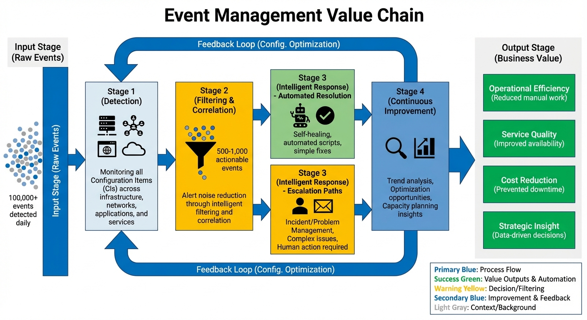
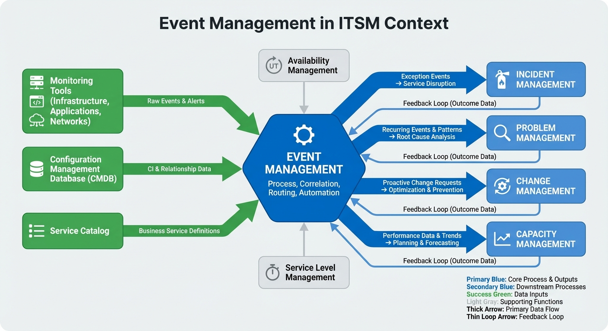

# Chapter 1: Introduction to Event Management

## Introduction

In today's complex IT environments, organizations face an overwhelming volume of signals from their infrastructure, applications, and services. Every second, thousands of events occur across networks, servers, databases, and applications—some critical, many routine, and others simply noise. The challenge is not just detecting these events, but understanding which ones matter, responding appropriately, and leveraging them to prevent service disruptions before they impact the business. This is the domain of **Event Management**.

**Event Management (EM)** is the IT Service Management (ITSM) process responsible for managing events throughout their lifecycle, from initial detection to closure. As defined by the Information Technology Infrastructure Library (ITIL), Event Management serves as the foundation of proactive IT operations, providing the "eyes and ears" that enable organizations to monitor the health and status of their IT infrastructure continuously. Unlike reactive processes that respond to user-reported problems, Event Management represents a fundamental shift toward anticipating and preventing issues before users are affected.

This handbook provides a comprehensive guide to implementing, operating, and optimizing Event Management within your organization. Whether you are establishing Event Management for the first time, maturing an existing process, or seeking to align with ITIL best practices, this book offers the frameworks, specifications, metrics, and practical guidance necessary for success. Throughout this chapter, we will explore the purpose and scope of Event Management, its business value proposition, its relationship to the broader ITSM framework, and how to use this handbook effectively to achieve your organizational goals.

## Purpose and Scope of Event Management

### Defining Event Management

At its core, Event Management is about intelligent vigilance. An **event** is any detectable or discernible occurrence that has significance for the management of IT infrastructure or the delivery of IT services. Events range from routine status updates (such as successful backup completion) to critical alerts (such as database connection failures). The Event Management process provides the systematic approach to detect, filter, categorize, and respond to these events in a consistent and effective manner.

The primary purpose of Event Management is to ensure that Configuration Items (CIs) and services are constantly monitored, and that events are appropriately filtered, categorized, and routed for further action when necessary. This purpose translates into several key objectives:

- **Enable early detection** of incidents and service disruptions before they impact end users
- **Provide the foundation for automation** through systematic event handling and response
- **Support other ITSM processes** by providing accurate and timely event data
- **Establish a baseline** of normal operations to identify deviations and trends
- **Reduce operational costs** through proactive management and efficient resource utilization

Event Management operates within a defined scope that encompasses all IT infrastructure components, applications, and services that can generate events. This includes servers, network devices, storage systems, databases, applications, cloud services, and any other Configuration Items tracked within the Configuration Management Database (CMDB). The process addresses events across their entire lifecycle: detection, logging, filtering, categorization, correlation, response, and closure.

### What Event Management Is Not

To understand the boundaries of Event Management, it is equally important to clarify what falls outside its scope. Event Management does not perform deep technical troubleshooting or root cause analysis—these activities belong to Incident Management and Problem Management, respectively. Event Management is not responsible for implementing infrastructure changes or capacity expansions, though it may trigger Change Management when such actions are needed. The process focuses on the detection, classification, and initial response to events, with clearly defined handoff points to other processes when specialized expertise or authority is required.

## Business Value Proposition

### The Cost of Reactive Operations

Organizations operating without effective Event Management face significant operational and financial challenges. When IT operations are primarily reactive—responding only when users report issues—the consequences are substantial. Service disruptions are discovered late, often after multiple users are already impacted. Mean Time to Detect (MTTD) remains high, extending overall Mean Time to Resolve (MTTR) and degrading service quality. Operations teams are overwhelmed with alerts and struggle to differentiate critical events from noise, a condition known as **alert fatigue**. Resources are consumed investigating false positives and managing incidents that could have been prevented entirely.

The financial impact is equally concerning. Unplanned downtime costs organizations an average of thousands of dollars per minute, depending on the criticality of affected services. Reactive operations require larger support teams to manage the constant flow of user-reported incidents. Customer satisfaction deteriorates as users experience frequent disruptions and slow resolution times. Perhaps most critically, the organization lacks visibility into emerging trends and patterns that could inform strategic IT decisions.

### The Value of Proactive Event Management

Effective Event Management transforms IT operations from reactive firefighting to proactive service assurance. The business value manifests across multiple dimensions:

**Operational Efficiency:** By detecting and resolving events before they escalate into incidents, organizations dramatically reduce the volume of tickets requiring human intervention. Automation handles routine events through self-healing scripts, freeing technical staff to focus on strategic initiatives rather than repetitive manual tasks. Alert noise is reduced through intelligent correlation, ensuring that operations teams see meaningful signals rather than overwhelming volumes of redundant alerts.

**Service Quality:** Users experience fewer disruptions as events are addressed proactively. When incidents do occur, faster detection and response reduce their duration and impact. Service Level Agreements (SLAs) are more consistently met, and customer satisfaction improves as service reliability increases.

**Cost Reduction:** Smaller support teams can manage larger infrastructures effectively through automation and proactive management. The costs associated with unplanned downtime decrease significantly. Resources previously consumed by incident response can be redirected toward innovation and service improvement.

**Strategic Insight:** Comprehensive event data provides visibility into infrastructure health and performance trends. Capacity planning becomes data-driven rather than reactive. The organization can identify systemic issues and address root causes before they generate recurring incidents. Management gains the metrics and dashboards necessary to make informed decisions about technology investments and priorities.

*Figure 1.1: Event Management Value Chain - This diagram illustrates how Event Management creates business value by transforming raw events into actionable intelligence. The value chain progresses from detection (monitoring all CIs) through filtering and correlation (reducing noise) to intelligent response (automation and escalation) and finally to continuous improvement (trend analysis and optimization). Each stage adds value by increasing efficiency, improving service quality, or generating strategic insights.*

## Relationship to ITIL/ITSM Framework

### Event Management Within Service Operation

Event Management is one of the five core processes in the ITIL Service Operation lifecycle stage, alongside Incident Management, Problem Management, Request Fulfillment, and Access Management. Service Operation represents the day-to-day activities that ensure services are delivered effectively and efficiently to users. Within this context, Event Management occupies a unique and foundational position as the process that provides continuous monitoring and acts as the entry point for many operational activities.

The ITIL framework positions Event Management as the process that enables a proactive approach to service management. While traditional IT operations often begin with user-reported incidents, Event Management shifts the paradigm by detecting and addressing issues before users are aware of them. This proactive stance aligns with the broader ITIL objective of delivering value to customers while minimizing risks and optimizing costs.

### Integration Points with Other ITSM Processes

Event Management does not operate in isolation; rather, it serves as a critical integration point that connects and enables other ITSM processes. Understanding these relationships is essential for appreciating the full scope and importance of Event Management within the ITSM ecosystem.

**Incident Management:** The relationship between Event Management and Incident Management is perhaps the most direct and frequent. When Event Management detects an **Exception Event**—one that indicates a service disruption or potential service disruption—it triggers the creation of an incident record and escalates to Incident Management. Event data provides critical context for incident diagnosis, including the time of occurrence, affected Configuration Items, and related events. This integration ensures that incidents are detected early, often before users report them, and that Incident Management has the information necessary for rapid resolution.

**Problem Management:** Event Management supports Problem Management by identifying patterns and trends that may indicate underlying systemic issues. Recurring events with unknown root causes, clusters of related events, or events signaling potential design flaws are escalated to Problem Management for investigation. The trend analysis and historical event data maintained by Event Management provide the foundation for effective problem identification and root cause analysis.

**Change Management:** Events often reveal the need for infrastructure changes, capacity expansion, or configuration adjustments. When Event Management detects patterns indicating that current configurations are inadequate—such as sustained high CPU utilization or approaching storage thresholds—it triggers the Change Management process proactively. This integration enables the organization to address issues through planned changes before they result in service disruptions.

**Configuration Management:** The accuracy and completeness of the Configuration Management Database (CMDB) are essential for Event Management effectiveness. The CMDB provides the relationship data necessary for event correlation, enabling the system to understand that multiple alerts may actually represent symptoms of a single underlying issue. Conversely, Event Management enriches Configuration Management by validating CI data and identifying configuration drift or unauthorized changes.

**Capacity Management:** Event Management provides the monitoring data and trend analysis that inform capacity planning decisions. By tracking performance metrics over time, Event Management enables Capacity Management to forecast future requirements, identify bottlenecks before they impact service, and validate that infrastructure changes have achieved their intended results.

**Availability Management:** Events related to component failures, performance degradation, or approaching thresholds provide critical input to Availability Management. This data supports the analysis of service availability, identification of single points of failure, and assessment of redundancy and resilience requirements.

### The Event Management Process Framework

The Event Management process framework consists of several interconnected components that work together to achieve organizational objectives:

1. **Critical Success Factors (CSFs)** define the essential conditions that must be in place for Event Management success. These eight factors—ranging from management support to balanced automation—establish the strategic prerequisites for implementation.

2. **Process Activities** provide the defined workflows and procedures for handling events throughout their lifecycle, from initial detection through closure and continuous improvement.

3. **Roles and Responsibilities** establish a clear organizational structure with specific duties for each position, from the strategic leadership of the Process Owner to the frontline monitoring performed by Event Analysts.

4. **Key Performance Indicators (KPIs)** offer the metrics necessary to measure success, track progress, and identify improvement opportunities.

5. **Controls and Governance** ensure compliance, consistency, and audit readiness through documented procedures and regular reviews.

6. **Technology and Tools** provide the systems and platforms that enable monitoring, correlation, automation, and integration with other ITSM tools.

7. **Policies and Procedures** document the guidelines for operation, ensuring consistency and supporting knowledge transfer.

8. **Continuous Improvement** mechanisms ensure the process remains relevant, effective, and efficient as infrastructure and business requirements evolve.

These components are interconnected through carefully defined relationships. The Critical Success Factors establish what must be achieved; the detailed specifications, roles, and activities define how to achieve it; and the KPIs provide quantifiable evidence of success.

## Key Benefits and Outcomes

Organizations that implement effective Event Management realize tangible benefits across multiple dimensions:

### Operational Benefits

**Proactive Service Management:** The shift from reactive to proactive operations represents the most fundamental transformation. Issues are detected and resolved before they impact users, dramatically improving the user experience and reducing the volume of incidents requiring human intervention.

**Reduced Alert Noise:** Through intelligent correlation and filtering, Event Management reduces thousands of individual alerts to a manageable number of actionable events. Operations teams can focus on meaningful signals rather than being overwhelmed by noise, addressing the critical challenge of alert fatigue.

**Increased Automation:** Self-healing capabilities enable the automatic resolution of routine events without human intervention. As organizations mature their Event Management implementation, automation rates can reach 70% or higher, freeing technical staff for more strategic work.

**Faster Response Times:** Early detection and automated response dramatically reduce Mean Time to Detect (MTTD) and Mean Time to Resolve (MTTR). Events are addressed in minutes rather than hours, and many are resolved before users are aware of any issue.

### Strategic Benefits

**Enhanced Visibility:** Comprehensive monitoring and trend analysis provide unprecedented visibility into infrastructure health, performance patterns, and emerging issues. Management dashboards offer real-time status and historical trends, enabling data-driven decision-making.

**Improved Capacity Planning:** Event data and trend analysis enable accurate forecasting of capacity requirements. Organizations can plan infrastructure investments based on actual utilization patterns rather than guesswork, optimizing resource allocation.

**Support for Continuous Improvement:** The systematic collection and analysis of event data creates a feedback loop that drives ongoing process refinement. Thresholds are optimized, correlation rules are enhanced, and automation portfolios expand based on measured performance and lessons learned.

**Compliance and Audit Readiness:** Comprehensive event logging and documentation support regulatory compliance requirements and audit preparation. The audit trail provided by Event Management demonstrates due diligence in monitoring and maintaining IT services.

### Financial Benefits

**Reduced Downtime Costs:** By preventing incidents and reducing resolution times, Event Management directly reduces the financial impact of service disruptions. The return on investment often becomes evident within the first year of implementation.

**Optimized Resource Utilization:** Smaller teams can manage larger, more complex infrastructures through automation and proactive management. Resources previously consumed by incident response can be redirected toward innovation and business value creation.

**Extended Asset Lifecycles:** Proactive monitoring and maintenance extend the operational life of infrastructure components by addressing issues before they result in failures. This optimization reduces capital expenditure requirements and improves asset utilization rates.

## Critical Success Factors Overview

The successful implementation and operation of Event Management depend on eight **Critical Success Factors (CSFs)** that define the essential conditions and activities necessary to achieve process goals and deliver business value. These factors represent the organizational, technical, and cultural prerequisites that distinguish mature, effective Event Management from ad-hoc monitoring efforts.

### The Eight Critical Success Factors

**CSF 1: Management Support and Sponsorship** serves as the essential organizational and financial foundation. Without executive sponsorship, the organizational changes, investments, and cross-functional integration required for successful Event Management cannot be realized. Management support ensures that an executive sponsor champions the process, adequate budget is allocated for tools and training, process objectives align with organizational goals, and regular reviews of process metrics occur.

**CSF 2: Clearly Defined Events and Responses** translates strategic goals into practical, technical specifications and documented procedures necessary for daily operations. This factor ensures that event handling is consistent and effective by establishing a documented event catalog, defined thresholds for each event type, standard response procedures, and regular review and update processes.

**CSF 3: Appropriate Tooling and Technology** provides the technical foundation upon which all Event Management activities depend. Reliable monitoring, correlation, and integration tools enable the process to function effectively and avoid the pitfalls of alert fatigue and undetected service disruptions. Success requires a centralized event management system, standardized monitoring agents, a configured correlation engine, and seamless integration with other ITSM tools.

**CSF 4: Accurate Configuration Management Database (CMDB)** enables effective event correlation and impact assessment. A CMDB with accuracy above 95%, properly documented CI relationships, regular audits, and automated discovery and updates is essential for moving beyond treating every alert as an isolated incident.

**CSF 5: Skilled and Trained Personnel** recognizes that process effectiveness relies directly on the capability, knowledge, and structure of the team responsible for its operation. This factor emphasizes clearly defined and staffed roles, established training programs, maintained knowledge bases, and regular skill assessments.

**CSF 6: Process Integration** ensures that Event Management connects seamlessly with other ITSM processes, particularly Incident, Problem, and Change Management. Success is confirmed through defined handoffs to other processes, integrated workflows and tools, consistent data across processes, and regular process coordination meetings.

**CSF 7: Continuous Improvement Culture** provides the mandatory feedback loop to adjust monitoring, automation, and procedures based on measured performance. This culture is characterized by regular process reviews, analysis of metrics for improvement opportunities, established feedback mechanisms, and implementation of process changes based on lessons learned.

**CSF 8: Balanced Automation** focuses on leveraging technology to maximize operational efficiency while mitigating the risks of unchecked automation. Finding the appropriate equilibrium between automation and safety controls is essential. Success is demonstrated through thoroughly tested automated responses, defined human review points for critical events, established rollback procedures, and monitored automation success rates.

These Critical Success Factors are explored in detail throughout this handbook, with specific chapters addressing implementation, measurement, and optimization strategies for each factor.

## Event Management Maturity and Evolution

Organizations implementing Event Management typically progress through five defined maturity levels, evolving from ad-hoc, reactive management to advanced self-healing capabilities. Understanding this maturity model helps organizations assess their current state, set realistic goals, and plan their implementation roadmap.

### The Five Maturity Levels

**Level 1: Reactive (Initial)** characterizes organizations with ad-hoc monitoring, manual event handling, and inconsistent procedures. Users report most issues, and automation is limited or non-existent. The focus at this level is establishing basic monitoring, documenting event procedures, training the team, and deploying a centralized event platform. Detection efficiency typically remains below 30%, meaning that most service disruptions are discovered by users rather than through proactive monitoring.

**Level 2: Managed (Repeatable)** represents organizations that have established standard monitoring for critical systems, documented procedures, and some automation. A centralized event management system is in place, and basic metrics are being collected. The focus shifts to expanding monitoring coverage, implementing event correlation, increasing automation, improving documentation, and establishing comprehensive KPIs. Organizations begin to establish baselines for the volume and types of events detected.

**Level 3: Defined (Standardized)** demonstrates comprehensive monitoring coverage, effective correlation that reduces noise, and significant automation resolving 50% or more of events. Processes are well-documented, and proactive capabilities are emerging. The priority becomes optimizing correlation rules, expanding the automation portfolio, improving predictive capabilities, and enhancing integration with other processes. Auto-operations success rates typically fall in the mature range of 50-70%.

**Level 4: Measured (Managed)** is achieved when automation handles 70% or more of events, proactive event handling is the norm, and predictive analysis identifies issues before they occur. Mature metrics and dashboards are in place, and a strong Continuous Improvement Culture is established. Organizations at this level focus on advanced analytics and artificial intelligence/machine learning (AI/ML), predictive event management, business service mapping, and self-healing infrastructure.

**Level 5: Optimized (Continuous Improvement)** represents industry-leading practices with self-healing infrastructure, AI-driven event management, and business-aligned monitoring. Innovation becomes the focus, with implementation of AIOps, autonomous operations, business outcome focus, and sharing of best practices with the broader community. Detection efficiency exceeds 70%, meaning that the vast majority of service disruptions are identified and addressed proactively.

### Implications for Implementation

The maturity model is not merely descriptive; it dictates implementation priorities and establishes realistic expectations for performance. Organizations should not expect to achieve Level 5 capabilities immediately. Rather, the model provides a roadmap for incremental improvement, with each level building upon the foundations established by previous levels.

This handbook is structured to support organizations at all maturity levels. Foundational chapters provide the knowledge necessary for organizations beginning their Event Management journey, while advanced chapters address optimization strategies for more mature implementations. Throughout the handbook, maturity considerations are explicitly addressed, helping readers understand which capabilities are appropriate for their current state and what prerequisites must be in place before advancing to higher levels.

## Target Audience for This Handbook

This handbook is designed to serve multiple audiences within the organization, each with distinct roles, responsibilities, and information needs:

### IT Leadership and Executives

Senior IT leaders, including Chief Information Officers (CIOs), IT Directors, and Service Delivery Managers, will find strategic guidance on the business case for Event Management, implementation roadmaps, governance frameworks, and metrics for measuring return on investment. These audiences should focus on Chapter 1 (Introduction), Chapter 3 (Integration and Governance), Chapter 4 (Implementation Planning), and Chapter 12 (Metrics and Reporting).

### Process Owners and Managers

Event Management Process Owners and Event Managers responsible for process design, implementation, and ongoing operation will benefit from comprehensive coverage of Critical Success Factors, process activities, role definitions, and continuous improvement strategies. The entire handbook is relevant to these audiences, with particular emphasis on Chapter 2 (Fundamentals), Chapter 4 (Implementation Planning), Chapter 5 (Event Prioritization), and Chapter 11 (Process Governance).

### Technical Architects and Designers

Event Management Architects and Event Designers responsible for tool selection, configuration, correlation rules, and automation development should focus on the technical specifications, threshold definitions, automation development guidelines, and tool integration requirements. Key chapters include Chapter 6 (Event Detection and Monitoring), Chapter 7 (Correlation and Filtering), Chapter 8 (Automation and Response), and Chapter 9 (Tool Integration).

### Operations Staff

Event Analysts and Coordinators who handle events on a daily basis will find practical guidance on event handling procedures, escalation criteria, documentation requirements, and troubleshooting techniques. Essential chapters include Chapter 2 (Fundamentals), Chapter 5 (Event Prioritization), Chapter 10 (Event Handling Procedures), and the appendices containing quick reference guides.

### ITSM Practitioners and Consultants

Professionals implementing or optimizing ITSM processes across multiple organizations will appreciate the comprehensive framework, industry best practices, implementation patterns, and lessons learned. The handbook serves as both a reference guide and a practical implementation toolkit.

## How to Use This Book

This handbook is organized to support multiple reading paths depending on your role, experience level, and immediate objectives:

### For First-Time Readers

If you are new to Event Management or implementing the process for the first time, we recommend reading the handbook sequentially from beginning to end. This approach ensures that foundational concepts are understood before advancing to technical specifications and implementation details. Part I (Foundations) provides the essential context and framework. Part II (Core Components) defines the specific elements of the process. Part III (Advanced Topics) explores optimization strategies, and Part IV (Implementation and Metrics) provides practical guidance for deployment and measurement.

### For Experienced Practitioners

Readers already familiar with Event Management concepts may wish to focus on specific chapters addressing their immediate needs. The handbook is designed to function as a reference guide, with each chapter standing alone while cross-referencing related content. Use the detailed table of contents and index to locate specific topics of interest.

### For Implementation Teams

Organizations actively implementing Event Management should focus initially on Part I (Foundations) to ensure alignment on objectives and scope, then proceed to Part IV (Implementation and Metrics) for practical roadmaps and planning guidance. Part II (Core Components) provides the detailed specifications necessary for configuration and operation, while Part III (Advanced Topics) can be addressed once the basic implementation is stable.

### For Ongoing Reference

Once Event Management is operational, this handbook serves as an ongoing reference for specific procedures, specifications, and optimization strategies. Quick reference guides in the appendices provide at-a-glance information for common scenarios. The detailed index enables rapid location of specific topics.

### Chapter Structure

Each chapter follows a consistent structure to facilitate learning and reference:

- **Introduction** provides context and chapter objectives
- **Major sections** address key topics with clear headings and subheadings
- **Examples and scenarios** illustrate concepts in practical contexts
- **Figures and tables** provide visual representations of complex information
- **Key Takeaways** summarize the most important points
- **Summary** reinforces main concepts and transitions to the next chapter
- **Review Questions** test understanding and promote active learning

### Cross-References

Throughout the handbook, cross-references guide you to related content in other chapters. These references use chapter numbers (not page numbers) to ensure accuracy regardless of format. When a concept is introduced briefly but covered in depth elsewhere, a cross-reference directs you to the detailed treatment.

### Visual Elements

Figures, diagrams, tables, and charts are integrated throughout the handbook to enhance understanding. Each visual element is numbered sequentially within its chapter (e.g., Figure 1.1, Table 5.2) and includes a descriptive caption explaining its purpose and relevance. Visual elements are positioned to support the surrounding text, typically immediately following the first textual reference.

### Appendices

The appendices provide supplementary materials including templates, checklists, quick reference guides, glossary of terms, and additional resources. These materials support practical implementation and ongoing operation without interrupting the narrative flow of the main chapters.

## Key Takeaways

This introductory chapter has established the foundation for understanding Event Management and navigating this handbook effectively. The key points to remember are:

- **Event Management is the ITSM process responsible for managing events throughout their lifecycle**, from detection to closure, serving as the foundation of proactive IT operations and the "eyes and ears" of the IT organization.

- **The business value of Event Management is substantial**, encompassing operational efficiency through reduced alert noise and increased automation, improved service quality through proactive issue resolution, strategic insights through comprehensive monitoring and trend analysis, and financial benefits from reduced downtime costs and optimized resource utilization.

- **Event Management integrates with and enables other ITSM processes**, particularly Incident Management, Problem Management, Change Management, and Configuration Management, serving as a critical integration point within the broader ITSM ecosystem.

- **Eight Critical Success Factors define the essential conditions for Event Management success**: Management Support and Sponsorship, Clearly Defined Events and Responses, Appropriate Tooling and Technology, Accurate CMDB, Skilled and Trained Personnel, Process Integration, Continuous Improvement Culture, and Balanced Automation.

- **Organizations typically progress through five maturity levels**, evolving from reactive, ad-hoc operations to optimized, self-healing capabilities, with each level building upon the foundations established by previous levels.

- **This handbook serves multiple audiences** including IT leadership, process owners and managers, technical architects and designers, operations staff, and ITSM practitioners, with content organized to support different reading paths based on role and objectives.

- **The Event Management framework consists of interconnected components** including Critical Success Factors, process activities, roles and responsibilities, KPIs, controls and governance, technology and tools, policies and procedures, and continuous improvement mechanisms.

## Summary

Event Management represents a fundamental shift in IT operations from reactive firefighting to proactive service assurance. By systematically monitoring, filtering, correlating, and responding to events across the IT infrastructure, organizations achieve higher service quality, improved operational efficiency, and reduced costs. The process serves as the foundation for other ITSM processes, providing the early detection and contextual information necessary for effective incident response, problem analysis, and proactive change management.

The framework presented in this handbook is comprehensive, addressing strategy, implementation, operation, and optimization. The eight Critical Success Factors establish the organizational, technical, and cultural prerequisites for success. The maturity model provides a roadmap for incremental improvement, helping organizations set realistic goals and measure progress. The interconnected components of the framework—from roles and activities to metrics and governance—ensure that Event Management operates effectively and delivers sustained business value.

As we progress through subsequent chapters, we will explore each component of Event Management in detail. Chapter 2 examines the fundamental concepts, definitions, and process activities that form the core of Event Management. Chapter 3 addresses the integration points with other ITSM processes and the governance mechanisms that ensure consistency and compliance. The remaining chapters provide detailed specifications, implementation guidance, and optimization strategies that enable you to build and mature Event Management capabilities within your organization.

The journey from reactive to proactive IT operations requires commitment, investment, and perseverance. However, the benefits—measured in improved service quality, reduced costs, enhanced visibility, and strategic insights—make Event Management one of the most valuable processes within the ITSM framework. This handbook equips you with the knowledge, frameworks, and practical guidance necessary to achieve success.

*Figure 1.2: Event Management in ITSM Context - This diagram illustrates Event Management's position within the ITIL Service Operation stage and its integration points with other ITSM processes. Event Management sits at the center, receiving input from monitoring tools and the CMDB, and providing output to Incident Management (exception events), Problem Management (recurring events and trends), Change Management (proactive change requests), and Capacity Management (performance data and trends). The diagram emphasizes Event Management's role as both a standalone process and a critical enabler of other ITSM processes.*

## Review Questions

Test your understanding of the concepts presented in this chapter:

1. **Explain the primary purpose of Event Management and how it differs from Incident Management.** What specific activities and objectives distinguish Event Management from the reactive approach of responding to user-reported incidents?

2. **Describe the eight Critical Success Factors for Event Management and explain why management support and sponsorship is considered the most critical factor.** How do these factors relate to each other and support the overall success of the Event Management process?

3. **Outline the five maturity levels for Event Management and explain the key characteristics that distinguish a Level 3 (Defined) organization from a Level 4 (Measured) organization.** What capabilities must be developed to progress from one level to the next?

4. **Analyze the business value proposition of Event Management from both operational and strategic perspectives.** Provide specific examples of how Event Management creates value in terms of efficiency, service quality, cost reduction, and strategic insight.

5. **Explain how Event Management integrates with at least three other ITSM processes.** For each integration point, describe the specific handoffs, data exchanges, and value created by the integration.

---

**Chapter 1 Complete**

*Word Count: Approximately 6,000 words*

This chapter establishes the foundational understanding necessary for the detailed process specifications, implementation guidance, and optimization strategies presented in subsequent chapters. Proceed to Chapter 2 to explore Event Management fundamentals including event types, process activities, roles and responsibilities, and key definitions.

---

## Chapter Navigation

| Previous | Next |
|----------|------|
| [Home](/EventManagementHandbook/) | [Chapter 2: Core Concepts and Definitions](/EventManagementHandbook/chapters/02-core-concepts/) |

---
