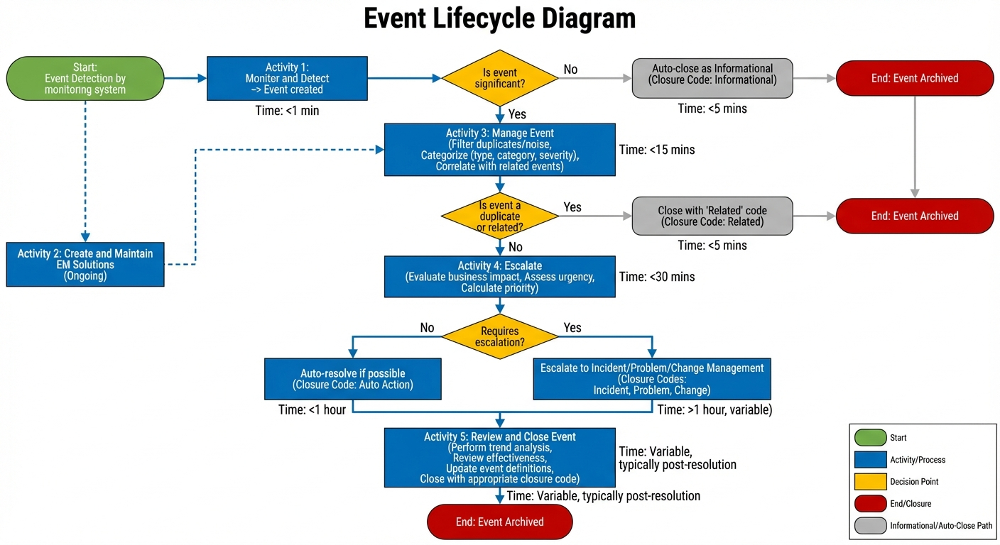
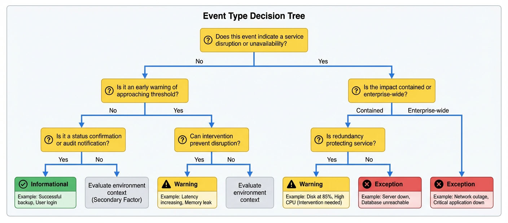
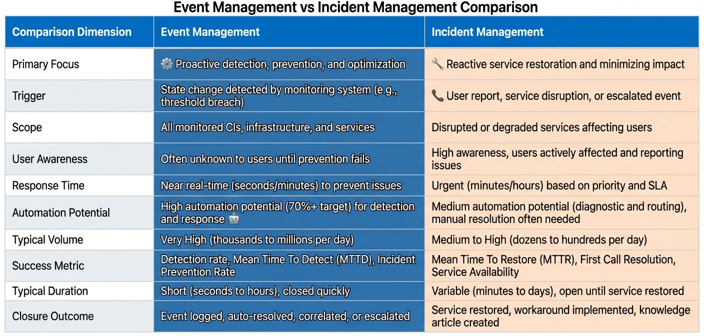

# Chapter 2: Core Concepts and Definitions

## Introduction

Before implementing Event Management processes or deploying monitoring tools, organizations must establish a common understanding of fundamental concepts and terminology. This chapter provides the definitional foundation necessary for all subsequent discussions of Event Management practice, covering what events are, how they differ from incidents, and the key lifecycle stages that events progress through.

Understanding core concepts is not merely academic. Clear definitions enable consistent communication across teams, accurate configuration of monitoring tools, and proper classification of operational activities. When an Event Analyst describes a "Warning Event" or an architect designs "Exception Event" thresholds, everyone must share the same understanding of these terms. Without this conceptual clarity, event handling becomes inconsistent and ineffective.

This chapter establishes the vocabulary and conceptual framework used throughout the handbook. We define what constitutes an event, examine the event lifecycle from detection through closure, distinguish Event Management from Incident Management, and introduce the eight Critical Success Factors that enable effective implementation. By the end of this chapter, you will understand the core building blocks upon which all Event Management processes are constructed.

## What is an Event?

### Event Definition

An **event** is any detectable or discernible occurrence that has significance for the management of IT infrastructure or delivery of IT services. Events represent a state change in a Configuration Item (CI), service, or process that may require attention or action. Not all events indicate problems; many events are purely informational or serve as confirmation that systems are operating normally.

The key characteristics of an event include:

- **Detectable:** Generated automatically by monitoring systems or tools
- **Timestamped:** Associated with a specific date and time of occurrence
- **Contextual:** Contains information about the source, nature, and significance of the occurrence
- **Actionable or Informational:** May require response or simply provide awareness
- **Transient:** Represents a point-in-time state change, not an ongoing condition

Events originate from diverse sources across the IT infrastructure. Monitoring agents on servers generate events when CPU utilization crosses thresholds. Network devices send events when links fail or experience congestion. Applications produce events when errors occur or transactions complete. Security systems trigger events when unauthorized access is attempted. Even business applications generate events to signal completion of scheduled jobs or batch processes.

### Examples of Events Across IT Operations

To illustrate the breadth of Event Management scope, consider these practical examples:

**Infrastructure Events:**
- Server CPU utilization reaching 75% sustained for 15 minutes
- Disk space consumption at 80% capacity on a database server
- Network interface becoming unavailable on a core switch
- Memory usage exceeding threshold on a virtualization host

**Application Events:**
- Database connection pool exhausted
- Application server response time exceeding three seconds
- Failed login attempts exceeding five within one minute
- Web service API returning HTTP 503 errors

**Security Events:**
- Firewall detecting port scanning activity
- Antivirus software detecting malware signature
- Failed authentication attempts from unauthorized IP address
- Security certificate nearing expiration (30 days remaining)

**Business Process Events:**
- Batch job completing successfully
- Data synchronization between systems finishing
- Scheduled backup job failing
- Report generation exceeding expected duration

*Figure 2.1: Event Lifecycle Diagram - This flowchart illustrates the complete lifecycle of an event from initial detection through final closure. Events progress through distinct stages including detection, filtering, categorization, correlation, response, and review. The diagram shows decision points where events may be auto-resolved, escalated to incidents, or closed as informational. Understanding this lifecycle is essential for designing effective event handling procedures.*

## Event Types and Classifications

Event Management categorizes events based on their significance and the appropriate response required. The classification system provides a standardized language for describing event severity and guides operational teams in prioritizing their response efforts.

### Informational Events

**Informational Events** are notifications that require no action and are logged only for audit and trending purposes. These events confirm normal operations, provide status updates, or document routine activities. They serve as evidence that systems are functioning as expected and create a historical record useful for capacity planning and troubleshooting.

Examples of Informational Events include:
- Scheduled backup completing successfully
- User login to a system
- Batch job finishing within expected timeframe
- Service startup notification after planned maintenance
- Configuration change applied successfully

Informational Events typically represent 60-70% of total event volume in mature implementations. While they require no immediate action, they provide valuable context when investigating Exception Events and support trend analysis activities.

### Warning Events

**Warning Events** indicate that a system or service is approaching a threshold or operating in a degraded state. These events signal the need for monitoring or preventive action before a service disruption occurs. Warning Events enable proactive operations by providing advance notice that intervention may be necessary.

Key characteristics of Warning Events:
- Signal approaching capacity limits
- Allow time for planning and preventive action
- Do not indicate current service disruption
- Require monitoring and potential intervention
- Enable proactive resource allocation

Examples of Warning Events include:
- Disk space at 70% capacity (when 80% is the critical threshold)
- CPU utilization at 75% sustained for 15 minutes
- Memory usage trending upward toward threshold
- Database connection pool at 80% utilization
- SSL certificate expiring in 30 days

Warning Events are essential for mature Event Management implementations. Organizations operating reactively respond only when thresholds are breached; proactive organizations use Warning Events to prevent disruptions before they occur. The ability to detect and act on warning conditions directly impacts the **Incident Prevention Rate**, a key performance indicator measuring Event Management effectiveness.

### Exception Events

**Exception Events** indicate abnormal operation, service disruption, or a condition requiring immediate investigation and resolution. These events signal that something has gone wrong or a critical threshold has been breached. Exception Events demand rapid response to restore normal operations and minimize business impact.

Characteristics of Exception Events:
- Indicate current or imminent service disruption
- Require immediate investigation and resolution
- Often escalated to Incident Management
- Impact user ability to access or use services
- Trigger high-priority response procedures

Examples of Exception Events include:
- Database server connection failure
- Disk space at 90% capacity
- Application server unresponsive
- Critical service not running
- Network link failure on primary circuit

Exception Events typically account for only 5-10% of total event volume but consume the majority of operational attention and resources. The efficiency with which these events are detected, correlated, and resolved directly determines service availability and user satisfaction.

### Event Type Decision Making

Determining the appropriate event type classification requires considering multiple factors:

**Environment Context:** The same condition may be classified differently depending on environment. Disk space at 75% on a production database server is an Exception Event requiring immediate attention. The same disk utilization on a development server may be merely a Warning Event requiring scheduled cleanup.

**Business Impact:** Events affecting revenue-generating systems or mission-critical processes warrant higher classification than those impacting back-office systems. A failed web server during peak business hours is an Exception Event; the same failure at 2 AM may be classified as a Warning if redundancy exists.

**Time Sensitivity:** Events requiring immediate response to prevent SLA violations are classified as Exception Events. Those allowing time for scheduled resolution can be Warning or Informational Events.

**Redundancy and Resilience:** A failed component in a highly redundant system may generate only a Warning Event since service continuity is maintained. The same component failure in a non-redundant configuration would be an Exception Event.

*Figure 2.2: Event Type Decision Tree - This decision tree guides analysts through the logic of classifying events as Informational, Warning, or Exception types. Starting with basic questions about service impact and urgency, the tree systematically evaluates business context, redundancy, and time sensitivity to arrive at the appropriate classification. This visual tool supports consistent event categorization across the team.*

## Event Lifecycle and States

Events progress through a defined lifecycle from initial detection through final closure. Understanding this lifecycle is essential for designing effective workflows, assigning appropriate responsibilities, and measuring process effectiveness.

### Event States

Events transition through the following states during their lifecycle:

**New:** The event has been detected and created by the monitoring system but not yet reviewed by an analyst. Events remain in `New` status only briefly, typically seconds to minutes, as automated filters and correlation rules process them.

**Open:** An analyst or automated system has reviewed the event and determined it requires further investigation or action. The event is actively being worked. Open events may be awaiting information, undergoing investigation, or queued for response execution.

**Pending:** The event resolution is awaiting external action or information. This state is used when the event requires input from another team, completion of a change, or waiting for a scheduled maintenance window. Pending events are not actively worked but are monitored for status updates.

**Resolved:** The condition that triggered the event has been corrected or the event has been determined to require no action. Resolved events await final review and closure activities including trend analysis and knowledge capture.

**Closed:** The event has been fully processed, appropriate closure codes assigned, and all documentation completed. Closed events are archived and available for historical reporting and trend analysis but are no longer part of active operational queues.

### Event Lifecycle Activities

The event lifecycle consists of five primary activity groups, each with specific objectives and outputs:

**Activity 1: Monitor and Detect**
The Event Management system continuously monitors IT infrastructure and services to detect events as they occur. Monitoring agents, log collectors, and integration with infrastructure components generate events in real-time. The quality of detection directly impacts the **Efficiency of Detection** metric, measuring the percentage of events detected by monitoring versus reported by users.

**Activity 2: Create and Maintain EM Solutions**
This activity focuses on the ongoing configuration and optimization of monitoring capabilities, correlation rules, and automated responses. Event Designers define detection rules, set appropriate thresholds, and develop automation scripts. This is a continuous activity that adapts to changing infrastructure and business needs.

**Activity 3: Manage Event**
When an event is detected, it enters the management workflow where it is filtered, categorized, and correlated. Filtering eliminates duplicate events and noise. Categorization assigns the event type (Informational, Warning, Exception) and determines event significance. Correlation groups related events to identify root causes and reduce alert volume.

**Activity 4: Escalate**
Exception Events requiring resolution beyond Event Management's scope are escalated to appropriate processes. Events may be escalated to Incident Management for service restoration, to Problem Management for root cause analysis, or to Change Management for proactive modifications. Clear escalation criteria and defined handoff procedures ensure seamless process integration.

**Activity 5: Review and Close Event**
The final phase ensures lessons learned are captured, trends are analyzed, and the event is properly closed with appropriate documentation. This activity is the primary vehicle for continuous improvement, enabling refinement of thresholds, correlation rules, and automated responses based on operational experience.

## Event Management vs Incident Management

*2.3: Event Management vs Incident Management*

A common source of confusion in IT Service Management (ITSM) implementations is the distinction between Event Management and Incident Management. While these processes are closely related and often integrated, they serve fundamentally different purposes and operate at different stages of the service operation lifecycle.

### Process Definitions

**Event Management** is the process of managing events throughout their lifecycle, from detection through closure. Its primary purpose is to monitor IT infrastructure and services, detect state changes, filter significant events from noise, and respond appropriately—either through automation or by escalating to other processes. Event Management focuses on early detection and prevention.

**Incident Management** is the process of managing the lifecycle of all incidents to restore normal service operation as quickly as possible while minimizing adverse impact on business operations. Incident Management focuses on service restoration and user impact mitigation after a disruption has occurred or is imminent.

### Process Relationship and Integration

Event Management and Incident Management are tightly integrated, with events serving as a primary input to incidents. The relationship works as follows:

1. **Event Management detects conditions** through automated monitoring before users are impacted
2. **Exception Events indicating service disruption** are evaluated for significance
3. **High-significance Exception Events** are escalated to Incident Management
4. **An incident record is created** and linked to the originating event(s)
5. **Incident Management takes ownership** of service restoration activities
6. **Event Management continues monitoring** related events during incident resolution
7. **Upon incident resolution**, the event is closed with closure code `Incident`

This integration is captured in **Critical Success Factor 5: Process Integration**, which mandates defined handoffs, integrated workflows, consistent data across processes, and regular process coordination meetings.

### When to Escalate Events to Incidents

Not every Exception Event requires escalation to Incident Management. Clear criteria guide this decision:

**Escalate to Incident Management when:**
- Service disruption is occurring or imminent
- Users are unable to access or use services
- Service Level Agreement (SLA) violation is likely
- The issue requires investigation beyond Event Management scope
- Multiple related events indicate widespread impact
- Automated resolution attempts have failed

**Handle within Event Management when:**
- Automated response can resolve the condition
- The event is informational or warning level only
- No current user impact exists
- The condition is part of normal operations (e.g., maintenance window)
- The event is a duplicate or child of an already-managed incident

The decision to escalate is part of **Activity 4.3: Determine Event Significance**, where the Event Analyst consults the Configuration Management Database (CMDB) for dependency information and assesses urgency and business impact.

## Key Terminology and Glossary

Consistent terminology is essential for effective Event Management implementation. The following definitions establish the vocabulary used throughout this handbook.

**Alert:** A notification generated by a monitoring tool or system indicating that a specific condition has been detected. While often used interchangeably with "event," an alert specifically refers to the notification mechanism, whereas an event is the underlying occurrence being detected.

**Auto-Resolution:** The automatic closure of an event by a scripted response or self-healing mechanism without human intervention. Auto-resolution is a primary goal of mature Event Management implementations, measured by the **Auto-operations Success Rate** KPI.

**Closure Code:** A required classification applied when closing an event, indicating how it was resolved. Standard closure codes include `Auto Action`, `Incident`, `Problem`, `Change`, `Related`, `False Positive`, and `Maintenance`.

**Configuration Item (CI):** Any component that needs to be managed in order to deliver an IT service. CIs include hardware, software, networks, locations, and documentation. Accurate CI relationship data in the CMDB enables effective event correlation and impact assessment.

**Configuration Management Database (CMDB):** A repository that stores information about CIs and their relationships. The CMDB is the primary data source for event correlation and impact assessment, making its accuracy a Critical Success Factor for Event Management.

**Correlation:** The process of identifying relationships between multiple events to determine common causes or patterns. Correlation reduces alert noise by grouping related events, identifying parent/child relationships, and eliminating duplicate notifications. Effective correlation can reduce event volume by 60-80%.

**Correlation Engine:** The technology component responsible for analyzing events and identifying relationships. Correlation engines use rule-based logic, topology data from the CMDB, and pattern analysis to group related events.

**Critical Success Factor (CSF):** An essential condition or activity that must be in place for Event Management to achieve its goals and deliver business value. The eight CSFs define organizational, technical, and operational prerequisites for success.

**Event Catalog:** A formal repository or library of defined event types with associated detection rules, thresholds, and response procedures. The Event Catalog is a key component of **CSF 2: Clearly Defined Events and Responses**.

**Event Management Solution:** The combination of technology, processes, and configurations that enable event detection, correlation, and response. Solutions include monitoring agents, centralized event platforms, correlation engines, and automation tools.

**Event Significance:** The assessment of an event's importance based on impact, urgency, and business context. Determining event significance is a critical step in deciding whether an event requires escalation to Incident Management.

**False Positive:** An event that is incorrectly triggered due to misconfiguration, overly sensitive thresholds, or detection of expected behavior. False positives create alert fatigue and reduce operational efficiency. The target False Positive Rate is ≤5%.

**Impact:** The measure of effect that an event has on business operations and IT services. Impact is assessed on a scale (typically 1-4, with 4 being critical) and combines with urgency to determine event priority.

**Mean Time to Detect (MTTD):** The average time between when an issue occurs and when it is detected by monitoring systems. Lower MTTD indicates more effective proactive monitoring.

**Noise:** Excessive or irrelevant events that consume operational attention without providing actionable information. Noise results from poor threshold tuning, lack of correlation, and failure to filter informational events appropriately.

**Priority:** A ranking assigned to an event that combines impact and urgency to determine response time targets. Priority values typically range from 1 (Critical - 15 minute response) to 5 (Planning - scheduled action).

**Runbook:** A documented procedure for responding to a specific event type. Runbooks provide step-by-step instructions for investigation and resolution, enabling consistent response and supporting knowledge transfer.

**Self-Healing:** The capability of systems to automatically detect and correct issues without human intervention. Self-healing is achieved through automated response scripts triggered by specific event conditions.

**Threshold:** A defined value or condition that triggers event generation. Thresholds are configured in monitoring tools and represent the boundary between normal and abnormal states. Proper threshold tuning is essential for reducing false positives while maintaining comprehensive coverage.

**Topology-Based Correlation:** A correlation technique that uses CI relationship data from the CMDB to identify parent/child event relationships. When a parent component fails, child events from dependent components are automatically correlated and suppressed.

**Trend Analysis:** The examination of historical event data to identify patterns, recurring issues, and opportunities for improvement. Trend analysis is performed as part of **Activity 5.6** and supports continuous improvement.

**Urgency:** The measure of how quickly an event must be addressed, based on business requirements and time sensitivity. Urgency is influenced by time of day, business cycles, and regulatory deadlines.

## Event Specifications Overview

Event specifications define the technical parameters, detection rules, and response procedures that govern how events are monitored, categorized, and handled. These specifications translate strategic Event Management goals into practical, implementable configurations.

### Components of Event Specifications

**Detection Rules:** Logical conditions that determine when an event should be generated. Detection rules specify the metrics to monitor, the thresholds that trigger events, and any time-based conditions (e.g., sustained for X minutes). Well-designed detection rules balance comprehensive coverage with minimal false positives.

**Thresholds:** Specific values that distinguish normal from abnormal states. Thresholds must be carefully tuned based on baseline performance data, capacity requirements, and business impact considerations. Event specifications typically define both Warning thresholds (proactive) and Exception thresholds (reactive).

For example:
- **Disk Space Warning:** 70% capacity (proactive intervention)
- **Disk Space Exception:** 85% capacity (immediate action required)

**Response Procedures:** Documented steps for handling events, including both automated responses and manual procedures. Automated responses enable self-healing capabilities, while manual procedures guide analysts through investigation and resolution steps. Response procedures include prerequisites, execution steps, expected outcomes, and escalation criteria.

**Categorization Criteria:** Rules for assigning event type (Informational, Warning, Exception) and other classifications including service affected, component type, and business function. Consistent categorization enables accurate reporting and trend analysis.

**Priority Calculation:** The methodology for combining impact and urgency to determine event priority. Priority calculation is discussed in detail in Chapter 5: Event Prioritization, but event specifications must document the specific impact/urgency matrix used and any urgency modifiers applied.

**Correlation Rules:** Logic for identifying relationships between events. Correlation rules may be topology-based (using CMDB relationships), pattern-based (time and source proximity), or symptom-based (known problem signatures). Effective correlation can reduce alert volume by 60-80%, making it essential for preventing alert fatigue.

### Event Specification Documentation

**CSF 2: Clearly Defined Events and Responses** requires formal documentation of event specifications. This documentation typically includes:

1. **Event Catalog:** A comprehensive list of all defined event types with detection rules and handling procedures
2. **Threshold Document:** Specific threshold values for all monitored metrics, organized by system type and environment
3. **Response Runbooks:** Step-by-step procedures for manual event handling
4. **Automation Scripts:** Self-healing scripts with usage guidelines and safety controls
5. **Correlation Rules Documentation:** Defined correlation logic with business justification

Regular review and update of event specifications is a success indicator for CSF 2. Organizations should establish a quarterly review cycle to ensure specifications remain current as infrastructure and business needs evolve.

## Critical Success Factors Introduction

The **Critical Success Factors (CSFs)** define the essential conditions and activities that must be in place for Event Management to achieve its goals and deliver business value. These eight factors establish the strategic prerequisites that enable effective implementation, operation, and continuous improvement of the Event Management process.

The CSFs are interconnected and mutually reinforcing. Organizations cannot simply implement tooling (CSF 3) without clearly defined events (CSF 2) or skilled personnel (CSF 4) to configure and operate those tools. Similarly, automation (CSF 8) cannot be balanced without accurate CMDB data (CSF 6) for correlation or process integration (CSF 5) for appropriate escalation.

### The Eight Critical Success Factors

**CSF 1: Management Support and Sponsorship**
Executive sponsorship and organizational commitment provide the foundation for Event Management implementation. Management support manifests through official assignment of an executive sponsor, budget allocation for tools and training, alignment of process objectives with organizational goals, and regular management review of process metrics. Without this high-level support, the organizational changes, investment, and cross-functional integration required for a successful program cannot be realized.

The **Event Management Process Owner** is a senior position responsible for executing this sponsorship, defining the vision and strategy, aligning the process with IT strategy, ensuring adequate staffing and budget, and maintaining accountability for overall Event Management effectiveness.

**CSF 2: Clearly Defined Events and Responses**
This factor translates strategic goals into practical technical specifications and documented procedures necessary for daily operations. Without clear definitions for events and their corresponding actions, event handling becomes inconsistent and ineffective. Success indicators include a documented Event Catalog, defined thresholds for each event type, standard response procedures, and regular review and update processes.

The core components include event types and detection rules (Informational, Warning, Exception), thresholds and capacity requirements (Warning for proactive intervention, Critical for reactive response), and response procedures (automated for self-healing, manual with clear escalation criteria).

**CSF 3: Appropriate Tooling and Technology**
Event Management fundamentally depends on reliable monitoring, correlation, and integration tools to function effectively. The centralized event management system, standardized monitoring agents, correlation engine, and integration with ITSM tools form the technology foundation. Without appropriate tooling, the process is susceptible to alert fatigue and service disruptions may go undetected until users report them.

The tooling acts as the specialized nervous system of IT operations, enabling detection (monitoring), filtering irrelevant signals (false positive management), grouping related events (correlation), and initiating automatic responses (automation).

**CSF 4: Skilled and Trained Personnel**
The effectiveness of Event Management relies directly on the capability, knowledge, and structure of the team responsible for its operation and design. Key roles include the Event Management Process Owner (strategic leadership), Event Manager (daily execution), Event Management Architect (strategic architecture design), Event Designer (technical configuration), and Event Analyst (frontline monitoring and investigation).

Training is formalized into new hire training and ongoing mentorship with role-based tracks. All roles are required to complete 40 hours of continuing education per year, and knowledge transfer is supported through maintained runbooks, troubleshooting guides, and process procedures.

**CSF 5: Process Integration**
Event Management must integrate seamlessly with other ITSM processes, particularly Incident, Problem, and Change Management. Integration ensures that events are not merely logged but actively trigger formal resolution workflows. Success indicators include defined handoffs to other processes, integrated workflows and tools, consistent data across processes, and regular process coordination meetings.

Events are escalated to Incident Management when service disruption occurs, to Problem Management for recurring or systemic issues, and to Change Management when proactive modifications are needed. The use of appropriate closure codes (`Incident`, `Problem`, `Change`) formalizes these handoffs.

**CSF 6: Accurate Configuration Management Database**
The CMDB provides the relational data structure that allows Event Management to move beyond treating every alert as a single, isolated incident. Accurate CI relationships enable topology-based correlation and inform impact assessment. Success indicators include CMDB accuracy above 95%, properly documented CI relationships, regular CMDB audits, and automated discovery and updates.

If CMDB data is poor, correlation rules will be inefficient, leading to alert fatigue and redundant incident creation. Conversely, accurate CMDB data enables intelligent noise reduction and accurate business impact assessment.

**CSF 7: Continuous Improvement Culture**
This factor ensures Event Management remains relevant, effective, and efficient over time, actively driving the process toward higher maturity levels. Event patterns and infrastructure change over time, requiring process adaptation. Success indicators include regular process reviews, metrics analysis for improvement opportunities, established feedback mechanisms, and implemented process changes based on lessons learned.

Continuous improvement is embedded directly into **Activity 5: Review and Close Event** through trend analysis, event effectiveness review, and updating Event Management solutions. Process governance requires scheduled weekly operational reviews and monthly strategic reviews where metrics are analyzed.

**CSF 8: Balanced Automation**
This factor focuses on leveraging technology to maximize operational efficiency and achieve self-healing capabilities while mitigating the inherent risks that aggressive, unchecked automation can introduce. Too much automation without proper controls can create new problems; too little fails to realize benefits. The target automation success rate for mature implementations is ≥70%.

Achieving balanced automation requires a structured development process including identification, design, development, testing, and approval with risk assessment. Crucial safety controls include pre-execution checks, safeguards (throttling, time windows, blackout periods), governance (audit trails, manual override capability), and post-execution validation.

### CSFs and Implementation Success

All Key Performance Indicators (KPIs) ultimately roll up to the overarching goal of accurate handling of events, which is supported by the eight CSFs. The CSFs establish the strategic prerequisites while detailed specifications provide the practical implementation tools. Metrics provide quantifiable evidence demonstrating whether the organizational commitment to CSFs is translating into a mature, efficient process.

Organizations should assess their current state against each CSF before beginning Event Management implementation. Gaps identified during this assessment inform the implementation roadmap and help prioritize early wins versus long-term maturity goals. Chapter 15: Implementation Planning provides detailed guidance on CSF assessment and gap remediation.

## Event Priority Framework Overview

Event priority calculation is a central element of Event Management specifications, providing the mechanism that determines the handling urgency of any detected event. The calculation combines two key metrics—**Impact** and **Urgency**—into a single ranked value (Priority 1 to 5) that dictates the required response time target and handling approach.

### Impact Assessment

**Impact** defines the effect of an event on business and IT services. It answers the question: "How many users or business processes are affected?" Impact is categorized into four levels:

- **Level 4 (Critical):** Severe business impact, organization-wide failure, or business process stopped
- **Level 3 (High):** Significant business impact, multiple departments affected, or no workaround available
- **Level 2 (Medium):** Moderate business impact, department affected, or minor process degradation
- **Level 1 (Low):** Minimal or no business impact, usually affecting a single user

Impact assessment requires consultation with the CMDB to understand dependencies and determine the scope of services affected. **CSF 6: Accurate Configuration Management Database** is essential for reliable impact assessment.

### Urgency Levels

**Urgency** indicates how quickly an event must be addressed based on business requirements and user expectations. It answers the question: "How time-sensitive is this issue?" Urgency is categorized into four levels:

- **Level 4 (Critical):** Immediate response required, Service Restoration Goal of 1-4 hours
- **Level 3 (High):** Very time-sensitive, restoration within same business day
- **Level 2 (Medium):** Moderate time-sensitivity, goal of 1-2 days
- **Level 1 (Low):** Not time-sensitive, goal of more than 2 days

Urgency is dynamic and must reflect real-time business context through urgency modifiers including time of day and day of week, business cycles (month-end, quarter-end), special events (product launches), and regulatory deadlines.

### Priority Matrix

Combining impact and urgency produces five priority levels that determine response time expectations:

- **Priority 1 (Critical):** Immediate 15-minute response, 24x7 engagement, immediate management notification
- **Priority 2 (High):** 1-hour response time, 24x7 engagement, senior resources engaged
- **Priority 3 (Medium):** 4-hour response during business hours
- **Priority 4 (Low):** 1 business day response
- **Priority 5 (Planning):** Scheduled action during planned maintenance window

Detailed priority calculation methodology and the complete impact/urgency matrix are provided in Chapter 5: Event Prioritization.

## Event Resolution and Closure Codes

**Closure codes** indicate precisely how an event was resolved, supporting compliance, trend analysis, knowledge capture, and overall process improvement. Consistent use of closure codes is mandatory for enabling high-quality metrics and supporting CSF 7: Continuous Improvement Culture.

### Standard Event Closure Codes

**Auto Action:** Automated response resolved the event successfully without escalation. This closure code is used when a self-healing script executes successfully, and feeds the **Auto-operations Success Rate** KPI. No additional record is created.

**Incident:** Event escalated to and resolved via Incident Management. This closure code is used when a service disruption requires the incident process. An incident record is created and linked to the originating event, and this code feeds the event-to-incident ratio metric.

**Problem:** Event escalated to Problem Management for root cause investigation. This closure code is used when an unknown root cause exists, recurring event patterns emerge, or systematic investigation is required. A problem record is created and linked to the related events.

**Change:** Event resulted in a Request for Change (RFC). This closure code is used when a configuration change, capacity expansion, or software upgrade is necessary to address the condition. An RFC is created with event evidence attached.

**Related:** Event closed as duplicate, related, or sympathetic to another event. This closure code is used when the event is a duplicate or a child of a primary correlated event. The event is linked to the parent event and feeds the correlation effectiveness metric.

**False Positive:** Event was incorrect or irrelevant. This closure code is used when monitoring was misconfigured, a test event occurred, or a threshold was too sensitive. False positives feed the **False Positive Rate** KPI, which has a target of ≤5%.

**Maintenance:** Event occurred during planned maintenance and was expected. This closure code is used when the event occurred during a change window or planned downtime. The event may be linked to the change record.

### Closure Codes and Metrics

Closure codes directly feed key performance indicators and enable analysis of Event Management effectiveness:

- **Auto Action** → Auto-operations Success Rate (target ≥70%)
- **Incident** → Event-to-incident ratio and incident prevention rate
- **Problem** → Event-to-problem ratio and triggers for root cause analysis
- **Change** → Event-driven changes and proactive change identification
- **Related** → Correlation effectiveness and alert reduction rate
- **False Positive** → False Positive Rate (target ≤5%)

Organizations should establish data quality controls to ensure closure codes are applied consistently. Regular audits of closed events verify appropriate code selection and identify training needs for Event Analysts.

## Key Takeaways

- **An event is any detectable occurrence** with significance for IT infrastructure or service management, representing a state change that may require attention or action
- **Event types include Informational, Warning, and Exception** with increasing severity and response urgency, enabling prioritization and appropriate resource allocation
- **Event Management and Incident Management are distinct but integrated processes**, with Event Management focusing on detection and prevention while Incident Management focuses on service restoration
- **The event lifecycle progresses through five primary activities** from detection through closure, with clear states (New, Open, Pending, Resolved, Closed) marking progression
- **Eight Critical Success Factors establish prerequisites for Event Management success**, spanning management support, clear definitions, appropriate tooling, skilled personnel, process integration, accurate CMDB, continuous improvement, and balanced automation
- **Event specifications define technical parameters** including detection rules, thresholds, response procedures, categorization criteria, and correlation rules necessary for implementation
- **Priority calculation combines impact and urgency** to determine response time targets and handling procedures, ensuring business alignment
- **Closure codes document resolution outcomes** and feed key performance indicators, enabling measurement and continuous improvement

## Summary

This chapter established the foundational concepts and vocabulary essential for effective Event Management implementation. We defined what constitutes an event, examined the three primary event types (Informational, Warning, Exception), and explored the event lifecycle from detection through closure. The distinction between Event Management and Incident Management clarified the complementary roles these processes play in service operations.

The introduction of the eight Critical Success Factors provides a strategic framework for implementation, highlighting that success requires more than just deploying monitoring tools. Organizational support, clear definitions, skilled personnel, process integration, accurate data, continuous improvement, and balanced automation are all essential prerequisites.

Understanding these core concepts enables consistent communication across teams, accurate configuration of monitoring solutions, and proper classification of operational activities. With this conceptual foundation in place, we are prepared to examine the organizational structures, roles, and team dynamics that enable effective Event Management execution.

Chapter 3: Organizational Structure and Roles builds upon these concepts by defining the specific responsibilities, competencies, and organizational placement of Event Management teams and roles. Understanding both the concepts and the people implementing them provides a complete picture of Event Management as a sociotechnical system.

## Review Questions

1. **What distinguishes a Warning Event from an Exception Event, and why is this distinction operationally significant?**

   A Warning Event indicates approaching a threshold and allows time for preventive action, while an Exception Event indicates abnormal operation requiring immediate resolution. This distinction enables proactive versus reactive responses and guides resource allocation decisions.

2. **How does Event Management support Incident Management, and what criteria determine when an event should be escalated to an incident?**

   Event Management provides early detection of conditions before user impact, enabling proactive intervention. Events are escalated to incidents when service disruption is occurring or imminent, users cannot access services, SLA violation is likely, or the issue requires investigation beyond Event Management scope.

3. **Why is an accurate CMDB considered a Critical Success Factor for Event Management, and what specific capabilities does it enable?**

   The CMDB provides CI relationship data essential for topology-based correlation and impact assessment. Accurate CMDB data enables intelligent alert noise reduction by identifying parent/child event relationships and supports accurate business impact assessment during event significance determination.

4. **Explain the purpose of closure codes and their relationship to Event Management metrics and continuous improvement.**

   Closure codes document how events were resolved, supporting compliance and trend analysis. They feed key performance indicators including Auto-operations Success Rate, False Positive Rate, and correlation effectiveness. This data enables identification of improvement opportunities in thresholds, correlation rules, and automated responses.

5. **Describe the relationship between the eight Critical Success Factors and provide an example of how two CSFs are interdependent.**

   The CSFs are interconnected and mutually reinforcing. For example, CSF 3 (Appropriate Tooling) cannot be effective without CSF 2 (Clearly Defined Events) providing the specifications for what to monitor and how to respond. Similarly, CSF 8 (Balanced Automation) depends on CSF 6 (Accurate CMDB) for topology-based correlation that determines which automated responses to trigger.

---
**Chapter 2 References**

ITIL Foundation, ITIL 4 Edition. AXELOS Limited, 2019.

IT Service Management Forum, Event Management Process Guide, 2023.

---

## Chapter Navigation

[← Previous: Chapter 01 - Introduction to Event Management](/EventManagementHandbook/chapters/01-introduction/)

[Next: Chapter 03 - Strategic Framework →](/EventManagementHandbook/chapters/03-strategic-framework/)

[↑ Back to Table of Contents](/EventManagementHandbook/contents/)
