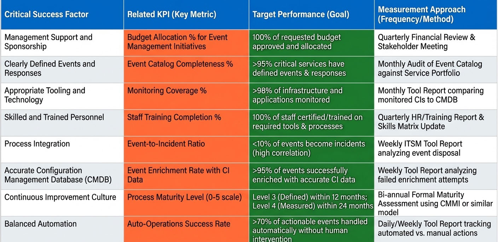
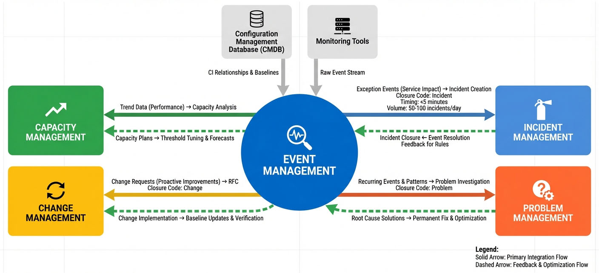

# Chapter 3: Strategic Framework


## Introduction

The strategic framework for Event Management serves as the foundation upon which successful implementations are built. While the previous chapters established what Event Management is and how events are defined and classified, this chapter addresses the critical question: *What conditions must exist for Event Management to deliver measurable business value?*

Organizations often invest heavily in monitoring tools and platforms, yet struggle to achieve the promised benefits of proactive IT operations. The difference between success and failure lies not in the technology alone, but in addressing the strategic prerequisites that enable the entire Event Management process to function effectively. This chapter introduces the eight Critical Success Factors (CSFs) that define these prerequisites, along with the supporting goals, organizational benefits, and continuous improvement mechanisms necessary for a mature Event Management practice.

Understanding and implementing these strategic elements transforms Event Management from a reactive alert-handling function into a proactive business enabler. The framework presented here provides a roadmap for organizations at any maturity level to systematically build capability, demonstrate return on investment, and align IT operations with strategic business objectives.

## The Eight Critical Success Factors

**Critical Success Factors (CSFs)** define the essential conditions and activities that must be in place for the Event Management process to achieve its goals and deliver business value. These eight factors serve as high-level organizational and operational goals that implementation efforts, detailed specifications, and Key Performance Indicators (KPIs) are designed to support and measure.

The eight Critical Success Factors for Event Management are:

1. Management Support and Sponsorship
2. Clearly Defined Events and Responses
3. Appropriate Tooling and Technology
4. Accurate Configuration Management Database (CMDB)
5. Skilled and Trained Personnel
6. Process Integration
7. Continuous Improvement Culture
8. Balanced Automation

Each CSF represents a pillar supporting the Event Management process. The absence or weakness of any single factor can significantly impair the effectiveness of the entire program. The following sections examine each CSF in detail, including success indicators, implementation requirements, and the measurable outcomes that demonstrate achievement.



*Figure 3.1: Eight Critical Success Factors for Event Management - This circular diagram illustrates the eight interdependent Critical Success Factors that form the strategic foundation of Event Management. Each factor connects to adjacent factors, demonstrating that success requires balanced attention to all eight elements. Management Support and Sponsorship forms the foundation at the base, with Continuous Improvement Culture at the apex, representing the ongoing evolution of the process.*

### CSF 1: Management Support and Sponsorship

**Management Support and Sponsorship** is the most critical success factor for effective Event Management. This CSF serves as the essential organizational and financial foundation necessary to implement, sustain, and mature the entire Event Management process. Without high-level support, the organizational changes, investment, and cross-functional integration required for a successful Event Management program cannot be realized.

#### Why It Matters

Event Management implementation requires significant organizational commitment. It demands budget allocation for specialized tools, investment in training programs, changes to organizational structure, and often, cultural transformation from reactive to proactive operations. These changes cannot occur without active championship from senior leadership who understand the strategic value of the initiative and are willing to commit resources to its success.

Furthermore, Event Management touches multiple departments and processes—from infrastructure teams who must deploy monitoring agents, to application teams who define event thresholds, to incident management teams who receive escalations. Coordinating these diverse stakeholders and resolving competing priorities requires executive authority and influence.

#### Success Indicators

An organization has achieved this CSF when the following conditions are met:

- **Executive Sponsor Assigned:** A senior executive is officially designated as the champion for the Event Management process, with formal accountability for its success
- **Budget Allocated:** Adequate funding is provided for tools, technology platforms, training programs, and staffing resources
- **Strategic Alignment:** Event Management objectives are explicitly aligned with broader organizational and IT strategy goals
- **Regular Management Review:** Process metrics and performance are reviewed in scheduled management meetings with documented decisions and actions

#### The Role of the Process Owner

The Event Management Process Owner is a senior-level position responsible for translating management support into operational reality. This role executes the mandate provided by executive sponsorship and serves as the primary accountability point for process effectiveness.

**Key Responsibilities:**
- **Define Vision and Strategy:** Articulate the purpose, scope, and strategic objectives of the Event Management process
- **Align with IT Strategy:** Ensure Event Management goals directly support broader IT service management and business objectives
- **Ensure Adequate Staffing:** Secure sufficient headcount and the right skill mix across all Event Management roles
- **Provide Budget:** Request and manage funding for tools, training, and operational expenses
- **Drive Accountability:** Hold the organization accountable for Event Management effectiveness through regular performance reviews
- **Champion Process Adoption:** Advocate for Event Management across the organization and remove barriers to implementation

#### Implementation Considerations

Organizations should formalize management support through documented commitments, such as:

- **Charter Document:** A formal Event Management charter signed by executive leadership that defines scope, objectives, authority, and resources
- **Steering Committee:** An Event Management steering committee with representation from IT leadership, business stakeholders, and process stakeholders
- **Budget Line Items:** Dedicated budget allocation visible in financial planning systems
- **Performance Objectives:** Event Management success metrics included in relevant leadership performance objectives and scorecards

**For example:** An organization implementing Event Management might establish a steering committee chaired by the Chief Information Officer, with quarterly reviews of process maturity metrics, automation success rates, and incident prevention statistics. The Event Management Process Owner presents results, proposes investments, and secures decisions on strategic direction.

### CSF 2: Clearly Defined Events and Responses

**Clearly Defined Events and Responses** is the second Critical Success Factor and represents the bridge between strategic intent and operational execution. This factor translates the goals of Event Management into practical, detailed technical specifications and documented procedures necessary for daily operations and consistent event handling. Without clear definitions for events and their corresponding actions, event handling becomes inconsistent and ineffective, resulting in missed critical events, alert fatigue, and operational confusion.

#### Why It Matters

Event Management systems generate thousands or even millions of alerts daily. Without precise definitions of what constitutes an event, which events matter, and how each should be handled, organizations face several critical problems:

- **Inconsistent Response:** Different analysts interpret the same alert differently, leading to varied response times and actions
- **Alert Fatigue:** Excessive low-value alerts overwhelm teams, causing critical events to be missed
- **Inability to Automate:** Automation requires precise, repeatable definitions—ambiguity prevents effective scripting
- **Poor Metrics:** Without clear event types and outcomes, measuring process effectiveness becomes impossible

#### Success Indicators

This CSF is achieved when:

- **Documented Event Catalog:** A formal, maintained library of defined events exists and is accessible to all relevant personnel
- **Defined Thresholds:** Specific values for each event type are documented (for example, `75% CPU sustained for 15 minutes` triggers a Warning event; `90% CPU sustained for 5 minutes` triggers an Exception event)
- **Standard Response Procedures:** Documented steps exist for handling each event type, including symptoms, possible causes, initial assessment steps, resolution actions, and escalation criteria
- **Regular Review Process:** A formal mechanism exists to review and update event definitions based on operational experience and changing infrastructure

#### Core Components

##### Event Types and Detection Rules

Events must be classified into distinct types that dictate handling requirements:

- **Informational Events:** Notifications requiring no action, logged only for audit purposes and trending analysis. For instance, successful scheduled backup completion or user login events fall into this category.
- **Warning Events:** Indicate approaching a threshold and require monitoring or preventive action. These are proactive indicators that allow time for planning. For example, disk space at `70%` utilization where the critical threshold is `80%`, or sustained CPU utilization at `75%` for 15 minutes.
- **Exception Events:** Indicate abnormal operation or service disruption requiring immediate investigation and resolution. These include database connection failures, application crashes, or critical thresholds exceeded. Exception events often result in escalation to Incident Management.

##### Thresholds and Capacity Requirements

Thresholds must be defined based on both technical capacity and business requirements:

**Warning Thresholds (Proactive):**
- Disk space at `70%` used
- CPU utilization at `75%` sustained for 15 minutes
- Memory utilization at `80%`
- Network bandwidth at `60%` of capacity

These thresholds provide advance warning, allowing teams to plan capacity expansion, schedule maintenance, or implement optimization measures before service impact occurs.

**Critical Thresholds (Reactive):**
- Disk space at `85%` used
- CPU utilization at `90%` sustained for 5 minutes
- Memory utilization at `95%`
- Network bandwidth at `85%` of capacity

Critical threshold breaches require immediate response and may trigger automatic escalation to Incident Management if service disruption is likely or confirmed.

##### Response Procedures

Each defined event type must have a corresponding response procedure:

**Automated Responses:** Enable self-healing capabilities by scripting resolution actions for well-understood, repeatable events. Examples include restarting a failed service, clearing a temporary directory approaching capacity, or resetting a locked user account.

**Manual Response Procedures:** Document step-by-step instructions for events requiring human judgment or complex troubleshooting. These procedures must include:
- **Symptoms:** Observable indicators that triggered the event
- **Possible Causes:** Known root causes based on historical analysis
- **Initial Assessment Steps:** Diagnostic actions to determine actual cause
- **Resolution Steps:** Corrective actions to resolve the issue
- **Escalation Criteria:** Clear conditions under which the event must be escalated to Incident Management or Problem Management

#### Implementation Example

Consider a database server experiencing performance degradation:

**Event Definition:**
- **Event Name:** Database Connection Pool Exhaustion Warning
- **Event Type:** Warning
- **Threshold:** Connection pool utilization ≥ `80%` sustained for 5 minutes
- **Detection Method:** Database monitoring agent queries connection pool metrics every 60 seconds

**Response Procedure:**
1. **Verify Event:** Confirm connection pool utilization via database console
2. **Check Application Load:** Determine if increased legitimate traffic is causing demand
3. **Identify Connection Leaks:** Query for long-running or idle connections
4. **Take Action:** If connection leak identified, coordinate with application team to restart application; if legitimate load increase, prepare capacity expansion recommendation
5. **Escalate If:** Utilization reaches `95%` or service degradation is reported by users

This level of specificity ensures consistent handling regardless of which analyst responds to the event.

### CSF 3: Appropriate Tooling and Technology

**Appropriate Tooling and Technology** is a foundational Critical Success Factor upon which the entire Event Management process depends. The success of Event Management relies on reliable monitoring, correlation, and integration tools that form the technical infrastructure enabling detection, analysis, and response activities.

#### Why It Matters

Event Management is fundamentally a data-driven process. Without the right tools, organizations face critical limitations:

- **Blind Spots:** Inadequate monitoring coverage means events go undetected until users report service disruptions
- **Alert Fatigue:** Without correlation engines, teams are overwhelmed by redundant and related alerts
- **Manual Inefficiency:** Lack of automation capabilities forces manual handling of routine events, limiting scale and increasing response times
- **Integration Gaps:** Poor integration with IT Service Management (ITSM) platforms results in lost context and inefficient handoffs to Incident and Problem Management

The right tooling transforms Event Management from a reactive, overwhelmed function into a proactive, efficient operation.

#### Success Indicators

This CSF is achieved when:

- **Centralized Event Management System:** A single platform aggregates events from all monitoring sources, providing unified visibility
- **Standardized Monitoring Agents:** Consistent monitoring tools are deployed across infrastructure, applications, and services
- **Correlation Engine Configured:** Rules and logic are in place to reduce alert noise by identifying relationships between events
- **ITSM Integration Functioning:** Seamless data exchange exists between the event management platform and incident, problem, and change management systems

#### Tooling Supporting Key Process Activities

Different tools support specific Event Management activities and drive measurable outcomes:

**Table 3.1:** Event Management Tooling and Related Benefits

| Tool Function | Process Activity Supported | Related Metric/Benefit |
|--------------|---------------------------|----------------------|
| **Monitoring Agents** | Activity 1: Monitor and Detect | Coverage and Detection Rate |
| **Central Event Platform** | Activity 3: Manage Event | False Positive Rate (target ≤ `5%`) |
| **Correlation Engine** | Activity 3.2: Correlate Events | Correlation Effectiveness (Alert Reduction) |
| **Automation Engine** | Activity 3.3: Auto-Response | Auto-operations Success Rate (target ≥ `70%`) |
| **CMDB Integration** | Activity 4.3: Determine Significance | Accurate Impact Assessment, Better Fault Analysis |
| **ITSM Integration** | Activity 4: Escalate | Efficient handoff to Incident/Problem Management |

#### Essential Tool Categories

##### Monitoring and Detection Tools

These tools form the sensory system of Event Management:

- **Infrastructure Monitoring:** Tracks servers, network devices, storage systems for hardware and resource utilization events
- **Application Monitoring:** Monitors application performance, errors, and availability
- **Network Monitoring:** Detects network connectivity, bandwidth, and protocol issues
- **Log Management:** Aggregates and analyzes log files for error patterns and security events
- **Synthetic Monitoring:** Proactively simulates user transactions to detect service degradation before users are impacted

##### Central Event Management Platform

The central platform serves as the command center:

- Aggregates events from all monitoring sources
- Provides unified dashboards and visualization
- Manages event lifecycle from detection through closure
- Stores event history for trending and analysis
- Generates reports and metrics

##### Correlation Engine

Correlation capabilities reduce alert noise and identify relationships:

- **Time-Based Correlation:** Groups events occurring within a defined time window
- **Topology-Based Correlation:** Uses Configuration Management Database (CMDB) relationships to identify dependent events (for example, multiple application failures caused by underlying database server failure)
- **Pattern-Based Correlation:** Identifies recurring sequences of events that indicate specific failure modes

##### Automation and Orchestration

Automation tools enable self-healing and efficiency:

- Execute scripted responses to defined events
- Orchestrate multi-step remediation workflows
- Integrate with infrastructure APIs for programmatic responses
- Provide rollback capabilities for failed automation attempts

##### ITSM Integration

Integration with service management platforms ensures seamless process handoffs:

- Automatic incident creation from critical events
- Bi-directional data synchronization
- Consistent data models across platforms
- Unified reporting across Event, Incident, and Problem Management

#### Implementation Analogy

The tooling acts as the specialized nervous system of IT operations. Just as a biological nervous system allows a body to detect problems through sensors (monitoring), filter irrelevant signals in the brain (correlation), and initiate automatic reflexes (automation), appropriate tooling ensures the Event Management process is proactive and efficient, preventing issues from impacting end users.

Organizations should select tools that integrate well with existing platforms, scale to anticipated event volumes, and support the skill levels of available personnel.

### CSF 4: Accurate Configuration Management Database

**Accurate Configuration Management Database (CMDB)** is Critical Success Factor 4, emphasizing that Event Management's effectiveness fundamentally depends on accurate data about Configuration Items (CIs) and their relationships. The CMDB provides the relational data structure that enables the Event Management system to move beyond treating every alert as an isolated incident, instead enabling intelligent correlation and accurate impact assessment.

#### Why It Matters

Event correlation and impact analysis are fundamentally dependent on accurate CI relationships documented in the CMDB. Without this foundation:

- **Correlation Fails:** The system cannot determine that multiple alerts are all symptoms of a single root cause, leading to alert fatigue and redundant investigation
- **Impact Assessment Is Inaccurate:** Without knowing what services and business processes depend on a failing component, Event Management cannot accurately prioritize events
- **Automation Is Risky:** Automated responses may inadvertently affect related components not accounted for in remediation scripts
- **Trend Analysis Is Limited:** Historical analysis cannot identify patterns across related infrastructure components

The CMDB is not merely an IT governance requirement; it is a technical necessity for Event Management success.

#### Success Indicators

This CSF is achieved when:

- **CMDB Accuracy Above 95%:** CI records are verified to be current and correct for at least 95% of CIs
- **CI Relationships Properly Documented:** Dependency relationships, hosting relationships, and service mappings are defined and maintained
- **Regular CMDB Audits Performed:** Systematic validation of CMDB data occurs on a defined schedule
- **Automated Discovery and Updates Implemented:** Discovery tools continuously update CMDB data, reducing manual effort and improving currency

#### Enabling Core Event Management Activities

##### Event Correlation

Accurate CMDB data is vital for achieving intelligent alert noise reduction through topology-based correlation.

**Topology-Based Correlation** relies entirely on the CMDB. By defining CI dependency relationships within the CMDB, the Event Management system can determine when multiple events are all child events of a single parent event.

**For example:** Consider a web application that depends on an application server, which in turn depends on a database server, which depends on a storage array, all connected through network infrastructure. If the storage array fails, the Event Management platform may receive:

- Storage array failure event
- Database server connection failure event
- Application server database connection timeout events
- Web application failure events
- Multiple user session termination events

Without CMDB relationships, these appear as separate incidents requiring individual investigation. With accurate CMDB dependencies, the correlation engine recognizes that all downstream events are child events of the parent storage array failure. The system can:

1. Suppress or correlate child events
2. Focus investigation on the root cause (storage array)
3. Automatically assess impact based on services affected by the storage array
4. Prevent creation of multiple redundant incidents

This correlation reduces alert noise from potentially dozens of alerts to a single actionable event, dramatically improving efficiency.

##### Impact Assessment and Event Significance

During **Activity 4.3: Determine Event Significance**, the Event Analyst must assess the business impact and urgency of each event to establish appropriate priority. The CMDB is the primary source of data for this assessment.

**CMDB Data Used for Impact Assessment:**
- **Business Service Mapping:** Which business services depend on the affected CI?
- **User Count:** How many users are affected by a service outage?
- **Dependency Relationships:** What other infrastructure components will be impacted if this CI fails?
- **CI Criticality:** What is the defined criticality rating of this CI (for example, Tier 1 production, Tier 2 development)?
- **Environment Classification:** Is this production, pre-production, test, or development environment?

**For example:** A database server experiencing CPU warnings triggers different responses depending on CMDB data:

- **Scenario A:** CMDB shows the database supports the organization's customer-facing e-commerce application serving 10,000 active users. Impact: **Critical**. Priority: **High**.
- **Scenario B:** CMDB shows the database supports an internal reporting application used by five analysts during business hours only. Impact: **Low**. Priority: **Low**.

The same technical event (database CPU warning) receives dramatically different prioritization based on accurate CMDB impact data. Without CMDB accuracy, Event Management either treats all events as equally critical (leading to resource exhaustion) or arbitrarily deprioritizes events (leading to missed critical incidents).

#### Implementation Requirements

Achieving CMDB accuracy sufficient for Event Management requires:

**1. Comprehensive CI Coverage:**
- All infrastructure components generating events must exist as CIs in the CMDB
- Monitoring tools must use consistent CI identifiers that match CMDB records

**2. Relationship Mapping:**
- Hosting relationships (physical server hosts virtual machine hosts application)
- Dependency relationships (application depends on database depends on storage)
- Service relationships (business service comprises multiple technical CIs)

**3. Regular Audits:**
- Quarterly validation of CI attributes for accuracy
- Monthly validation of critical CI relationships
- Automated reconciliation between discovery tools and CMDB

**4. Change Integration:**
- All infrastructure changes update the CMDB as part of change implementation
- Discovery tools refresh CMDB data automatically at defined intervals
- Monitoring tool integration provides real-time updates when CIs are detected or decommissioned

**5. Data Quality Metrics:**
- CMDB completeness (percentage of actual infrastructure documented)
- CMDB accuracy (percentage of CI records verified as correct)
- Relationship coverage (percentage of CIs with documented dependencies)

Organizations should prioritize CMDB accuracy for production and critical infrastructure first, then expand coverage to lower environments as maturity increases.

### CSF 5: Skilled and Trained Personnel

**Skilled and Trained Personnel** is Critical Success Factor 5, emphasizing that the effectiveness of Event Management relies directly on the capability, knowledge, and structure of the team responsible for its operation and design. This factor translates the theoretical requirements of the Event Management framework into actionable human capital requirements, ensuring the organization has the right expertise to implement complex tools, define accurate rules, and execute procedures consistently.

#### Why It Matters

Even the most sophisticated event management platform, the most comprehensive event catalog, and the strongest executive sponsorship will fail without skilled personnel to operate the process. Event Management requires diverse competencies:

- **Technical Expertise:** Understanding of infrastructure, applications, and monitoring technologies
- **Analytical Skills:** Ability to interpret event patterns, correlate related alerts, and determine significance
- **Process Knowledge:** Understanding of Event Management activities, integration points, and escalation criteria
- **Automation Skills:** Capability to develop, test, and maintain automated response scripts
- **Communication Skills:** Ability to document procedures, escalate appropriately, and coordinate with other teams

#### Success Indicators

This CSF is achieved when:

- **Roles Clearly Defined and Staffed:** Specific Event Management roles are formally established with documented responsibilities and filled with qualified personnel
- **Training Programs Established:** Structured training exists for new hires and ongoing skill development
- **Knowledge Base Maintained:** Operational knowledge is captured in accessible documentation including runbooks, troubleshooting guides, and process procedures
- **Regular Skill Assessments Conducted:** Proficiency is continuously evaluated through competency assessments and performance reviews

#### Key Roles and Required Competencies

**Table 3.2:** Event Management Roles and Competency Requirements

| Role | Primary Responsibility | Key Skills | Knowledge Level Required |
|------|----------------------|-----------|-------------------------|
| **Event Management Process Owner** | Strategic leadership and governance | Strategic Thinking, Business Management | Expert in Process Management |
| **Event Manager** | Daily execution and team leadership | People Management, Process Management | Expert in EM Process |
| **Event Management Architect** | Tool selection and strategic architecture design | Technical Breadth, Strategic Planning | Expert in EM Tools |
| **Event Designer** | Technical configuration of rules, correlation, and automation | Advanced Scripting/Automation, Tool Configuration | Expert in EM Tools and Platforms |
| **Event Analyst** | Frontline monitoring, investigation, and escalation | Attention to Detail, Troubleshooting | Advanced in Incident Management |

##### Event Management Process Owner

This senior position provides strategic direction and accountability. The Process Owner defines the vision for Event Management, ensures alignment with IT strategy, secures resources, and drives continuous improvement. This role requires business acumen, strategic thinking, and the organizational influence to drive cross-functional coordination.

##### Event Manager

The Event Manager executes day-to-day operations, leading the Event Management team and ensuring processes are followed consistently. This role requires strong people management skills, process expertise, and the ability to manage operational metrics and performance. The Event Manager implements directives from the Process Owner and ensures the team has the support and guidance needed to succeed.

##### Event Management Architect

The Architect role is responsible for the strategic design of the Event Management technology infrastructure. This includes selecting appropriate monitoring tools, designing the correlation engine architecture, planning integration points with other systems, and ensuring the platform scales to organizational needs. The Architect must possess deep technical knowledge across multiple domains and the ability to design solutions that meet both current and future requirements.

##### Event Designer

Event Designers perform the detailed technical work of implementing monitoring rules, configuring correlation logic, developing automation scripts, and maintaining event definitions. This hands-on role requires expert knowledge of the event management platform, advanced scripting skills, and deep understanding of the infrastructure and applications being monitored. Event Designers translate business requirements into technical configurations.

##### Event Analyst

Event Analysts are the frontline operators who monitor event dashboards, investigate alerts, execute response procedures, and escalate events as needed. This role requires excellent attention to detail, strong troubleshooting skills, and the ability to work under pressure during critical events. Event Analysts must understand event definitions, follow documented procedures, and exercise judgment in determining event significance and escalation requirements.

#### Training and Continuous Skill Development

Organizations must invest in both initial training and ongoing development:

**New Hire Training:**
- **Week 1:** Event Management process overview, organizational context, tool access, and orientation
- **Weeks 2-3:** Technical deep dive on monitoring platforms, correlation engine, event catalog, and CMDB structure
- **Week 4:** Role-specific training including shadowing experienced team members and supervised event handling

**Role-Based Training Tracks:**
- **Event Analyst Track:** Focus on event investigation, troubleshooting methodologies, escalation procedures, and tool operation
- **Event Designer Track:** Advanced tool configuration, scripting and automation development, correlation rule design, and testing methodologies
- **Event Architect Track:** Architecture design principles, vendor evaluation, integration patterns, and capacity planning
- **Event Manager Track:** Team leadership, process governance, metrics management, and continuous improvement facilitation

**Continuing Education:**
All roles require a minimum of 40 hours of continuing education per year, which may include:
- Vendor certification programs for monitoring platforms
- ITIL or equivalent service management framework training
- Technical training on new infrastructure or application technologies
- Soft skills development such as communication, leadership, or project management

**Knowledge Management:**
The organization must maintain a comprehensive knowledge base including:
- **Runbooks:** Step-by-step procedures for handling specific event types
- **Troubleshooting Guides:** Diagnostic trees and resolution techniques
- **Process Documentation:** Detailed process flows, role descriptions, and governance procedures
- **Lessons Learned:** Documented post-incident reviews and process improvement recommendations

#### Building Team Capability

Organizations should implement structured approaches to develop and maintain skilled personnel:

1. **Competency Assessments:** Conduct regular skills assessments against defined competency frameworks to identify gaps
2. **Career Pathing:** Provide clear progression paths from Event Analyst through Designer to Architect roles
3. **Mentorship Programs:** Pair junior team members with experienced practitioners for knowledge transfer
4. **Cross-Training:** Rotate personnel through different Event Management roles to build breadth of understanding
5. **Knowledge Sharing:** Establish regular team meetings for sharing lessons learned, discussing complex events, and collective problem-solving

**For example:** An organization might establish a monthly Event Management forum where the team reviews the most challenging events from the previous month, discusses how they were handled, identifies improvements to documentation or automation, and shares insights across team members. This practice builds collective expertise while driving continuous improvement.

### CSF 6: Process Integration

**Process Integration** is Critical Success Factor 6, emphasizing that Event Management must integrate seamlessly with other IT Service Management (ITSM) processes to deliver complete service management value. Event Management acts as the "entry point" for many Service Operation activities, detecting conditions that require resolution, investigation, or change. Integration ensures that these detected events effectively connect with the subsequent processes responsible for resolution and systemic improvement.

#### Why It Matters

Event Management detects and performs initial classification of events, but it does not resolve complex technical issues, perform root cause analysis, or implement infrastructure changes. These activities are the domain of specialized ITSM processes: Incident Management, Problem Management, and Change Management respectively.

Without effective integration:

- **Events Die in Limbo:** Critical events are detected but never acted upon because no formal handoff to resolution processes occurs
- **Context Loss:** Information gathered during event investigation is lost when escalating, forcing redundant investigation
- **Duplicate Work:** Multiple teams investigate the same issue without coordination
- **Metrics Silos:** Event Management metrics show success while service quality degrades, because event outcomes are not tracked through complete resolution

Integration ensures that Event Management demonstrates measurable value by preventing incidents, enabling proactive problem resolution, and triggering necessary changes.

#### Supporting Goal

A key supporting goal of Event Management is to **Support Other Processes** by providing accurate and timely event data to Incident, Problem, and Change Management. This goal recognizes that Event Management success is measured not just by events handled, but by the effectiveness of downstream process activities enabled by high-quality event detection and initial triage.

#### Success Indicators

This CSF is achieved when:

- **Defined Handoffs:** Clear, documented procedures exist for escalating events to Incident, Problem, and Change Management
- **Integrated Workflows and Tools:** Technical integration enables automatic creation of incident, problem, or change records with full event context
- **Consistent Data Across Processes:** Common data models ensure event information flows seamlessly between processes
- **Regular Process Coordination Meetings:** Event Management personnel meet regularly with representatives from other ITSM processes to coordinate activities and resolve integration issues

#### Integration with Incident Management

Exception events that cause or are likely to cause service disruption trigger escalation to Incident Management. This integration is the most frequent and critical handoff from Event Management.

**Escalation Criteria:**
- Service disruption confirmed or imminent
- Exception event with high business impact
- Event cannot be resolved through standard Event Management procedures
- User-reported issues correlated with detected events

**Integration Mechanics:**
1. **Event Analyst Creates Incident Record:** The analyst generates a formal incident in the ITSM system, linked to the originating event(s)
2. **Transfer Event Data:** All relevant event details transfer to the incident including event description, time of detection, affected Configuration Items (CIs), diagnostic information gathered, and actions already taken
3. **Set Incident Priority:** Incident priority is calculated using impact and urgency data from the event assessment
4. **Assign to Incident Team:** The incident is routed to the appropriate incident resolution team based on categorization and assignment rules
5. **Monitor Incident Progress:** Event Management tracks the incident to closure and analyzes whether the event definitions or response procedures should be updated based on the outcome

**Closure Code:** Events escalated to Incident Management are closed with closure code `Incident`, linking to the created incident record.

#### Integration with Problem Management

Recurring events with unknown root causes, patterns of related events, or events indicating systemic issues are escalated to Problem Management for investigation and permanent resolution.

**Escalation Criteria:**
- Recurring events affecting the same CI or service
- Multiple related events suggesting an underlying systemic issue
- Event indicates design flaw or architectural limitation
- Workarounds or temporary fixes have been applied but root cause is unknown

**Integration Mechanics:**
1. **Event Analyst Creates Problem Record:** The analyst generates a problem record in the ITSM system
2. **Link Related Events:** The problem is linked to all related events, providing comprehensive history
3. **Provide Trend Data:** Event history, frequency analysis, and pattern data are attached to support problem investigation
4. **Continue Monitoring:** Event Management continues to detect and track related events, providing ongoing data to the problem investigation team
5. **Update Event Definitions:** Once root cause is identified and permanent fix implemented, Event Management updates monitoring rules and thresholds to detect similar conditions proactively in the future

**Closure Code:** Events escalated to Problem Management are closed with closure code `Problem`, linking to the created problem record.

#### Integration with Change Management

Events signaling the need for configuration adjustments, capacity expansions, or infrastructure modifications trigger the Change Management process proactively.

**Escalation Criteria:**
- Warning events indicating approaching capacity limits
- Events suggesting configuration optimization opportunities
- Recurring informational events indicating inefficient infrastructure design
- Events recommending preventive maintenance

**Integration Mechanics:**
1. **Event Analyst Creates Request for Change (RFC):** The analyst initiates a change request in the change management system
2. **Document Change Rationale:** The RFC includes justification based on event data, such as trend analysis showing capacity growth or pattern analysis revealing inefficiency
3. **Attach Event Evidence:** Supporting event data and analysis are included with the RFC to inform change planning
4. **Track Change Implementation:** Event Management monitors for events during and after change implementation to validate success
5. **Update Event Baselines:** Following successful change implementation, Event Management updates baseline thresholds and expected behavior patterns

**Closure Code:** Events resulting in proactive changes are closed with closure code `Change`, linking to the created RFC.



*Figure 3.2: Process Integration Map - This diagram illustrates the primary integration points between Event Management and other ITSM processes. Event Management serves as the central detection mechanism, feeding Incident Management (for service disruptions), Problem Management (for recurring issues requiring root cause analysis), and Change Management (for proactive infrastructure improvements). Bi-directional arrows indicate feedback loops where insights from downstream processes inform updates to event definitions and monitoring rules.*

#### Enabling Effective Integration

Organizations should implement several practices to ensure strong process integration:

1. **Common Data Models:** Ensure event, incident, problem, and change records share common fields such as affected CI, business service, priority, and categorization
2. **Automated Handoffs:** Configure technical integration to automatically create downstream records when escalation criteria are met
3. **Service Level Agreements (SLAs):** Define clear response time expectations for each process, ensuring events escalated to other processes receive timely attention
4. **Regular Coordination Meetings:** Establish weekly or biweekly meetings between Event Management and other process teams to review escalation quality, identify process improvements, and coordinate on complex issues
5. **Integrated Reporting:** Develop dashboards and reports that track events through complete lifecycle including downstream process outcomes

**For example:** An organization might implement a monthly "Event-to-Outcome" report showing: total events detected, percentage auto-resolved, percentage escalated to Incident Management with average incident resolution time, percentage escalated to Problem Management with problems resolved, and percentage resulting in proactive changes. This end-to-end visibility ensures Event Management demonstrates value beyond initial detection.

### CSF 7: Continuous Improvement Culture

**Continuous Improvement Culture** is Critical Success Factor 7, representing the mechanism that ensures the Event Management process remains relevant, effective, and efficient over time. This element actively drives the process toward higher maturity levels and prevents stagnation. While other CSFs establish the initial conditions for success, Continuous Improvement Culture ensures sustained and growing success.

#### Why It Matters

Event patterns and infrastructure change over time, requiring process adaptation. Several factors drive the need for continuous improvement:

- **Infrastructure Evolution:** New applications, platforms, and technologies are deployed, requiring new monitoring definitions
- **Changing Thresholds:** Capacity growth, infrastructure upgrades, and workload changes necessitate threshold adjustments
- **False Positive Accumulation:** Monitoring rules that were once accurate may generate false positives as configurations drift
- **Missed Events:** Post-incident analysis may reveal that Event Management failed to detect critical conditions
- **Automation Opportunities:** Manual event handling procedures may reveal patterns suitable for automation

Without a formalized continuous improvement culture, Event Management effectiveness degrades over time as the process fails to adapt to changing conditions.

#### Success Indicators

This CSF is achieved when:

- **Regular Process Reviews Conducted:** Scheduled reviews of Event Management effectiveness occur with documented findings and action items
- **Metrics Analyzed for Improvement Opportunities:** KPIs are actively monitored and analyzed to identify performance gaps and improvement targets
- **Feedback Mechanisms Established:** Structured processes exist to capture lessons learned from incidents, problems, and operational experience
- **Process Changes Implemented:** Improvement recommendations result in actual changes to monitoring rules, automation scripts, procedures, and training

#### Implementation and Integration with Process Activities

Continuous Improvement Culture is embedded directly into the final phase of the Event Management lifecycle, ensuring that learning and adaptation are formalized process steps rather than ad-hoc activities.

##### Activity 5: Review and Close Event

This activity is the primary vehicle for continuous improvement, leveraging data gathered throughout the event lifecycle.

**Activity 5.6: Perform Trend Analysis**
- **Identify Patterns:** Analyze event data to identify recurring events, event clusters, time-based patterns (for example, events occurring at specific times of day or days of week), and correlation opportunities
- **Analyze Event Frequency:** Compare current event volumes to historical baselines to identify increases or decreases
- **Identify Recurring Events:** Flag events affecting the same CI or service repeatedly, indicating systemic issues requiring Problem Management escalation
- **Assess Detection Effectiveness:** Identify service disruptions that were user-reported rather than event-detected, revealing monitoring gaps

**Activity 5.7: Review Event Effectiveness**
- **Assess False Positive Rate:** Calculate the percentage of events closed as false positives and investigate causes
- **Measure Correlation Effectiveness:** Determine alert reduction achieved through correlation and identify opportunities for additional correlation rules
- **Evaluate Automation Success:** Track automated response success rates and identify failed automation requiring refinement
- **Analyze Response Times:** Review event response time performance against targets to identify delays and bottlenecks

**Activity 5.8: Update Event Management Solutions**
- **Adjust Event Thresholds:** Modify warning and critical thresholds based on false positive analysis and missed event identification
- **Modify Correlation Rules:** Add, remove, or refine correlation logic based on observed event patterns
- **Optimize Automated Responses:** Improve automation scripts based on failure analysis and success rate tracking
- **Update Response Procedures:** Refine manual procedures based on lessons learned during event handling
- **Expand Monitoring Coverage:** Deploy new monitoring rules to address identified detection gaps

##### Process Governance and Auditing

Continuous improvement extends beyond individual event review to systematic process governance:

**Weekly Operational Reviews:**
- Review event volumes, escalation rates, and automation success
- Identify immediate operational issues requiring corrective action
- Share lessons learned from significant events
- Assign improvement actions with owners and due dates

**Monthly Strategic Reviews:**
- Analyze monthly trend data and KPI performance
- Review progress on improvement initiatives
- Identify strategic improvement opportunities requiring investment or organizational change
- Present results to Event Management Process Owner and steering committee

**Quarterly Process Audits:**
- Validate compliance with documented procedures
- Assess alignment with other ITSM processes
- Review roles and responsibilities for currency
- Evaluate training effectiveness and identify skill gaps

#### Role of Key Personnel in Continuous Improvement

All Event Management roles have defined continuous improvement responsibilities:

**Event Management Process Owner:**
- Drive continuous improvement of the process at the strategic level
- Review process metrics and identify improvement opportunities requiring executive support or investment
- Champion process changes across the organization
- Ensure continuous improvement is prioritized and resourced

**Event Manager:**
- Implement corrective actions based on performance monitoring
- Conduct process audits and reviews
- Facilitate weekly and monthly review meetings
- Track improvement initiatives to completion

**Event Designer:**
- Perform regular review of event effectiveness
- Optimize event thresholds and correlation rules based on operational data
- Refine automation scripts and develop new automation opportunities
- Document technical improvements and share knowledge with the team

**Event Analyst:**
- Provide feedback on procedure effectiveness during daily operations
- Identify improvement opportunities through frontline experience
- Document lessons learned from challenging events
- Participate actively in improvement discussions

#### Building Continuous Improvement Culture

Organizations should implement practices that institutionalize continuous improvement:

1. **Metrics-Driven:** Base improvement decisions on quantitative performance data rather than subjective opinions
2. **Blameless Post-Event Reviews:** Focus on process and system improvements rather than individual blame when events are mishandled
3. **Innovation Time:** Allocate time for Event Designers and Analysts to experiment with new monitoring approaches, automation techniques, and tools
4. **Recognition:** Acknowledge and reward individuals and teams who identify and implement improvements
5. **Knowledge Sharing:** Document and share improvements across the team and with other organizations through communities of practice

**For example:** An organization might establish a monthly "Continuous Improvement Award" recognizing the individual who contributed the most impactful improvement during the month. This might be an Event Analyst who identified a monitoring gap that prevented a major incident, an Event Designer who developed automation that resolved a frequently recurring event, or an Event Manager who implemented a process change that improved escalation efficiency.

### CSF 8: Balanced Automation

**Balanced Automation** is the eighth and final Critical Success Factor, focusing on leveraging technology to maximize operational efficiency and achieve self-healing capabilities while crucially mitigating the inherent risks that aggressive, unchecked automation can introduce. This factor recognizes that automation is essential for Event Management maturity, but must be implemented thoughtfully with appropriate safety controls.

#### Why It Matters

Automation directly supports a primary goal of Event Management: **Maximize Automation** by increasing the percentage of events handled automatically without human intervention. The benefits are substantial:

- **Improved Efficiency:** Automated responses execute faster than manual procedures
- **24x7 Coverage:** Automation handles events during off-hours without requiring on-call staff
- **Consistency:** Automated responses execute identically every time, eliminating human error and procedural variations
- **Scalability:** Automation enables Event Management to scale to much higher event volumes without proportional staffing increases

However, the risks of poorly implemented automation are equally substantial. Too much automation without proper controls can create new problems rather than solving existing ones. Automation failures can cause service outages, data corruption, or cascading failures affecting multiple systems.

The core principle is that **"Too much automation without proper controls can create new problems; too little fails to realize benefits."** Balanced Automation achieves the equilibrium between efficiency and safety.

#### Supporting Goal

This CSF directly supports the **Primary Supporting Goal** of Event Management to **Maximize Automation**. Mature Event Management implementations achieve automation success rates of 70% or higher, meaning seven out of every ten events are automatically resolved without human intervention.

#### Success Indicators

This CSF is achieved when:

- **Automated Responses Thoroughly Tested:** All automation scripts undergo comprehensive testing in non-production environments before production deployment
- **Safety Controls Implemented:** Pre-execution checks, throttling mechanisms, and rollback procedures are built into all automation
- **Human Review Points Defined:** Critical events and high-risk automated actions include human approval requirements or validation steps
- **Rollback Procedures Established:** Every automated action has a documented and tested procedure to reverse the action if it fails or causes unintended consequences
- **Automation Success Rate Monitored:** KPIs track automated response effectiveness with target success rate ≥ `70%` for mature implementations

#### Implementation and Development Requirements

Achieving Balanced Automation requires a structured approach to development, configuration, and testing, primarily executed by the Event Designer role.

##### Automation Development Process

**1. Identification:**
- Review frequent manual actions to identify candidates for automation
- Assess suitability based on event volume, procedure complexity, and risk level
- Prioritize high-volume, low-risk events for initial automation

**2. Design:**
- Document the manual procedure being automated
- Design the automated workflow including decision points and conditional logic
- Identify prerequisites (for example, CI must be in specific state, system resources must be available)
- Plan for rollback and remediation if automation fails

**3. Development:**
- Write the automation script or workflow
- Implement comprehensive error handling to catch failures
- Add detailed logging for audit trails and troubleshooting
- Create rollback mechanism to reverse automated actions

**4. Testing:**
- Test thoroughly in non-production environment
- Simulate various scenarios including success cases, failure modes, and edge cases
- Test error handling and logging
- Validate rollback procedure actually reverses actions successfully

**5. Approval:**
- Conduct risk assessment considering potential impact of automation failure
- Document test results and risk mitigation measures
- Obtain approval from Event Manager and, for high-risk automation, from Change Management

**6. Deployment:**
- Deploy to production with initial monitoring period
- Run automation with enhanced logging and monitoring for initial execution cycles
- Review early execution results before considering automation fully operational

**7. Maintenance:**
- Monitor ongoing automation success rate
- Update automation when infrastructure or procedures change
- Periodically retest to ensure continued effectiveness

##### Crucial Safety Controls

Safety controls differentiate balanced automation from reckless automation:

**Pre-Execution Checks:**
- **Validate Event Data Accuracy:** Confirm the event triggering automation is legitimate and not a false positive
- **Check System State Prerequisites:** Verify the target system is in the expected state before executing automated actions
- **Confirm Not in Maintenance Window:** Prevent automation from executing during scheduled maintenance
- **Verify Resource Availability:** Ensure automation has necessary credentials, network connectivity, and system resources

**Safeguards:**
- **Throttling:** Limit how frequently automation can execute. For example, restart a service automatically, but no more than three times per hour to prevent infinite restart loops
- **Time Windows:** Restrict automation to execute only during specific time periods (for example, database optimization only during off-peak hours)
- **Blackout Periods:** Prevent automation during critical business periods such as month-end processing or major events
- **Approval Workflows:** Require human approval before executing high-risk automated actions such as production database failover or infrastructure-wide configuration changes

**Governance:**
- **Audit Trails:** Complete logging of all automated actions including what action was taken, when, by which automation rule, and what the result was
- **Manual Override:** Ability for Event Analysts to disable automation temporarily or permanently if issues are detected

**Post-Execution Validation:**
- **Verify Expected Outcome:** Automation must confirm the intended result was achieved (for example, after restarting a service, verify the service is actually running)
- **Check for Side Effects:** Monitor for unintended consequences of the automated action
- **Confirm Service Availability:** Validate that business services are functioning correctly after automation execution

##### Automation Candidates and Risk Assessment

Not all events are appropriate for automation. Organizations should categorize automation opportunities by risk:

**Low-Risk Automation (Implement First):**
- Restart failed services or processes
- Clear temporary directories approaching capacity
- Reset locked user accounts
- Acknowledge informational events
- Create incident records for predefined event types

**Medium-Risk Automation (Implement After Low-Risk Success):**
- Failover to standby systems
- Scale compute resources based on load
- Apply configuration changes
- Restart application components
- Clear cache or connection pools

**High-Risk Automation (Implement Only with Robust Safety Controls):**
- Database failover or recovery actions
- Infrastructure-wide configuration changes
- Automated incident resolution involving user-facing services
- Actions affecting multiple dependent systems

#### Measuring Success

**Auto-operations Success Rate (KPI):** This metric tracks the percentage of events successfully resolved through automated responses without human intervention.

**Calculation:** (Auto-resolved Events / Total Events Eligible for Automation) × 100

**Target Performance:**
- **Initial Implementation:** 30-50%
- **Mature Process:** 50-70%
- **Optimized Process:** ≥70%

Organizations should track not only success rate, but also automation failures, rollback invocations, and safety control interventions to continuously improve automation quality and safety.

**For example:** An organization might track that of 1,000 events detected in a month, 600 were eligible for automation. Of those 600, 450 were successfully auto-resolved (75% success rate), 120 required manual intervention (20%), and 30 failed with rollback invoked (5%). This data drives targeted improvements to the 5% that failed and analysis of why 20% required manual intervention.

## Supporting Goals of Event Management

While the eight Critical Success Factors establish the conditions necessary for success, the supporting goals of Event Management define what the process aims to achieve operationally. These goals directly support the primary objective of Event Management, which is to detect and appropriately respond to events to maintain service quality and prevent incidents.

### Primary Supporting Goal: Maximize Automation

The primary supporting goal is to **maximize automation** by increasing the percentage of events handled automatically without human intervention. As discussed in CSF 8, automation drives efficiency, enables 24x7 coverage, improves consistency, and allows Event Management to scale.

Organizations should establish targets for automation rates based on maturity level:
- **Initial Maturity:** 30% automation
- **Managed Maturity:** 50% automation
- **Optimized Maturity:** 70% or higher automation

### Secondary Supporting Goal: Support Other Processes

Event Management must effectively **support other ITSM processes** by providing accurate and timely event data. This goal, discussed in CSF 6, ensures that Event Management serves as an effective entry point for Incident, Problem, and Change Management activities.

Success is measured through:
- Quality of event escalations (low false escalation rate)
- Completeness of event context provided to downstream processes
- Proactive identification of problems and change opportunities
- Effectiveness of integrated workflows

### Tertiary Supporting Goal: Reduce Mean Time to Detect

Event Management aims to **reduce Mean Time to Detect (MTTD)** service disruptions, enabling faster response and minimizing business impact. Proactive event detection should identify issues before users report them, shifting from reactive to proactive operations.

Success is measured through:
- **Efficiency of Detection:** Percentage of incidents detected by Event Management rather than user reports (target ≥70% for optimized maturity)
- **Detection Speed:** Time from event occurrence to event detection and initial triage
- **Coverage:** Percentage of infrastructure and applications with effective monitoring

## Organizational Benefits and Return on Investment

Implementing Event Management according to the strategic framework delivers measurable organizational benefits that justify the investment in tools, personnel, and process development.

### Operational Benefits

**Reduced Incident Volume:**
Proactive event detection and automated resolution prevent events from escalating to incidents. Organizations implementing mature Event Management often report significant reductions in incident volume, with industry studies and ITSM practitioners commonly citing improvements in the range of 20-40%.[^1]

**Faster Mean Time to Resolve:**
Events that do escalate to incidents arrive with comprehensive context, diagnostic data, and preliminary investigation completed, enabling faster incident resolution. Improvements of 25-35% in MTTR are frequently reported in ITSM implementation case studies, though results vary based on baseline maturity and implementation scope.[^2]

**Improved Service Availability:**
Proactive detection and resolution of Warning events prevent service disruptions before they impact users, directly improving service availability metrics. Organizations with mature Event Management practices commonly target and achieve 99.9% or higher availability for critical services, though this depends on multiple factors beyond Event Management alone.

**Reduced Alert Fatigue:**
Correlation and filtering can significantly reduce alert noise, with mature implementations frequently achieving 60-80% reduction in redundant alerts. This allows operations teams to focus on events that matter rather than being overwhelmed by duplicative notifications.[^3]

[^1]: Improvement ranges are based on industry benchmarks and practitioner reports. Actual results vary significantly based on organizational maturity, implementation quality, and baseline incident volumes. Organizations should establish their own baselines and track improvements specific to their context.

[^2]: MTTR improvements depend on factors including process maturity, tool integration quality, and team skill levels. These figures represent commonly reported outcomes rather than guaranteed results.

[^3]: Alert reduction effectiveness depends on correlation rule quality, CMDB accuracy, and event source characteristics. Organizations should measure their specific correlation effectiveness rather than assuming industry averages apply to their environment.

### Financial Benefits

**Reduced Operational Costs:**
Automation reduces the manual effort required to handle events, improving operational efficiency. Industry reports suggest that mature automation implementations can achieve 30-50% reduction in operational effort for event handling, though actual results depend on automation scope, event complexity, and baseline manual effort levels.[^4]

**Avoided Business Impact:**
Preventing incidents avoids the business cost of service disruptions. For organizations where service availability directly impacts revenue (for example, e-commerce, SaaS providers), this benefit can be substantial. The specific value depends on the organization's revenue model, customer base, and the criticality of affected services.

**Improved Resource Utilization:**
Proactive capacity management driven by event trending prevents over-provisioning while avoiding capacity-related incidents, optimizing infrastructure investment.

[^4]: Operational efficiency improvements vary widely based on starting maturity, automation sophistication, and organizational factors. Organizations should track their own efficiency metrics to measure actual improvement rather than relying on industry averages.

### Strategic Benefits

**Business-Aligned IT Operations:**
Event Management aligned with business priorities ensures IT efforts focus on services that matter most to the organization, improving business-IT alignment.

**Proactive Service Management:**
Mature Event Management shifts IT operations from reactive firefighting to proactive service stewardship, improving IT credibility and business relationships.

**Foundation for Advanced Capabilities:**
Event Management creates the data foundation for advanced analytics, predictive incident management, and artificial intelligence applications, positioning the organization for future innovation.

### Calculating Return on Investment

Organizations should calculate Event Management ROI by comparing implementation and operational costs against measurable benefits:

**Investment:**
- Event management platform licensing and implementation costs
- Monitoring tool deployment and integration
- Training and personnel development
- Process development and documentation
- Ongoing operational costs (personnel, tool maintenance)

**Measurable Returns:**
- Reduced incident handling costs (fewer incidents × average incident handling cost)
- Avoided downtime costs (prevented incidents × average cost per hour of downtime)
- Operational efficiency gains (hours saved through automation × labor cost)
- Improved productivity (reduced end-user disruption)

**Illustrative Example:** The following scenario demonstrates how an organization might calculate ROI. *Note: These figures are hypothetical and intended to illustrate the calculation methodology. Actual costs and benefits will vary significantly based on organization size, industry, existing infrastructure, and implementation scope. Organizations should develop their own calculations using their specific cost data and realistic benefit estimates.*

- **Investment:** $500,000 initial implementation + $200,000 annual operational cost
- **Returns Year 1:** $300,000 (40% incident reduction × $750,000 annual incident costs) + $150,000 (avoided downtime) + $180,000 (operational efficiency) = $630,000
- **Net Benefit Year 1:** $630,000 - $700,000 = -$70,000 (net cost during implementation year)
- **Returns Year 2+:** $600,000 annual returns - $200,000 operational cost = $400,000 annual net benefit
- **ROI:** Payback achieved in approximately 18 months with substantial ongoing returns

*The 18-24 month payback period is consistent with industry observations for well-executed ITSM implementations, though actual results depend heavily on implementation quality, organizational readiness, and benefit realization practices.*

## Success Metrics Overview

Success metrics, formalized as Key Performance Indicators (KPIs), provide quantitative evidence that the strategic framework is achieving intended outcomes. While detailed KPI definitions and calculation methods are covered in Part 4 of this handbook, this section introduces the metrics that align with each Critical Success Factor.

**Table 3.3:** CSFs Aligned with Key Performance Indicators

| Critical Success Factor | Related KPI | Target Performance |
|------------------------|-------------|-------------------|
| **CSF 1: Management Support** | Process maturity score, Budget allocation | Defined maturity level achieved |
| **CSF 2: Clearly Defined Events** | False Positive Rate | ≤5% |
| **CSF 3: Appropriate Tooling** | Coverage percentage, Correlation Effectiveness | ≥95% coverage, 60-80% alert reduction |
| **CSF 4: Accurate CMDB** | CMDB accuracy percentage | ≥95% |
| **CSF 5: Skilled Personnel** | Training completion rate, Skill assessment scores | 100% required training, ≥80% competency scores |
| **CSF 6: Process Integration** | Event-to-Incident ratio, Handoff quality | Defined targets based on environment |
| **CSF 7: Continuous Improvement** | Improvement initiatives completed | 100% of planned improvements |
| **CSF 8: Balanced Automation** | Auto-operations Success Rate | ≥70% for mature implementations |

Organizations should establish baseline measurements when implementing Event Management, then track progress toward target performance levels as the process matures.

## Process Integration Strategy

A comprehensive process integration strategy ensures Event Management effectively connects with other ITSM processes and organizational functions. This strategy extends beyond the technical integration discussed in CSF 6 to address organizational, procedural, and cultural integration.

### Organizational Integration

**Cross-Functional Teams:**
Establish working groups with representation from Event Management, Incident Management, Problem Management, Change Management, and key infrastructure teams. These groups coordinate process activities, resolve integration issues, and drive improvements.

**Shared Accountability:**
Define shared accountability metrics that require collaboration across processes. For example, "End-to-end incident resolution time" from event detection through incident closure creates shared incentive for effective Event Management-to-Incident Management handoffs.

**Unified Governance:**
Establish governance structures that oversee all ITSM processes collectively rather than in isolation, ensuring integration is prioritized and issues are escalated appropriately.

### Procedural Integration

**Standardized Data Models:**
Implement common data structures for events, incidents, problems, and changes, ensuring information flows seamlessly between processes without translation or data loss.

**Consistent Classification:**
Use consistent categorization schemes across processes so that event categories align with incident categories, enabling accurate trending and analysis across the service lifecycle.

**Integrated Workflows:**
Automate process handoffs through workflow integration so that escalations from Event Management trigger appropriate workflows in receiving processes with full context transfer.

### Cultural Integration

**Process Ownership Collaboration:**
Foster strong working relationships between process owners, ensuring they understand interdependencies and collaborate on process improvements.

**Knowledge Sharing:**
Establish mechanisms for sharing lessons learned across processes so that insights from incident post-mortems inform event definition improvements, and event trend analysis informs problem investigations.

**Unified Objectives:**
Align process objectives around common service quality goals rather than optimizing individual process metrics that may create perverse incentives or process silos.

## Continuous Improvement Culture in Practice

Continuous Improvement Culture, addressed as CSF 7, deserves additional elaboration regarding its practical implementation and organizational impact.

### Establishing the Foundation

**Metrics Framework:**
Implement comprehensive metrics collection and analysis capabilities so that improvement decisions are data-driven. Metrics should be:
- **Timely:** Available in near real-time or at least daily
- **Accurate:** Based on reliable data sources with validation
- **Actionable:** Providing clear insight into specific improvement opportunities
- **Aligned:** Connected to strategic goals and business outcomes

**Feedback Mechanisms:**
Create multiple channels for capturing improvement ideas:
- **Structured Reviews:** Formal post-event reviews, weekly operational reviews, and monthly strategic reviews
- **Bottom-Up Input:** Mechanisms for frontline personnel to submit improvement suggestions
- **Cross-Process Collaboration:** Joint reviews with other ITSM processes to identify integration improvements
- **Stakeholder Feedback:** Regular input from business stakeholders on service quality and Event Management effectiveness

### Implementing Improvements

**Prioritization Framework:**
Not all improvement opportunities can be pursued simultaneously. Organizations should prioritize based on:
- **Impact:** Expected benefit from implementing the improvement
- **Effort:** Resources and time required for implementation
- **Risk:** Potential negative consequences if improvement fails
- **Strategic Alignment:** Connection to organizational priorities and goals

High-impact, low-effort improvements should be prioritized, while high-impact, high-effort improvements require formal project planning and investment justification.

**Improvement Lifecycle:**
1. **Identify:** Recognize improvement opportunity through metrics analysis, feedback, or incident review
2. **Analyze:** Investigate root causes and define desired outcome
3. **Design:** Develop solution approach and implementation plan
4. **Approve:** Secure necessary approvals based on risk and resource requirements
5. **Implement:** Execute improvement with appropriate testing and validation
6. **Measure:** Track results to confirm improvement achieved intended outcome
7. **Standardize:** Update documentation and training to institutionalize the improvement

**Innovation and Experimentation:**
Mature organizations allocate time for experimentation with new approaches, tools, and techniques. For example, dedicating 10% of Event Designer time to research and proof-of-concept activities enables innovation while maintaining operational stability.

### Sustaining Momentum

**Leadership Engagement:**
Continuous improvement requires ongoing leadership attention and support. Process Owners and Event Managers should regularly report improvement results to executive sponsors, maintaining visibility and commitment.

**Recognition and Celebration:**
Acknowledge individuals and teams who contribute improvements, both formally through awards and recognition programs, and informally through regular communication of successes.

**Learning Organization Mindset:**
Foster a culture where learning from failures and challenges is valued as much as celebrating successes. Blameless post-event reviews and constructive analysis create psychological safety that encourages transparency and continuous learning.

## Key Takeaways

- **Critical Success Factors** define eight essential conditions that must exist for Event Management to deliver business value: Management Support, Clearly Defined Events, Appropriate Tooling, Accurate CMDB, Skilled Personnel, Process Integration, Continuous Improvement Culture, and Balanced Automation.

- **Management Support and Sponsorship** is the foundational CSF, providing the organizational commitment, resources, and authority necessary for Event Management implementation and sustainability.

- **Clearly Defined Events and Responses** translate strategic intent into operational reality through documented event catalogs, specific thresholds, and standard response procedures that enable consistency and automation.

- **Appropriate Tooling and Technology** serves as the technical foundation, with monitoring agents, central platforms, correlation engines, and automation capabilities enabling the process to function at scale.

- **Accurate CMDB** enables intelligent event correlation and accurate impact assessment by providing reliable data about Configuration Items and their dependency relationships.

- **Skilled and Trained Personnel** across clearly defined roles—Process Owner, Event Manager, Event Architect, Event Designer, and Event Analyst—provide the human expertise necessary to implement tools, define rules, and execute procedures effectively.

- **Process Integration** ensures Event Management serves as an effective entry point for Incident, Problem, and Change Management through defined handoffs, integrated workflows, and consistent data models.

- **Continuous Improvement Culture** prevents process stagnation through regular reviews, metrics analysis, feedback mechanisms, and systematic implementation of improvements.

- **Balanced Automation** maximizes efficiency while managing risk through structured development processes, comprehensive safety controls, and thorough testing of automated responses.

- **Supporting Goals**—maximizing automation, supporting other processes, and reducing Mean Time to Detect—provide operational targets that drive Event Management activities toward measurable outcomes.

- **Return on Investment** is achieved through reduced incident volumes, faster resolution times, improved service availability, and operational efficiency gains that typically result in payback within 18-24 months.

## Summary

The strategic framework for Event Management provides the foundation upon which successful implementation is built. The eight Critical Success Factors—Management Support and Sponsorship, Clearly Defined Events and Responses, Appropriate Tooling and Technology, Accurate CMDB, Skilled and Trained Personnel, Process Integration, Continuous Improvement Culture, and Balanced Automation—define the essential conditions that must exist for Event Management to function effectively and deliver business value.

Each CSF is interdependent with the others. Management support enables investment in tools and training. Skilled personnel can define accurate events and develop effective automation. Appropriate tooling enables correlation and integration. The CMDB provides data that makes correlation and impact assessment possible. Process integration ensures detected events drive resolution and improvement activities. Continuous improvement culture ensures the process adapts and matures over time. Balanced automation delivers efficiency while managing risk.

Organizations implementing Event Management must assess their current state against each CSF, identify gaps, and systematically address deficiencies. The maturity model, introduced in Chapter 1 and detailed in later chapters, provides a roadmap for this journey from reactive, ad-hoc operations to optimized, self-healing capabilities.

Success is measured through Key Performance Indicators that align with each CSF and supporting goal, providing quantitative evidence of progress and value delivery. Organizations can demonstrate return on investment through reduced incident volumes, improved service availability, operational efficiency gains, and enhanced business-IT alignment.

With the strategic framework established, the next chapter examines the detailed process activities that comprise the Event Management lifecycle—from initial detection through investigation, correlation, response, and closure. Chapter 4 will translate the strategic elements presented here into operational procedures that Event Management personnel execute daily.

## Review Questions

1. **Explain the relationship between Critical Success Factors and Key Performance Indicators.** How do CSFs provide the strategic context for measuring Event Management effectiveness through KPIs?

<details>
<summary>Click to reveal answer</summary>

**Answer:** Critical Success Factors (CSFs) define **what** must be achieved for Event Management success, while Key Performance Indicators (KPIs) measure **how well** those factors are being achieved.

| CSF | Related KPIs |
|-----|--------------|
| **CSF 1: Management Support** | Budget allocation rate, executive review frequency |
| **CSF 2: Clearly Defined Events** | Categorization accuracy (≥95%), false positive rate (≤5%) |
| **CSF 3: Appropriate Tooling** | Integration coverage, platform availability |
| **CSF 4: Accurate CMDB** | CMDB accuracy (>95%), correlation effectiveness |
| **CSF 5: Skilled Personnel** | Training completion rate, competency assessments |
| **CSF 6: Process Integration** | Routing accuracy (≥95%), handoff success rate |
| **CSF 7: Continuous Improvement** | CSI initiatives implemented, threshold adjustments |
| **CSF 8: Balanced Automation** | Auto-operations success rate (≥70%), automation failure rate |

CSFs establish the strategic goals; KPIs provide quantitative evidence of progress toward those goals. Without CSFs, KPIs lack context. Without KPIs, CSF achievement cannot be measured or demonstrated.

</details>

2. **Why is Management Support and Sponsorship considered the most critical success factor?** What specific outcomes cannot be achieved without strong management support?

<details>
<summary>Click to reveal answer</summary>

**Answer:** Management Support and Sponsorship is the foundation upon which all other CSFs depend. It enables:

**Outcomes requiring management support:**

| Outcome | Why Management Support is Required |
|---------|-----------------------------------|
| **Budget allocation** | Tools, training, and personnel require funding decisions at executive level |
| **Organizational change** | Process changes, role creation, and team restructuring need mandate from leadership |
| **Cross-functional cooperation** | Teams won't integrate without executive direction (Incident, Problem, Change teams) |
| **Resource prioritization** | Competing priorities require executive arbitration |
| **Policy enforcement** | Compliance with Event Management policies needs leadership backing |
| **Strategic alignment** | Process objectives must align with organizational goals through executive guidance |

Without management support:
- No budget for monitoring tools or training
- No authority to mandate process adoption
- No enforcement of integration requirements
- No executive-level metric reviews
- Other priorities will consistently override Event Management needs

</details>

3. **Describe the three event types (Informational, Warning, Exception) and provide examples of appropriate thresholds for each.** How do these definitions enable consistent event handling?

<details>
<summary>Click to reveal answer</summary>

**Answer:**

| Event Type | Definition | Example Thresholds | Response |
|------------|------------|-------------------|----------|
| **Informational** | Normal operation notification | Backup completed successfully; Service started; Scheduled job finished | Log only, no action required |
| **Warning** | Approaching threshold, unusual activity | CPU 70-85%; Disk 70-85%; Memory 75-90%; Response time degraded but within SLA | Monitor closely; may require preventive action; 2-4 hour response |
| **Exception** | Service disruption or abnormal operation | CPU >85%; Disk >85%; Service unavailable; SLA breach | Immediate investigation; 15 min–4 hour response based on priority |

**How definitions enable consistency:**

1. **Objective classification** — Numeric thresholds remove subjectivity; all analysts classify the same event identically
2. **Appropriate response** — Each type has defined handling procedures, preventing under- or over-reaction
3. **Resource allocation** — Warning events get monitored; Exception events get immediate attention
4. **Automation enablement** — Clear definitions allow automated classification and response
5. **Metric accuracy** — Consistent classification enables meaningful KPI measurement

</details>

4. **How does CMDB accuracy enable event correlation?** Provide a specific example of topology-based correlation that would fail without accurate CI relationship data.

<details>
<summary>Click to reveal answer</summary>

**Answer:** The CMDB provides CI relationship data essential for understanding event context and dependencies.

**How CMDB enables correlation:**
- **Parent-child relationships** — Identify infrastructure dependencies
- **Service mapping** — Link CIs to business services for impact assessment
- **Topology data** — Understand network and application architecture

**Example of topology-based correlation:**

**Scenario:** A network switch fails, causing connectivity loss to 20 servers.

| With Accurate CMDB | Without Accurate CMDB |
|-------------------|----------------------|
| Switch failure event detected | Switch failure event detected |
| CMDB shows switch → 20 server relationships | No relationship data available |
| 20 server "connection lost" events correlated to switch | 20 server events treated as independent incidents |
| **Result:** 1 parent event + 20 related events = 1 actionable alert | **Result:** 21 separate alerts overwhelming operators |
| Impact correctly assessed as affecting all 20 servers | Impact unknown; each server investigated separately |
| Root cause immediately identified | Hours spent investigating each server before discovering switch |

**Consequences of inaccurate CMDB:**
- False correlations (grouping unrelated events)
- Missed correlations (treating related events as independent)
- Incorrect impact assessment
- Wasted investigation time
- Delayed root cause identification

</details>

5. **Explain the principle of "Balanced Automation."** What are the risks of too much automation without proper controls, and what safety mechanisms mitigate these risks?

<details>
<summary>Click to reveal answer</summary>

**Answer:** Balanced Automation means maximizing operational efficiency through automation while implementing appropriate controls to prevent automation-caused incidents.

**Risks of uncontrolled automation:**

| Risk | Example |
|------|---------|
| **Cascade failures** | Automated restart script triggers repeatedly, consuming resources |
| **Data loss** | Automated cleanup removes files still needed |
| **Service disruption** | Automation acts during business hours without blackout awareness |
| **Masking root cause** | Repeated auto-restarts hide underlying problem |
| **Compliance violations** | Automated changes bypass change management |

**Safety mechanisms:**

| Mechanism | Purpose |
|-----------|---------|
| **Throttling limits** | Maximum 3 automated actions per CI per hour |
| **Blackout periods** | No automation during business-critical hours |
| **Pre-execution validation** | Verify CI state before acting |
| **Rollback capability** | Reverse automated changes if verification fails |
| **Human review thresholds** | Escalate high-impact automation to analysts |
| **Emergency shutdown** | Global automation disable switch |
| **Comprehensive logging** | Audit trail of all automated actions |
| **Post-execution verification** | Confirm automation achieved desired outcome |

**Balance achieved through:** Starting with low-risk automation, expanding scope as confidence grows, maintaining human oversight for critical systems, and continuously monitoring automation success rates.

</details>

6. **Describe the integration points between Event Management and Incident Management, Problem Management, and Change Management.** What are the escalation criteria for each, and what closure codes are used?

<details>
<summary>Click to reveal answer</summary>

**Answer:**

**Integration with Incident Management:**

| Aspect | Details |
|--------|---------|
| **Escalation Criteria** | Exception event indicating service disruption; user impact occurring or imminent; SLA violation likely |
| **Closure Code** | `Incident` |
| **Data Passed** | Event details, affected CIs, timestamp, preliminary diagnostics, related events |
| **Value** | Early detection, context for faster resolution |

**Integration with Problem Management:**

| Aspect | Details |
|--------|---------|
| **Escalation Criteria** | Recurring events (same event 3+ times in 30 days); unknown root cause; cluster of related events suggesting design flaw |
| **Closure Code** | `Problem` |
| **Data Passed** | Event history, trend analysis, correlation patterns, affected CIs |
| **Value** | Root cause identification, permanent resolution |

**Integration with Change Management:**

| Aspect | Details |
|--------|---------|
| **Escalation Criteria** | Capacity threshold approaching; configuration optimization needed; proactive infrastructure change required |
| **Closure Code** | `Change` |
| **Data Passed** | Performance trends, capacity projections, recommended changes |
| **Value** | Planned changes prevent emergency incidents |

**Other closure codes:** `Auto Action` (automated resolution), `Related` (correlated to parent event), `False Positive` (incorrectly generated), `Maintenance` (expected during planned activity)

</details>

7. **What are the key roles in Event Management and their primary responsibilities?** How do these roles work together to ensure process effectiveness?

<details>
<summary>Click to reveal answer</summary>

**Answer:**

| Role | Primary Responsibilities |
|------|-------------------------|
| **Event Management Process Owner** | Strategic oversight; policy approval; budget management; executive reporting; process governance |
| **Event Manager** | Day-to-day operations; team leadership; escalation management; KPI monitoring; stakeholder communication |
| **Event Management Architect** | Platform design; integration architecture; correlation strategy; technology roadmap |
| **Event Designer** | Threshold configuration; correlation rules; automation scripts; event catalog maintenance |
| **Event Analyst** | Console monitoring; event investigation; initial response; escalation execution; documentation |

**How roles work together:**

```
Process Owner (Strategic)
       ↓ Sets direction, approves policies
Event Manager (Tactical)
       ↓ Translates strategy to operations
Architect ←→ Designer (Technical)
       ↓ Designs and configures solutions
Event Analyst (Operational)
       ↓ Executes daily monitoring
Feedback Loop → All Levels
```

**Collaboration examples:**
- Analyst identifies recurring false positives → Designer adjusts thresholds
- Manager reviews KPIs → Reports to Process Owner for strategic decisions
- Architect designs new integration → Designer implements correlation rules
- Process Owner approves automation policy → Manager ensures team compliance

</details>

8. **How does Continuous Improvement Culture prevent process stagnation?** What specific activities and mechanisms institutionalize continuous improvement?

<details>
<summary>Click to reveal answer</summary>

**Answer:** Continuous Improvement Culture creates a systematic feedback loop that ensures Event Management adapts to changing infrastructure, business needs, and lessons learned.

**Activities that institutionalize improvement:**

| Activity | Frequency | Purpose |
|----------|-----------|---------|
| **Operational reviews** | Weekly | Analyze KPIs, identify immediate improvements |
| **Strategic reviews** | Monthly | Assess CSF achievement, plan initiatives |
| **Threshold tuning** | Ongoing | Reduce false positives, optimize detection |
| **Correlation rule refinement** | Monthly | Improve noise reduction effectiveness |
| **Automation portfolio review** | Quarterly | Expand automation, retire ineffective scripts |
| **Post-incident analysis** | Per major incident | Extract lessons, update procedures |
| **Trend analysis** | Monthly | Identify patterns, predict future issues |

**Mechanisms:**

| Mechanism | How It Drives Improvement |
|-----------|--------------------------|
| **KPI dashboards** | Visible metrics create accountability |
| **CSI register** | Formal tracking of improvement initiatives |
| **Feedback channels** | Analysts report issues to Designers |
| **Benchmark comparison** | Compare against targets, identify gaps |
| **Root cause analysis** | Learn from failures, prevent recurrence |
| **Documentation updates** | Capture knowledge for future reference |

**Without continuous improvement:** Thresholds become stale, correlation rules miss new patterns, automation doesn't expand, false positive rates increase, and process effectiveness declines over time.

</details>

---

**Chapter 3 References**

*Content in this chapter is based on IT Service Management frameworks including ITIL (Information Technology Infrastructure Library) and industry best practices for Event Management implementation.*

---

## Chapter Navigation

| Previous | Next |
|----------|------|
| [Chapter 2: Core Concepts and Definitions](/EventManagementHandbook/chapters/02-core-concepts/) | [Chapter 4: Event Classification](/EventManagementHandbook/chapters/04-event-classification/) |

---
