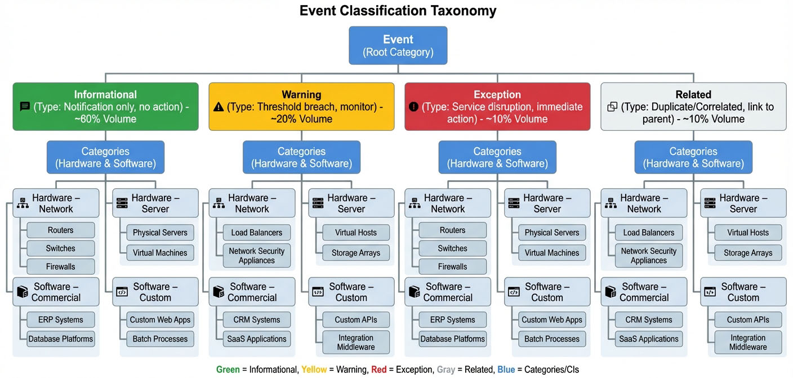
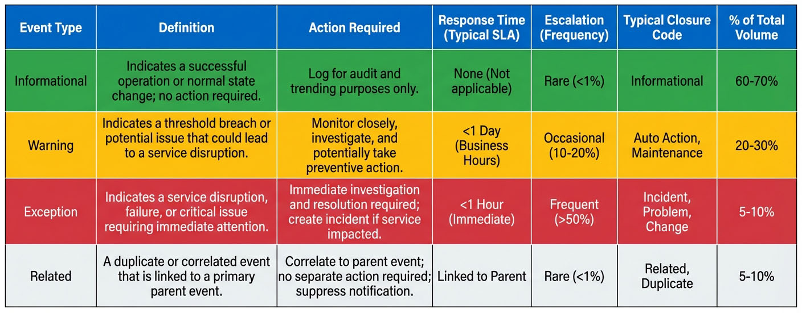
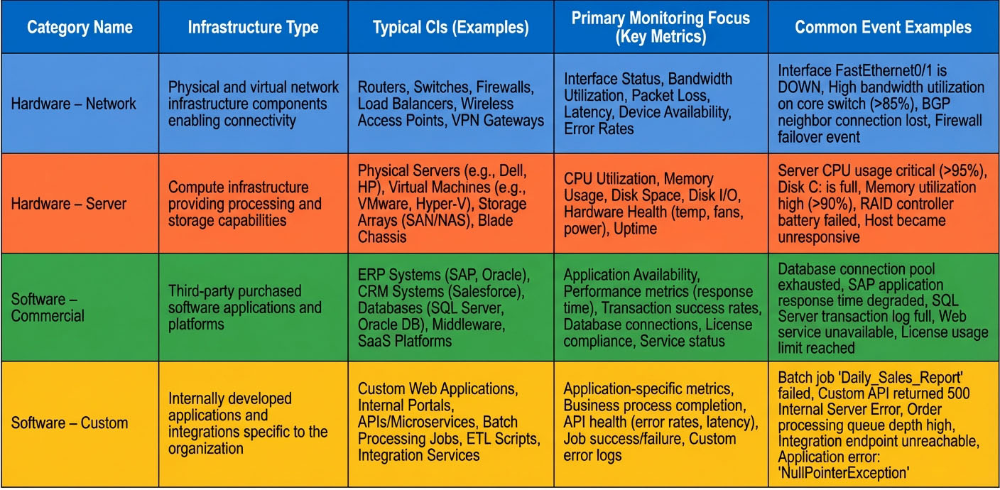
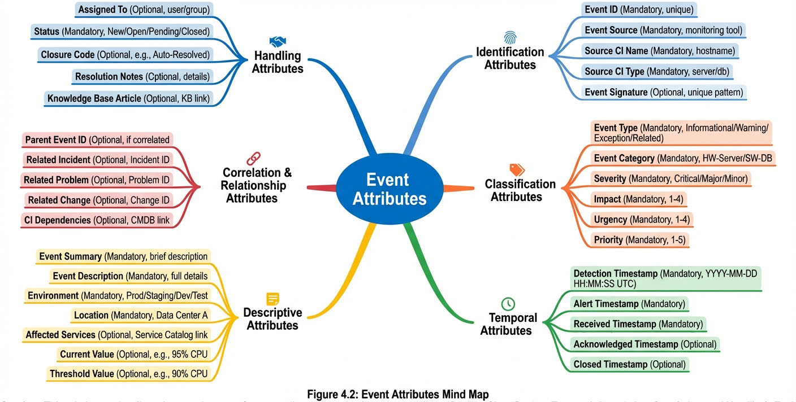

# Chapter 4: Event Classification and Specifications

*Figure 4.1: Event Classification Taxonomy - This hierarchy diagram illustrates the complete event classification structure, showing how events are organized by Type (Informational, Warning, Exception, Related) and Category (Hardware – Network, Hardware – Server, Software – Commercial, Software – Custom). The taxonomy provides the foundation for consistent event handling, routing, and reporting across the enterprise.*

## Introduction

Effective Event Management depends on the ability to consistently classify, categorize, and prioritize events as they flow through the monitoring infrastructure. Without standardized specifications, events would be handled inconsistently, leading to missed critical issues, wasted effort on low-priority items, and an inability to measure process effectiveness. This chapter establishes the foundational taxonomies and definitions that enable organizations to manage events systematically.

Event classification serves multiple critical purposes within the Event Management process. First, it provides a common language that allows technical teams across different domains—network, server, application, and database—to communicate about events with precision. Second, it enables automation and correlation logic by providing predictable attributes that tools can process consistently. Third, it supports meaningful reporting and trending by organizing events into logical groupings that reveal patterns and opportunities for improvement.

This chapter defines four essential classification dimensions: **Event Types** (which describe the nature and required action for an event), **Event Categories** (which organize events by the infrastructure component that generates them), **Event Attributes** (which provide the metadata needed for routing and correlation), and **Event Status and Closure Codes** (which track the lifecycle and resolution approach for each event). Additionally, we introduce the **Impact** and **Urgency** factors that form the foundation for event prioritization, which will be explored in depth in Chapter 5. Together, these specifications create a comprehensive framework for handling the thousands of events that enterprise IT environments generate daily.

## Event Types

Event Types represent the fundamental classification that determines the action required when an event occurs. Each event detected by monitoring tools must be assigned to one of four standardized types: **Informational**, **Warning**, **Exception**, or **Related**. This type assignment directly impacts how the event is handled, whether it requires investigation, and how urgently it must be addressed.

*Table 4.1: Event Types Comparison Matrix - This comprehensive matrix compares the four primary event types (Informational, Warning, Exception, Related) across key operational dimensions. For each event type, the table specifies the definition, required action, response time expectations, escalation frequency, typical closure codes, and percentage of total event volume. This reference enables consistent event classification and helps teams understand appropriate response protocols for each event type.*

### Informational Events

**Informational Events** are notifications that confirm normal operations or successful completion of routine activities. These events require no action from Event Management personnel but serve important purposes for audit trails, compliance verification, and operational trending. Informational events are typically logged to the event management system and then immediately closed without investigation.

Informational events provide confidence that systems are functioning as designed. When a scheduled backup completes successfully, a batch job finishes within expected parameters, or a system startup sequence completes normally, these events document operational health. While individual informational events rarely require attention, their absence can be significant—a missing "backup completed successfully" event may indicate a failure that requires investigation.

**Examples of Informational Events:**
- Scheduled backup completed successfully
- Nightly batch processing finished
- User authentication succeeded
- Configuration change logged
- Service restart completed
- Database integrity check passed
- Scheduled report generated
- System health check normal

**Handling Approach:** Informational events are typically closed immediately by automated rules with a closure code of `Auto Action`. Organizations with mature Event Management processes configure filters to suppress display of informational events on the console, though they remain logged for audit purposes. The Key Performance Indicator (KPI) "Volume of Events Detected" includes informational events, but these should represent no more than 30-40% of total event volume in a well-tuned monitoring environment.

### Warning Events

**Warning Events** indicate that a threshold has been approached or unusual activity has been detected, but no service disruption has occurred yet. These events represent the "early warning system" that enables proactive response before problems impact users. Warning events require monitoring and may trigger preventive action, but they do not automatically escalate to Incident Management.

The value of warning events lies in their predictive nature. A disk space warning at 75% capacity provides time for planned capacity expansion before the disk fills completely. A memory utilization warning allows investigation during normal business hours rather than requiring emergency response during off-hours. CPU utilization trending upward over several days may indicate a memory leak that can be addressed before performance degrades significantly.

**Examples of Warning Events:**
- Disk space at 75% capacity (threshold 80%)
- CPU utilization sustained above 70% for 10 minutes
- Memory usage approaching maximum allocation
- Network bandwidth utilization above normal baseline
- Database connection pool 80% utilized
- Application response time degraded but within SLA
- Security: Unusual login pattern detected
- Temperature approaching upper limit in data center

**Handling Approach:** Warning events typically remain on the event console for a defined period (often 4-24 hours) to allow the Event Analyst to verify they do not escalate to exceptions. The analyst may take preventive action—such as clearing temporary files when disk space warnings appear—or may document that the condition is temporary and expected (such as month-end processing causing elevated resource usage). Warning events that resolve on their own are closed with `Auto Action` or `Incident` closure codes, depending on whether action was taken.

> **Best Practice:** Configure warning thresholds at 70-80% of critical thresholds to provide adequate response time. The gap between warning and exception thresholds should reflect the time needed to take corrective action during normal business hours.

### Exception Events

**Exception Events** indicate abnormal operation or service disruption. These events represent the highest priority within Event Management and require immediate investigation and resolution. Exception events typically escalate to Incident Management for formal tracking and resolution, especially when they impact service availability or user productivity.

Exception events signal that something has failed, a critical threshold has been exceeded, or a service is unavailable. Unlike warning events, which provide time for preventive action, exception events require reactive response to restore normal operation. The speed and effectiveness of exception event handling directly impact user experience and business continuity.

**Examples of Exception Events:**
- Database connection failed
- Application server unresponsive
- Disk space at 95% capacity (critical threshold 90%)
- Network interface down
- Service unavailable (HTTP 503 error)
- Authentication service failed
- Critical process terminated unexpectedly
- Hardware component failure detected
- Security: Unauthorized access attempt

**Handling Approach:** Exception events must be acknowledged by an Event Analyst within the defined response time target (typically 15 minutes for Priority 1 events). The analyst performs initial investigation to determine the scope and impact of the issue, then creates an incident record if service restoration is required. Exception events remain `Open` until the underlying issue is resolved, at which point they are closed with the appropriate closure code—most commonly `Incident` if escalated to Incident Management, or `Problem` if the event triggers root cause investigation.

The Event Analyst must evaluate business impact using the Impact Assessment Matrix and assess urgency to calculate the event priority. This priority determines the required response time and handling approach, as detailed in Chapter 5.

### Related Events

**Related Events** are duplicates or sympathy events that are correlated to an existing primary event. When a root cause issue generates multiple notifications across different systems or components, correlation logic identifies these related events and links them to the primary event. This prevents duplicate effort, provides a complete picture of the issue's scope, and ensures accurate event metrics.

Event correlation is essential for managing "alert storms"—situations where a single infrastructure failure generates dozens or hundreds of individual event notifications. For example, when a core network switch fails, every server and application dependent on that switch may generate "network unreachable" events. Correlation logic recognizes the dependency relationship and marks these secondary events as `Related` to the primary switch failure event.

**Examples of Related Event Scenarios:**
- Multiple database connection errors linked to a single database server failure
- Application timeout events related to a network path failure
- Disk I/O errors symptomatic of a storage array controller failure
- Multiple authentication failures traced to Active Directory service disruption
- Backup failures across multiple servers caused by backup server outage

**Handling Approach:** Related events are typically closed immediately with the `Related` closure code. The event management system maintains the relationship link so that when the primary event is resolved, all related events are automatically updated. Event Management KPIs count related events separately to measure correlation effectiveness—a high percentage of related events indicates effective correlation logic, while a low percentage may suggest correlation rules need improvement.

> **Note:** The ability to identify related events depends on the Configuration Management Database (CMDB) containing accurate CI dependency relationships and the Event Designer configuring appropriate correlation rules.

**Table 4.1: Event Types Comparison Matrix**

| Event Type | Definition | Action Required | Response Time | Escalation | Typical Closure Code | % of Total Volume (Typical) |
|---|---|---|---|---|---|---|
| **Informational** | Notification of normal operation | None – log for audit | N/A | Never | `Auto Action` | 30-40% |
| **Warning** | Approaching threshold or unusual activity | Monitor closely; may require preventive action | 2-4 hours | Rarely | `Auto Action`, `Incident` | 30-35% |
| **Exception** | Service disruption or abnormal operation | Immediate investigation and resolution | 15 min – 4 hours (priority-dependent) | Frequently | `Incident`, `Problem`, `Change` | 25-30% |
| **Related** | Duplicate or sympathy event | Correlate to primary event; no separate action | N/A | Never | `Related` | 5-10% |

## Event Categories

*Table 4.2: Event Categories with Monitoring Examples - This table defines the four primary event categories used to organize and route events based on infrastructure type. For each category (Hardware-Network, Hardware-Server, Software-Commercial, Software-Custom), the table describes the infrastructure type, typical Configuration Items (CIs), primary monitoring focus areas, and common event examples. Understanding these categories enables proper event routing to specialized support teams and supports accurate reporting and trending.*

**Event Categories** serve as the primary mechanism for organizing events based on the type of Configuration Item (CI) or infrastructure component that generates them. Categories enable effective event routing, support reporting and trending analysis, and help identify which infrastructure areas require the most attention or tuning. The categorization taxonomy must align with CI types found in the Configuration Management Database (CMDB) to enable correlation and impact analysis.

Accurate categorization is mandated by **Control EM-C03**, which requires that event management procedures include criteria for categorizing events. The implementation steps for this control specify defining an event categorization taxonomy, documenting criteria for each category, and reviewing categories annually to ensure they remain aligned with the organization's infrastructure and needs.

### Defining Event Categories

The standard Event Management taxonomy includes four primary categories that cover the majority of enterprise IT infrastructure: **Hardware – Network**, **Hardware – Server**, **Software – Commercial**, and **Software – Custom**. Organizations may extend this taxonomy with additional categories relevant to their specific environment, such as "Hardware – Storage", "Software – Database", "Cloud Services", or "IoT Devices".

Each category is defined by the CI type that generates events, the monitoring focus for that category, and example configurations that fall within the category. Clear category definitions ensure consistent classification across different teams and enable meaningful trend analysis.

### Hardware – Network Category

The **Hardware – Network** category encompasses all network infrastructure components that provide connectivity, routing, and network security functions. Network events are critical for understanding connectivity issues, capacity constraints, and potential bottlenecks affecting application performance.

**Configuration Items in Hardware – Network:**
- Routers (edge, core, and distribution)
- Switches (access, distribution, and core)
- Load balancers (application and network)
- Firewalls (perimeter and internal)
- Wireless access points and controllers
- VPN concentrators
- Network security appliances
- WAN optimization devices

**Monitoring Focus for Hardware – Network:**
- Interface status (up/down)
- Bandwidth utilization (percentage and throughput)
- Packet loss and error rates
- Network latency and jitter
- Device availability (ICMP response)
- CPU and memory utilization on network devices
- Configuration changes
- Security events (blocked traffic, intrusion attempts)

**Example Events:**
- Router interface down on core-router-01 port GigE0/1
- Switch CPU utilization sustained above 80%
- Load balancer health check failure for application pool
- Firewall rule table capacity at 85%
- Wireless controller authentication failures increasing

### Hardware – Server Category

The **Hardware – Server** category includes all physical and virtual server infrastructure that runs operating systems and hosts applications. Server events provide visibility into compute resource health, capacity utilization, and hardware failures that impact service availability.

**Configuration Items in Hardware – Server:**
- Physical servers (Intel/AMD x86, RISC, mainframe)
- Virtual hosts (VMware ESXi, Microsoft Hyper-V, KVM)
- Virtual machines
- Containers and orchestration platforms
- Unix and Linux systems
- Windows servers
- Storage arrays and SAN infrastructure
- Blade chassis and enclosures

**Monitoring Focus for Hardware – Server:**
- CPU utilization (overall and per-core)
- Memory usage (utilized, available, swap/paging)
- Disk I/O (read/write operations, latency, queue depth)
- Hardware health (RAID status, temperature, fans, power supplies)
- Power status and consumption
- Virtualization metrics (host overcommitment, VM resource contention)
- Operating system services status
- System logs (kernel, system, application)

**Example Events:**
- CPU utilization sustained above 90% on production-web-01
- Memory paging excessive on database-server-03
- RAID array degraded – disk failure detected
- VMware host memory overcommitment detected
- Temperature warning – ambient temperature 28°C (threshold 30°C)
- Server unresponsive to ICMP ping

### Software – Commercial Category

The **Software – Commercial** category encompasses third-party commercial software packages and Software-as-a-Service (SaaS) platforms that the organization licenses and uses. These applications provide business functionality but are developed and maintained by external vendors.

**Configuration Items in Software – Commercial:**
- Enterprise Resource Planning (SAP, Oracle EBS)
- Customer Relationship Management (Salesforce, Microsoft Dynamics)
- Database platforms (Oracle Database, Microsoft SQL Server, MongoDB)
- Productivity suites (Microsoft Office 365, Google Workspace)
- IT Service Management platforms (ServiceNow, BMC Remedy)
- Collaboration tools (Slack, Microsoft Teams, Zoom)
- Email and messaging systems (Exchange, Gmail)
- Business intelligence platforms (Tableau, Power BI)

**Monitoring Focus for Software – Commercial:**
- Application availability (HTTP response, service status)
- License compliance (usage vs. entitlement)
- Performance metrics (response time, throughput, concurrent users)
- Error rates (application errors, failed transactions)
- User connections (active sessions, authentication failures)
- Integration health (API calls, data synchronization)
- Database query performance
- SaaS service health status

**Example Events:**
- Oracle Database connection pool exhausted
- Salesforce API rate limit approaching threshold
- Microsoft Exchange mailbox database dismounted
- SAP dialog response time exceeding 2 seconds
- ServiceNow integration failure – CMDB sync stopped
- SQL Server transaction log full

### Software – Custom Category

The **Software – Custom** category includes internally developed applications, scripts, and integrations created specifically for the organization. These applications often implement proprietary business processes and require specialized monitoring configurations.

**Configuration Items in Software – Custom:**
- Internal web applications and portals
- Custom business applications (claims processing, inventory management)
- Proprietary APIs and microservices
- Integration middleware and ETL processes
- Custom reporting and analytics systems
- Internal workflow and automation tools
- Mobile application backends
- Batch processing systems

**Monitoring Focus for Software – Custom:**
- Application errors and exceptions
- Transaction success rates
- Business process metrics (orders processed, transactions completed)
- API health and response times
- Process completion status (batch jobs, scheduled tasks)
- Custom business KPIs embedded in applications
- Application-specific resource utilization
- Data quality metrics

**Example Events:**
- Custom CRM application – database timeout errors increasing
- Nightly data integration job failed with error code 1242
- Health benefits enrollment system – claim processing rate below threshold
- Internal timecard application – authentication service unavailable
- Custom API endpoint response time exceeding 5 seconds SLA
- Batch file processing – 15% of records failed validation

> **Important:** Application development teams must follow standards defined by Event Management (per **Policy 8: Application Event Triggers**) when implementing event triggers in custom applications. This ensures consistency in event formats, severity assignments, and actionable information.

**Table 4.2: Event Categories with Monitoring Examples**

| Category | Infrastructure Type | Typical CIs | Primary Monitoring Focus | Common Event Examples |
|---|---|---|---|---|
| **Hardware – Network** | Network connectivity and routing | Routers, Switches, Firewalls, Load Balancers, WAPs | Interface status, Bandwidth, Latency, Device health | Interface down, High bandwidth utilization, Packet loss |
| **Hardware – Server** | Compute and storage infrastructure | Physical servers, Virtual hosts, VMs, Storage arrays | CPU, Memory, Disk I/O, Hardware health, Power | High CPU, Memory exhausted, RAID degraded, Hardware failure |
| **Software – Commercial** | Third-party licensed applications | Oracle, SAP, Salesforce, ServiceNow, Exchange | Availability, Performance, License compliance, Errors | Connection failures, Response time degraded, License limit |
| **Software – Custom** | Internally developed applications | Custom web apps, APIs, Batch processes, Integrations | Application errors, Transaction success, Business metrics, Process status | Application exception, Job failed, API timeout, Data validation error |

### Category Assignment and Routing

Events are assigned to categories during **Activity 3.4: Categorize Event** within the Event Management process. This categorization may be automated based on the source CI type (as recorded in the CMDB) or may be assigned manually by the Event Analyst when automated classification is uncertain.

Accurate categorization enables effective routing to specialized support teams. For example, Hardware – Network events may route to the Network Operations team, while Software – Custom events route to the Application Support team. Categories also support reporting that identifies which infrastructure areas generate the most events, helping prioritize tuning and improvement efforts.

The **KPI: Volume per Category** tracks the distribution of events across categories. Expected distribution varies by organization but typically shows:
- Hardware – Network: 20-30%
- Hardware – Server: 30-40%
- Software – Commercial: 15-25%
- Software – Custom: 10-20%
- Related: 5-10%

Significant deviations from expected distribution warrant investigation. For example, if Software – Custom represents 45% of events, this suggests custom applications may need better coding practices, improved error handling, or threshold tuning.

**Figure 4.1: Event Classification Taxonomy**
*Caption:* This hierarchy diagram illustrates the complete event classification structure, showing how events are organized by Type (Informational, Warning, Exception, Related) and Category (Hardware – Network, Hardware – Server, Software – Commercial, Software – Custom). The taxonomy provides the foundation for consistent event handling, routing, and reporting across the enterprise.
*Position:* After Event Categories section

## Event Attributes and Metadata

*Figure 4.2: Event Attributes Mind Map - This mind map visualizes the complete set of event attributes organized by category (Identification, Classification, Temporal, Descriptive, Correlation, and Handling). Each attribute provides information needed for event processing, correlation, routing, or reporting. Standardizing these attributes across all monitoring tools enables consistent event handling and meaningful analytics.*

Beyond type and category, events carry structured attributes that provide the information needed for correlation, routing, impact analysis, and resolution. These attributes function as metadata that enables both automated processing and analyst investigation. Standardized attributes ensure consistency across diverse monitoring tools and enable meaningful reporting.

### Core Event Attributes

Every event in the centralized event management system must include a defined set of core attributes:

**Identification Attributes:**
- **Event ID:** Unique identifier for the event instance
- **Event Source:** Monitoring tool or system that generated the event
- **Source CI Name:** Configuration Item generating the event
- **Source CI Type:** Category of CI (aligns with Event Category)
- **Event Signature:** Unique identifier for the event rule or pattern

**Classification Attributes:**
- **Event Type:** Informational, Warning, Exception, or Related
- **Event Category:** Hardware – Network, Hardware – Server, Software – Commercial, or Software – Custom
- **Severity:** Original severity assigned by monitoring tool (Critical, Major, Minor, Warning, Clear)
- **Impact:** Business effect (1-Low to 4-Critical)
- **Urgency:** Time sensitivity (1-Low to 4-Critical)
- **Priority:** Calculated from Impact and Urgency (1-5)

**Temporal Attributes:**
- **Detection Timestamp:** When monitoring tool detected the condition
- **Alert Timestamp:** When event was generated
- **Received Timestamp:** When central system received the event
- **Acknowledged Timestamp:** When Event Analyst acknowledged the event
- **Closed Timestamp:** When event was closed

**Descriptive Attributes:**
- **Event Summary:** Brief description (1-2 sentences)
- **Event Description:** Detailed information about the condition
- **Environment:** Production, Staging, Development, Test
- **Location:** Data center, region, or site
- **Affected Services:** Business services potentially impacted
- **Current Value:** Metric value that triggered the event
- **Threshold Value:** Configured threshold that was exceeded

**Correlation and Relationship Attributes:**
- **Parent Event ID:** Link to primary event if this event is Related
- **Related Incident:** Link to incident record if escalated
- **Related Problem:** Link to problem record if escalated
- **Related Change:** Link to change record if RFC created
- **CI Dependencies:** CIs that depend on the affected CI

**Handling Attributes:**
- **Assigned To:** Event Analyst or team responsible
- **Status:** New, Open, Pending, Closed
- **Closure Code:** How the event was resolved
- **Resolution Notes:** Actions taken and resolution details
- **Knowledge Base Article:** Link to relevant KB article

### Attribute Standardization

Consistency in attribute population enables automation and correlation. The Event Designer configures monitoring tools to populate attributes according to defined standards:

**Naming Conventions:**
- CI names must match CMDB exactly (e.g., "prod-web-01.company.com")
- Event signatures follow consistent patterns (e.g., "CPU_UTIL_HIGH", "DISK_SPACE_WARN")
- Service names align with Service Catalog

**Value Standardization:**
- Environment values limited to: Production, Staging, Development, Test
- Location uses standard site codes from CMDB
- Status values restricted to: New, Open, Pending, Closed
- Closure codes use defined list (detailed in next section)

**Timestamp Synchronization:**
- All timestamps use UTC to avoid time zone confusion
- Monitoring tools must synchronize with NTP servers
- Time lag between detection and alert should be minimal (<1 minute)

> **Best Practice:** Configure monitoring tools to populate as many attributes as possible automatically. Manual attribute population introduces errors and delays. The Event Designer should work with tool administrators to map tool-specific fields to Event Management standard attributes.

**Figure 4.2: Event Attributes Mind Map**
*Caption:* This mind map visualizes the complete set of event attributes organized by category (Identification, Classification, Temporal, Descriptive, Correlation, and Handling). Each attribute provides information needed for event processing, correlation, routing, or reporting. Standardizing these attributes across all monitoring tools enables consistent event handling and meaningful analytics.
*Position:* After Event Attributes and Metadata section

## Event Status Codes

Event Status codes track the lifecycle of an event from detection through closure. The status indicates the current handling state and determines which team member is responsible for next action. Event Management uses four standard status values: `New`, `Open`, `Pending`, and `Closed`.

### New Status

Events enter the event management system in `New` status. This status indicates the event has been detected and received by the central system but has not yet been acknowledged by an Event Analyst. Events remain in `New` status until acknowledged or until automated rules move them to a different status.

**Characteristics of New Status:**
- Event console displays `New` events prominently (often with visual indicator)
- **Policy 1: Event Console Monitoring** requires that the console be monitored 24x7
- Event Analysts are expected to acknowledge `New` events within defined response time targets
- Automated rules may immediately close `New` informational events or `New` related events
- Performance metric **Mean Time to Acknowledge (MTTA)** measures time in `New` status

**Responsibilities:**
The Event Analyst monitors the console continuously and acknowledges `New` events promptly. Acknowledging an event changes its status to `Open` and assigns it to the acknowledging analyst, signaling that investigation has begun.

### Open Status

Events move to `Open` status when acknowledged by an Event Analyst or when automated processing determines that investigation is required. `Open` status indicates that the event is under active investigation or awaiting action.

**Characteristics of Open Status:**
- Analyst has acknowledged the event and is investigating
- Event may remain `Open` while troubleshooting steps are performed
- Event may remain `Open` while waiting for automated action to complete
- Analyst may reassign `Open` events to specialized support teams
- `Open` events are reviewed during shift handoffs

**Handling Activities:**
While an event is `Open`, the Event Analyst:
- Performs initial troubleshooting using documented procedures
- Consults knowledge base articles for similar events
- Determines whether the event represents a true issue or false positive
- Evaluates Impact and Urgency to calculate Priority
- Identifies the appropriate escalation path
- Creates incident, problem, or change records as appropriate
- Documents all actions in the event record

Events remain `Open` until the underlying condition is resolved or until the analyst determines the appropriate closure approach.

### Pending Status

Events move to `Pending` status when action has been taken but the event cannot yet be closed, typically because the analyst is waiting for an external dependency. `Pending` events are temporarily set aside to allow the analyst to focus on active issues while tracking items requiring follow-up.

**Characteristics of Pending Status:**
- Waiting for external team to complete action
- Waiting for automated process to complete
- Waiting for customer response or additional information
- Waiting for monitoring to confirm condition has cleared
- Waiting for scheduled maintenance window

**Examples of Pending Scenarios:**
- Incident record created and assigned to server team; event `Pending` until incident is resolved
- Disk space cleaned on server; event `Pending` for 30 minutes to confirm space usage drops below threshold
- Change request submitted for capacity expansion; event `Pending` until change is implemented
- Backup failure escalated to backup team; event `Pending` until team confirms resolution
- Apparent false positive; event `Pending` for 24 hours to ensure condition does not recur

**Pending Management:**
The Event Management system should provide automated reminders for events in `Pending` status that exceed defined timeframes (typically 24-48 hours). The Event Manager reviews long-pending events during weekly operations reviews to identify bottlenecks or process issues.

### Closed Status

Events move to `Closed` status when the underlying condition has been resolved, the event has been determined to be a false positive or duplicate, or the appropriate escalation has been completed. `Closed` events are removed from the active console but remain in the system for reporting, trending, and audit purposes.

**Characteristics of Closed Status:**
- No further action required on the event
- Closure code documents how the event was resolved
- Resolution notes provide details for future reference
- Event data available for reporting and trending
- Closed events may be automatically archived after defined retention period (typically 90-180 days)

**Closure Requirements:**
Before closing an event, the Event Analyst must:
1. Verify the condition has actually resolved or appropriate escalation is complete
2. Select the appropriate closure code (detailed in next section)
3. Document resolution notes explaining actions taken
4. Link to related incident, problem, or change records
5. Update knowledge base if new resolution procedure was identified

> **Important:** Premature closure of events—closing an event before confirming resolution—introduces inaccuracies in KPI metrics and may allow recurring issues to go unaddressed. Event Managers should monitor patterns of recurring events with the same signature as indicators of premature closure.

**Table 4.3: Event Status Lifecycle**

| Status | Definition | Typical Duration | Next Status | Key Performance Metric |
|---|---|---|---|---|
| **New** | Event detected and received; awaiting acknowledgment | Minutes | Open, Closed (if automated) | Mean Time to Acknowledge (MTTA) |
| **Open** | Acknowledged and under investigation | Minutes to Hours | Pending, Closed | Mean Time to Escalate (for exceptions) |
| **Pending** | Awaiting external action or dependency | Hours to Days | Open (if action required), Closed | Pending Event Age (review metric) |
| **Closed** | Resolved or appropriately escalated | Permanent (until archived) | N/A | Mean Time to Close |

## Event Closure Codes

Event Closure Codes document how an event was resolved, providing critical data for process improvement, trending, and KPI measurement. The closure code answers the question: "What was the final disposition of this event?" Accurate closure code assignment enables organizations to measure automation effectiveness, identify recurring problems, and assess the accuracy of event detection.

Event Management uses seven standard closure codes: `Auto Action`, `Incident`, `Problem`, `Change`, `Related`, `False Positive`, and `Maintenance`. Each closure code has specific usage criteria and impacts different KPIs.

### Auto Action Closure Code

**Closure Code:** `Auto Action`

**Definition:** The event was automatically resolved by a predefined automated response script without human intervention, or the event was informational and required no action.

**Usage Criteria:**
- Automated script executed successfully and resolved the condition
- Informational event logged for audit purposes only
- Monitoring threshold reset automatically after temporary condition
- Self-healing action completed successfully

**Examples:**
- Disk space warning resolved by automated cleanup script that removed temporary files
- Informational event: "Nightly backup completed successfully" – logged and automatically closed
- Service automatically restarted by monitoring agent after failure detected
- Memory cache cleared by automated response after utilization exceeded threshold
- Stale process terminated by automation script

**KPI Impact:**
The `Auto Action` closure code directly feeds the **Auto-operations Success Rate** KPI, calculated as:

(Events Closed with Auto Action / Total Events Eligible for Automation) × 100

Target: ≥70% for mature Event Management implementations

A high percentage of `Auto Action` closures indicates effective automation and reduced manual workload. Organizations should continuously identify additional opportunities to convert manually resolved events to automated responses.

> **Best Practice:** Track which event signatures are frequently resolved manually with the same procedure. These are candidates for automation. Work with the Event Designer to develop automated response scripts for these scenarios.

### Incident Closure Code

**Closure Code:** `Incident`

**Definition:** The event was escalated to Incident Management because it represented a service disruption or degradation requiring investigation and restoration.

**Usage Criteria:**
- Exception event with service impact requiring restoration
- User-affecting issue that requires formal tracking
- Event that could not be resolved through documented procedures available to Event Analyst
- Condition requiring involvement of specialized technical teams

**Examples:**
- Database connection failure escalated to database administration team
- Application server unresponsive – incident created for application support team
- Network outage affecting multiple users – escalated to network operations
- Critical batch job failure requiring investigation by development team
- Hardware failure requiring dispatch of field technician

**KPI Impact:**
The `Incident` closure code impacts multiple KPIs:

**Efficiency of Detection:** (Event-Triggered Incidents / Total Incidents) × 100
- Target: ≥60%
- Measures how effectively Event Management detects issues before users report them
- High ratio indicates proactive monitoring; low ratio suggests monitoring gaps

**Escalation Rate:** (Events Closed as Incident / Total Events) × 100
- Typical range: 15-25%
- Very high escalation rates may indicate false positives or overly sensitive thresholds
- Very low escalation rates may indicate events not being properly escalated

**Integration Requirement:**
Events escalated to Incident Management must transfer complete information to the incident record:
- Affected CI and CI type
- Event description and current status
- Business impact and urgency
- Troubleshooting steps already attempted
- Related events and CI dependencies
- Time of initial detection

This information transfer is critical for meeting **Control EM-C05** requirements for event prioritization and is essential for enabling Incident Management to meet their response time targets.

### Problem Closure Code

**Closure Code:** `Problem`

**Definition:** The event was escalated to Problem Management for root cause investigation because it represented a recurring issue or systemic problem requiring permanent resolution.

**Usage Criteria:**
- Event signature has occurred multiple times within defined period (e.g., five times in 30 days)
- Event indicates systemic issue affecting multiple CIs
- Workaround exists but permanent solution is needed
- Event pattern suggests underlying problem requiring investigation

**Examples:**
- Memory leak in custom application causing weekly server restarts – pattern requires code investigation
- Recurring network latency spikes at specific time each day – infrastructure review needed
- Multiple servers exhibiting disk I/O performance degradation – storage architecture review required
- Intermittent authentication failures – directory service architecture assessment needed

**KPI Impact:**
**Problem Identification Rate:** (Events Closed as Problem / Total Events) × 100
- Typical range: 2-5%
- Low rates may indicate reactive rather than proactive problem identification
- High rates may indicate too many issues being sent to Problem Management rather than resolved

**Trending Responsibility:**
During **Activity 5.7: Review Event Effectiveness**, the Event Analyst must **identify recurring events** that should be escalated to Problem Management. This typically involves querying the event management system for event signatures that have occurred multiple times within a defined lookback period.

> **Important:** Creating problem records for recurring events is a critical process integration point. Without this escalation path, organizations operate reactively, repeatedly addressing symptoms rather than eliminating root causes.

### Change Closure Code

**Closure Code:** `Change`

**Definition:** The event was closed after creating a Request for Change (RFC) because the resolution requires a planned configuration or infrastructure change.

**Usage Criteria:**
- Event indicates need for capacity expansion or infrastructure modification
- Resolution requires configuration change subject to change control
- Multiple events indicate threshold tuning or monitoring configuration change needed
- Planned system upgrade or replacement needed to prevent future events

**Examples:**
- Persistent disk space warnings at 75% – RFC created for storage capacity expansion
- CPU utilization consistently high during business hours – RFC created for server upgrade
- Network bandwidth regularly exceeding 80% – RFC created for circuit upgrade
- Database connection pool exhaustion during peak load – RFC created for configuration change

**KPI Impact:**
**Change Initiation Rate:** (Events Closed as Change / Total Events) × 100
- Typical range: 3-8%
- Indicates how effectively Event Management identifies capacity and configuration needs
- Supports proactive capacity management

**Process Integration:**
The Event Management process interfaces with Change Management through the RFC creation process. The Event Analyst must provide sufficient justification and impact information in the RFC to enable Change Management to assess the change priority and schedule appropriately.

### Related Closure Code

**Closure Code:** `Related`

**Definition:** The event was identified as a duplicate or sympathy event correlated to an existing primary event and was closed without separate action.

**Usage Criteria:**
- Event identified by correlation rules as related to existing primary event
- Event signature indicates sympathy alert due to upstream failure
- Multiple events from same CI or dependent CIs represent single issue
- Manual investigation confirms event is duplicate of already-open event

**Examples:**
- Multiple "network unreachable" events from servers correlated to primary switch failure event
- Database connection errors from five application servers linked to primary database outage
- Backup failure events across multiple servers correlated to backup server failure
- Authentication failures from multiple applications linked to Active Directory service disruption

**KPI Impact:**
**Correlation Effectiveness:** (Events Closed as Related / Total Events) × 100
- Typical range: 5-10%
- Low rates may indicate correlation rules need improvement or CMDB lacks dependency data
- Very high rates (>15%) may indicate infrastructure instability generating alert storms

**Automation Opportunity:**
Correlation should be automated wherever possible using topology-based rules (leveraging CMDB CI relationships), time-based rules (events within defined window), and pattern-based rules (similar event signatures). Manual correlation by Event Analysts is time-consuming and should be reserved for complex scenarios where automated rules are insufficient.

The Event Designer is responsible for creating and tuning correlation rules during **Activity 2.4: Create Event Correlation Rules**. Effective correlation significantly reduces analyst workload and improves the accuracy of event volume metrics.

### False Positive Closure Code

**Closure Code:** `False Positive`

**Definition:** The event was determined to be incorrectly generated—either the condition did not actually exist, or the event triggered inappropriately due to misconfiguration or overly sensitive thresholds.

**Usage Criteria:**
- Investigation confirms the reported condition does not exist
- Threshold configuration is inappropriate for the specific CI
- Monitoring tool misconfigured or detecting normal activity as abnormal
- Network or agent issue caused duplicate or spurious event generation

**Examples:**
- CPU utilization alert triggered during intentional stress test
- Disk space alert on volume that was recently expanded but monitoring not updated
- Application error event generated during planned maintenance window
- Backup failure alert for system scheduled for decommissioning
- Performance degradation alert during load testing activity

**KPI Impact:**
**False Positive Rate:** (Events Closed as False Positive / Total Events) × 100
- Target: ≤5%
- High rates indicate monitoring tuning needed
- Should trigger **Activity 2.10: Maintain and Update Event Definitions** to correct thresholds or rules

**Continuous Improvement:**
Events closed with `False Positive` represent waste—effort spent investigating non-existent issues. The Event Manager should review false positive trends monthly to identify:
- Specific event signatures generating high false positive rates
- Categories or CIs with consistently high false positive rates
- Correlation between false positives and recent monitoring changes

The Event Designer should prioritize tuning or disabling event rules with high false positive rates. Additionally, integration with Change Management enables suppression of monitoring during planned maintenance windows, eliminating a common source of false positives.

### Maintenance Closure Code

**Closure Code:** `Maintenance`

**Definition:** The event was generated due to planned maintenance activity and was closed after verifying it was expected and documented.

**Usage Criteria:**
- Event occurred during scheduled maintenance window
- Event corresponds to documented planned change
- System intentionally offline for patching, upgrades, or configuration changes
- Testing or validation activity triggered expected events

**Examples:**
- Server unavailable event during scheduled operating system patching
- Application errors during planned database migration
- Network alerts during scheduled router firmware upgrade
- Service interruption events during planned data center maintenance

**KPI Impact:**
**Maintenance Event Rate:** (Events Closed as Maintenance / Total Events) × 100
- Typical range: 2-5%
- High rates may indicate insufficient monitoring suppression during maintenance windows
- Should be correlated with change calendar to validate accuracy

**Integration with Change Management:**
Ideally, approved changes in the change calendar should automatically suppress monitoring or tag events occurring during maintenance windows with `Maintenance` closure code. This requires integration between the Event Management system and the Change Management system. In the absence of automated integration, Event Analysts manually verify events against the change calendar and apply the `Maintenance` closure code appropriately.

> **Best Practice:** Implement automated monitoring suppression for scheduled maintenance windows. This prevents false alarms during planned downtime and allows analysts to focus on unplanned issues. The Event Designer configures suppression rules based on change calendar data.

**Table 4.4: Event Closure Codes with KPI Impact**

| Closure Code | Definition | Usage Scenario | Primary KPI Impact | Target/Typical Range |
|---|---|---|---|---|
| **Auto Action** | Automatically resolved or informational only | Script execution successful, informational event | Auto-operations Success Rate | ≥70% |
| **Incident** | Escalated to Incident Management | Service disruption requiring restoration | Efficiency of Detection, Escalation Rate | 15-25% of events |
| **Problem** | Escalated to Problem Management | Recurring issue requiring root cause analysis | Problem Identification Rate | 2-5% of events |
| **Change** | RFC created for planned modification | Capacity expansion or configuration change needed | Change Initiation Rate | 3-8% of events |
| **Related** | Correlated to existing primary event | Duplicate/sympathy event | Correlation Effectiveness | 5-10% of events |
| **False Positive** | Incorrectly generated event | Threshold misconfigured or condition doesn't exist | False Positive Rate | ≤5% (target) |
| **Maintenance** | Generated during planned activity | Occurred during scheduled maintenance window | Maintenance Event Rate | 2-5% of events |

## Impact and Urgency Factors

While Event Type and Category describe *what* an event is and *where* it originated, **Impact** and **Urgency** determine *how quickly and with what priority* the event must be handled. These two factors combine to produce the overall **Priority** of the event, which dictates response time targets and resource allocation. Impact and Urgency are introduced in this chapter as components of event specifications, with detailed prioritization calculation covered in Chapter 5.

### Impact Assessment

**Impact** measures the business effect of an event—the extent to which the event affects services, users, and business processes. Impact assessment answers the question: "How significant is this event to the business?" Impact is rated on a scale of 1 (Low) to 4 (Critical).

**Impact Levels:**

**Level 1 – Low Impact:** Minimal or no business impact. Affects only a single user, causes no business process impact, or a workaround is readily available.

**Level 2 – Medium Impact:** Moderate business impact. Affects a specific department, results in minor process degradation, or has a limited workaround.

**Level 3 – High Impact:** Significant business impact. Affects multiple departments, causes major process degradation, or no workaround is available.

**Level 4 – Critical Impact:** Severe business impact. Causes organization-wide impact, results in complete stoppage of a business process, or has financial or regulatory consequences.

**Impact Determination Factors:**
Impact is determined by evaluating two dimensions: **Organizational Scope** (how many users or departments are affected) and **Environment Type** (whether the affected CI is in Production, Staging, Development, or Test).

**Impact Determination Matrix:**

| Organizational Scope / Environment | Test | Development | Staging/UAT | Production |
|---|---|---|---|---|
| **Single User / Office** | 1 – Low | 1 – Low | 2 – Medium | 3 – High |
| **Department / Building** | 1 – Low | 1 – Low | 2 – Medium | **4 – Critical** |
| **Multiple Departments / Site** | 1 – Low | 2 – Medium | 3 – High | **4 – Critical** |
| **Organization-wide / Enterprise** | 1 – Low | 2 – Medium | 3 – High | **4 – Critical** |

**Key Principle:** Production environment failures affecting more than a single user typically result in Impact levels of 3 (High) or 4 (Critical). Non-production environments generally have lower impact unless they block critical testing or development activities.

**Example Impact Assessments:**
- Test database server failure affecting one developer: **Impact 1 (Low)**
- Production application server degraded performance affecting one department: **Impact 3 (High)**
- Production e-commerce website unavailable affecting all customers: **Impact 4 (Critical)**
- Development CI/CD pipeline failure blocking all developers: **Impact 2 (Medium)**

### Urgency Assessment

**Urgency** addresses the time sensitivity of an event—how quickly the event must be addressed based on business requirements and user expectations. Urgency answers the question: "How soon must we address this?" Urgency is rated on a scale of 1 (Low) to 4 (Critical).

**Urgency Levels:**

**Level 1 – Low Urgency:** Not time-sensitive. Service restoration goal >2 days. Minimal user impact; low business priority; scheduled maintenance possible.

**Level 2 – Medium Urgency:** Moderate time-sensitivity. Service restoration goal 1-2 days. Some user impact; standard SLAs apply; moderate business priority.

**Level 3 – High Urgency:** Very time-sensitive. Service restoration goal same business day. Significant user impact; critical SLA in effect; high business priority.

**Level 4 – Critical Urgency:** Immediate response required. Service restoration goal 1-4 hours. Major business impact; regulatory requirement; mission-critical system.

**Urgency Modifiers:**
Urgency is not static and can be adjusted based on current operational context. Factors that can increase the assigned urgency level include:

- **Time of Day:** Urgency is typically higher during business hours when users are actively working
- **Day of Week:** Urgency is typically higher on business days than weekends (for most organizations)
- **Business Cycles:** Urgency increases during month-end, quarter-end, or year-end reporting periods
- **Special Events:** Urgency increases during critical business events (e.g., product launches, open enrollment periods)
- **Regulatory Deadlines:** Urgency increases when approaching compliance reporting dates

**Example Urgency Assessments:**
- Disk space at 60% capacity (threshold 80%): **Urgency 1 (Low)** – can be addressed during planned capacity review
- Application performance degraded but within SLA: **Urgency 2 (Medium)** – should be investigated within 1-2 days
- Production database connection failure during business hours: **Urgency 4 (Critical)** – immediate response required
- Batch processing failure discovered at 2 AM with no immediate business impact: **Urgency 2 (Medium)** – can be addressed first thing in the morning

> **Note:** The same event may have different urgency levels depending on context. A disk space warning might be Urgency 1 (Low) during a normal period, but Urgency 2 (Medium) during month-end reporting when disk capacity directly impacts critical batch jobs.

### Priority Calculation Preview

**Priority** is calculated by combining Impact and Urgency using a priority matrix. While detailed prioritization is covered in Chapter 5, understanding that priority is derived from Impact and Urgency is essential for event classification. Events are assigned Priority levels from 1 (Critical) to 5 (Planning), with each priority level corresponding to defined response time targets:

- **Priority 1 (Critical):** 15-minute response time
- **Priority 2 (High):** 1-hour response time
- **Priority 3 (Medium):** 4-hour response time
- **Priority 4 (Low):** 8-hour response time (next business day)
- **Priority 5 (Planning):** Scheduled action (included in change planning)

The Event Analyst evaluates Impact and Urgency during **Activity 4.3: Determine Event Significance** as part of the event handling process. Accurate Impact and Urgency assessment ensures that events with the highest potential to affect service levels are addressed first, supporting compliance with **Control EM-C05: Event Prioritization**.

## Key Takeaways

This chapter established the foundational classifications and specifications that enable systematic Event Management. The key points to remember are:

- **Event Types** (Informational, Warning, Exception, Related) determine the action required when an event occurs. Exception events require immediate investigation, Warning events require monitoring, Informational events require only logging, and Related events are correlated to primary events.

- **Event Categories** (Hardware – Network, Hardware – Server, Software – Commercial, Software – Custom) organize events by infrastructure component type, enabling effective routing and trending analysis. Accurate categorization depends on alignment with CMDB CI types.

- **Event Attributes** provide the structured metadata needed for correlation, routing, impact analysis, and reporting. Standardizing attribute population across monitoring tools is essential for automation and consistency.

- **Event Status Codes** (New, Open, Pending, Closed) track the event lifecycle and indicate current handling state. Proper status management ensures visibility and enables accurate performance metrics.

- **Event Closure Codes** document how events were resolved and directly feed KPI calculations. The seven standard codes—Auto Action, Incident, Problem, Change, Related, False Positive, and Maintenance—enable measurement of automation effectiveness, escalation patterns, and monitoring accuracy.

- **Impact and Urgency** factors assess the business effect and time sensitivity of events. These factors combine to determine Priority, which dictates response time targets and resource allocation. Impact considers organizational scope and environment type, while Urgency considers business context and operational cycles.

- Accurate event classification enables automation, correlation, meaningful reporting, and compliance with Event Management controls. Organizations must invest in standardization, CMDB accuracy, and ongoing tuning to maintain classification accuracy.

## Summary

Event classification provides the common language and structured framework that enables organizations to manage thousands of daily events systematically. By standardizing Event Types, Categories, Attributes, Status codes, and Closure codes, organizations create consistency that supports both human decision-making and automated processing. These specifications transform raw monitoring alerts into actionable intelligence.

The specifications defined in this chapter form the foundation for prioritization (Chapter 5), detection and correlation (Chapter 6), and continuous improvement (Chapter 7). Without accurate classification, events cannot be prioritized effectively, automation cannot be applied consistently, and metrics cannot meaningfully measure process performance. Organizations should view event specifications not as administrative overhead but as essential enablers of efficient, proactive Event Management.

Chapter 5 builds on these classifications by introducing the Priority Matrix and detailed prioritization methodology. Understanding how Impact and Urgency combine to produce Priority, and how priority determines response time targets, is critical for ensuring that the Event Management process addresses the most critical issues first while maintaining appropriate service levels for lower-priority events.

## Review Questions

1. **What is the primary difference between a Warning event and an Exception event, and how does this difference impact handling approach?**

2. **Describe a scenario where an event might be initially classified as Exception but later closed with a `Related` closure code. What process would identify this correlation?**

3. **Why is the Hardware – Server category typically the largest category by event volume in most organizations? What does it indicate if Software – Custom becomes the largest category?**

4. **Explain why accurate CMDB data is essential for effective event categorization and correlation. What specific CMDB information is required?**

5. **A production database server failure is detected at 3 AM. Walk through the determination of Impact level, Urgency level, and expected Priority. How would the assessment change if the same failure occurred at 2 PM on the last day of the fiscal quarter?**

6. **What is the purpose of the False Positive closure code, and what action should the Event Manager take when false positive rates exceed the 5% target threshold?**

7. **Describe three scenarios where an event would appropriately be closed with the `Change` closure code rather than the `Incident` closure code. What process integration is required to handle these scenarios effectively?**

---

**Chapter 4 Complete**

---

## Chapter Navigation

[← Previous: Chapter 03 - Strategic Framework](/EventManagementHandbook/chapters/03-strategic-framework/)

[Next: Chapter 05 - Event Prioritization →](/EventManagementHandbook/chapters/05-event-prioritization/)

[↑ Back to Table of Contents](/EventManagementHandbook/contents/)
