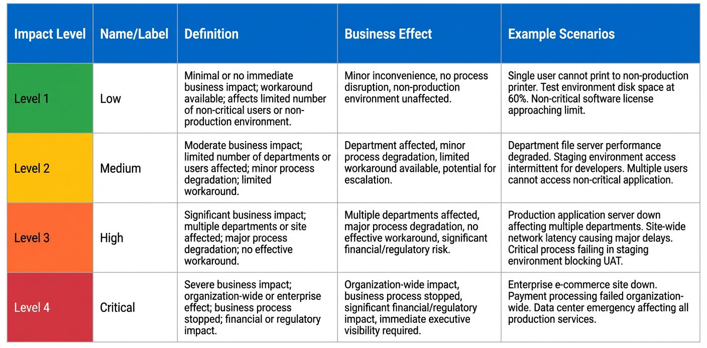
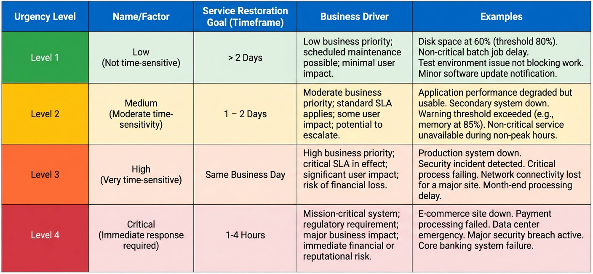
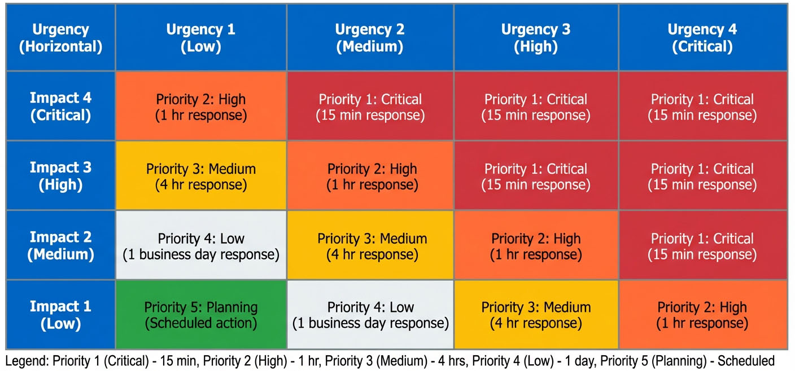
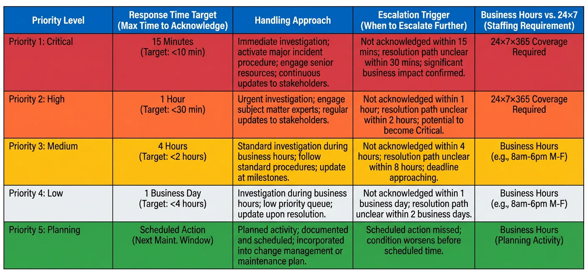
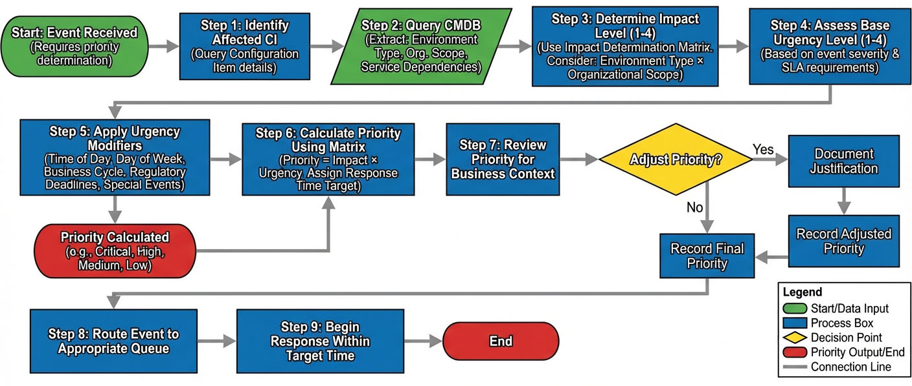

# Chapter 5: Event Prioritization


## Introduction

Event prioritization is a cornerstone capability of effective Event Management. Without a structured approach to determining which events require immediate attention and which can wait, organizations risk misallocating their response resources, missing critical business-impacting issues, or wasting effort on low-priority alerts. The prioritization framework transforms raw event data into actionable intelligence by systematically evaluating each event's business impact and time sensitivity.

This chapter presents the comprehensive framework for event prioritization, including the Impact Assessment Matrix, Urgency Levels, and the Priority Calculation Matrix that combines these two dimensions. The framework is mandated by Control Objective EM-C05, which requires that events be prioritized using defined criteria to ensure those with the highest potential to impact service levels are addressed first. By the end of this chapter, readers will understand how to assess impact based on organizational scope and environment type, determine urgency considering business context and time modifiers, calculate final priority, and establish appropriate response time targets.

The prioritization framework serves multiple critical purposes: it ensures consistency in event handling across shifts and analysts, aligns technical response with business requirements, enables effective resource allocation, supports compliance with Service Level Agreements (SLAs), and provides the foundation for automated event routing and escalation decisions.

## Impact Assessment Matrix

Impact assessment measures the **business consequence** of an event. It answers the fundamental question: "If this event represents a real problem, how much will it affect the organization?" Impact is evaluated independently of how quickly the event must be addressed, focusing instead on the breadth and severity of the business effect.

### Impact Levels

The Event Management framework defines four impact levels, ranging from minimal effects to severe business disruption. Each level corresponds to specific business consequences and organizational scope.

**Table 5.1: Impact Assessment Matrix**

| Level | Name | Definition | Business Effect |
|---|---|---|---|
| **1** | **Low** | Minimal or no business impact | Single user affected, no business process impact, or workaround readily available |
| **2** | **Medium** | Moderate business impact | Department affected, minor process degradation, or limited workaround available |
| **3** | **High** | Significant business impact | Multiple departments affected, major process degradation, or no workaround available |
| **4** | **Critical** | Severe business impact | Organization-wide impact, business process completely stopped, or financial/regulatory consequences |

**Impact Level 1 (Low)** events affect individual users or have negligible business consequences. A single user's inability to access a non-critical application, a cosmetic display issue in a test environment, or a warning that has an easy workaround all represent Low impact scenarios. These events, while requiring eventual attention, do not threaten business operations.

**Impact Level 2 (Medium)** events affect a specific department or team. Performance degradation in a departmental application during non-peak hours, a backup failure for non-critical systems, or disk space warnings in development environments typically fall into this category. The business impact is contained and manageable, though attention is required to prevent escalation.

**Impact Level 3 (High)** events significantly disrupt business operations across multiple departments or critical functions. Production system outages affecting multiple teams, security incidents requiring investigation, or failures in critical batch processes represent High impact. The absence of workarounds and the cross-departmental scope make these events serious business concerns.

**Impact Level 4 (Critical)** events represent the most severe scenarios. Complete production system failures affecting the entire organization, e-commerce site outages preventing customer transactions, payment processing failures, data center emergencies, or situations with regulatory compliance implications all warrant Critical impact classification. These events can result in revenue loss, regulatory penalties, or significant reputational damage.

### Determining Impact Based on Environment and Scope

Impact assessment is not solely determined by the nature of the failure itself, but by the combination of **environment type** (Test, Development, Staging, Production) and **organizational scope** (Office, Building, Site, Organization). This two-dimensional approach ensures that identical technical failures receive appropriate impact ratings based on their actual business context.

**Table 5.2: Impact Determination Matrix**

| Organizational Scope / Environment Type | Office (Single Dept) | Building (Multiple Depts) | Site (Location) | Organization (Enterprise) |
|---|---|---|---|---|
| **Test Environment** | 1 - Low | 1 - Low | 1 - Low | 1 - Low |
| **Development Environment** | 1 - Low | 1 - Low | 2 - Medium | 2 - Medium |
| **Staging/UAT Environment** | 2 - Medium | 2 - Medium | 3 - High | 3 - High |
| **Production Environment** | 3 - High | **4 - Critical** | **4 - Critical** | **4 - Critical** |



*Figure 5.1: Impact Assessment Matrix - This visual representation of the Impact Determination Matrix shows how environment type (Test, Development, Staging, Production) intersects with organizational scope (Office, Building, Site, Organization) to determine impact levels. The color-coded matrix makes it easy for Event Analysts to quickly identify the appropriate impact level during event triage.*

This matrix demonstrates that environment type heavily influences impact assessment. Test environment failures consistently receive Low impact ratings regardless of organizational scope, reflecting their isolation from business operations. Development environment issues receive Low to Medium impact depending on scope, as they affect developer productivity but not end users. Staging and User Acceptance Testing (UAT) environments receive Medium to High impact ratings because failures can block production releases or quality assurance activities. Production environments receive the highest impact ratings, with any production failure affecting multiple users automatically classified as Critical.

The organizational scope dimension recognizes that the same failure has different business consequences depending on how many users or departments it affects. A production database server failure affecting a single office (perhaps a branch-specific application) receives High impact (Level 3), while the same technical failure affecting an entire building, site, or organization receives Critical impact (Level 4).

For example, consider a database connection failure. In a test environment affecting a single office, this is **Impact 1 (Low)** because it only prevents a few developers from testing. The same failure in a development environment affecting the entire organization is **Impact 2 (Medium)** because it halts development work across teams. If the failure occurs in staging and affects an entire site during a critical UAT phase, it becomes **Impact 3 (High)** because it blocks production release activities. Finally, if the failure occurs in the production environment affecting a building or more users, it is **Impact 4 (Critical)** because it stops business operations.

### Impact Assessment in Practice

When Event Analysts perform **Activity 4.3: Determine Event Significance**, they must evaluate business impact using the Impact Determination Matrix. This assessment requires consulting the Configuration Management Database (CMDB) to identify:

- The affected Configuration Item (CI) and its environment classification
- Dependency relationships to understand downstream effects
- Service mappings to determine which business services are impacted
- User population and organizational scope

The CMDB provides the dependency information necessary for accurate impact assessment. An event affecting a single server might seem minor, but if that server supports a critical application used organization-wide, the impact is actually Critical. Conversely, an apparently serious failure in an isolated test system has minimal business impact.

Impact assessment also considers the availability of workarounds. An event that prevents users from accessing a primary application but where a secondary system or manual process can maintain operations receives a lower impact rating than one with no alternative. However, workarounds must be realistic and sustainable—if the workaround adds significant time or introduces error risk, the impact rating should reflect the actual business disruption.

## Urgency Levels

While impact measures the business consequence of an event, **urgency** measures the time sensitivity—how quickly the event must be addressed to prevent or minimize business disruption. Urgency is influenced by Service Level Agreements (SLAs), business cycles, regulatory requirements, and operational context.

### Urgency Level Definitions




*Figure 5.2: Urgency Level with Service Restoration Goal - This visual displays the four urgency levels with their associated service restoration goals and business drivers, helping Event Analysts quickly determine the appropriate urgency classification.*

The Event Management framework defines four urgency levels, each associated with a service restoration goal and business driver.

**Urgency Level 1 (Low)** applies to events that do not require immediate attention. These are typically informational events, early warning indicators well below critical thresholds, or issues in non-production environments. A disk space warning at 60% capacity when the threshold is 80% represents Low urgency—there is sufficient time for planned capacity expansion. Test environment issues that do not block immediate work also fall into this category.

**Urgency Level 2 (Medium)** indicates moderate time sensitivity where standard SLAs apply. Performance degradation that affects but does not stop work, warning thresholds that have been exceeded but have not yet reached critical levels, or delayed but not failed batch processes represent Medium urgency. These events require attention within one to two days to prevent escalation to more serious problems.

**Urgency Level 3 (High)** reflects very time-sensitive situations requiring same-business-day resolution. Production system degradation, security incidents requiring investigation, or critical batch job failures that affect business operations must be addressed promptly. The business impact is significant, and delays risk further disruption.

**Urgency Level 4 (Critical)** demands immediate response, typically within one to four hours. E-commerce site outages that prevent customer transactions, payment processing failures, mission-critical system failures, or data center emergencies cannot wait. These situations often have regulatory implications or direct revenue impact, requiring the fastest possible response.

### Urgency Modifiers

Urgency is not static. The same event may warrant different urgency levels depending on when it occurs and the current business context. **Urgency modifiers** adjust the base urgency level to reflect these temporal and contextual factors:

**Time of Day:** Events occurring during business hours typically receive higher urgency ratings than identical events occurring overnight. A database connection failure at 2 PM when hundreds of users are working requires immediate attention (Urgency 3 or 4), while the same failure at 2 AM when no batch processes are running might only warrant Urgency 2 (Medium).

**Day of Week:** Business days carry higher urgency than weekends for most organizations. However, for organizations with weekend operations or retail businesses, weekend urgency may equal or exceed weekday urgency. The urgency modifier must reflect actual business operations, not calendar conventions.

**Business Cycles:** Certain periods demand elevated urgency regardless of the time of day. Month-end, quarter-end, and year-end periods involve critical financial reporting processes that cannot be delayed. An event that would normally be Urgency 1 (Low) during mid-month may be elevated to Urgency 2 (Medium) during month-end to ensure capacity for critical reporting jobs.

**Regulatory Deadlines:** Approaching compliance reporting deadlines increase urgency for any events affecting systems or data required for regulatory filings. Events affecting financial reporting systems near SEC filing deadlines, healthcare systems near quality reporting deadlines, or security logging systems near audit periods receive urgency upgrades.

**Special Events:** Product launches, marketing campaigns, seasonal peak periods (such as holiday shopping), or planned high-visibility activities increase urgency for events affecting relevant systems. An e-commerce application issue that is normally Urgency 2 (Medium) becomes Urgency 4 (Critical) during Black Friday weekend.

**Scheduled Maintenance Windows:** Conversely, urgency may be reduced for non-critical events when scheduled maintenance windows are approaching. If a system is scheduled for maintenance in 12 hours, a minor issue requiring restart can wait for the maintenance window rather than prompting immediate action.

### Practical Application of Urgency Modifiers

Consider a **Disk Space Warning (75% used)** event. The base urgency might be Urgency 1 (Low) because there is still 25% capacity available and no immediate risk. However, context changes the assessment:

- During normal operations: **Urgency 1 (Low)** - plan capacity expansion
- During month-end financial close: **Urgency 2 (Medium)** - could impact reporting jobs, address within 1-2 days
- During quarter-end with regulatory filing deadline: **Urgency 3 (High)** - must ensure capacity for critical compliance processes, address same day
- During year-end close on the production financial database: **Urgency 4 (Critical)** - cannot risk failed transactions, address immediately

This example illustrates how the Event Analyst must assess urgency based not merely on the technical condition but on the business context at the time the event occurs.

## Priority Calculation Matrix




*Figure 5.3: Urgency × Impact Priority Matrix - This matrix shows how priority levels (1-5) are derived from the intersection of impact (1-4) and urgency (1-4) dimensions, enabling consistent priority calculation across all events.*

Priority is the **combination of Impact and Urgency** calculated using a defined matrix. This two-dimensional approach ensures that both the business consequence and time sensitivity are considered when determining how quickly and with what resources an event should be addressed.

### Priority Levels

The Event Management framework defines five priority levels resulting from the Impact × Urgency calculation:

**Priority 1 (Critical):** Events requiring immediate response with a target of 15 minutes. These represent severe business impact combined with critical time sensitivity.

**Priority 2 (High):** Events requiring urgent response with a target of 1 hour. These have either high impact with high urgency or critical impact with medium urgency.

**Priority 3 (Medium):** Events requiring standard response with a target of 4 hours. These represent moderate combinations of impact and urgency.

**Priority 4 (Low):** Events requiring routine response with a target of 8 hours. These have low impact or low urgency, or both.

**Priority 5 (Planning):** Events requiring scheduled action, included in change planning rather than immediate response. These are informational or very low urgency matters.

### The Priority Matrix

The Priority Matrix calculates priority by mapping Impact (vertical axis) against Urgency (horizontal axis). The result determines both the priority level and the expected response time.

**Table 5.3: Priority Calculation Matrix (Impact × Urgency)**

|  | **Urgency 1 (Low)** | **Urgency 2 (Medium)** | **Urgency 3 (High)** | **Urgency 4 (Critical)** |
|---|---|---|---|---|
| **Impact 4 (Critical)** | Priority 3 (Medium) | Priority 2 (High) | Priority 1 (Critical) | Priority 1 (Critical) |
| **Impact 3 (High)** | Priority 4 (Low) | Priority 3 (Medium) | Priority 2 (High) | Priority 1 (Critical) |
| **Impact 2 (Medium)** | Priority 5 (Planning) | Priority 4 (Low) | Priority 3 (Medium) | Priority 2 (High) |
| **Impact 1 (Low)** | Priority 5 (Planning) | Priority 5 (Planning) | Priority 4 (Low) | Priority 3 (Medium) |

This matrix reveals several important prioritization principles:

**Critical Impact dominates:** Events with Impact 4 (Critical) receive Priority 1 or 2 regardless of urgency, with only the lowest urgency scenario (Urgency 1) dropping to Priority 3. This reflects the principle that severe business impact demands rapid response even when time sensitivity is moderate.

**High urgency elevates priority:** An event with Critical urgency (Urgency 4) receives Priority 1 or 2 regardless of impact level, except for the lowest impact scenario. Time-critical situations require immediate attention even when the business scope is limited, because delays risk escalation.

**Low impact and low urgency combine to Planning:** Events with both Low impact and Low urgency receive Priority 5 (Planning), indicating they should be addressed through scheduled maintenance or change processes rather than immediate response.

**The matrix balances both dimensions:** The center of the matrix shows how moderate combinations of impact and urgency result in Priority 3 (Medium), ensuring appropriate but not excessive response urgency.

### Priority Matrix in Action

Let's examine several scenarios to illustrate how the Priority Matrix operates in practice:

**Scenario 1: Production E-Commerce Application Failure**
- Environment: Production
- Scope: Organization-wide (all customers affected)
- Impact: Level 4 (Critical) - complete business process stoppage, revenue impact
- Time: 10 AM on Black Friday (peak shopping day)
- Urgency: Level 4 (Critical) - immediate response required due to business cycle modifier
- **Priority: 1 (Critical) - Response target: 15 minutes**

**Scenario 2: Development Database Performance Degradation**
- Environment: Development
- Scope: Single office (development team)
- Impact: Level 1 (Low) - affects only developers, no production impact
- Time: 2 PM on Tuesday
- Urgency: Level 2 (Medium) - moderate time sensitivity during business hours
- **Priority: 5 (Planning) - Schedule optimization during next maintenance window**

**Scenario 3: Production Disk Space Warning (75% used)**
- Environment: Production
- Scope: Building (multiple departments use application)
- Impact: Level 4 (Critical) - production environment, multiple departments
- Time: Mid-month, normal operations
- Urgency: Level 1 (Low) - sufficient capacity remains, time for planned expansion
- **Priority: 3 (Medium) - Response target: 4 hours (initiate capacity planning)**

**Scenario 4: Staging Application Error During UAT**
- Environment: Staging/UAT
- Scope: Site (UAT team for major release)
- Impact: Level 3 (High) - blocks UAT activities before production release
- Time: 11 AM, three days before scheduled production release
- Urgency: Level 3 (High) - must resolve before release window
- **Priority: 2 (High) - Response target: 1 hour**

**Scenario 5: Test Environment Server Offline**
- Environment: Test
- Scope: Office (single development team)
- Impact: Level 1 (Low) - test environment, single team
- Time: 9 AM on Monday
- Urgency: Level 3 (High) - team needs environment to continue work (time of day modifier)
- **Priority: 4 (Low) - Response target: 8 hours**

These scenarios demonstrate how the same technical issue (server failure, disk space warning, application error) receives different priority ratings based on environment, scope, and temporal context.

### Automated Priority Assignment

The Priority Matrix is designed for **automated priority assignment** within the event management system. When events are generated, the system should automatically:

1. Determine Impact based on CI attributes in the CMDB (environment type, user population, service dependencies)
2. Assign base Urgency based on event type and severity
3. Apply urgency modifiers based on current time, business calendar, and operational context
4. Calculate Priority using the matrix
5. Assign the event to the appropriate queue with the corresponding response time target

Automated priority assignment ensures consistency, eliminates human error in priority determination, accelerates event handling by avoiding manual assessment delays, and allows Event Analysts to focus on investigation rather than classification.

However, Event Analysts retain the authority to adjust priority when automated assignment does not reflect actual business conditions. All priority adjustments must be documented with justification.

## Response Time Targets by Priority Level




*Figure 5.4: Response Time Targets by Priority Level - This visual displays the response time targets, handling approaches, and escalation triggers for each of the five priority levels, providing a quick reference for Event Analysts.*

Each priority level has an associated **response time target** that defines how quickly the Event Analyst must acknowledge and begin working on the event. These targets are critical for meeting SLAs and ensuring that business-impacting events receive appropriate attention.

**Table 5.4: Response Time Targets by Priority**

| Priority Level | Priority Name | Response Time Target | Handling Approach | Escalation Trigger |
|---|---|---|---|---|
| **Priority 1** | **Critical** | 15 minutes | Immediate action; escalate to senior analyst or management if not resolved in 30 minutes | 30 minutes without resolution |
| **Priority 2** | **High** | 1 hour | Urgent attention; prioritize over all lower priority events | 2 hours without significant progress |
| **Priority 3** | **Medium** | 4 hours | Standard response; follow documented procedures | 8 hours without resolution |
| **Priority 4** | **Low** | 8 hours | Routine handling; address during normal workflow | 24 hours without action |
| **Priority 5** | **Planning** | Scheduled | Include in change planning cycle; not immediate response | Not applicable (scheduled work) |

**Response time target** is the maximum time between event detection and initial analyst response (acknowledgment and investigation start). This is distinct from resolution time, which varies based on the complexity of the issue.

### Interpreting Response Time Targets

**Priority 1 (Critical)** events require immediate action. The 15-minute response target means the Event Analyst must acknowledge the event and begin investigation within 15 minutes of its arrival in the event management console. If the event is not resolved within 30 minutes, automatic escalation to senior analysts or management is triggered. Priority 1 events take precedence over all other work.

**Priority 2 (High)** events require urgent attention with a 1-hour response target. While not as immediately critical as Priority 1, these events still represent significant business impact or high urgency and must be prioritized over all Priority 3 and lower events. Escalation occurs if significant progress is not made within 2 hours.

**Priority 3 (Medium)** events receive standard response with a 4-hour target. These events follow documented procedures and standard troubleshooting workflows. Escalation is triggered if the event remains unresolved after 8 hours.

**Priority 4 (Low)** events are handled routinely with an 8-hour response target. These events can be addressed during normal workflow and do not require interrupting higher-priority work. However, they must receive some action within 24 hours to prevent aging.

**Priority 5 (Planning)** events are not handled through the incident response process. Instead, they are routed to change planning, capacity management, or scheduled maintenance processes. These events document trends, capacity planning needs, or future optimization opportunities.

### Response Time Monitoring

The Event Management team monitors response time performance through Key Performance Indicators (KPIs):

**Mean Time to Acknowledge (MTTA):** The average time between event detection and analyst acknowledgment, measured separately for each priority level. Target: MTTA should be ≤ 50% of the response time target for each priority.

**Response Time SLA Compliance:** The percentage of events acknowledged within the response time target. Target: ≥ 95% compliance for Priority 1 and Priority 2 events, ≥ 90% for Priority 3 and Priority 4.

**Escalation Rate:** The percentage of events requiring escalation due to exceeding response or resolution time targets. This KPI identifies when events are consistently more complex than expected or when resource allocation is insufficient.

Consistent failure to meet response time targets indicates the need for process improvement, staffing adjustments, automation enhancements, or priority matrix recalibration.

## Priority Decision Flowchart


The priority determination process follows a logical sequence that ensures consistency while allowing for contextual adjustments. The flowchart below illustrates this decision flow:



*Figure 5.5: Event Management Priority Flowchart - This flowchart demonstrates the systematic approach to determining event priority. The process begins with impact assessment based on environment and organizational scope, continues with urgency determination considering time modifiers, applies the Priority Matrix to calculate initial priority, and includes a validation step where Event Analysts can adjust priority based on business knowledge. All priority adjustments must be documented.*

```
[Start]
  ↓
[Identify Affected CI]
  ↓
[Query CMDB for CI Attributes]
  ├→ Environment Type (Test/Dev/Staging/Prod)
  ├→ Organizational Scope (Office/Building/Site/Organization)
  └→ Service Dependencies
  ↓
[Determine Impact Level (1-4)]
  ├→ Use Impact Determination Matrix
  └→ Consider: Environment Type × Organizational Scope
  ↓
[Assess Base Urgency Level (1-4)]
  ├→ Based on event severity and SLA requirements
  ↓
[Apply Urgency Modifiers]
  ├→ Time of Day (business hours vs. off-hours)
  ├→ Day of Week (business day vs. weekend)
  ├→ Business Cycle (month-end, quarter-end, year-end)
  ├→ Regulatory Deadlines
  └→ Special Events (product launches, peak periods)
  ↓
[Calculate Priority Using Matrix]
  ├→ Priority = Impact × Urgency
  └→ Assign Response Time Target
  ↓
[Review Priority for Business Context]
  ├→ Does automated priority reflect actual business impact?
  ├→ Are there factors not captured in the matrix?
  ↓
<Decision: Adjust Priority?>
  ├→ Yes: Document justification → [Record Adjusted Priority]
  └→ No: → [Record Final Priority]
  ↓
[Route Event to Appropriate Queue]
  ↓
[Begin Response Within Target Time]
  ↓
[End]
```

This flowchart emphasizes the integration of automated assessment with human judgment. While the system can automatically determine impact from CMDB attributes and apply urgency modifiers based on business calendars, the Event Analyst provides the final validation to ensure priority accurately reflects business needs.

## Control Objective EM-C05: Event Prioritization

Control Objective EM-C05 establishes the mandatory requirements for event prioritization within the Event Management process. This control ensures that events are systematically evaluated and handled in order of business importance.

### Control Statement

**EM-C05: Event Prioritization**

Events must be prioritized using defined criteria (Impact and Urgency) to ensure those with the highest potential to impact service levels are addressed first.

### Purpose and Rationale

Event Management processes can easily become overwhelmed by event volume, with hundreds or thousands of events arriving daily. Without systematic prioritization, there is significant risk that:

- Critical business-impacting events are delayed while analysts work on low-priority issues
- Resources are misallocated to events with minimal business consequence
- Service Level Agreements (SLAs) are breached due to insufficient focus on time-sensitive events
- Inconsistent handling occurs as different analysts apply different judgment about what is "important"

Control Objective EM-C05 mitigates these risks by mandating a standardized prioritization framework based on objective, defined criteria. This ensures that business impact and time sensitivity—not just technical severity or subjective judgment—drive response decisions.

### Control Requirements

To achieve compliance with EM-C05, organizations must implement the following requirements:

**1. Impact Assessment Matrix:** Define and document impact levels (1-4) with clear criteria based on environment type and organizational scope. The matrix must be accessible to all Event Analysts and integrated into the event management system.

**2. Urgency Level Definitions:** Define and document urgency levels (1-4) with associated service restoration goals and business drivers. Include documented urgency modifiers for time of day, business cycles, and special circumstances.

**3. Priority Calculation Matrix:** Implement the Priority Matrix (Impact × Urgency) to calculate priority levels (1-5) with associated response time targets. The matrix must be consistently applied to all events.

**4. Automated Priority Assignment:** Configure the event management system to automatically assign priority based on CI attributes, event severity, and contextual factors. Automation reduces manual effort and ensures consistency.

**5. Priority Override Capability:** Allow Event Analysts to adjust automated priority assignments when business context warrants, with mandatory documentation of the justification for any priority change.

**6. Response Time Targets:** Establish and enforce response time targets for each priority level. Monitor compliance with response time SLAs and investigate breaches.

**7. CMDB Integration:** Maintain accurate CI attributes in the CMDB to support automated impact assessment, including environment type, organizational scope, service dependencies, and user population data.

**8. Regular Review and Calibration:** Review priority assignments quarterly to ensure the framework accurately reflects business priorities. Adjust impact and urgency criteria as business requirements evolve.

### Implementation Steps

Organizations implementing EM-C05 should follow these steps:

**Step 1: Define Impact and Urgency Criteria** - Document the Impact Assessment Matrix and Urgency Levels using the frameworks presented in this chapter as templates. Customize environment types and organizational scope categories to match your organization's structure.

**Step 2: Develop Priority Matrix** - Create the Priority Calculation Matrix by mapping impact against urgency. Validate that the resulting priorities align with business expectations by testing scenarios.

**Step 3: Configure Event Management System** - Implement automated priority assignment by configuring rules to query the CMDB, apply urgency modifiers based on time and business calendar, calculate priority using the matrix, and assign events to appropriate queues.

**Step 4: Update CMDB** - Ensure all Configuration Items have accurate attributes including environment classification (Test, Development, Staging, Production), organizational scope (Office, Building, Site, Organization), service mappings, and user population data.

**Step 5: Establish Response Time Targets** - Define response time targets for each priority level and configure alerting for events approaching target breach.

**Step 6: Train Event Analysts** - Ensure all Event Analysts understand the prioritization framework, know how to interpret Impact and Urgency, can apply urgency modifiers appropriately, and understand when and how to adjust automated priorities.

**Step 7: Monitor Compliance** - Track response time SLA compliance, priority adjustment frequency and justifications, and event age by priority level to identify issues.

**Step 8: Review and Refine** - Conduct quarterly reviews of priority accuracy, response time target appropriateness, and urgency modifier effectiveness, adjusting the framework as needed.

### Key Performance Indicators for EM-C05

The following KPIs measure compliance with and effectiveness of the event prioritization control:

**Priority Assignment Accuracy:** Percentage of events where automated priority assignment aligns with Event Analyst validation. Target: ≥ 90%. Low accuracy indicates the need for improved automation rules or CMDB data quality.

**Response Time SLA Compliance:** Percentage of events acknowledged within response time targets by priority level. Target: ≥ 95% for Priority 1-2, ≥ 90% for Priority 3-4. Tracks adherence to time-based commitments.

**Priority Adjustment Rate:** Percentage of events where Event Analyst adjusts automated priority. Target: ≤ 10%. High adjustment rates suggest automation rules do not capture business context adequately.

**Critical Event Response Time:** Average response time for Priority 1 events. Target: ≤ 10 minutes. Measures effectiveness of critical event handling.

**Event Age by Priority:** Average time events remain open, segmented by priority level. Identifies priorities where resolution times exceed expectations.

### Relationship to Other Controls

EM-C05 works in conjunction with other Event Management controls:

**EM-C03 (Event Categorization):** Categorization feeds into priority by helping identify the affected CI type and potential scope. Accurate categorization improves automated priority assignment.

**EM-C04 (Event Correlation):** Correlation reduces event volume by linking related events, ensuring only the primary event is prioritized for response while related events are documented but not separately worked.

**EM-C06 (Event Escalation):** Escalation criteria are directly tied to priority levels. Priority 1 events have aggressive escalation triggers, while lower priorities have more lenient thresholds.

**EM-C07 (Event Documentation):** Priority, including any adjustments and justifications, must be documented in the event record to support trending, audit, and process improvement.

Compliance with EM-C05 is essential for achieving the Event Management process's primary goal: detecting and responding to events in a manner that supports service availability and minimizes business impact.

## Key Takeaways

- **Event prioritization combines Impact and Urgency** to determine which events require immediate attention and which can be handled through routine processes. This two-dimensional approach ensures both business consequence and time sensitivity are considered.

- **Impact measures business consequence** based on environment type (Test, Development, Staging, Production) and organizational scope (Office, Building, Site, Organization). Production environment failures affecting multiple users consistently receive the highest impact ratings.

- **Urgency measures time sensitivity** based on service restoration requirements, SLAs, and business context. Urgency modifiers account for time of day, business cycles, regulatory deadlines, and special events.

- **The Priority Matrix calculates priority** by mapping Impact against Urgency, resulting in Priority levels 1-5 with associated response time targets ranging from 15 minutes for Priority 1 (Critical) to scheduled action for Priority 5 (Planning).

- **Automated priority assignment** leverages CMDB data and business calendars to consistently calculate priority without manual intervention, though Event Analysts retain authority to adjust priority when business context warrants.

- **Response time targets** define the maximum time between event detection and analyst response. Meeting these targets requires adequate staffing, appropriate queue management, and effective escalation procedures.

- **Control Objective EM-C05 mandates** systematic event prioritization using defined criteria to ensure events with the highest potential to impact service levels are addressed first. Compliance requires documented matrices, automated assignment, and regular review.

## Summary

Event prioritization transforms raw monitoring data into actionable business intelligence by systematically evaluating the business consequence and time sensitivity of each event. The comprehensive prioritization framework presented in this chapter—encompassing the Impact Assessment Matrix, Urgency Levels with modifiers, Priority Calculation Matrix, and response time targets—provides Event Management teams with the structure needed to allocate resources effectively and meet service level commitments.

The Impact Assessment Matrix recognizes that identical technical failures have vastly different business consequences depending on environment type and organizational scope. A database failure in a test environment is a minor inconvenience, while the same failure in production affecting the entire organization is a critical business emergency. By structuring impact assessment around these two dimensions, organizations ensure that priority reflects actual business risk rather than just technical severity.

Urgency assessment incorporates both the inherent time sensitivity of the event type and contextual factors through urgency modifiers. The same disk space warning might warrant immediate attention during month-end financial close or routine planning during mid-month operations. By considering time of day, business cycles, regulatory deadlines, and special events, the framework ensures that urgency ratings align with current business needs.

The Priority Matrix combines these two dimensions to calculate priority levels that dictate response time targets and handling approaches. This standardization ensures consistency across shifts and analysts while still permitting Event Analysts to apply business judgment when automated priority assignment does not capture the full context.

Control Objective EM-C05 establishes the mandatory nature of systematic prioritization and provides the implementation roadmap for organizations building or improving their Event Management capabilities. Compliance with EM-C05 requires not merely defining matrices but also automating priority assignment, maintaining accurate CMDB data, establishing response time targets, and continuously reviewing and refining the framework.

In the next chapter, we will explore Event Correlation and Automation, examining how organizations reduce event noise by linking related events and maximize efficiency through automated response actions. The priority framework established in this chapter provides the foundation for these advanced capabilities, ensuring that correlation and automation focus on the events that matter most to the business.

## Review Questions

1. **What are the two dimensions that combine to determine event priority, and why is each dimension important?** Consider how Impact and Urgency contribute different perspectives to prioritization decisions.

2. **A production database server supporting a building-wide application experiences a disk space warning (75% used). Walk through the priority determination process:** What is the Impact level and why? What factors determine the Urgency level? How do urgency modifiers affect the assessment? What is the final Priority and response time target?

3. **Explain why a test environment failure consistently receives Impact Level 1 (Low) regardless of organizational scope, while a production environment failure affecting multiple departments receives Impact Level 4 (Critical).** What principle does this illustrate about the impact assessment framework?

4. **Describe three urgency modifiers and provide a specific example of how each modifier would change the urgency assessment for a particular event type.** How do these modifiers ensure that priority reflects current business context rather than just static event attributes?

5. **Control Objective EM-C05 mandates automated priority assignment, yet also requires that Event Analysts have the authority to adjust priority. Explain why both automated calculation and human override capability are essential.** When should an analyst adjust priority, and what must they document?

---

**Chapter 5 References**

Content based on Event Management Framework Implementation Guide, Event Management Handbook source material (Part II: Framework, sections 1501-1711, 1864-1930), ITIL Event Management best practices, and Control Objective EM-C05 specifications.

---

## Chapter Navigation

[← Previous: Chapter 04 - Event Classification and Specifications](/EventManagementHandbook/chapters/04-event-classification/)

[Next: Chapter 06 - Roles and Responsibilities →](/EventManagementHandbook/chapters/06-roles-responsibilities/)

[↑ Back to Table of Contents](/EventManagementHandbook/contents/)
