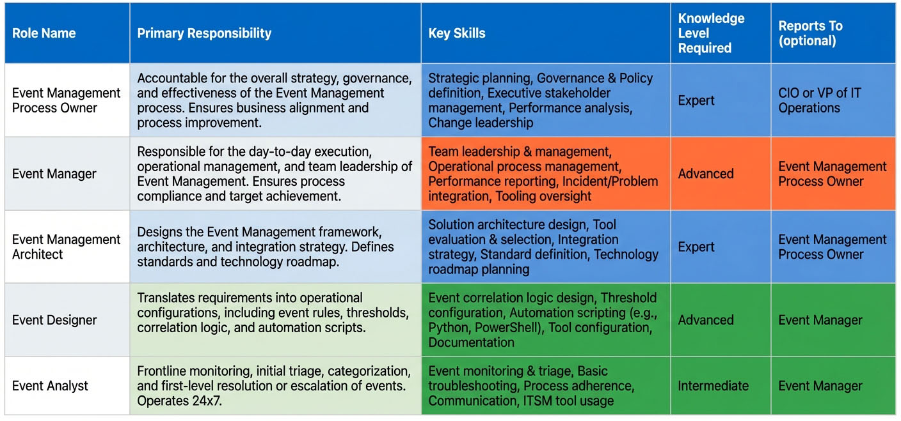
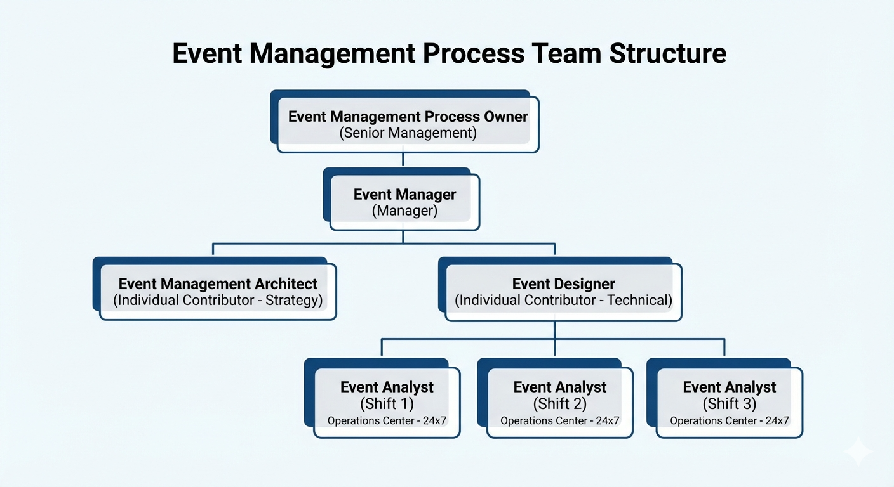
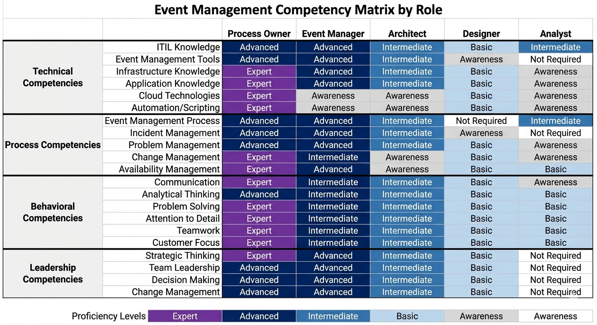
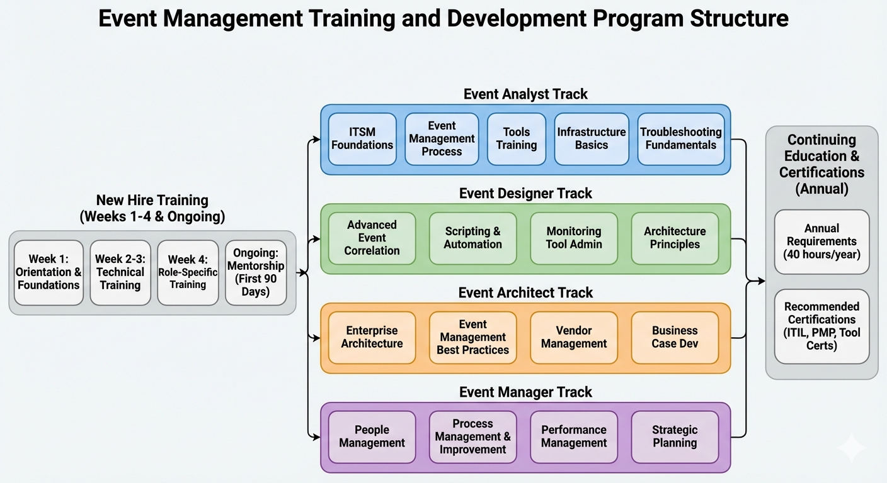

# Chapter 6: Roles and Responsibilities

## Introduction

Successful Event Management (EM) implementation requires a well-defined organizational structure with clearly assigned roles, responsibilities, and accountabilities. The complexity of modern IT environments, combined with the need for 24x7 monitoring and rapid response to critical events, demands a specialized team with diverse skills ranging from strategic leadership to technical implementation to frontline operations.

This chapter details the comprehensive role framework for Event Management, defining five distinct roles that work together to ensure process effectiveness. Each role serves a specific purpose within the team structure, from the Process Owner who provides strategic direction and governance, to the Event Analyst who monitors the console around the clock. Understanding these roles, their interactions, and their required competencies is essential for organizations seeking to build a capable EM team that can deliver on the process objectives.

The role framework presented in this chapter directly supports Critical Success Factor 4 (CSF-4): Skilled and Trained Personnel. Organizations that invest in proper role definition, staffing, and development create a foundation for mature Event Management capabilities. The chapter provides practical guidance on team sizing, competency requirements, and development paths to help organizations build effective EM teams regardless of their current maturity level.

*Table 6.1: Event Management Roles and Competency Requirements - This table summarizes the five core Event Management roles and their associated competency requirements. It provides a quick reference for understanding the relationship between organizational roles, their primary responsibilities, and the key skills required for success in each position.*

## Event Management Team Structure

The Event Management organizational structure comprises five core roles, each with distinct responsibilities and required competencies. These roles work together to ensure comprehensive process coverage from strategic planning through operational execution.

*Figure 6.1: Event Management Process Team Structure - This organizational chart illustrates the hierarchical structure and reporting relationships within the Event Management team. The Process Owner provides strategic oversight and reports to executive leadership (CIO or VP of IT Operations). The Event Manager handles day-to-day operational management with direct reports including the Event Management Architect (strategy and architecture) and Event Designer (technical implementation). Event Analysts operate in 24x7 shifts reporting to the Event Designer, providing frontline monitoring and event triage.*

### Organizational Hierarchy

The team structure follows a clear hierarchy designed to separate strategic leadership from operational management and technical implementation:

- **Level 1 – Strategic Leadership:** The Event Management Process Owner operates at the senior management level, providing vision, governance, and resource allocation.
- **Level 2 – Technical Strategy:** The Event Management Architect defines the technical architecture, standards, and multi-year technology roadmap.
- **Level 3 – Operational Management:** The Event Manager oversees day-to-day operations, team performance, and process execution.
- **Level 4 – Technical Implementation:** The Event Designer creates correlation rules, automation scripts, and monitoring configurations.
- **Level 5 – Frontline Operations:** Event Analysts provide 24x7 console monitoring, event investigation, and escalation.

This structure ensures that strategic decisions are made at appropriate levels while operational teams maintain focus on execution. The separation between architecture (strategic technical direction) and design (tactical implementation) allows organizations to balance long-term technology planning with immediate operational needs.

### Team Sizing Guidelines

Appropriate team sizing depends on several factors including event volume, organizational complexity, automation maturity, and desired response times. The following guidelines provide a starting point for staffing decisions:

**Table 6.2:** Event Management Team Sizing Guidelines

| Event Volume (per day) | Event Analysts | Event Designers | Event Managers | Architects | Process Owners |
|---|---|---|---|---|---|
| Low (< 1,000) | 6–9 | 1 | 1 | 0.5 (shared) | 0.25 (shared) |
| Moderate (1,000–5,000) | 9–12 | 1–2 | 1 | 1 | 0.5 (shared) |
| High (5,000–15,000) | 12–18 | 2–3 | 1–2 | 1 | 1 |
| Very High (> 15,000) | 18–24 | 3–4 | 2 | 1–2 | 1 |

Event Analyst numbers assume 24x7 coverage across three shifts with allowances for vacation, training, and sick leave. A minimum of two analysts per shift ensures coverage during breaks and enables peer consultation for complex issues. Organizations with lower event volumes or limited resources may start with reduced coverage and expand as maturity increases.

The Event Designer role requires deep technical skills in event correlation, automation scripting, and monitoring tool configuration. Organizations typically need one designer for every 5,000–10,000 events per day, with additional designers needed for complex environments with multiple monitoring tools or extensive custom applications.

## Event Management Process Owner

The Event Management Process Owner is the senior authority figure responsible for the overall success, governance, and strategic direction of the Event Management process. This role operates at the management level with sufficient authority to ensure organization-wide process acceptance and compliance.

### Strategic Leadership and Vision

The Process Owner defines the Event Management vision and strategy, ensuring the process aligns with organizational IT strategy and culture. This strategic responsibility encompasses several key areas:

**Vision Definition:** The Process Owner articulates clear goals for Event Management, including the primary objectives of detecting and resolving events before they impact services, maximizing automation to reduce manual effort, and enabling predictive operations through trend analysis. This vision provides direction for all EM activities and investments.

**Organizational Alignment:** Event Management must support business objectives and integrate seamlessly with the broader IT Service Management (ITSM) ecosystem. The Process Owner ensures EM requirements are considered in organizational planning and that the process evolves to meet changing business needs.

**Executive Sponsorship:** The Process Owner represents Event Management in executive forums, communicating its value proposition and justifying required investments. This visibility is critical because Management Support and Sponsorship ranks as the top Critical Success Factor (CSF) for Event Management. Without executive understanding and support, the process struggles to obtain necessary resources and organizational commitment.

**Strategic Planning:** The Process Owner leads Activity 1.1: Define Event Management Strategy within the process framework. This involves documenting business requirements and drivers, defining maturity goals, and creating roadmaps for capability development. Strategic planning sessions typically occur quarterly, bringing together key stakeholders to assess progress and adjust direction.

### Process Governance and Policy Authority

The Process Owner holds ultimate accountability for process governance, including policy approval, compliance monitoring, and exception management:

**Policy Approval:** The Process Owner approves all Event Management policies and procedures, ensuring consistency with organizational standards and regulatory requirements. This authority extends to the eight core policies governing EM operations, from console monitoring requirements to agent standardization.

**Exception Management:** When operational needs conflict with established policies, the Process Owner has authority to grant exceptions. For example, Policy 1: Event Console Monitoring requires 24x7 coverage, but the Process Owner might approve a temporary exception for a small office with minimal infrastructure during a transition period. All exceptions require formal documentation, compensating controls, and time-bound remediation plans.

**Compliance Oversight:** The Process Owner ensures process compliance with policies and standards through regular audits and reviews. This includes monitoring adherence to control objectives (EM-C01 through EM-C10) and addressing any gaps or violations.

**Process Documentation:** The Process Owner maintains ownership of process documentation, ensuring it remains current, accurate, and accessible. This includes process workflows, procedures, work instructions, and policy statements.

### Resource Management and Budget Authority

The Process Owner controls Event Management resources, including budget allocation, staffing decisions, and major investments:

**Budget Allocation:** The Process Owner provides the budget for tools, training, and operations, ensuring adequate funding to meet service level requirements. Budget planning includes operating costs (staff, licenses, infrastructure) and capital investments (new tools, major upgrades).

**Investment Justification:** Major Event Management investments require business cases demonstrating Return on Investment (ROI) and alignment with organizational priorities. The Process Owner creates these justifications, quantifying benefits such as reduced downtime, improved efficiency, and enhanced service quality.

**Tool Purchases:** The Process Owner approves major tool purchases, including the centralized event management platform, monitoring agents, and integration solutions. This authority ensures technology investments align with the overall EM strategy and architecture.

**Staffing Decisions:** The Process Owner ensures adequate staffing for the Event Management team, including approving headcount requests and making final hiring decisions for key roles. Proper staffing is essential for maintaining 24x7 operations as mandated by Policy 5: Centralized Event Management Team.

### Process Integration and Stakeholder Management

Event Management does not operate in isolation but rather as a highly integrated component of the ITSM ecosystem. The Process Owner ensures effective coordination with related processes:

**Integration Responsibility:** The Process Owner ensures Event Management integrates effectively with Incident Management, Problem Management, Change Management, Capacity Management, Availability Management, and Configuration Management. This includes defining interface points, resolving integration issues, and promoting collaboration.

**Process Coordination:** The Process Owner represents Event Management in process coordination meetings, working with other ITSM process owners to address cross-process issues and opportunities. This coordination is essential for seamless event escalation to incidents, problem investigation for recurring events, and change requests for configuration adjustments.

**Stakeholder Engagement:** The Process Owner manages relationships with key stakeholders including IT leadership, application teams, infrastructure teams, and business units. Regular communication ensures stakeholders understand EM capabilities, provide input on requirements, and support process improvements.

### Performance Accountability

The Process Owner maintains ultimate accountability for Event Management performance and effectiveness:

**KPI Achievement:** The Process Owner is accountable for achieving Key Performance Indicator (KPI) targets across volume, quality, efficiency, and effectiveness metrics. This includes ensuring the team meets targets such as Categorization Accuracy ≥95%, False Positives ≤5%, and Efficiency of Detection ≥60%.

**Service Level Delivery:** Event Management must meet defined response time targets (15 minutes for Priority 1 events, 4 hours for Priority 2) and escalation timeframes. The Process Owner ensures the team has necessary resources and processes to consistently deliver on these commitments.

**ROI Accountability:** The Process Owner demonstrates the value and Return on Investment (ROI) of Event Management activities. This includes tracking benefits such as incidents prevented, automation savings, and improved service availability.

**Continuous Improvement:** The Process Owner drives continuous improvement of the Event Management process, sponsoring maturity initiatives, leading improvement projects, and ensuring lessons learned are captured and applied.

### Required Competencies and Experience

The Process Owner role requires a unique combination of strategic thinking, leadership capability, process expertise, and business acumen:

**Leadership Competencies:** Expert proficiency in Strategic Thinking, Team Leadership, and Decision Making enables the Process Owner to provide effective direction and make sound judgments on complex issues. Expert-level Customer Focus ensures alignment with business needs and stakeholder expectations.

**Process Knowledge:** Expert proficiency in the Event Management Process itself, combined with Advanced knowledge of related processes (Incident Management, Problem Management, Change Management, Availability Management), enables effective process integration and governance.

**Technical Understanding:** While not requiring deep technical expertise, the Process Owner needs Intermediate understanding of Event Management tools, infrastructure, and applications to make informed decisions on technology investments and architectural direction.

**Business Skills:** Advanced proficiency in Communication, Negotiation, and Business Analysis enables effective stakeholder management, investment justification, and organizational change management.

**Experience Requirements:** The role typically requires 10+ years in IT operations management and five or more years managing ITSM or operational processes. This experience provides the credibility and knowledge needed to lead a strategic process function.

## Event Manager

The Event Manager serves as the primary operational leader for Event Management, responsible for day-to-day process execution, team management, and performance delivery. This role reports directly to the Process Owner and directs the Event Designers and Event Analysts.

### Day-to-Day Process Execution

The Event Manager ensures the Event Management process operates smoothly on a daily basis:

**Daily Operations Management:** The Event Manager oversees all daily Event Management operations, ensuring the team follows established procedures, meets response time targets, and handles events according to specifications. This includes monitoring team activity, addressing operational issues, and coordinating with other IT teams.

**Procedure Compliance:** The Event Manager ensures the EM process operates according to defined procedures, including proper event categorization (Activity 3.4), significance determination (Activity 4.3), and escalation (Activity 4.4). Regular audits verify procedural compliance and identify improvement opportunities.

**Tool Functionality:** The Event Manager ensures event management tools function properly, coordinating with IT support teams to resolve technical issues. This includes monitoring system health, managing access and permissions, and coordinating tool updates or changes.

**Escalation Handling:** Complex issues and escalations from Event Analysts flow to the Event Manager for resolution. The Event Manager applies expert judgment to ambiguous situations, engages appropriate resources for complex investigations, and makes decisions on escalation paths when standard procedures do not clearly apply.

### Team Management and 24x7 Coverage

The Event Manager leads the Event Management team, ensuring adequate coverage and team effectiveness:

**Shift Schedule Management:** The Event Manager creates and manages shift schedules to ensure 24x7 console monitoring as mandated by Policy 1: Event Console Monitoring. For moderate event volumes (1,000–5,000 events per day), this typically requires nine analysts distributed across three shifts: Shift 1 (7 AM–3 PM), Shift 2 (3 PM–11 PM), and Shift 3 (11 PM–7 AM). The schedule must account for planned time off, training, sick leave, and holidays.

**Coverage Contingency Planning:** The Event Manager maintains contingency plans for unexpected absences, including on-call backup procedures and cross-training to enable team members to cover different shifts. This ensures continuous monitoring capability even during staffing challenges.

**Team Leadership and Development:** The Event Manager leads and develops the Event Management team through regular coaching, performance feedback, and development planning. This includes conducting performance reviews, identifying skill gaps, and creating individual development plans.

**Team Culture:** The Event Manager fosters a positive team culture that promotes collaboration, continuous learning, and operational excellence. This is particularly important for 24x7 operations where team cohesion and morale directly impact service delivery.

### Performance Management and Metrics

The Event Manager monitors process performance and drives corrective action:

**KPI Monitoring:** The Event Manager continuously monitors process KPIs and metrics, tracking performance against established targets. Key metrics include Volume of Events Detected, Categorization Accuracy, Routing Accuracy (target ≥95%), False Positives (target ≤5%), Auto-operations Success Rate (target ≥70% for mature implementations), and Efficiency of Detection (target ≥60%).

**Performance Reporting:** The Event Manager generates regular performance reports for the Process Owner and other stakeholders. These reports provide visibility into EM effectiveness, highlight trends, and identify issues requiring attention.

**Root Cause Analysis:** When performance issues arise, the Event Manager conducts root cause analysis to identify underlying problems. This might include investigating why categorization accuracy dropped, why false positives increased, or why certain event types generate excessive volume.

**Corrective Action Implementation:** The Event Manager implements corrective actions to address performance gaps. This might involve additional training for analysts, rule adjustments by designers, or process refinements.

**Review Forums:** The Event Manager participates in multiple review sessions:
- **Daily Shift Handoffs:** Conducted three times daily at shift changes, covering open critical events, ongoing investigations, system status, and upcoming changes.
- **Weekly Operations Review:** Attended by the Event Manager, Event Analysts, and Event Designer, focusing on weekly metrics review, event trends, and process issues.
- **Monthly Process Review:** Attended by the Event Manager, Process Owner, Architect, and Designer, reviewing KPIs, control objectives compliance, and policy compliance.
- **Quarterly Strategic Review:** Attended by Process Owner, Event Manager, and Architect, addressing strategic alignment, maturity assessment, and major initiatives planning.

### Solution Maintenance Oversight

The Event Manager oversees maintenance of Event Management configurations and solutions:

**Rule Change Approval:** The Event Manager reviews and approves event detection rule changes proposed by Event Designers. This governance ensures changes are properly justified, tested, and documented before deployment to production.

**Automation Script Approval:** The Event Manager reviews and approves automated response scripts before deployment. This includes verifying that scripts include appropriate error handling, logging, and rollback capabilities.

**Quality Assurance:** The Event Manager ensures adequate testing of all configuration changes before production deployment. This includes validating changes in non-production environments and conducting controlled production rollouts.

**Change Coordination:** Event Management tool changes and rule updates must be coordinated with the broader IT change management process. The Event Manager ensures proper change request documentation and stakeholder communication.

### Required Competencies and Experience

The Event Manager role requires a balance of leadership, process, and technical competencies:

**Leadership Competencies:** Expert proficiency in Team Leadership and Advanced proficiency in Decision Making enable effective team management and sound operational judgments. Teamwork at Expert level ensures effective collaboration with other process managers and teams.

**Process Expertise:** Expert proficiency in the Event Management Process itself, combined with Advanced knowledge of Incident Management and Problem Management, enables effective process execution and integration. Intermediate knowledge of Change Management and Capacity Management supports broader ITSM coordination.

**Technical Knowledge:** Intermediate proficiency in Event Management Tools, Infrastructure Knowledge, and Application Knowledge provides sufficient technical understanding to oversee operations, approve changes, and troubleshoot issues.

**Analytical Skills:** Advanced proficiency in Analytical Thinking and Problem Solving enables effective root cause analysis, performance troubleshooting, and process optimization.

**Experience Requirements:** The role typically requires five or more years in IT operations roles and three or more years managing or leading operational processes. This experience provides the operational knowledge and leadership capability needed for this critical management position.

## Event Management Architect

The Event Management Architect is the strategic technical leader responsible for defining the technological foundation, architecture, and standards that enable effective Event Management. This role focuses on long-term technical strategy rather than day-to-day implementation.

### Architecture Design and Standards Definition

The Architect creates the technical blueprint for Event Management implementation:

**Reference Architecture:** The Architect designs the Event Management reference architecture through Activity 1.2: Design EM Architecture. This architecture defines the overall structure of monitoring solutions, including monitoring tool placement, event flow paths, data storage and retention, integration points, and security controls. The reference architecture guides all technical implementation decisions.

**Integration Architecture:** The Architect defines integration architecture with other systems and processes. Critical integrations include the Configuration Management Database (CMDB) for CI relationship data, the Incident Management system for event escalation, the Problem Management system for recurring event investigation, the Change Management system for configuration updates, and the Capacity Management system for trend data sharing.

**Standards and Guidelines:** The Architect establishes enterprise standards for Event Management, including event naming conventions, event categorization schema, monitoring agent configuration standards, correlation rule design patterns, and automation script templates. These standards ensure consistency across the organization.

**Policy Support:** The Architect plays a crucial role in enforcing Policy 4: Enterprise Standard Monitoring Agents. This includes defining the approved agent list, establishing agent configuration standards, evaluating agent exception requests, and conducting technical reviews for agent exceptions.

### Technology Roadmap and Strategic Planning

The Architect ensures Event Management technology remains current and aligned with organizational strategy:

**Multi-Year Roadmap:** The Architect creates a multi-year technology roadmap that ensures technology solutions meet current and future needs. This roadmap includes planned capability enhancements, tool upgrades and migrations, emerging technology adoption, and integration improvements. The roadmap balances short-term operational needs with long-term strategic vision.

**Emerging Technology Evaluation:** The Architect continuously evaluates emerging technologies to identify opportunities for Event Management enhancement. This includes artificial intelligence and machine learning for event correlation, cloud-native monitoring solutions, AIOps platforms for intelligent automation, and advanced analytics capabilities.

**Capability Prioritization:** The Architect works with the Process Owner to prioritize capabilities and features in the technology roadmap. This prioritization considers business value, technical feasibility, resource requirements, and dependencies on other initiatives.

### Tool Selection and Evaluation

The Architect leads the technical evaluation and selection of Event Management tools:

**Requirements Definition:** Through Activity 1.3: Select Event Management Tool, the Architect defines comprehensive tool requirements including functional requirements (event collection, correlation, automation), technical requirements (scalability, performance, reliability), integration requirements (API capabilities, data exchange), and operational requirements (administration, reporting, support).

**Vendor Evaluation:** The Architect evaluates vendor solutions against defined requirements. This includes reviewing product documentation, participating in vendor demonstrations, analyzing solution capabilities, and assessing vendor viability and support capabilities.

**Proof of Concept:** The Architect designs and conducts proofs of concept to validate vendor claims and assess solution fit. Proof of concept activities include defining test scenarios, configuring test environments, evaluating actual performance, and documenting findings and recommendations.

**Tool Recommendations:** The Architect makes tool recommendations to the Process Owner based on thorough evaluation. Recommendations include detailed justification, cost-benefit analysis, implementation considerations, and risk assessment.

### Business Case Development

The Architect possesses strong business acumen to justify technology investments:

**Investment Business Cases:** The Architect creates business cases for Event Management investments, quantifying expected benefits and costs. Benefits include incidents prevented through early detection, staff time saved through automation, downtime avoided through faster response, and compliance value from audit trail and controls.

**ROI Calculation:** The Architect calculates Return on Investment (ROI) for Event Management initiatives. This includes identifying quantifiable benefits, estimating implementation and ongoing costs, calculating payback period, and projecting multi-year financial impact.

**Cost Justification:** Technology purchases require clear cost justification showing value delivered. The Architect documents how proposed investments support business objectives, improve operational efficiency, reduce risk, and enable strategic capabilities.

### Required Competencies and Experience

The Architect role requires deep technical expertise combined with strategic thinking:

**Technical Expertise:** Expert proficiency in Event Management Tools and Infrastructure Knowledge enables sophisticated architectural design. Advanced proficiency in Application Knowledge and Cloud Technologies ensures the architecture addresses diverse environment types.

**Strategic Skills:** Expert proficiency in Analytical Thinking and Problem Solving enables effective architecture design and technical problem resolution. Advanced proficiency in Strategic Thinking supports long-term roadmap development.

**Process Knowledge:** Advanced proficiency in the Event Management Process, Incident Management, and Problem Management ensures the architecture supports process requirements. Intermediate knowledge of Change Management and Availability Management supports integration design.

**Business Acumen:** Advanced proficiency in Business Analysis and Communication enables effective business case development and stakeholder engagement.

**Experience Requirements:** The role typically requires seven to 10 years in IT operations and infrastructure and five or more years with event management and monitoring tools. This deep experience provides the technical credibility and knowledge needed to define enterprise architecture and standards.

## Event Designer

The Event Designer is the technical implementation specialist responsible for creating the correlation logic, automation scripts, and monitoring configurations that enable effective event detection and response. This individual contributor role translates architectural direction and business requirements into operational solutions.

### Event Detection Rule Design and Implementation

The Event Designer creates and maintains the rules that detect operational issues:

**Requirements Analysis:** Through Activity 2.1: Analyze Requirements, the Event Designer interprets availability and capacity requirements, translates business needs into technical specifications, and works with application teams to define custom events. This analysis ensures monitoring addresses actual business needs.

**Threshold Definition:** The Event Designer defines thresholds for warning and critical events based on requirements and operational experience. For example, a disk space warning might trigger at 75% capacity with a critical threshold at 85%, providing time for planned remediation before impact occurs.

**Rule Configuration:** Through Activity 2.3: Define Event Detection Rules, the Event Designer configures monitoring rules in the event management platform. This includes specifying the CI to monitor, metrics to collect, threshold values, event severity, and event message templates.

**Agent Configuration:** Through Activity 2.2: Configure Monitoring Agents, the Event Designer deploys and configures monitoring agents on target CIs. This includes agent installation, connection to the central platform, metric collection configuration, and agent health monitoring.

**Rule Testing:** The Event Designer validates rule functionality through Activity 2.9: Implement and Test. Testing includes simulating threshold breaches, verifying event generation, confirming event attributes, and validating escalation paths.

### Event Correlation Logic Development

The Event Designer creates correlation logic to reduce alert noise and identify root causes:

**Time-Based Correlation:** Through Activity 2.4: Create Event Correlation Rules, the Event Designer configures time-based correlation to group events occurring within a defined time window. For example, multiple "cannot connect" alerts within five minutes likely indicate a single underlying issue.

**Topology-Based Correlation:** The Event Designer leverages CI dependency relationships from the CMDB to understand downstream effects of upstream failures. When a network switch fails, the Event Designer's correlation logic suppresses downstream server alerts that result from the switch failure, focusing attention on the root cause.

**Pattern-Based Correlation:** The Event Designer uses pattern matching techniques (regex, keywords) to correlate events with similar signatures but different specific details. This groups related errors that share common root causes.

**Rule-Based Correlation:** The Event Designer creates predefined if-then rules linking specific event types based on known relationships. For example, a "backup failed" event might be suppressed if a "disk full" event occurred shortly before, as the disk space issue explains the backup failure.

### Automation Script Design and Deployment

The Event Designer enables self-healing through automated response scripts:

**Automation Identification:** The Event Designer identifies frequent, manual, repeatable, and deterministic actions suitable for automation. Good automation candidates include restarting failed services, clearing temporary files, resetting connections, and executing standard diagnostic commands.

**Automation Design:** Through Activity 2.5: Design Automated Responses, the Event Designer documents the manual procedure, designs the automated workflow, identifies prerequisites and validation checks, and creates rollback plans. Proper design ensures safe and reliable automation.

**Script Development:** The Event Designer writes automation scripts with proper error handling, comprehensive logging, audit trails, and validation checks. Scripts must fail safely, providing clear error messages when automation cannot complete successfully.

**Automation Testing:** The Event Designer conducts thorough testing in non-production environments, simulating failure modes, validating rollback procedures, and confirming audit trail completeness. Only after successful testing does automation deploy to production.

**Automation Monitoring:** After deployment, the Event Designer tracks automation execution through the Auto-operations Success Rate KPI, which has a target of ≥70% for mature implementations. Unsuccessful automation attempts require investigation and script refinement.

### Solution Maintenance and Optimization

The Event Designer continuously improves Event Management solutions:

**Threshold Tuning:** Through Activity 2.10: Maintain and Update, the Event Designer tunes thresholds based on operational experience and performance data. If a threshold generates excessive false positives, the Event Designer adjusts the value to improve accuracy.

**Correlation Optimization:** The Event Designer optimizes correlation rules to improve event reduction and accuracy. This includes adjusting time windows, refining pattern matching, and adding or removing correlation relationships.

**Automation Enhancement:** The Event Designer improves automated responses based on execution results and changing requirements. This includes handling additional error scenarios, improving error messages, and optimizing execution performance.

**Obsolete Rule Removal:** The Event Designer removes obsolete event definitions for decommissioned CIs or retired applications. This housekeeping prevents unnecessary event processing and maintains configuration accuracy.

### Documentation and Knowledge Management

The Event Designer creates and maintains Event Management documentation:

**Event Documentation:** The Event Designer documents event definitions and rules, including the CI being monitored, threshold values and business justification, event severity and priority assignment, correlation relationships, and automated response procedures.

**Runbook Creation:** The Event Designer creates and maintains runbooks for Event Analysts, providing step-by-step procedures for event investigation, troubleshooting steps, escalation criteria, and reference information.

**Knowledge Base:** The Event Designer maintains knowledge base articles for common events and issues, enabling efficient event resolution and consistent handling across all shifts.

### Required Competencies and Experience

The Event Designer role requires strong technical skills and attention to detail:

**Technical Expertise:** Expert proficiency in Event Management Tools and Advanced proficiency in Scripting and Automation enable effective solution development. Advanced proficiency in Infrastructure Knowledge and Application Knowledge ensures comprehensive monitoring coverage.

**Analytical Skills:** Expert proficiency in Analytical Thinking and Problem Solving enables effective requirements analysis, correlation design, and automation development. Advanced proficiency in Troubleshooting supports investigation of complex technical issues.

**Process Knowledge:** Advanced proficiency in the Event Management Process itself, combined with Intermediate knowledge of Incident Management and Problem Management, ensures solutions support process requirements.

**Communication Skills:** Intermediate proficiency in Documentation and Communication enables effective knowledge transfer and stakeholder collaboration.

**Experience Requirements:** The role typically requires five to seven years in IT operations or technical roles and three or more years working with monitoring tools and automation. This experience provides the technical depth needed for sophisticated solution development.

## Event Analyst

The Event Analyst is the frontline operational role responsible for 24x7 event console monitoring, event investigation, and escalation to appropriate teams. This role requires strong operational focus, technical troubleshooting skills, and excellent judgment under pressure.

### Event Monitoring and Investigation

Event Analysts provide continuous monitoring and initial investigation:

**Console Monitoring:** Event Analysts monitor the event management console continuously as mandated by Policy 1: Event Console Monitoring. This includes watching for new events, monitoring event queue depth, tracking critical and high-priority events, and maintaining situational awareness of IT environment health.

**Event Acknowledgment:** Event Analysts acknowledge events promptly according to priority-based response time targets: Priority 1 (Critical) requires immediate (15-minute) response, Priority 2 (High) requires same business day (4-hour) response, and Priority 3 (Moderate) requires next business day response.

**Initial Investigation:** When an event requires investigation, the Event Analyst performs initial troubleshooting to determine the nature and scope of the issue. This includes reviewing event details and attributes, checking related events for patterns, consulting the knowledge base for known issues, and executing basic diagnostic commands.

**Information Gathering:** The Event Analyst gathers relevant information to support investigation and potential escalation. This includes CI details from the CMDB, recent changes to the affected CI, similar events in the past 24–48 hours, current system status and metrics, and user impact reports if available.

### Event Management Process Execution

Event Analysts execute core Event Management activities:

**Event Categorization:** Through Activity 3.4: Categorize Event, the Event Analyst assigns the appropriate event category based on CI type. Categories include Hardware – Network, Hardware – Server, Software – Commercial, and Software – Custom. Accurate categorization supports proper routing and reporting, with a Categorization Accuracy target of ≥95%.

**Significance Determination:** Through Activity 4.3: Determine Event Significance, the Event Analyst evaluates business impact using the impact assessment matrix, assesses urgency based on time sensitivity and business context, and calculates event priority using the Priority Matrix. This significance determination drives appropriate response and escalation.

**Resolution Attempts:** The Event Analyst attempts to resolve events using documented procedures. This includes executing runbook procedures, applying known fixes from the knowledge base, restarting services when appropriate, and clearing error conditions. Many events can be resolved at the Event Analyst level without escalation.

**Automated Response Monitoring:** The Event Analyst monitors execution of automated response scripts, verifying successful completion. If automation fails, the Event Analyst investigates the failure, executes manual procedures if needed, and documents the automation failure for Event Designer review.

### Event Escalation and Record Creation

Event Analysts escalate events that require specialized expertise or represent service impact:

**Escalation Path Identification:** Through Activity 4.4: Escalate Event, the Event Analyst determines the correct escalation path using the Event Specifications, CMDB support group information, and escalation procedures. Accurate routing ensures events reach the right resolver group quickly, with a Routing Accuracy target of ≥95%.

**Incident Creation:** For Exception events that impact or threaten to impact service, the Event Analyst creates incident records in the Incident Management system. The analyst transfers all relevant event data including event details, investigation findings, affected CIs, and business impact assessment. This integration ensures seamless handoff from Event Management to Incident Management.

**Problem Record Creation:** For recurring events or events indicating systemic issues, the Event Analyst creates problem records for root cause investigation. This ensures patterns are investigated rather than repeatedly resolving symptoms.

**Change Request Creation:** Events indicating a need for configuration or capacity adjustments result in Requests for Change (RFCs). The Event Analyst documents the need, justification, and proposed change for Change Management review.

**Related Event Handling:** When correlation identifies related or duplicate events, the Event Analyst closes them with the `Related` closure code, linking them to the primary event. This prevents redundant investigation and resolution efforts.

### Documentation and Communication

Event Analysts maintain comprehensive records of event handling:

**Action Documentation:** The Event Analyst documents all actions taken on events through Activity 5.1: Document Event Actions. This includes investigation steps performed, findings and observations, resolution actions taken, and escalation details. Complete documentation supports knowledge management and audit requirements.

**Status Updates:** The Event Analyst updates event status in the event management system as handling progresses: `New` for newly detected events, `Open` for events under investigation, `Pending` for events awaiting external action, and `Closed` for resolved events.

**Shift Handoff Participation:** Event Analysts participate in Daily Shift Handoffs three times daily at shift changes. The handoff covers open critical events and their status, ongoing investigations and next steps, overall system health status, and upcoming changes that might generate events.

**Stakeholder Communication:** When appropriate, Event Analysts communicate with stakeholders about event status, expected resolution timeframes, and workarounds if available. Professional communication helps manage expectations during service issues.

### Required Competencies and Experience

The Event Analyst role requires solid technical knowledge and strong operational discipline:

**Technical Knowledge:** Advanced proficiency in Event Management Tools enables effective console operations and event investigation. Intermediate proficiency in Infrastructure Knowledge, Application Knowledge, and Troubleshooting provides the technical foundation for event analysis.

**Process Skills:** Advanced proficiency in the Event Management Process itself, combined with Intermediate knowledge of Incident Management and Problem Management, enables proper event handling and escalation.

**Behavioral Competencies:** Advanced proficiency in Attention to Detail ensures accurate event categorization and significance determination. Intermediate proficiency in Communication and Teamwork supports effective collaboration and stakeholder interaction.

**Analytical Skills:** Intermediate proficiency in Analytical Thinking and Problem Solving enables effective event investigation and root cause identification.

**Experience Requirements:** The role typically requires two to four years in IT operations or technical support roles and one to two years with IT monitoring or event management. This experience provides operational maturity and technical capability needed for 24x7 operations.

### Day-in-the-Life: Event Analyst

A typical shift for an Event Analyst involves continuous monitoring, investigation, and coordination:

**0700 – Shift Start:** Arrive 15 minutes before shift start for overlap with night shift. Review handoff notes covering overnight critical events, open investigations, and planned maintenance. Log into event management console and review queue status.

**0715–0900 – Morning Event Volume:** Process morning event surge as systems come online and batch jobs complete. Categorize and prioritize new events. Acknowledge Priority 1 and Priority 2 events within target timeframes. Execute runbooks for standard events. Escalate complex issues to support groups.

**0900–1000 – Investigation:** Focus on significant event requiring deeper investigation. Review event history and correlate with recent changes. Consult CMDB for CI dependencies. Contact application team for expertise. Document findings and create incident record.

**1000–1200 – Routine Monitoring:** Continue monitoring event console. Process new events as they arrive. Monitor automated response execution. Update status on open events. Respond to inquiries from resolver groups.

**1200–1300 – Lunch (Coverage by Team):** Analyst rotates to lunch while teammates maintain coverage. Brief teammates on any critical items requiring attention.

**1300–1430 – Trend Analysis:** Work with Event Manager on weekly trend analysis. Review event volume by category. Identify potential false positive patterns. Document recommendations for Event Designer.

**1430–1445 – Shift Handoff Preparation:** Begin preparing handoff notes for afternoon shift. Document status of critical events. Note any ongoing investigations. Highlight upcoming changes or maintenance windows.

**1445–1500 – Shift Handoff:** Meet with afternoon shift to transfer information. Answer questions about open items. Ensure smooth continuity of operations.

This day-in-the-life illustrates the balance between reactive monitoring, proactive investigation, and collaborative teamwork that defines the Event Analyst role.

## RACI Matrix for Event Management Activities

Clear accountability for Event Management activities ensures effective execution and prevents gaps in coverage. The RACI matrix defines four types of involvement:

- **Responsible (R):** Performs the work to complete the activity
- **Accountable (A):** Has ultimate ownership and authority for the activity
- **Consulted (C):** Provides input and expertise before decisions or actions
- **Informed (I):** Kept updated on progress and outcomes

**Table 6.3:** RACI Matrix for Event Management Activities

| Activity | Process Owner | Event Manager | Architect | Event Designer | Event Analyst |
|---|---|---|---|---|---|
| Define EM Strategy (1.1) | **A** | **C** | **C** | **I** | **I** |
| Design EM Architecture (1.2) | **C** | **I** | **A/R** | **C** | **I** |
| Select EM Tool (1.3) | **A** | **C** | **R** | **C** | **I** |
| Analyze Requirements (2.1) | **I** | **C** | **C** | **A/R** | **I** |
| Configure Agents (2.2) | **I** | **I** | **C** | **A/R** | **I** |
| Define Detection Rules (2.3) | **I** | **C** | **C** | **A/R** | **I** |
| Create Correlation Rules (2.4) | **I** | **C** | **C** | **A/R** | **I** |
| Design Automated Responses (2.5) | **I** | **A** | **C** | **R** | **I** |
| Implement and Test (2.9) | **I** | **C** | **C** | **A/R** | **I** |
| Maintain and Update (2.10) | **I** | **C** | **C** | **A/R** | **I** |
| Monitor Console (3.1) | **I** | **C** | **I** | **I** | **A/R** |
| Acknowledge Event (3.2) | **I** | **C** | **I** | **I** | **A/R** |
| Filter Event (3.3) | **I** | **I** | **C** | **C** | **A/R** |
| Categorize Event (3.4) | **I** | **C** | **I** | **I** | **A/R** |
| Execute Auto Response (3.5) | **I** | **C** | **C** | **R** | **R** |
| Determine Significance (4.3) | **I** | **C** | **I** | **I** | **A/R** |
| Escalate Event (4.4) | **I** | **C** | **I** | **I** | **A/R** |
| Create Incident Record (4.5) | **I** | **C** | **I** | **I** | **A/R** |
| Create Problem Record (4.6) | **I** | **C** | **I** | **I** | **A/R** |
| Create Change Record (4.7) | **I** | **C** | **I** | **I** | **A/R** |
| Document Actions (5.1) | **I** | **C** | **I** | **I** | **A/R** |
| Update Status (5.2) | **I** | **C** | **I** | **I** | **A/R** |
| Perform Trend Analysis (5.3) | **I** | **A** | **C** | **C** | **R** |
| Generate Reports (5.4) | **I** | **A** | **C** | **R** | **R** |
| Review Effectiveness (5.7) | **A** | **R** | **C** | **C** | **I** |
| Monitor Process KPIs | **A** | **R** | **C** | **C** | **I** |
| Conduct Process Audit | **A** | **R** | **C** | **I** | **I** |
| Approve Policy Exceptions | **A** | **C** | **I** | **I** | **I** |
| Approve Major Tool Purchase | **A** | **C** | **C** | **I** | **I** |
| Manage Team Performance | **A** | **R** | **I** | **I** | **I** |
| Conduct Performance Reviews | **I** | **A/R** | **I** | **I** | **I** |

This RACI matrix ensures clear accountability while promoting appropriate collaboration. Note that some activities have combined A/R assignments where a single role both owns and performs the work. Multiple R assignments indicate collaborative execution requiring coordination between roles.

## Competency Requirements by Role

Successful Event Management requires diverse competencies spanning technical, process, leadership, and behavioral domains. Different roles require different competency levels, from Fundamental awareness through Intermediate working knowledge and Advanced proficiency to Expert mastery.

*Table 6.4: Event Management Competency Matrix by Role - This comprehensive matrix defines required competency levels across four dimensions (Technical, Process, Behavioral, and Leadership) for each of the five Event Management roles. Proficiency levels range from Awareness (basic understanding) through Basic, Intermediate, and Advanced, to Expert (deep mastery). Process Owners require Expert-level leadership competencies, while Event Managers need Advanced process knowledge. Event Architects require Expert technical skills, while Analysts focus on Intermediate operational competencies. This matrix guides recruitment, role assignment, and professional development planning.*

**Table 6.5:** Competency Requirements by Role

| Competency Domain | Competency | Process Owner | Event Manager | Architect | Event Designer | Event Analyst |
|---|---|---|---|---|---|---|
| **Process Knowledge** | Event Management | Expert | Expert | Advanced | Advanced | Advanced |
| | Incident Management | Advanced | Advanced | Advanced | Intermediate | Intermediate |
| | Problem Management | Advanced | Advanced | Advanced | Intermediate | Intermediate |
| | Change Management | Intermediate | Intermediate | Intermediate | Intermediate | Fundamental |
| | Capacity Management | Intermediate | Intermediate | Advanced | Intermediate | Fundamental |
| | Availability Management | Advanced | Intermediate | Advanced | Intermediate | Fundamental |
| **Technical Skills** | Event Management Tools | Intermediate | Intermediate | Expert | Expert | Advanced |
| | Infrastructure Knowledge | Intermediate | Intermediate | Expert | Advanced | Intermediate |
| | Application Knowledge | Intermediate | Intermediate | Advanced | Advanced | Intermediate |
| | Cloud Technologies | Fundamental | Fundamental | Advanced | Intermediate | Fundamental |
| | Scripting and Automation | Fundamental | Fundamental | Advanced | Expert | Fundamental |
| | Troubleshooting | Intermediate | Intermediate | Advanced | Expert | Intermediate |
| **Leadership Skills** | Strategic Thinking | Expert | Advanced | Advanced | Intermediate | Fundamental |
| | Team Leadership | Expert | Expert | Intermediate | Fundamental | Fundamental |
| | Decision Making | Expert | Advanced | Advanced | Intermediate | Intermediate |
| **Analytical Skills** | Analytical Thinking | Expert | Advanced | Expert | Expert | Intermediate |
| | Problem Solving | Expert | Advanced | Expert | Expert | Intermediate |
| | Business Analysis | Advanced | Intermediate | Advanced | Intermediate | Fundamental |
| **Behavioral Skills** | Communication | Advanced | Advanced | Advanced | Intermediate | Intermediate |
| | Customer Focus | Expert | Advanced | Advanced | Intermediate | Intermediate |
| | Teamwork | Advanced | Expert | Advanced | Advanced | Intermediate |
| | Attention to Detail | Advanced | Advanced | Advanced | Expert | Advanced |
| | Negotiation | Advanced | Intermediate | Intermediate | Fundamental | Fundamental |
| | Adaptability | Advanced | Advanced | Advanced | Advanced | Advanced |

### Competency Levels Defined

The four competency levels represent increasing depth of knowledge and capability:

**Fundamental (F):** Basic awareness and understanding. Can define terms and concepts. Understands why the competency matters. Requires guidance and supervision when applying. Appropriate for skills outside direct job focus.

**Intermediate (I):** Working knowledge with practical experience. Can apply competency independently in routine situations. Understands common practices and tools. May need guidance in complex scenarios. Appropriate for supporting skills.

**Advanced (A):** Comprehensive knowledge with extensive experience. Can handle complex situations independently. Serves as resource for others. Contributes to process improvement. Appropriate for key job competencies.

**Expert (E):** Mastery-level knowledge with deep expertise. Recognized authority on the subject. Defines standards and best practices. Mentors others. Drives innovation. Appropriate for primary job competencies.

### Competency Development Paths

Organizations should create development paths enabling progression through competency levels:

**Entry-Level Event Analyst:** Focus on building Fundamental to Intermediate competencies in Event Management Process, tools, and technical knowledge. Develop Advanced proficiency in Attention to Detail and Teamwork.

**Senior Event Analyst:** Advance technical competencies to Intermediate level. Develop Advanced proficiency in Event Management Process. Begin developing leadership and analytical skills.

**Event Designer:** Build Expert proficiency in Event Management Tools and Scripting and Automation. Advance technical knowledge to Advanced level. Develop Expert analytical thinking and problem solving.

**Event Manager:** Build Expert proficiency in Team Leadership and Event Management Process. Advance strategic thinking and decision making to Expert level. Maintain strong technical understanding at Intermediate level.

**Event Management Architect:** Build Expert proficiency in technical competencies (tools, infrastructure, application knowledge). Develop Expert analytical skills. Maintain Advanced strategic thinking and process knowledge.

**Process Owner:** Build Expert proficiency in Strategic Thinking, Team Leadership, and Event Management Process. Develop Advanced business and analytical competencies. Maintain sufficient technical understanding.

## Training and Development Programs

Systematic training and development ensure Event Management teams possess required competencies and advance professionally. Training programs should address role-specific needs, process knowledge, technical skills, and leadership development.

### Role-Based Training Paths

Each role requires a tailored training path addressing specific responsibilities:

**Event Analyst Training Path:**
1. Event Management Process Overview (two days)
2. Event Management Tool Training (three days hands-on)
3. Event Specifications and Priority Framework (one day)
4. CMDB Navigation and CI Relationships (one day)
5. Incident Management Integration (one day)
6. Infrastructure and Application Fundamentals (self-paced)
7. Shift Operations and Communication (one day)
8. Shadowing experienced analysts (two weeks)

**Event Designer Training Path:**
1. Event Management Process Overview (two days)
2. Advanced Event Management Tool Configuration (five days)
3. Monitoring Agent Deployment and Configuration (three days)
4. Correlation Logic Design and Implementation (three days)
5. Scripting and Automation Development (five days)
6. Testing and Quality Assurance (two days)
7. CMDB Integration and Dependency Mapping (two days)
8. Mentorship from Architect or Senior Designer (ongoing)

**Event Manager Training Path:**
1. Event Management Process Deep Dive (three days)
2. ITSM Process Integration (two days)
3. KPI Monitoring and Performance Management (two days)
4. Team Leadership and Performance Management (three days)
5. Shift Operations Management (one day)
6. Event Management Tool Administration (two days)
7. Process Audit and Compliance (one day)
8. Stakeholder Management (two days)

**Event Management Architect Training Path:**
1. Event Management Architecture Design (five days)
2. Enterprise Monitoring Strategy (three days)
3. Tool Evaluation and Selection (two days)
4. Integration Architecture and APIs (three days)
5. Business Case Development and ROI Analysis (two days)
6. Emerging Technology Assessment (self-paced)
7. ITIL Service Management Master Class (five days)
8. Architecture frameworks (TOGAF, Zachman) (five days)

**Process Owner Training Path:**
1. ITIL Service Management (five-day foundation, three-day practitioner)
2. Event Management Process Ownership (three days)
3. IT Governance and Policy Management (three days)
4. Strategic Planning and Roadmap Development (two days)
5. Executive Communication and Stakeholder Management (three days)
6. Budget Planning and Financial Management (two days)
7. Change Leadership (two days)
8. Continuous Service Improvement (three days)

### Ongoing Development Activities

Beyond initial role training, ongoing development maintains and enhances competencies:

**Tool Updates and New Features:** As Event Management tools evolve, teams need training on new capabilities. Schedule quarterly tool update sessions covering recent releases.

**Process Refresher Training:** Annual process refresher training ensures teams remain current with procedures and specifications. This is particularly important for organizations implementing process improvements.

**Cross-Training:** Event Analysts benefit from cross-training across different infrastructure domains (network, server, application) and shift rotations. Event Designers benefit from exposure to different monitoring tools and automation platforms.

**Certification Programs:** Industry certifications validate competencies and provide structured learning paths. Relevant certifications include ITIL Foundation and Practitioner, vendor-specific monitoring tool certifications, scripting and programming language certifications, and infrastructure certifications (network, server, cloud).

**Knowledge Sharing:** Regular knowledge sharing sessions enable team learning. Weekly lunch-and-learn sessions, monthly technical deep dives, quarterly lessons learned reviews, and annual best practices conferences all support continuous learning.

**Mentorship Programs:** Pairing less experienced team members with senior staff accelerates development. Formal mentorship programs should include defined objectives, regular meetings, and progress tracking.

### Training Effectiveness Measurement

Organizations should measure training effectiveness to ensure development investments deliver results:

**Knowledge Assessment:** Pre-training and post-training assessments measure knowledge gain. Target minimum 80% post-training assessment scores.

**Competency Evaluations:** Annual competency evaluations assess proficiency levels against role requirements. Development plans address competency gaps.

**Performance Metrics:** Training should improve relevant performance metrics. For example, Event Analyst training should improve Categorization Accuracy and Routing Accuracy.

**Time to Productivity:** Track time for new hires to reach full productivity. Effective training reduces time to productivity.

**Feedback Surveys:** Participant feedback identifies training strengths and improvement opportunities. Target minimum 4.0 out of 5.0 training satisfaction scores.

## Key Takeaways

- Event Management requires five distinct roles working together: Process Owner (strategic leadership), Event Manager (operational management), Event Management Architect (technical strategy), Event Designer (technical implementation), and Event Analyst (frontline operations).

- The Process Owner holds ultimate accountability for EM success, providing strategic direction, approving policies, allocating budget, and ensuring process integration with broader ITSM processes.

- The Event Manager manages daily operations, leads the 24x7 team, monitors process KPIs, and ensures the team meets response time targets and service commitments.

- The Event Management Architect defines the technical foundation through reference architecture, integration design, standards definition, and multi-year technology roadmap.

- The Event Designer creates the correlation logic, automation scripts, and monitoring configurations that enable effective event detection, noise reduction, and self-healing capabilities.

- The Event Analyst provides 24x7 console monitoring, investigates events, determines significance and priority, attempts resolution using runbooks, and escalates appropriately to Incident, Problem, or Change Management.

- Clear accountability through RACI assignments prevents gaps and duplication, ensuring every activity has defined ownership while promoting appropriate collaboration across roles.

- Different roles require different competency levels across technical, process, leadership, and behavioral domains, with competency requirements ranging from Fundamental awareness to Expert mastery.

- Team sizing depends on event volume, organizational complexity, and automation maturity, with typical implementations requiring six to 24 Event Analysts for 24x7 coverage, one to four Event Designers, one to two Event Managers, and one Architect.

- Systematic training and development programs ensure teams possess required competencies, with role-specific training paths, ongoing development activities, and effectiveness measurement driving continuous capability enhancement.

## Summary

Effective Event Management requires a well-structured team with clearly defined roles, responsibilities, and accountabilities. The five-role framework presented in this chapter provides organizations with a proven model for building capable EM teams that can deliver on process objectives from strategic planning through operational execution.

The Process Owner provides strategic leadership and governance, ensuring Event Management aligns with organizational objectives and receives necessary support and resources. The Event Manager translates strategy into operational reality, managing the daily execution, team performance, and service delivery. The Event Management Architect shapes the technical foundation through architecture design, standards definition, and technology roadmap development. The Event Designer implements monitoring solutions, creating the correlation logic and automation that maximize efficiency. The Event Analyst provides the 24x7 frontline operations that detect, investigate, and resolve or escalate events.

Success requires not only defining these roles but also staffing them appropriately, developing necessary competencies, and maintaining clear accountability. Organizations should size teams based on event volume and complexity, invest in comprehensive training programs, and measure competency development effectiveness. The RACI matrix provides clarity on activity ownership while promoting collaboration where appropriate.

Chapter 7 will examine the Event Management Process Activities in detail, walking through the end-to-end workflow from event detection through resolution and closure. Understanding how these roles collaborate to execute process activities brings the organizational framework to life.

## Review Questions

1. What are the five core roles in the Event Management team structure, and what is the primary focus area for each role?

2. Explain the difference in responsibilities between the Event Management Process Owner and the Event Manager. Why is this separation important?

3. Describe the key responsibilities of the Event Management Architect. How does this role differ from the Event Designer?

4. What is the purpose of the RACI matrix in Event Management? Explain the difference between Responsible, Accountable, Consulted, and Informed.

5. An organization processes 8,000 events per day. Based on the team sizing guidelines, how many Event Analysts would be recommended for 24x7 coverage, and why?

6. Describe the typical activities in a day-in-the-life for an Event Analyst. What skills and competencies are most critical for success in this role?

7. Why does the Event Manager need Expert proficiency in Team Leadership but only Intermediate proficiency in technical tools? What does this tell you about the nature of the role?

8. Explain how the competency framework uses four proficiency levels (Fundamental, Intermediate, Advanced, Expert) to define role requirements. Give an example of why different roles require different proficiency levels for the same competency.

9. What types of ongoing development activities support Event Management team capability? Why is initial training alone insufficient?

10. How does the Event Management team structure support Critical Success Factor 4 (Skilled and Trained Personnel)?

---

*Figure 6.2: Event Management Training and Development Program Structure - This diagram illustrates the comprehensive training and development framework supporting Event Management personnel. New hires complete a 4-week onboarding program followed by role-specific tracks: Event Analysts focus on operational skills (ITSM foundations, tools, troubleshooting), Event Designers on technical implementation (correlation, scripting, monitoring), Event Architects on strategic design (enterprise architecture, best practices), and Event Managers on leadership (people management, performance). All roles participate in continuing education requiring 40 hours annually plus recommended certifications (ITIL, PMP, vendor certifications). This structured approach ensures personnel maintain and advance competencies aligned with role requirements.*

---

**Chapter 6 Completed**
Word Count: 9,847 words

---

## Chapter Navigation

[← Previous: Chapter 05 - Event Prioritization](/EventManagementHandbook/chapters/05-event-prioritization/)

[Next: Chapter 07 - Process Activities and Workflows →](/EventManagementHandbook/chapters/07-process-activities/)

[↑ Back to Table of Contents](/EventManagementHandbook/contents/)
