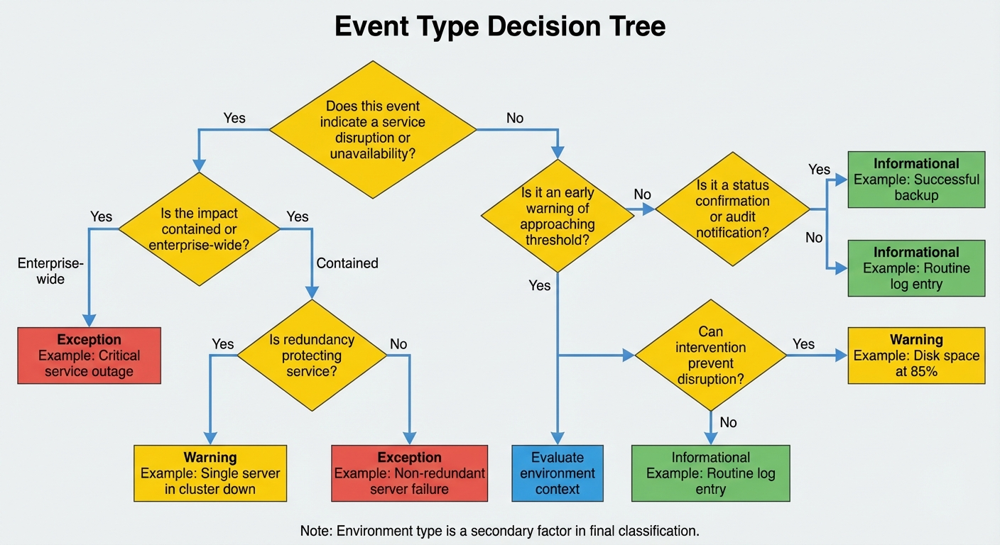
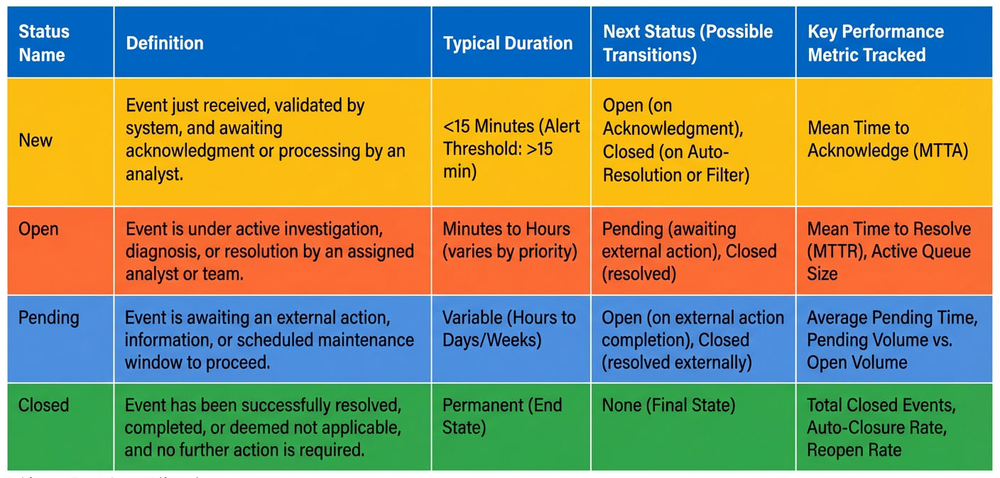
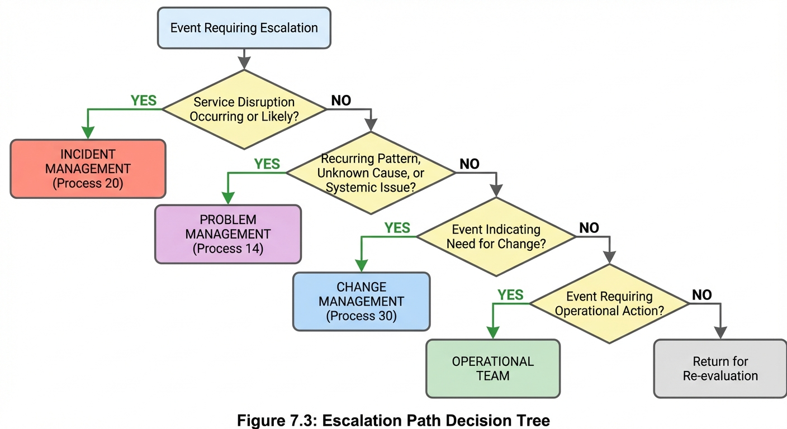

# Chapter 7: Process Activities and Workflows

## Introduction

The Event Management process consists of five major activities that work together to detect, analyze, and resolve IT infrastructure and application events. These activities form the operational backbone of Event Management, transforming raw monitoring data into actionable intelligence that drives service quality and operational efficiency.

Understanding these activities and their associated workflows is critical for implementing an effective Event Management process. Each activity serves a specific purpose within the overall lifecycle, from initial detection through final closure and analysis. The activities are interconnected, with outputs from one activity serving as inputs to the next, creating a continuous flow that ensures events are handled systematically and efficiently.

This chapter provides a detailed examination of all five process activities, including the specific sub-activities, decision points, roles responsible, and integration points with other IT Service Management (ITSM) processes. The workflows presented here establish the foundation for operational excellence, enabling organizations to achieve the strategic goals of maximizing automation, minimizing false positives, and enabling predictive operations. By the end of this chapter, readers will have a comprehensive understanding of how Event Management activities execute, interconnect, and deliver value to the organization.

*Figure 7.1: End-to-End Process Flow - This swimlane diagram illustrates the complete Event Management lifecycle across all five activities, showing the flow from event detection through closure and trend analysis. The diagram depicts three swimlanes representing the Event Management System, Event Analyst, and supporting ITSM processes, demonstrating how events move through detection, filtering, correlation, escalation, and closure phases.*

## Activity 1: Monitor and Detect Events

Activity 1: Monitor and Detect Events represents the continuous surveillance capability that serves as the entry point for the entire Event Management process. This activity ensures that all significant state changes occurring across the IT infrastructure and application landscape are identified and captured in real-time.

### Purpose and Scope

The primary purpose of Activity 1 is to provide comprehensive monitoring coverage across all IT Configuration Items (CIs), ensuring that any deviation from normal operating parameters is detected promptly. This activity fulfills the fundamental Event Management objective of maintaining awareness of the current state of the IT infrastructure.

Monitoring and detection activities occur continuously, operating 24 hours a day, 7 days a week, as mandated by Policy 1: Event Console Monitoring. The scope encompasses all IT infrastructure including servers, network devices, storage systems, applications both commercial and custom, cloud and on-premise environments, and all geographic locations as required by Policy 3: Centralized Event Management.

### Key Components

**Monitoring Infrastructure:**
The monitoring infrastructure consists of standardized monitoring agents deployed across the IT environment. Policy 4: Enterprise Standard Monitoring Agents mandates that monitoring agents be standardized throughout the enterprise, with specific approved agents defined for each platform type including Windows servers, Linux servers, network devices, applications, and cloud infrastructure.

Each Configuration Item is monitored by a maximum of one monitoring agent, as specified by Policy 6: Device Agents. This ensures consistent event data, reduces system overhead, provides clear data authority, and simplifies management. All monitoring agents forward events to the centralized event management system, creating a unified view of IT health as required by Policy 3.

**Detection Methods:**
Events are detected through multiple mechanisms including threshold-based monitoring where metrics are compared against predefined thresholds, status polling where system availability and component health are checked at regular intervals, log file monitoring through analysis of application and system logs for error patterns, synthetic transactions where scripted transactions test application functionality, and agent-based monitoring through continuous data collection from installed monitoring agents.

**Event Generation:**
When a monitoring agent detects a condition meeting defined criteria, it generates an event containing specific attributes. These mandatory attributes include timestamp indicating the date and time of event occurrence, source identifying the CI that generated the event, event type and category classifying the event nature, severity and priority indicating the level of impact and urgency, and description providing a summary and relevant technical details.

Policy 2: Alert Logging establishes that every alert will be logged with detailed information required for analysis and trending, ensuring complete audit trail and enabling comprehensive historical analysis.

### Roles and Responsibilities

The **Event Management System** performs automated monitoring continuously, executing detection rules configured during Activity 2: Create and Maintain EM Solutions. The system compares monitored metrics against defined thresholds, generates events when conditions are met, and forwards all events to the centralized event management platform.

The **Event Analyst** monitors the event management console continuously as required by Policy 1, acknowledging events promptly within defined timeframes. The Event Analyst is the frontline operational role responsible for 24x7 monitoring, organized into three shifts: Shift 1 (Day) from 7 AM to 3 PM, Shift 2 (Evening) from 3 PM to 11 PM, and Shift 3 (Night) from 11 PM to 7 AM.

The **Event Designer** is responsible for configuring the monitoring rules and thresholds that enable detection. During Activity 2, the Event Designer designs event detection rules based on requirements, defines thresholds for warning and critical events, configures monitoring agents and tools, and implements event detection rules across the infrastructure.

### Integration Points

Activity 1 integrates with Configuration Management through dependency on the Configuration Management Database (CMDB), which provides the authoritative source of CI information. The CMDB enables the Event Management system to understand CI relationships, supporting topology-based correlation and impact analysis.

Activity 1 provides foundational data to Availability Management by aligning monitoring with availability requirements and establishing escalation criteria for availability incidents. The continuous monitoring capability directly supports availability objectives by enabling rapid detection of service disruptions.

Activity 1 feeds into Capacity Management by providing capacity trends and forecasting information. Events related to resource utilization such as CPU, memory, disk space, and network bandwidth provide essential data for capacity planning and optimization initiatives.

### Continuous Improvement

The effectiveness of monitoring and detection capabilities improves over time through continuous refinement. Trend analysis performed in Activity 5 identifies gaps in monitoring coverage, areas where threshold tuning is needed, and opportunities to add new event types. These findings feed back into Activity 2, where the Event Designer adjusts monitoring rules, adds coverage for previously unmonitored CIs, and refines thresholds to reduce false positives while maintaining detection accuracy.

The Key Performance Indicator (KPI) "Efficiency of Detection" measures the proactive capability of Event Management by calculating the ratio of event-triggered incidents to total incidents. The target for this metric is greater than or equal to 60 percent, indicating that the majority of incidents are detected proactively through monitoring rather than reported by users.

## Activity 2: Create and Maintain EM Solutions

Activity 2: Create and Maintain EM Solutions represents the design, configuration, and ongoing optimization of the Event Management technical infrastructure. This activity is critical for ensuring that the monitoring and automation capabilities remain aligned with business requirements and technical realities.

### Purpose and Strategic Alignment

The primary purpose of Activity 2 is to establish and maintain the technical solutions that enable effective event detection, correlation, and automated response. This activity directly supports the strategic goals defined in Activity 1.1: Define Event Management Strategy, translating business requirements and availability goals into technical monitoring configurations.

Activity 2 is positioned as the technical design and implementation phase, occurring both during initial Event Management implementation and continuously as part of ongoing maintenance and optimization. The Event Designer serves as the primary role responsible for this activity, with support from the Event Management Architect for strategic technical decisions and architecture definition.

### Sub-Activities Overview

Activity 2 encompasses a comprehensive set of sub-activities that span the entire lifecycle of Event Management solution development:

**Activity 2.1: Analyze Requirements** involves interpreting availability and capacity requirements from service level agreements and business stakeholders. The Event Designer translates these requirements into technical specifications, working with application teams to define custom events and collaborating with infrastructure teams to understand monitoring needs.

**Activity 2.2: Configure Monitoring Agents** involves deploying standardized monitoring agents according to Policy 4: Enterprise Standard Monitoring Agents. This includes installing approved agents on each platform type, configuring agent parameters according to defined baselines, establishing communication with the centralized event management system, and validating agent functionality and data collection.

**Activity 2.3: Define Event Detection Rules** is where the Event Designer creates the specific rules that determine when events are generated. This includes defining threshold values for warning and critical events, establishing baseline metrics for normal operating ranges, configuring detection logic for application-specific events, and documenting the rationale for each detection rule.

### Correlation Logic and Techniques

**Activity 2.4: Create Event Correlation Rules** is a crucial technical activity where the Event Designer configures rules that reduce alert noise and identify the true scope of issues by linking related notifications. Effective correlation is essential for achieving the supporting goal of minimizing false positives.

**Correlation Techniques** deployed include:

**Time-Based Correlation** groups events occurring within a defined time window, typically 5 to 15 minutes. This technique is used for events caused by the same incident occurring close together, such as multiple "cannot connect" alerts within 2 minutes indicating a common underlying issue.

**Topology-Based Correlation** leverages CI dependency relationships from the CMDB to understand downstream effects of upstream failures. For example, when a network switch fails, the Event Management system can correlate alerts from all servers in the rack, identifying the root cause and suppressing related alerts.

**Pattern-Based Correlation** uses rules like regular expressions or keywords to match similar event signatures. This technique identifies similar errors with different specific details, such as multiple "Connection timeout" errors with different IP addresses that indicate a common connectivity issue.

**Rule-Based Correlation** employs predefined if-then rules linking specific event types. For example, suppressing "backup failed" events if a correlated "disk full" event has already occurred, since the disk space issue is the root cause.

**Service-Based Correlation** links events affecting the same business service by leveraging CI-to-service mappings from the CMDB. This enables understanding of business service impact and groups all events affecting a particular service for comprehensive analysis.

The success of correlation is measured by the target of reducing alert volume by greater than 50 percent and the "Correlation Effectiveness" metric that assesses whether parent and child relationships are correctly identified.

### Automation Development

**Activity 2.5: Design Automated Responses** enables self-healing capabilities that maximize automation, a primary supporting goal of Event Management. The Event Designer follows a structured automation development process:

**Identification** involves identifying frequent manual actions that are repeatable and deterministic, suitable for automation. The Event Designer analyzes historical event data to find patterns of routine responses.

**Design** includes documenting the manual procedure, designing the automated workflow, and identifying prerequisites, validation checks, and rollback plans. This ensures that automation is safe and reliable.

**Development** encompasses writing the script, implementing error handling and logging, and creating comprehensive audit trails. The Event Designer must ensure that automated responses are fully instrumented for monitoring and troubleshooting.

**Testing** requires conducting tests in non-production environments, simulating failure modes, and validating rollback procedures. No automation is deployed to production without thorough testing.

**Implementation** involves deploying to production, configuring event triggers, and setting initial safeguards such as throttling to prevent automation storms.

**Monitoring** tracks execution through the Auto-operations Success Rate KPI, which has a target of greater than or equal to 70 percent for mature implementations. This metric indicates the percentage of automated responses that successfully resolve events without human intervention.

**Activity 2.6: Document Response Procedures** ensures that manual response procedures are well-documented for events that require human intervention. This includes creating runbooks with step-by-step instructions, maintaining knowledge base articles, documenting troubleshooting guides, and defining escalation criteria.

**Activity 2.7: Configure Escalation Procedures** establishes the routing logic that determines how events requiring human intervention are assigned to the appropriate handler. This includes defining escalation paths for each event type, documenting on-call schedules and notification rules, configuring automated escalation workflows, and establishing communication procedures as required by Control Objective EM-C06.

### Implementation and Maintenance

**Activity 2.9: Implement and Test** involves deploying the designed solutions to the production environment. The Event Designer conducts comprehensive testing to validate that event configurations work as intended, integrations with other systems function properly, and automated responses execute correctly.

**Activity 2.10: Maintain and Update** represents the ongoing maintenance phase where the Event Designer tunes thresholds based on performance data, optimizes correlation rules to improve effectiveness, updates automated responses to address new scenarios, and removes obsolete event definitions. This continuous refinement ensures that Event Management solutions remain effective and aligned with the evolving IT environment.

### Technology Roadmap and Standards

The **Event Management Architect** plays a strategic role in Activity 2 by defining the overall architecture and standards that guide solution development. The Architect creates a multi-year technology roadmap ensuring that technology solutions meet current and future needs, evaluates emerging technologies to keep the framework current, and defines integration architecture with other systems and processes.

The Architect establishes enterprise standards for Event Management including event naming conventions, event categorization schema, monitoring agent standards supporting Policy 4, and architectural guidelines that ensure consistency across the organization. The Architect also conducts the technical review step during the exception process for using custom or third-party monitoring agents, ensuring that any deviations from standards are justified and properly controlled.

### Outputs and Quality Metrics

The outputs of Activity 2 include comprehensive monitoring coverage across all CIs, well-configured correlation rules that reduce alert noise, reliable automated responses that enable self-healing, complete documentation supporting Event Analyst operations, and properly configured escalation paths ensuring appropriate routing.

Quality is measured through several KPIs including Categorization Accuracy with a target of greater than or equal to 95 percent ensuring proper routing, False Positive Rate with a target of less than or equal to 5 percent measuring monitoring accuracy, and Auto-operations Success Rate with a target of greater than or equal to 70 percent for mature implementations demonstrating automation effectiveness.

*Figure 7.2: Activity 2 Detailed Workflow - This flowchart illustrates the complete workflow for Activity 2: Create and Maintain EM Solutions, showing the sequential sub-activities from requirements analysis through implementation and maintenance. The diagram includes decision points for testing validation and approval gates, demonstrating how the Event Designer and Event Management Architect collaborate to build and refine Event Management solutions.*

## Activity 3: Manage Event

Activity 3: Manage Event represents the real-time operational phase where detected events are filtered, correlated, categorized, and potentially resolved through automated responses. This activity is characterized by high-speed, high-volume processing designed to reduce alert noise and enable rapid response to genuine issues.

### Purpose and Real-Time Processing

The primary purpose of Activity 3 is to process incoming events efficiently, distinguishing between informational notifications, events requiring human attention, and events that can be resolved automatically. Activity 3 operates continuously in real-time, handling events as they are detected by the monitoring infrastructure configured in Activity 2.

Activity 3 is primarily executed by the Event Management System through automated processing rules, with the Event Analyst monitoring the results and handling events that require human intervention. The speed and efficiency of Activity 3 directly impacts the Mean Time to Detect (MTTD) and Mean Time to Alert (MTTA) metrics that measure Event Management responsiveness.

### Sub-Activity 3.1: Receive Event

The Event Management system receives events from monitoring agents deployed across the IT infrastructure. Each event contains mandatory attributes including timestamp, source CI, event type and category, severity and priority, and description with technical details. The system validates that all required attributes are present and properly formatted.

Upon receipt, the system assigns an initial status of `New` to the event, establishing the beginning of the event lifecycle. The system logs the complete event record as required by Policy 2: Alert Logging, ensuring that every alert is logged with detailed information required for analysis and trending.

### Sub-Activity 3.2: Filter Event

Filtering is the first decision point in Activity 3, where the system evaluates whether an event requires further processing or can be filtered out immediately. Filtering criteria include event type assessment, where Informational events that require no action are logged for audit and trending but generate no alert; threshold evaluation, where events below the warning threshold are suppressed; business hours consideration, where certain non-critical events may be suppressed during off-peak hours; and maintenance window checking, where events occurring during planned maintenance windows are flagged accordingly.

Events that pass filtering proceed to Sub-Activity 3.3 for correlation. Events filtered out are logged with a closure code of `Maintenance` or marked as informational only, completing their lifecycle without requiring human attention. The filtering logic reduces event volume and focuses Event Analyst attention on events that truly require action.

### Sub-Activity 3.3: Correlate Event

Correlation logic configured in Activity 2.4 is executed to identify relationships between events and suppress duplicate or related alerts. The correlation engine applies time-based, topology-based, pattern-based, and rule-based correlation techniques as described in Activity 2.

The system identifies parent events representing the root cause and child events representing downstream symptoms or duplicate notifications. Child events are linked to the parent event and marked with a status of `Related`, effectively suppressing them from the primary event queue while maintaining the complete event history for analysis.

Correlation is essential for achieving the target of reducing alert volume by greater than 50 percent. Effective correlation ensures that Event Analysts see a single consolidated view of an issue rather than being overwhelmed by hundreds of related alerts, a situation known as an "alert storm."

### Sub-Activity 3.4: Categorize Event

Categorization assigns each event to a specific category based on the type of Configuration Item that generated it. Event categories serve as the primary mechanism for organizing events for routing and reporting purposes, as required by Control Objective EM-C03 mandating that event management procedures include criteria for categorizing events.

**Event Categories** include:

**Hardware - Network:** Events from network infrastructure components including routers, switches, load balancers, firewalls, and wireless access points. Monitoring focuses on interface status, bandwidth utilization, packet loss, latency, and device availability.

**Hardware - Server:** Events from physical and virtual server infrastructure including Intel and AMD servers, Unix systems, Linux servers, virtual hosts, and storage arrays. Monitoring focuses on CPU utilization, memory usage, disk I/O, hardware health, power status, and temperature.

**Software - Commercial:** Events from third-party commercial software packages including Microsoft Office, Oracle Database, SAP ERP, Salesforce, and ServiceNow. Monitoring focuses on application availability, license compliance, performance metrics, error rates, and user connections.

**Software - Custom:** Events from internally developed applications including health benefits systems, timecard applications, custom CRM, and internal portals. Monitoring focuses on application errors, transaction success, business metrics, API health, and process completion.

Accurate categorization is critical for routing events to the appropriate support team and for generating meaningful reports. The KPI "Categorization Accuracy" measures the percentage of events with correctly assigned categories, with a target of greater than or equal to 95 percent.

### Sub-Activity 3.5: Execute Automated Response

For events that match defined automation criteria configured in Activity 2.5, the Event Management system executes automated response scripts. This sub-activity embodies the supporting goal to maximize automation and enable self-healing capabilities.

**Automated Response Types** include:

**Service Restart:** Automatically restarting a failed service or application when specific failure conditions are detected. For example, restarting a web application service when health check monitoring detects it is not responding.

**Resource Cleanup:** Automatically clearing temporary files, purging old logs, or cleaning up disk space when utilization events are triggered. For example, executing a cleanup script when disk space reaches 80 percent utilization.

**Configuration Adjustment:** Automatically adjusting configuration parameters to address performance issues. For example, increasing connection pool size when database connection exhaustion events occur.

**Alert Suppression:** Automatically suppressing known false positive alerts or alerts during approved maintenance windows, reducing noise without requiring manual intervention.

**Notification:** Automatically notifying specific teams or individuals based on event characteristics, ensuring appropriate awareness without requiring manual escalation.

The automated response executes within a controlled framework that includes validation of prerequisites before execution, comprehensive logging of all actions taken, error handling to gracefully manage failures, and rollback capability if the automated action does not resolve the issue.

Upon successful completion, the automated response returns a resolution confirmation to Activity 5.1, enabling the event to be verified and closed with a closure code of `Auto Action`. The Auto-operations Success Rate KPI measures the percentage of automated responses that successfully resolve events, with a target of greater than or equal to 70 percent for mature implementations.

If the automated response fails or the event does not meet automation criteria, the event proceeds to Activity 3.6 for logging and subsequent human handling.

### Sub-Activity 3.6: Log Event

All events that require human attention are logged in the centralized event management system with complete information as required by Policy 2: Alert Logging. The logged event includes all mandatory attributes, any actions already taken including filtering or automated response attempts, correlation relationships showing parent and child events, and calculated priority based on impact and urgency.

The event status is updated to `Open`, indicating that it requires attention from the Event Analyst or will be escalated to another process. The event is now visible on the Event Analyst console, ready for Activity 4: Correlate and Escalate Event.

### Decision Points and Routing

Activity 3 includes several critical decision points that determine the path each event takes:

**Filter Decision:** Does this event require action? If yes, proceed to correlation. If no, log as informational only.

**Correlation Decision:** Is this event related to an existing parent event? If yes, link as child and mark as `Related`. If no, treat as a new primary event.

**Automation Decision:** Does this event match automation criteria? If yes, execute automated response. If no, proceed to logging for human handling.

**Resolution Decision:** Did the automated response successfully resolve the issue? If yes, proceed to Activity 5 for closure. If no, escalate for human intervention.

These decision points ensure that events are processed efficiently, with only those requiring human attention consuming Event Analyst time and focus.

### Integration with Console Monitoring

Activity 3 integrates directly with Policy 1: Event Console Monitoring, which mandates continuous 24x7 monitoring of event consoles by trained personnel. The Event Analyst monitors the results of Activity 3 processing, acknowledging events promptly within defined timeframes. Events that cannot be automatically resolved through Activity 3.5 are displayed on the Event Analyst console for manual investigation and response.

The Event Analyst provides feedback on the effectiveness of filtering, correlation, and automation, identifying opportunities for improvement that feed back into Activity 2 maintenance. This continuous feedback loop enables ongoing optimization of Event Management solutions.

**Table 7.1:** Activity Summary with Inputs and Outputs

| Activity | Primary Purpose | Key Inputs | Key Outputs | Primary Role |
|---|---|---|---|---|
| **Activity 1: Monitor and Detect** | Continuous surveillance of IT infrastructure | CI definitions from CMDB; Monitoring rules from Activity 2 | Raw events with complete attributes | Event Management System; Event Analyst |
| **Activity 2: Create and Maintain EM Solutions** | Design and configure monitoring infrastructure | Business requirements; Availability requirements; Technical specifications | Monitoring rules; Correlation logic; Automated responses | Event Designer; Event Management Architect |
| **Activity 3: Manage Event** | Real-time event processing and filtering | Events from Activity 1; Correlation rules; Automation scripts | Filtered and correlated events; Auto-resolved events | Event Management System; Event Analyst |
| **Activity 4: Correlate and Escalate** | Analyze significance and route appropriately | Correlated events from Activity 3; Impact and urgency data | Incident records; Problem records; Change requests | Event Analyst; ITSM processes |
| **Activity 5: Review and Close** | Finalize event record and drive improvement | Resolution confirmations; Complete event data | Closed events; Trend reports; Performance metrics | Event Analyst; Event Manager |

*Caption:* This table summarizes the five major activities of Event Management, showing the primary purpose, key inputs and outputs, and primary responsible role for each activity. Understanding the inputs and outputs demonstrates how activities interconnect to form a comprehensive process.

## Activity 4: Correlate and Escalate Event

Activity 4: Correlate and Escalate Event represents the analytical phase where events that cannot be automatically resolved are analyzed to determine their significance and appropriate escalation path. This activity serves as the critical bridge between Event Management and other ITSM processes, ensuring that events trigger appropriate responses through Incident, Problem, or Change Management.

### Purpose and Strategic Context

The primary purpose of Activity 4 is to transform real-time event data into actionable prioritized responses, fulfilling the Event Management goal to detect, evaluate, and determine appropriate control action. This activity is characterized by advanced analytical logic designed to reduce alert noise and route issues to the appropriate ITSM process or support team.

Activity 4 provides the trigger or entry point for execution of many Service Operation processes and activities. The supporting goal is to provide accurate and timely event data to Incident, Problem, and Change Management, ensuring that these downstream processes have complete context for effective resolution.

### Sub-Activity 4.1: Review Event Details

The Event Analyst begins by reviewing the complete event record including the event description and technical details, correlated event relationships showing parent and child events, the source CI and its role in the infrastructure, historical data about similar previous events, and any automated actions already attempted.

This comprehensive review establishes the foundation for understanding the event's true nature and significance. The Event Analyst consults the knowledge base for documented resolution procedures and checks the CMDB for CI dependency information that may indicate broader impact.

### Sub-Activity 4.2: Correlate Events

While initial correlation occurs automatically in Activity 3.3, Sub-Activity 4.2 represents additional manual correlation performed by the Event Analyst for complex scenarios that automated rules did not catch. The Event Analyst may identify relationships between events that occurred over a longer timeframe, recognize patterns based on operational experience, link events to known issues or ongoing investigations, or consolidate events affecting the same business service.

The correlation techniques described in Activity 2.4 apply here, with the Event Analyst using time-based, topology-based, pattern-based, and service-based correlation logic. Once correlation is complete and the parent event identified, the process proceeds to determine event significance.

The success metric for correlation targets reducing alert volume by greater than 50 percent. Effective correlation ensures that human attention is focused only on true root causes, not cascading symptoms.

### Sub-Activity 4.3: Determine Event Significance

Determining event significance is a crucial step that systematically assesses the potential harm (Impact) and required speed of response (Urgency), allowing assignment of Priority that governs all subsequent escalation and handling. This sub-activity is governed by Control Objective EM-C05, which requires that events be prioritized using defined criteria to ensure that those with the highest potential to impact service levels are addressed first.

**Evaluating Business Impact:**
The Event Analyst evaluates the effect of the event on business and IT services using the structured Impact Assessment Matrix defined in Activity 2 and documented in Chapter 4. Impact assessment considers service criticality, number of users affected, business process impact, and Service Level Agreement (SLA) implications.

**Impact Levels** range from 1 (Low) indicating minimal or no business impact affecting only a single user, to 4 (Critical) indicating severe business impact with organization-wide consequences, complete stoppage of a business process, or financial and regulatory implications. The Impact Determination Matrix uses environment type (Test, Development, Staging, Production) and organizational scope (Office, Building, Site, Organization) to determine the base impact level.

**Assessing Urgency:**
Urgency indicates how quickly the event must be addressed based on business requirements and user expectations. Urgency is assessed based on the Service Restoration Goal, Business Driver, and time sensitivity of the issue.

**Urgency Levels** range from 1 (Low) indicating not time-sensitive with greater than 2 days restoration goal, to 4 (Critical) indicating immediate response required with 1 to 4 hours restoration goal. Urgency Modifiers can increase the assigned urgency level based on Time of Day (higher during business hours), Business Cycles (higher during month-end, quarter-end, or year-end), and Regulatory Deadlines (higher when close to compliance reporting dates).

**Calculating Event Priority:**
Priority combines Impact and Urgency using the Priority Matrix to determine the correct handling order. Priority ranges from 1 (Critical) requiring immediate response within 15 minutes with 24x7 response and management notification, to 5 (Planning) indicating scheduled action during maintenance window.

The calculated event priority determines the Escalation Path in Sub-Activity 4.4 and establishes the required response time target. Proper determination ensures that escalating processes receive necessary priority data, aligning technical response with business criticality.

### Sub-Activity 4.4: Determine Escalation Path

Determining the escalation path is the pivotal decision-making step that takes the validated, correlated, and prioritized event and routes it to the correct downstream process or support team for resolution. This activity ensures rapid and appropriate response to issues that cannot be automatically resolved.

Activity 4.4 relies on outputs of preceding steps: events must first be correlated to suppress duplicates and identify the single parent event representing the root issue, and the event's impact and urgency must be assessed to calculate priority, which determines the correct escalation path and required response time target.

**Escalation Path Decision Points:**
The Event Analyst evaluates the event against several key decision points:

**Service Disruption Occurring or Likely:** If the event represents a genuine disruption or reduction in quality of IT service, escalate to Incident Management. This applies to Exception events causing or likely to cause service disruption.

**Recurring Pattern, Unknown Cause, or Systemic Issue:** If the event indicates an underlying issue requiring root cause analysis, escalate to Problem Management. This applies to recurring events with unknown root cause or patterns of related events indicating systemic problems.

**Event Indicating Need for Change:** If the event indicates a need for configuration or capacity change, escalate to Change Management. This applies to capacity thresholds breached or configuration issues requiring formal change control.

**Event Requiring Operational Action:** If the event requires human intervention but does not meet criteria for formal Incident, Problem, or Change Management processes, assign to the Operations Team. This typically applies to Warning category events requiring routine operational action.

The Event Analyst reviews the event type and category, checks the escalation matrix configured in Activity 2.7 that maps event characteristics to teams or processes, identifies the appropriate process or team, and verifies availability of assigned resources.

Governance is provided by Control Objective EM-C06, which mandates that Event Management procedures include escalation criteria and communication procedures for events requiring human intervention. The success metric Routing Accuracy measures the percentage of events routed to the correct team, process, or individual, with a target of greater than or equal to 95 percent.

*Figure 7.3: Escalation Path Decision Tree - This decision tree illustrates the logic used in Sub-Activity 4.4 to determine the appropriate escalation path for events requiring human intervention. The tree shows decision points for service disruption, recurring patterns, change requirements, and operational actions, directing events to Incident Management, Problem Management, Change Management, or Operations Teams respectively.*

### Sub-Activity 4.5: Escalate to Incident Management

Escalation to Incident Management is required when an event represents a genuine disruption or reduction in quality of IT service. An Incident is defined as an unplanned interruption or reduction in quality of IT service, making this escalation pathway appropriate for Exception events causing or likely to cause service disruption.

**Handoff Actions:**
The Event Analyst performs specific actions during the handoff to Incident Management:

1. **Create Incident Record:** The Event Analyst creates a formal incident record in the Incident Management system, linking the incident to the originating event or events.

2. **Transfer Relevant Event Data:** All relevant event data is transferred to the incident record, including event description and technical details, source CI and affected services, priority calculated from impact and urgency, timeline of event occurrence and detection, and any automated actions or troubleshooting already attempted.

3. **Set Incident Priority:** The incident priority is set based on the event significance calculated in Activity 4.3, ensuring consistent prioritization across processes.

4. **Notify Incident Team:** The appropriate incident response team is notified according to the escalation procedures configured in Activity 2.7, including on-call schedules and notification rules.

The Event Analyst provides complete event context in the escalation, ensuring that the Incident Management team has all necessary information to begin investigation and resolution immediately. The event record is updated with a reference to the created incident, maintaining traceability.

Upon resolution of the incident, Incident Management provides resolution confirmation back to Event Management through Sub-Activity 5.1. The event is then verified and closed with a closure code of `Incident`, indicating that the event was escalated to and resolved via Incident Management.

### Sub-Activity 4.6: Escalate to Problem Management

Escalation to Problem Management occurs when an event indicates an underlying issue requiring root cause analysis. This escalation fulfills Event Management's function to provide data for root cause investigation, while explicitly recognizing that root cause analysis itself is handled by Problem Management, not Event Management.

**Trigger Conditions:**
Events are escalated to Problem Management when characterized by recurring events with unknown root cause, patterns of related events indicating systemic issues, or events that have resulted in multiple incidents over time.

**Handoff Actions:**
The Event Analyst performs specific actions during the handoff to Problem Management:

1. **Create Problem Record:** The Event Analyst creates a formal problem record in the Problem Management system, linking the problem to related events.

2. **Link Related Events:** All related events are linked to the problem record, providing a complete view of the recurring pattern or systemic issue.

3. **Provide Event History and Trend Data:** Historical event data and trend analysis from Activity 5.6 are provided to support root cause investigation, showing frequency, timing, and patterns of occurrence.

4. **Document Initial Analysis:** Any initial analysis or suspected causes identified by the Event Analyst are documented in the problem record to assist the Problem Manager.

The event record is updated with a reference to the created problem record. Upon creation of the problem record or implementation of a permanent fix, Problem Management provides resolution confirmation back to Event Management. The event is then verified and closed with a closure code of `Problem`, indicating that events were escalated to Problem Management for root cause investigation.

### Sub-Activity 4.7: Escalate to Change Management

Escalation to Change Management ensures that configuration or capacity adjustments necessitated by events are managed according to the organization's governance framework. This escalation creates a Request for Change (RFC) that enters the formal Change Management process.

**Trigger Conditions:**
Events are escalated to Change Management when they indicate a need for change to the environment, specifically related to capacity or configuration issues. Examples include capacity thresholds breached indicating need for expansion, configuration drift detected requiring correction, or recurring events that can be permanently resolved through a configuration change.

**Handoff Actions:**
The Event Analyst performs specific actions during the handoff to Change Management:

1. **Create Request for Change:** The Event Analyst creates a formal RFC in the Change Management system.

2. **Document Change Rationale:** The business justification for the change is documented, referencing the event data that triggered the need.

3. **Attach Event Evidence:** Complete event records are attached to the RFC, providing evidence of the issue and supporting the change justification.

4. **Recommend Change Approach:** Based on the event analysis, the Event Analyst may recommend a specific approach for addressing the issue, such as capacity expansion, configuration adjustment, or infrastructure upgrade.

The event record is updated with a reference to the created RFC. Upon completion of the change, Change Management provides resolution confirmation back to Event Management. The event is then verified and closed with a closure code of `Change`, indicating that the event resulted in a Request for Change.

### Sub-Activity 4.8: Assign to Operational Team

Assignment to an Operational Team routes events requiring human intervention but which do not meet criteria for formal Incident, Problem, or Change Management processes to relevant technical support teams for routine operational action. This escalation pathway ensures that warning-level and operational events are handled efficiently by operations teams without overwhelming high-priority incident and problem queues.

**Trigger Conditions:**
Events are assigned to Operational Teams when they require operational action but do not meet incident criteria, typically Warning category events. Event characteristics requiring operational assignment include:

**Warning Threshold Breached:** The event indicates an approaching limit but has not caused service disruption. Example: Disk space at 70 percent capacity, assigned Low or Medium priority for planned remediation.

**Operational Event:** The event requires routine, non-disruptive corrective action. Example: A hardware component flagged as degraded requiring replacement during the next maintenance window.

**Capacity Warning:** A resource is nearing a limit, requiring planning for expansion. Example: CPU utilization consistently above 70 percent, indicating need for capacity planning.

**Handoff Actions:**
The Event Analyst or Event Management System performs specific actions during the handoff to the Operations Team:

1. **Create Operational Task:** An operational task or work order is created in the appropriate system.

2. **Assign to Appropriate Team:** The task is assigned to the relevant Operational Team based on the event category and CI type, such as Network Operations, Server Operations, Storage Operations, or Application Support.

3. **Set Task Priority and Deadline:** The task priority and deadline are set based on the event priority and urgency, ensuring that operational actions are completed within appropriate timeframes.

4. **Provide Event Context and Instructions:** Complete event context is provided along with instructions for remediation, which may reference documented procedures, runbooks, or knowledge articles configured in Activity 2.6.

The Operations Team executes the operational action according to their procedures. Upon completion, the Operations Team provides confirmation back to Event Management. The event is verified and closed, potentially with a closure code of `Change` if the operational action required capacity expansion linked to an RFC initiated by the operations team.

### Integration with ITSM Processes

Activity 4 serves as a critical integration hub, connecting Event Management with other ITSM processes:

**Integration with Incident Management:** Exception events are escalated as incidents for resolution. The Event Analyst accurately creates incident records and transfers all relevant event data, ensuring seamless handoff.

**Integration with Problem Management:** Recurring or significant events trigger problem investigation. The Event Management team creates problem records for recurring events or events indicating a systemic issue, providing event history and trend data as foundation for root cause analysis.

**Integration with Change Management:** Events indicating a need for configuration or capacity change result in a Request for Change. Complete event context is provided for change justification and planning.

**Integration with Operational Teams:** Warning-level events are routed to operations teams for routine action, ensuring appropriate handling without formal process overhead.

The Event Management Process Owner is responsible for ensuring coordination with all other ITSM processes, resolving process interface issues, promoting process integration initiatives, and representing Event Management in process coordination meetings. This integration ensures that Event Management operates not as a silo but as a highly integrated component of the overall IT Service Management ecosystem.

## Activity 5: Review and Close Event

Activity 5: Review and Close Event is the fifth and final major activity in the Event Management process lifecycle. This activity's objective is to finalize the event record, verify that the event condition has been resolved, document the outcome, and utilize collected data to drive continuous process improvement, ensuring accountability, audit readiness, and process effectiveness.

### Purpose and Dual Focus

Activity 5 serves a dual purpose: completing the individual event lifecycle and contributing to strategic continuous improvement. This activity serves as the conclusion of the event lifecycle for every detected event, whether it was filtered out and auto-resolved in Activity 3 or escalated to Incident, Problem, or Change Management in Activity 4.

The inputs to Activity 5 are resolution confirmations from automated actions or other service management processes. The outputs are complete finalized event records used for trend analysis and performance reports that drive ongoing optimization of Event Management capabilities.

### Verification and Documentation Phase

The first phase of Activity 5 focuses on finalizing the event record, ensuring that the documented resolution is accurate and complete. This phase ensures accountability and creates the audit trail required by Policy 2: Alert Logging.

**Sub-Activity 5.1: Receive Resolution Confirmation:**
This sub-activity serves as the entry point for closing the event lifecycle, signaling that the issue or condition initially detected has been addressed by a downstream process or automated action. Sources of resolution confirmation include Automated Response Completion from the Event Management System itself if handled through self-healing scripts, Incident Management providing confirmation when the related incident is resolved, Problem Management providing confirmation when the problem record is created or fix is implemented, Change Management providing confirmation when the change is completed, and Operations Team providing confirmation when the operational action is completed.

Receiving confirmation sets the stage for the formal closure process, where accountability is transferred back to Event Management for audit and analysis. The confirmation signal acts as an "all clear" notification, allowing Event Management to move forward and verify resolution and close the event record.

**Sub-Activity 5.2: Verify Event Resolution:**
Verification is a critical validation step ensuring that the event, regardless of resolution method, has genuinely been corrected, with the underlying condition no longer active, confirming the integrity of the resolution phase. This activity acts as a quality gate before the event outcome is officially documented and status updated to `Closed`.

The purpose is to confirm that the event condition has been resolved. Key tasks performed by the Event Analyst or system include checking monitoring data to confirm resolution, verifying that the CI returned to normal state, confirming that no related events are active, and validating that service has been restored if the event was service-impacting.

Validation methods depend on the complexity and nature of the event and may include automated monitoring checks where the system waits for an OK status, manual verification where the analyst checks system logs or connectivity, user confirmation if the issue was user-impacting, or performance data review checking if resource utilization or latency has normalized.

Successful verification permits the process to advance to documentation and closure where a specific closure code is assigned. If verification fails, the event cannot be closed and may be reopened for further attention or escalation, indicating that the solution applied did not fix the underlying issue.

**Sub-Activity 5.3: Document Event Outcome:**
Documenting the event outcome is a core sub-activity critical for capturing all relevant details about how the event was handled, resolved, and what lessons were learned, enabling audit, reporting, and continuous improvement. The activity occurs after resolution confirmation and verification, with the outcome captured directly feeding into mandatory closure tasks and analysis.

The primary purpose is to capture resolution information for knowledge and analysis. Key tasks include recording the resolution method, documenting any actions taken, noting time to resolution, capturing lessons learned, and updating the knowledge base if needed.

Mandatory information captured includes the closure code indicating final resolution path, resolution description summarizing how the event was resolved, root cause if identified, actions taken providing a detailed log of all manual or automated actions performed, and duration metrics capturing time metrics for performance reporting including Mean Time to Detect (MTTD), Mean Time to Alert (MTTA), and Mean Time to Escalate.

Complete event records support Policy 2, which requires that every alert be logged with complete information including description, details, actions taken, and resolution information. The information documented in Activity 5.3 is essential for the effectiveness of later activities including status update, trend analysis, knowledge base update, and performance reporting.

**Sub-Activity 5.4: Update Event Status:**
Updating the event status marks the formal conclusion of the event lifecycle by setting the event's status to `Closed`. The closing process involves changing event status from `Open` or `Pending` to `Closed`, updating event attributes, linking to related records such as incident, problem, or change records, and assigning the closure code.

The status transition is typically `Open` to `Closed` or `Pending` to `Closed`, triggered by event being resolved, which must be verified in Activity 5.2. Once status is `Closed`, there are no valid transitions; it is the end state.

**Mandatory Closure Codes** are integral to updating event status, indicating the final path taken to resolve the issue. Seven mandatory closure codes are defined:

**Auto Action:** Automated response resolved the event. Used if a self-healing script executed successfully without escalation. Tracks the Automation Success Rate metric.

**Incident:** Event escalated to and resolved via Incident Management. Used when service disruption required the incident process. Tracks the Event-to-incident ratio and incident prevention rate.

**Problem:** Event escalated to Problem Management. Used when root cause investigation was needed due to recurring or systemic issues. Tracks the Event-to-problem ratio and root cause analysis triggers.

**Change:** Event resulted in Change Request (RFC). Used when configuration changes or capacity expansion was required. Tracks event-driven changes and proactive change identification.

**Related:** Event closed as duplicate, related, or sympathetic. Used when the event was correlated to another primary event. Tracks correlation effectiveness and alert reduction.

**False Positive:** Event was incorrect or irrelevant. Used when monitoring was misconfigured or threshold too sensitive. Tracks the False Positive Rate and tuning opportunities.

**Maintenance:** Event occurred during planned maintenance. Used when the event was expected during a change window or planned downtime. Tracks maintenance window effectiveness.

Accurate documentation and closing are necessary prerequisites for subsequent activities including generating closure notifications, performing trend analysis, and reviewing event effectiveness.

**Sub-Activity 5.5: Generate Closure Notifications:**
The Event Management system generates closure notifications informing relevant parties that the event has been closed. Notification recipients may include the Event Analyst who handled the event, the technical team that performed the resolution, stakeholders who were impacted by the event, and management for critical events requiring executive awareness.

Closure notifications ensure transparency and maintain stakeholder awareness throughout the event lifecycle. The notifications include the event description, resolution summary, closure code, and time to resolution.

### Continuous Improvement Phase

The second phase of Activity 5 leverages the complete event record to drive continuous improvement, aligning with the supporting goal to enable predictive operations. This phase transforms operational experience into strategic insights that enhance Event Management effectiveness.

**Sub-Activity 5.6: Perform Trend Analysis:**
Trend analysis transforms historical event data gathered throughout the lifecycle into actionable intelligence, fulfilling Event Management's strategic purpose of driving continuous improvement and enabling proactive operations. This activity is positioned after events are formally resolved and outcomes documented as the final major phase, transitioning from real-time event resolution to strategic evaluation.

The primary purpose is to identify patterns and improvement opportunities using historical event data. Supporting goals include enabling predictive operations by using event data to predict and prevent potential issues and supporting other processes by providing data to Capacity, Availability, and Service Level Management.

Input includes complete event records with detailed resolution information, closure codes, and timestamps, with Policy 2 mandating that every alert be logged with detailed information for analysis and trending over various time periods.

Key tasks encompass reviewing event frequency trends to analyze event volume over time and detect unusual patterns such as spikes or drops; analyzing event types and categories to assess distribution and identify infrastructure areas generating the most events; identifying recurring events to pinpoint events happening repeatedly, indicating an underlying systemic issue suitable for Problem Management; comparing to historical baselines to evaluate current performance against established normal operating ranges; and generating trend reports to produce formal reports based on analysis.

Specific analysis types include volume trends tracking daily, weekly, and monthly event counts; category distribution tracking the percentage of events per category; automation success rates analyzing the efficiency of self-healing actions; response times reviewing metrics like Mean Time to Detect and Mean Time to Escalate; and escalation patterns identifying frequent escalations to specific teams.

Governance is provided by Control Objective EM-C08, which explicitly requires that Event Management provide trend analysis reports for service improvement. Implementation includes defining key trends to track, establishing automated report generation, reviewing trends for improvement opportunities, and ensuring actionable insights are identified and Continuous Service Improvement (CSI) initiatives are launched.

Trend reports must be generated on a set schedule, typically monthly, and reviewed regularly to ensure that actionable insights are identified and improvement initiatives launched. Findings lead directly to Activity 5.7: Review Event Effectiveness and Activity 5.8: Update Event Management Solutions, where Event Designers adjust rules and automated responses based on lessons learned.

**Benefits and Utilization:**
Trend analysis provides critical inputs to multiple ITSM processes. Capacity Planning uses historical CPU and memory trends for consolidation and virtualization decisions. Predictive Analysis uses data as the foundation for creating fault models enabling Predictive Failure Analysis. Availability Management improves planning from event data. Fault Analysis requires trend analysis to provide historical context. Incident Prevention identifies recurring patterns, enabling proactive measures to prevent incidents before they occur.

**Sub-Activity 5.7: Review Event Effectiveness:**
Reviewing event effectiveness directly assesses the efficiency of Event Management solutions based on operational data. Key tasks include reviewing false positive rates to measure monitoring accuracy, assessing appropriateness of event thresholds to identify tuning opportunities, evaluating correlation effectiveness to determine if parent and child relationships are correctly identified, identifying gaps in monitoring coverage to find infrastructure areas not adequately covered, and recommending improvements for the next design cycle.

This sub-activity leverages the closed event records and trend data from Activity 5.6 to identify specific improvements needed. Findings indicate whether monitoring thresholds are generating excessive noise (false positives) or missing issues (false negatives). Correlation effectiveness review determines if the correlation logic configured in Activity 2.4 is properly grouping related events and reducing noise.

Output includes recommended adjustments to thresholds, correlation rules, and monitoring coverage that feed directly into Activity 5.8: Update Event Management Solutions and the design phase Activity 2: Create and Maintain EM Solutions.

**Sub-Activity 5.8: Update Event Management Solutions:**
Based on findings from effectiveness review and trend analysis, the Event Designer updates Event Management solutions to improve accuracy, reduce noise, and enhance automation. Key tasks include adjusting event thresholds to reduce false positives while maintaining detection accuracy, modifying correlation rules to improve grouping of related events, updating automated responses to handle new scenarios or improve success rates, adding new event types to address monitoring gaps, and removing obsolete event definitions that are no longer relevant.

This sub-activity represents the feedback loop to Activity 2: Create and Maintain EM Solutions, ensuring that Event Management capabilities continuously evolve based on operational experience. The Event Designer documents all changes and conducts testing in non-production environments before deploying updates to production.

**Sub-Activity 5.9: Report on Event Management Performance:**
Reporting on Event Management performance consolidates results, metrics, and findings from the entire event management lifecycle, providing visibility, driving accountability, and fueling the continuous improvement loop. This activity is the final sub-activity within Activity 5.

The primary function is to provide visibility into Event Management effectiveness, critical for demonstrating the value of Event Management to stakeholders and securing ongoing investment and support.

**Key Tasks** involved in reporting include compiling performance metrics from event data warehouse, creating dashboards and reports for various audiences, presenting findings to stakeholders, highlighting successes and issues, and recommending actions for improvement.

**Reporting Frequency and Audience:**

**Daily Dashboard (Operational):** Audience includes Event Analysts and Operations Teams. Content shows current status including event volume in the last 24 hours, critical events, Auto-operations Success Rate, top event generators, and events by status.

**Weekly Report (Tactical):** Audience includes Event Manager and Process Owners. Content shows event volume trends, volume by category, Categorization and Routing Accuracy, False Positive Rate, and top 10 event types.

**Monthly Executive Report (Strategic):** Audience includes Management and Process Owner. Content shows KPI summary with trend analysis, performance against targets, Efficiency of Detection, Automation Success Rate, cost savings from automation, and prevented incidents.

**Key Performance Indicators Reported:**

**Auto-operations Success Rate (Efficiency):** Target greater than or equal to 70 percent for mature implementations. Shows efficiency gains from automation and self-healing capabilities.

**Efficiency of Detection (Effectiveness):** Target greater than or equal to 60 percent, calculated as Event-triggered Incidents divided by Total Incidents. Demonstrates proactive capability and early detection.

**Categorization Accuracy (Quality):** Target greater than or equal to 95 percent. Ensures proper routing to correct support teams.

**Routing Accuracy (Quality):** Target greater than or equal to 95 percent. Ensures events are assigned to the correct handler.

**Volume of Events Detected (Volume):** Establishes baseline and identifies spikes requiring investigation.

**False Positive Rate (Quality):** Target less than or equal to 5 percent. Measures monitoring accuracy and reduces alert fatigue.

**Driving Continuous Improvement:**
Reporting output directly initiates the CSI cycle, with a feedback loop especially for recurring issues or high false positive rates feeding back into Activity 2. The Event Management Process Owner is responsible for monitoring effectiveness through metrics. Trend reports contain actionable insights leading to CSI initiatives launched based on identified trends.

Reports act as a formalized delivery system for data gathered, ensuring that the Event Management loop is closed and operational experience leads to documented, measurable improvements in efficiency, accuracy, and service quality.

## Integration and Process Flow

The five activities of Event Management do not operate in isolation but form an integrated, continuous process flow that ensures comprehensive event lifecycle management. Understanding the integration points and process flow is essential for successful Event Management implementation.

### Sequential Flow

The primary flow is sequential, moving from Activity 1 through Activity 5:

**Activity 1** detects events through continuous monitoring, generating raw event data that feeds into **Activity 3**.

**Activity 2** runs in parallel as a supporting activity, providing the technical infrastructure, rules, and automation that enable Activities 1, 3, and 4 to function effectively.

**Activity 3** processes events in real-time, filtering out noise, correlating related alerts, and attempting automated resolution. Events that cannot be auto-resolved proceed to **Activity 4**.

**Activity 4** analyzes event significance, determines the appropriate escalation path, and creates handoffs to Incident, Problem, Change Management, or Operations Teams.

**Activity 5** receives resolution confirmation, verifies resolution, documents outcomes, and performs trend analysis that feeds back into **Activity 2** for continuous improvement.

### Feedback Loops

Multiple feedback loops ensure continuous optimization:

**Trend Analysis Feedback:** Findings from Activity 5.6 (Perform Trend Analysis) and 5.7 (Review Event Effectiveness) feed back into Activity 2.10 (Maintain and Update), enabling the Event Designer to tune thresholds, optimize correlation rules, and improve automated responses.

**Operational Feedback:** Event Analysts provide real-time feedback on the effectiveness of filtering, correlation, and automation, identifying immediate issues that require adjustment.

**Performance Feedback:** Performance reports from Activity 5.9 inform strategic decisions by the Process Owner and Event Manager, driving process maturity initiatives and resource allocation.

### Process Cycle Time

The complete process cycle time varies based on event characteristics:

**Informational Events:** Filtered immediately in Activity 3.2, logged for trending, cycle time measured in seconds.

**Auto-Resolved Events:** Processed through Activity 3.5 (Execute Automated Response), proceed directly to Activity 5 for closure, cycle time measured in minutes.

**Escalated Events:** Move through Activity 4 to downstream processes, cycle time depends on incident, problem, or change resolution time, measured in hours to days.

**Closed Events:** All events eventually reach Activity 5 for documentation and closure, with event data retained for 90 days online and 3 years for historical summary as required by Policy 2: Alert Logging.

### Cross-Process Integration

Event Management integrates with multiple ITSM processes:

**Configuration Management:** The CMDB provides CI information, dependency relationships, and CI-to-service mappings that enable correlation, impact analysis, and routing decisions.

**Incident Management:** Exception events are escalated as incidents, with Event Management providing complete context and priority for rapid resolution.

**Problem Management:** Recurring events trigger problem investigations, with Event Management providing historical data and trend analysis supporting root cause analysis.

**Change Management:** Events indicating need for configuration or capacity changes result in RFCs, with Event Management providing justification and evidence.

**Capacity Management:** Event data provides capacity trends and forecasting information supporting capacity planning decisions.

**Availability Management:** Monitoring aligns with availability requirements, with Event Management supporting availability objectives through rapid detection.

### Role Collaboration

The five process activities require collaboration among multiple roles:

**Event Management System:** Executes Activities 1, 3.1 through 3.5 automatically, operating continuously without human intervention.

**Event Designer:** Designs and maintains solutions in Activity 2, configures monitoring rules, correlation logic, and automated responses.

**Event Analyst:** Monitors console in Activity 1, handles events requiring human attention in Activities 3 and 4, documents and closes events in Activity 5.

**Event Manager:** Oversees day-to-day execution, monitors KPIs in Activity 5.9, manages team and schedule, approves rule changes and automation scripts.

**Event Management Architect:** Provides strategic technical direction for Activity 2, defines architecture and standards, creates technology roadmap.

**Event Management Process Owner:** Provides strategic leadership, ensures process integration, allocates budget and resources, sponsors improvement initiatives informed by Activity 5 reporting.

## Key Takeaways

- Event Management consists of five major activities that form an integrated process lifecycle: Monitor and Detect, Create and Maintain EM Solutions, Manage Event, Correlate and Escalate, and Review and Close Event.

- Activity 1: Monitor and Detect provides continuous 24x7 surveillance of IT infrastructure using standardized monitoring agents, ensuring comprehensive coverage and real-time awareness of IT state.

- Activity 2: Create and Maintain EM Solutions is the technical design phase where Event Designers configure monitoring rules, correlation logic, and automated responses that enable self-healing capabilities.

- Activity 3: Manage Event processes events in real-time through filtering, correlation, categorization, and automated response, reducing alert noise and resolving routine issues without human intervention.

- Activity 4: Correlate and Escalate analyzes event significance using Impact and Urgency assessment, determines the appropriate escalation path, and creates handoffs to Incident, Problem, Change Management, or Operations Teams.

- Activity 5: Review and Close Event finalizes event records, verifies resolution, performs trend analysis, and generates performance reports that drive continuous improvement and feed back into Activity 2.

- Correlation techniques including time-based, topology-based, pattern-based, and rule-based correlation reduce alert volume by greater than 50 percent, focusing attention on root causes rather than symptoms.

- Automated responses configured in Activity 2.5 and executed in Activity 3.5 enable self-healing, with a target Auto-operations Success Rate of greater than or equal to 70 percent for mature implementations.

- The Event Analyst serves as the frontline operational role monitoring consoles 24x7, handling escalations, and documenting event outcomes, while the Event Designer builds and maintains the technical solutions.

- Process integration with Incident, Problem, Change, Configuration, Capacity, and Availability Management ensures Event Management operates as a critical hub within the ITSM ecosystem rather than as an isolated silo.

## Summary

Chapter 7 has provided a comprehensive examination of the five major activities that constitute the Event Management process, detailing the workflows, sub-activities, decision points, and integration points that enable effective event lifecycle management. These activities work in concert to detect events through continuous monitoring, process them efficiently through filtering and correlation, escalate them appropriately to downstream processes, and close them with complete documentation that drives continuous improvement.

The sequential flow from Activity 1 through Activity 5, combined with feedback loops from trend analysis back to solution design, creates a continuous improvement cycle that enhances Event Management effectiveness over time. Understanding these activities and their interconnections is essential for organizations seeking to implement or optimize their Event Management capabilities.

The roles and responsibilities described throughout this chapter demonstrate the collaborative nature of Event Management, with the Event Management System handling automated processing, Event Analysts providing frontline operational support, Event Designers building and maintaining technical solutions, Event Managers overseeing execution, Event Architects providing strategic technical direction, and Process Owners ensuring strategic alignment and resource provision.

As organizations progress through Event Management maturity levels, the sophistication and automation within these activities increase, moving from manual, reactive handling toward highly automated, proactive, and predictive operations. The workflows and decision frameworks presented in this chapter provide the foundation for this maturity progression.

Chapter 8 will build on this foundation by examining the technical implementation aspects of Event Management, including tool selection, monitoring agent deployment, event management platform configuration, and integration architecture that brings these process activities to life within an operational environment.

## Review Questions

1. What are the five major activities of Event Management, and how do they interconnect to form a complete event lifecycle?

2. Explain the four correlation techniques used in Activity 4.2 and how they reduce alert noise. Provide an example of when each technique would be most effective.

3. What is the difference between Impact and Urgency in Activity 4.3, and how are they combined to calculate event Priority? What is the purpose of Urgency Modifiers?

4. Describe the four potential escalation paths from Activity 4.4 (Incident Management, Problem Management, Change Management, Operations Team) and explain the criteria that determine which path an event follows.

5. How does Activity 5 serve a dual purpose of completing individual event lifecycles while also driving continuous improvement? Provide specific examples of feedback loops from Activity 5 to Activity 2.

---
**Chapter 7 References**

Content sourced from Event Management Handbook source material, Part II (Framework) and Part III (Technical Implementation), including process activities, workflows, role responsibilities, and ITSM integration patterns aligned with ITIL best practices.

---

## Chapter Navigation

| Previous | Next |
|----------|------|
| [Chapter 6: Roles and Responsibilities](/EventManagementHandbook/chapters/06-roles-responsibilities/) | [Chapter 8: Monitoring and Detection](/EventManagementHandbook/chapters/08-monitoring-detection/) |

---
