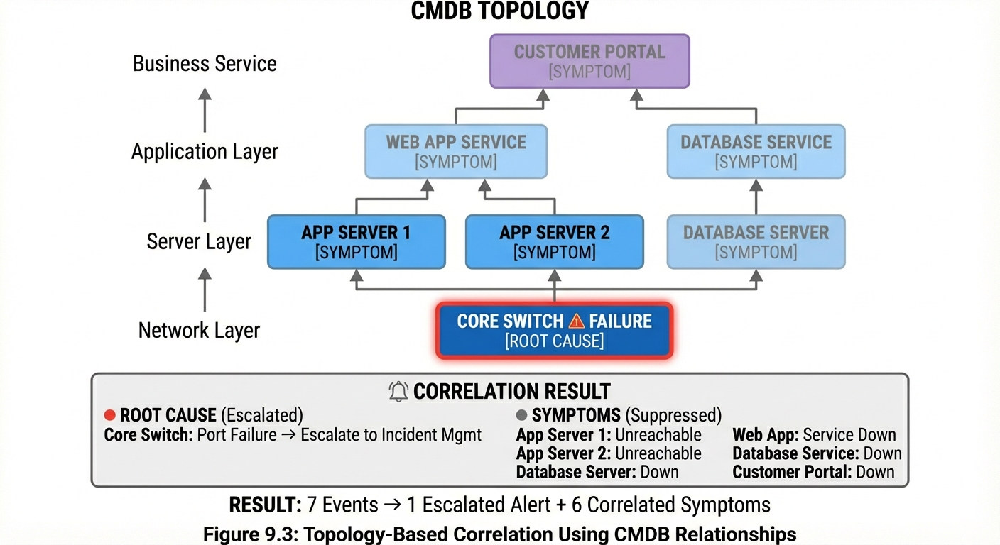
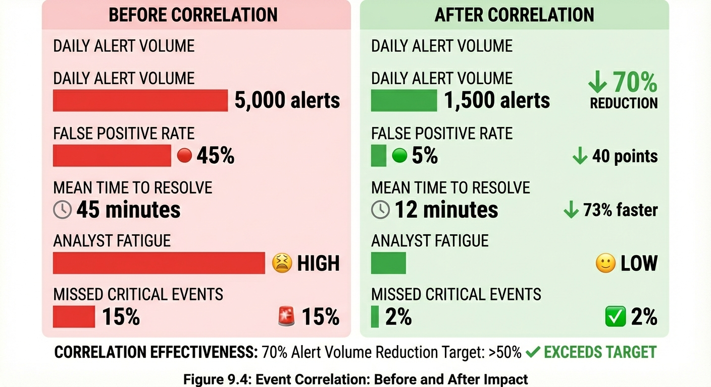
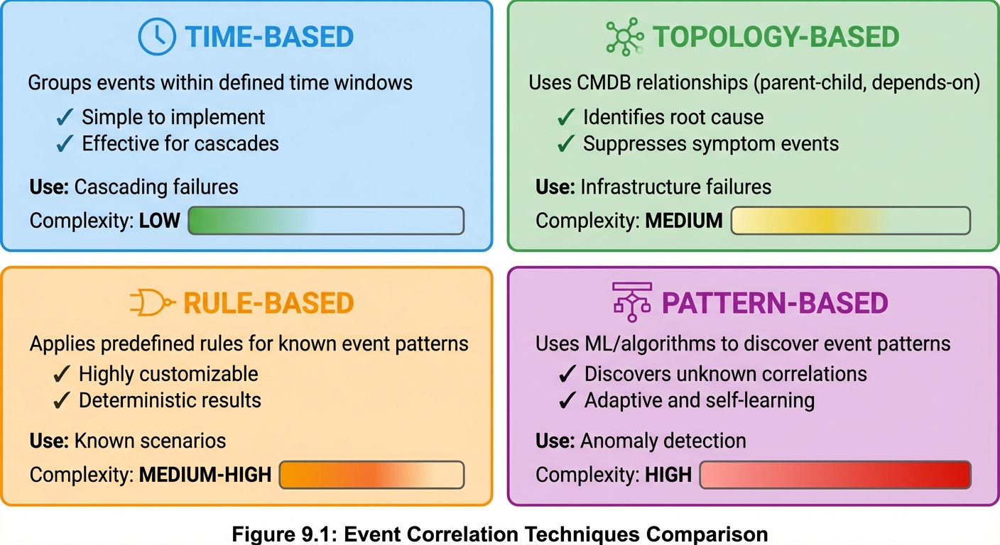
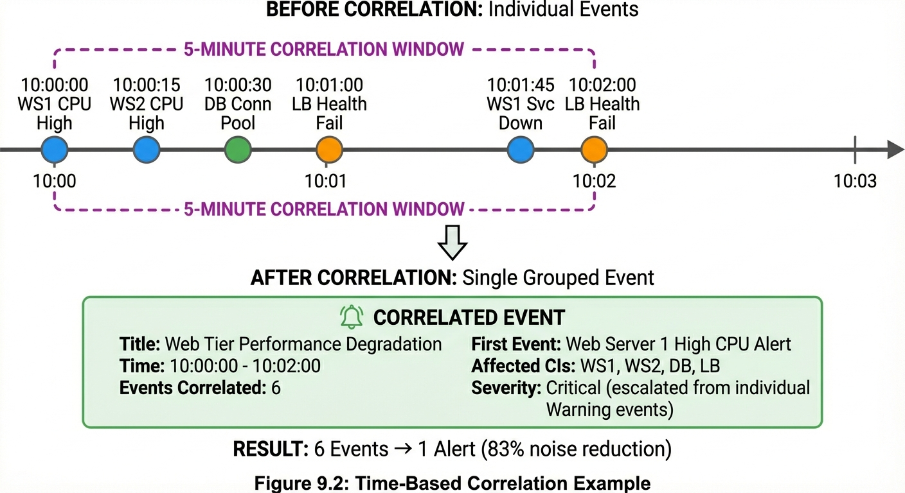

# Chapter 9: Event Correlation


## Introduction

In a modern IT environment, a single infrastructure failure can trigger dozens or even hundreds of alerts across multiple monitoring systems. When a core network switch fails, every server, application, and service dependent on that connection generates its own alert. Without effective correlation, operations teams face an overwhelming flood of notifications that obscures the true root cause and leads to alert fatigue, delayed response times, and inefficient resource allocation.

**Event Correlation** is the systematic process of identifying relationships between multiple events to understand their true scope and determine the root cause. Correlation transforms noise—multiple related alerts—into focused, actionable intelligence by grouping related events, identifying parent-child relationships, and suppressing duplicate or sympathy alerts. This capability is essential for achieving Event Management's supporting goal to **Minimize False Positives** and ensure human attention is focused only on the true root cause, not cascading symptoms.

Effective correlation delivers measurable business value. Organizations implementing robust correlation strategies commonly target and achieve **greater than 50% reduction in alert volume**, dramatically improving Mean Time to Detect (MTTD) and Mean Time to Resolve (MTTR) while reducing operational costs.[^1] This chapter explores the purpose and benefits of correlation, examines multiple correlation techniques including time-based, topology-based, pattern-based, rule-based, and service-based approaches, and provides implementation guidance for building an effective correlation framework. By mastering correlation, organizations move from reactive alert management to proactive incident prevention, reducing alert noise while improving operational efficiency and service quality.

[^1]: Correlation effectiveness percentages throughout this chapter (50%, 70-90%, etc.) are based on ITSM best practices, industry guidelines, and practitioner reports. These figures represent commonly cited targets and outcomes for mature implementations rather than results from controlled empirical studies. Actual results vary significantly based on infrastructure complexity, CMDB quality, correlation rule sophistication, and organizational maturity. Organizations should establish their own baselines and measure improvement specific to their environment.

## Purpose and Benefits of Event Correlation

### Why Correlation Is Essential

Event Correlation serves as a critical noise reduction mechanism within the Event Management process. As described in Activity 4.2: Correlate Events, the primary purpose is to **identify relationships between events to understand true scope**. This activity directly supports the objective of ensuring human attention is focused only on the true root cause rather than cascading symptoms.

Without correlation, operations teams face several significant challenges:

**Alert Storms:** A single infrastructure failure can generate hundreds or thousands of alerts within minutes. When a database server becomes unavailable, every application, monitoring check, and dependent service generates its own alert. Operations teams are overwhelmed trying to triage dozens of notifications for what is fundamentally one issue.

**Obscured Root Causes:** The sheer volume of sympathy alerts makes it difficult to identify the actual root cause. The original failure notification—such as "Database connection lost"—gets buried among hundreds of downstream alerts reporting application failures, timeout errors, and service degradation.

**Delayed Response:** Operations analysts waste valuable time investigating multiple alerts that represent the same underlying issue. Each alert appears urgent, forcing teams to spend critical minutes determining which alerts are truly independent incidents versus symptoms of a single problem.

**Resource Inefficiency:** Without correlation, multiple support teams may be mobilized simultaneously to investigate what turns out to be a single infrastructure failure. This duplicates effort and exhausts resources on redundant analysis.

**Alert Fatigue:** Continuous exposure to high volumes of alerts, many of which are duplicates or symptoms, leads to desensitization. Operations staff begin to ignore or deprioritize alerts, increasing the risk that truly critical events are missed or delayed.

### Core Benefits of Effective Correlation

Implementing robust event correlation delivers transformative benefits across multiple dimensions:

**Dramatic Alert Reduction:** Correlation effectiveness is measured by the ability to reduce alert volume by greater than 50%. Organizations with mature correlation implementations report reductions of 70% to 90%, transforming thousands of daily alerts into hundreds of actionable events. This reduction directly addresses alert fatigue and enables operations teams to focus on genuine issues.

**Faster Root Cause Identification:** By grouping related events and identifying parent-child relationships, correlation enables operations analysts to immediately see the root cause event and understand which alerts are downstream symptoms. This visibility dramatically reduces Mean Time to Detect (MTTD) and accelerates incident response.

**Improved Operational Efficiency:** Correlation eliminates redundant investigation efforts. Instead of multiple analysts examining dozens of related alerts, a single analyst can focus on the parent event knowing that child events are symptoms. This efficiency allows teams to manage larger infrastructures with fewer resources.

**Enhanced Prioritization:** Correlated event groups enable more accurate impact assessment. When correlation reveals that a single parent event affects 50 downstream Configuration Items (CIs), the calculated priority automatically reflects the true business impact rather than treating each alert independently.

**Reduced Incident Volume:** Many correlated events can be resolved by addressing the single root cause, preventing the creation of multiple redundant incident records. This reduction improves the **Event-to-Incident Ratio** Key Performance Indicator (KPI) and demonstrates effective preventive action.

**Better Service Context:** Service-based correlation links events to specific business services, enabling operations teams to understand business impact immediately. This context supports faster escalation decisions and more effective communication with business stakeholders.

### Correlation Success Metrics

Organizations measure correlation effectiveness through several key metrics:

**Correlation Effectiveness KPI:** The primary metric is the percentage reduction in alert volume achieved through correlation. The target threshold is **greater than 50% reduction**, with mature implementations achieving 70% or higher. This metric is calculated as:

```
Correlation Effectiveness = (Related Events Suppressed / Total Events Detected) × 100
```

**Related Event Closure Code:** Events closed with the `Related` closure code indicate they were successfully correlated to a parent event and suppressed. Tracking the volume of `Related` closures over time demonstrates correlation maturity and identifies opportunities for rule refinement.

**Mean Time to Detect (MTTD) Improvement:** Effective correlation should measurably reduce MTTD by enabling faster identification of root cause events. Organizations track MTTD trends before and after correlation implementation to quantify improvement.

**False Positive Reduction:** While distinct from correlation, effective grouping of related events often reveals patterns that help identify and eliminate false positives, contributing to the overall **False Positive Rate KPI** target of less than or equal to 5%.

These metrics align with Control Objective EM-C08, which requires Event Management to provide trend analysis reports for service improvement, ensuring correlation effectiveness is monitored and continuously optimized.

## Time-Based Correlation

### Overview and Purpose

**Time-Based Correlation** groups events that occur within a defined time window, operating on the principle that events caused by the same underlying incident typically occur close together in time. This technique is particularly effective for identifying cascading failures where a single root cause triggers multiple downstream symptoms within seconds or minutes.

Time-based correlation is configured by specifying a **correlation window**—a time period (for example, 2 minutes, 5 minutes, or 15 minutes) during which events with similar characteristics are considered related. Events that match defined correlation criteria and occur within the time window are automatically grouped, with the first event designated as the parent and subsequent events marked as children.

### How Time-Based Correlation Works

The correlation logic follows a systematic process:

1. **Initial Event Detection:** The first event matching defined correlation criteria arrives and is designated as the parent event. This event retains its original status and priority.

2. **Correlation Window Activation:** A time window (for example, 5 minutes) begins from the timestamp of the parent event. All subsequent events matching the correlation criteria are evaluated for grouping.

3. **Subsequent Event Evaluation:** As additional events arrive within the time window, the correlation engine compares them to the parent event based on defined criteria such as event type, affected CI category, severity level, or error message content.

4. **Child Event Suppression:** Events matching the correlation criteria within the time window are automatically linked to the parent event as children. These child events are suppressed from operator view and automatically assigned the `Related` closure code.

5. **Window Expiration:** When the correlation window expires, the parent event proceeds through normal escalation and resolution processes. If the same condition triggers new events after the window closes, a new parent-child group may be created.

### Practical Implementation Examples

**Example 1: Database Connection Timeout Storm**

A database server becomes unresponsive due to resource exhaustion. Within two minutes, 50 application servers attempt connections and generate "Connection timeout to DB01" alerts. Time-based correlation groups these events:

- **Parent Event:** "Database connection timeout - DB01" (first alert at 14:32:15)
- **Correlation Criteria:** Event Type = "Connection timeout", Source contains "DB01"
- **Time Window:** 5 minutes (14:32:15 to 14:37:15)
- **Child Events:** 49 additional timeout alerts from various application servers
- **Result:** Operators see one parent event instead of 50 individual alerts. All child events automatically closed as `Related`.

**Example 2: Network Switch Failure Cascade**

A core network switch fails, causing connectivity loss for all devices on connected ports. Time-based correlation captures the cascading alerts:

- **Parent Event:** "Switch port down - SW-CORE-01 Port 24" (14:05:00)
- **Correlation Criteria:** Event Category = "Network", Severity = "Critical"
- **Time Window:** 10 minutes
- **Child Events:** 30 server unreachable alerts, 15 application unavailable alerts
- **Result:** Single parent event provides complete context; 45 sympathy alerts suppressed.

### Time Window Selection Guidelines

Selecting the appropriate time window requires balancing noise reduction with operational accuracy:

**Short Windows (1-5 minutes):**
- **Use for:** Immediate cascading failures, connection timeouts, availability monitoring
- **Benefit:** Captures tightly coupled events with high confidence they share root cause
- **Risk:** May miss slower-propagating symptoms or create multiple parent-child groups for single incident

**Medium Windows (5-15 minutes):**
- **Use for:** Application performance degradation, capacity threshold breaches, service dependencies
- **Benefit:** Balances coverage and accuracy for most correlation scenarios
- **Risk:** Moderate risk of grouping unrelated events if criteria too broad

**Long Windows (15-60 minutes):**
- **Use for:** Batch job failures, scheduled task monitoring, trend-based patterns
- **Benefit:** Captures full scope of slowly developing issues
- **Risk:** Higher probability of incorrectly grouping independent incidents

> **Best Practice:** Start with shorter time windows (5 minutes) and conservative correlation criteria. Monitor correlation effectiveness metrics and gradually expand windows based on observed event patterns and analyst feedback.

### Configuration and Tuning

Effective time-based correlation requires careful configuration:

**Define Correlation Criteria:** Specify which event attributes must match for grouping. Common criteria include event type, CI category, severity level, error code pattern, or specific keywords in event description.

**Set Time Windows:** Establish appropriate correlation windows based on infrastructure behavior and known failure patterns. Document the rationale for each configured window.

**Implement Parent Selection Logic:** Define how the parent event is selected. Typical approaches include first event chronologically, highest severity event, or event from most upstream CI in topology.

**Configure Suppression Behavior:** Specify whether child events are hidden from operator view entirely or displayed as collapsed group members with visual indication of correlation relationship.

**Monitor and Adjust:** Track correlation accuracy by reviewing parent-child relationships during incident post-mortems. Adjust time windows and criteria when false correlations occur or genuine relationships are missed.

Time-based correlation provides foundational noise reduction and serves as a building block for more sophisticated correlation techniques described in subsequent sections.

## Topology-Based Correlation

### Overview and Purpose

**Topology-Based Correlation** leverages the known relationships between Configuration Items (CIs) stored in the Configuration Management Database (CMDB) to identify and group events that share an infrastructure or service dependency. This technique operates on the principle that when an upstream component fails, all downstream dependent CIs will generate sympathy alerts that should be correlated to the root cause.

Topology-based correlation is particularly powerful because it uses authoritative dependency information to make intelligent grouping decisions. Instead of relying solely on timing or pattern matching, this approach understands the actual infrastructure architecture and service chains, enabling accurate identification of cascading failures even when events occur minutes apart or involve different event types.

### How Topology-Based Correlation Works

Topology-based correlation requires integration between the Event Management system and the CMDB, following this process:

1. **CMDB Integration:** The correlation engine queries the CMDB for CI dependency relationships, including "depends on," "hosted on," "runs on," and "uses" relationships. This dependency map provides the foundation for correlation logic.

2. **Event CI Identification:** When an event is detected, the system identifies the specific CI affected (for example, server SVR-WEB-01, application APP-CRM, or network device RTR-CORE-05).

3. **Dependency Traversal:** The correlation engine queries the CMDB for all CIs that depend on the affected CI. For example, if a database server generates an alert, the system identifies all application servers and applications that depend on that database.

4. **Related Event Grouping:** Any events generated by downstream dependent CIs within a defined time window are automatically correlated to the upstream parent event. These downstream events are suppressed as `Related`.

5. **Multi-Level Correlation:** Sophisticated implementations traverse multiple dependency levels. If Server A hosts Application B, which provides data to Application C, then a Server A failure can correlate events from all three CIs.

### Practical Implementation Examples

**Example 1: Database Server Failure with Application Dependencies**

A database server experiences disk failure, triggering cascading application failures across the infrastructure:

- **CMDB Relationships:**
  - DB-PROD-01 (database server)
  - APP-CRM-01 depends on DB-PROD-01
  - APP-SALES-01 depends on DB-PROD-01
  - APP-INVENTORY-01 depends on DB-PROD-01

- **Event Sequence:**
  - 10:15:00 - "Disk failure on DB-PROD-01" (Parent Event)
  - 10:16:30 - "Connection timeout APP-CRM-01 to DB-PROD-01" (Child)
  - 10:17:15 - "Database query failure APP-SALES-01" (Child)
  - 10:19:45 - "Transaction timeout APP-INVENTORY-01" (Child)

- **Correlation Result:** The system recognizes all application alerts as sympathy events based on CMDB dependencies. Operators see one parent event ("Disk failure on DB-PROD-01") with three correlated child events automatically suppressed. The parent event's impact assessment reflects all three dependent applications, ensuring appropriate priority calculation.

**Example 2: Network Switch Failure with Rack-Level Impact**

A network switch providing connectivity to an entire server rack fails:

- **CMDB Relationships:**
  - SW-RACK-12 (network switch)
  - SVR-WEB-01 hosted on SW-RACK-12
  - SVR-WEB-02 hosted on SW-RACK-12
  - SVR-APP-05 hosted on SW-RACK-12
  - SVR-DB-08 hosted on SW-RACK-12

- **Event Sequence:**
  - 14:22:00 - "Switch port down SW-RACK-12 all ports" (Parent Event)
  - 14:22:45 - "Server unreachable SVR-WEB-01" (Child)
  - 14:23:10 - "Ping failure SVR-WEB-02" (Child)
  - 14:23:30 - "Connection lost SVR-APP-05" (Child)
  - 14:24:15 - "Database unavailable SVR-DB-08" (Child)

- **Correlation Result:** Topology-based correlation recognizes that all four servers depend on SW-RACK-12 for network connectivity. All server alerts are automatically suppressed, and the parent switch event reflects the full business impact including web tier, application tier, and database tier failures.

### CMDB Requirements and Data Quality

Topology-based correlation effectiveness depends entirely on CMDB accuracy and completeness:

**Required CI Relationships:** The CMDB must document key dependency types:
- **Hosting Relationships:** Physical servers host virtual machines, hardware hosts operating systems
- **Service Dependencies:** Applications depend on databases, APIs depend on backend services
- **Network Dependencies:** Devices connect through switches, routers, and firewalls
- **Infrastructure Dependencies:** Services depend on storage arrays, load balancers, and network paths

**Data Quality Imperatives:** Correlation accuracy requires:
- **Completeness:** All critical CIs and their relationships must be documented in the CMDB
- **Accuracy:** Relationships must reflect actual infrastructure dependencies, not outdated configurations
- **Currency:** CMDB updates must occur promptly when infrastructure changes are implemented
- **Consistency:** Relationship types and naming conventions must follow standardized definitions

**CMDB Integration Architecture:** The Event Management system must have real-time or near-real-time access to CMDB data through:
- **Direct Integration:** API calls to CMDB for dependency lookups during event processing
- **Cached Relationships:** Periodic synchronization of CI relationships to correlation engine
- **Bidirectional Updates:** Event data feeds back to CMDB to enrich CI records with operational context

> **Warning:** Topology-based correlation is only as good as the underlying CMDB data. Organizations with incomplete or outdated CMDBs risk missing genuine correlations or creating false parent-child relationships. Regular CMDB audits and relationship validation are essential prerequisites.

### Multi-Level Dependency Correlation

Advanced topology-based correlation traverses multiple dependency levels to capture complex cascading failures:

**Single-Level Correlation:** Groups events from CIs directly dependent on the failed component. This approach captures immediate downstream impacts.

**Multi-Level Correlation:** Traverses dependency chains to group events from indirectly dependent CIs. For example, if Database → Application → Web Service → End User Service, a database failure correlates events from all four levels.

**Configurable Depth Limits:** Organizations typically configure maximum traversal depth (for example, 3 levels) to prevent over-correlation and maintain meaningful grouping. Unlimited traversal could incorrectly correlate independent events across distant service chains.

### Combining Topology with Time Windows

Most effective implementations combine topology-based correlation with time-based windows:

**Example Configuration:**
- **Correlation Rule:** Group events from CIs dependent on parent CI (topology)
- **Time Window:** 15 minutes from parent event timestamp
- **Traversal Depth:** 2 dependency levels
- **Result:** Events from dependent CIs correlate only if they occur within 15 minutes, preventing false correlation of unrelated issues affecting the same infrastructure days later.

Topology-based correlation provides the most accurate and reliable event grouping when CMDB data is maintained with high quality. Combined with time-based windows, this technique forms the foundation of enterprise-grade correlation frameworks.

## Pattern-Based Correlation

### Overview and Purpose

**Pattern-Based Correlation** identifies relationships between events by matching similar patterns in event attributes such as error messages, event descriptions, or technical details. This technique uses regular expressions, keyword matching, and text analysis to group events that share common characteristics, even when they originate from different CIs or lack explicit topology relationships.

Pattern-based correlation is particularly valuable for application-level events, log file alerts, and error conditions that manifest with consistent text patterns but may affect multiple independent components. This approach complements topology-based correlation by capturing logical relationships that may not be documented in the CMDB.

### How Pattern-Based Correlation Works

Pattern-based correlation employs text analysis and matching logic:

1. **Pattern Definition:** Event Designers define correlation patterns using regular expressions, keyword lists, or text matching rules. For example, a pattern might match any event containing "Out of Memory" or "OOM Error" regardless of source system.

2. **Event Attribute Analysis:** As events arrive, the correlation engine extracts and analyzes key text fields including event description, detailed message text, error codes, and technical details.

3. **Pattern Matching:** The engine compares event text against defined patterns. Events matching the same pattern within a time window are candidates for correlation.

4. **Similarity Scoring:** Advanced implementations calculate similarity scores based on the degree of pattern match. Events with high similarity scores (for example, greater than 80% match) are correlated.

5. **Group Formation:** Events matching the same pattern are grouped with the first event as parent or the highest severity event designated as primary.

### Practical Implementation Examples

**Example 1: Out of Memory Error Correlation**

Multiple application servers experience memory exhaustion after a problematic code deployment:

- **Pattern Definition:** Match events containing "Out of Memory", "OOM", "java.lang.OutOfMemoryError", or "Memory allocation failed"
- **Time Window:** 30 minutes
- **Event Sequence:**
  - 09:15:00 - "Application crash: java.lang.OutOfMemoryError on APP-SRV-01"
  - 09:18:30 - "Service restart: Out of Memory condition on APP-SRV-02"
  - 09:22:15 - "Memory allocation failed on APP-SRV-05"
  - 09:35:00 - "OOM Error detected on APP-SRV-03"

- **Correlation Result:** Pattern-based correlation groups all four memory-related events, enabling operations teams to immediately recognize this as a systemic application issue rather than four independent server problems. This grouping triggers escalation to Problem Management (Activity 4.6) for root cause analysis rather than treating each as a separate incident.

**Example 2: Connection Timeout Pattern Across Applications**

A network latency issue causes connection timeouts across multiple applications communicating with various backend services:

- **Pattern Definition:** Regular expression matching "Connection timeout", "Timeout connecting to", "TCP timeout", or "Connection refused"
- **Time Window:** 10 minutes
- **Event Sequence:**
  - 14:05:00 - "Connection timeout connecting to database DB-PROD-03"
  - 14:06:30 - "TCP timeout reaching API endpoint APSVC-01"
  - 14:07:45 - "Connection refused from web service WEB-API-02"
  - 14:09:15 - "Timeout connecting to authentication server AUTH-01"

- **Correlation Result:** Pattern matching identifies these as related connectivity issues, even though they involve different source and destination CIs. This correlation reveals a broader network or infrastructure problem that might be missed if events were evaluated independently.

**Example 3: Certificate Expiration Warnings**

Multiple systems detect impending certificate expiration for services using a common certificate authority:

- **Pattern Definition:** Keyword match "certificate expir", "SSL certificate", "cert expires", "certificate validation failed"
- **Time Window:** 24 hours (longer window appropriate for warning-level events)
- **Event Sequence:**
  - Day 1, 08:00:00 - "SSL certificate expiring in 7 days for WEB-PROD-01"
  - Day 1, 09:30:00 - "Certificate validation warning WEB-PROD-02"
  - Day 1, 15:45:00 - "Certificate expires soon for API-GATEWAY-01"

- **Correlation Result:** Pattern-based grouping identifies these as related certificate management issues requiring coordinated remediation rather than isolated operational tasks.

### Pattern Definition Best Practices

Effective pattern-based correlation requires thoughtful pattern design:

**Use Regular Expressions for Flexibility:** Regular expressions enable matching variations of error messages across different systems and formats. For example, `(connection|connect).*(timeout|timed out|time-out)` matches various timeout message formats.

**Define Keyword Lists Strategically:** Create keyword lists grouped by error category: memory errors, disk errors, connection errors, authentication failures, and certificate issues. Maintain these lists as centralized configuration assets.

**Consider Case Insensitivity:** Configure pattern matching to ignore case differences, ensuring "Connection Timeout" and "connection timeout" are treated equivalently.

**Balance Specificity and Coverage:** Overly specific patterns miss legitimate correlations. Overly broad patterns create false positives. Test patterns against historical event data to validate effectiveness.

**Document Pattern Intent:** Clearly document why each pattern exists and what types of events it should correlate. This documentation supports future maintenance and troubleshooting.

### Pattern-Based Correlation Limitations

Pattern-based correlation has inherent limitations organizations must address:

**False Positive Risk:** Generic patterns may incorrectly group unrelated events that happen to share common keywords. For example, correlating all events containing "error" would create meaningless groups spanning thousands of events.

**Dependency on Message Quality:** Correlation effectiveness depends on consistent, descriptive event messages. Poorly formatted or cryptic error messages reduce pattern matching accuracy.

**Language and Format Variations:** Different monitoring tools and applications may describe identical conditions using different terminology or message formats, requiring multiple patterns to capture all variations.

**Computational Complexity:** Regular expression matching and text analysis are computationally expensive. Organizations processing millions of events daily must optimize pattern matching performance.

> **Best Practice:** Combine pattern-based correlation with time windows and additional criteria (such as event category or severity) to reduce false positive rates. Use pattern matching as a supplementary technique alongside topology-based correlation rather than as the primary correlation method.

### Advanced Pattern Techniques

Mature implementations employ sophisticated pattern analysis:

**Fuzzy Matching:** Instead of exact pattern matches, use similarity algorithms to identify events with high textual similarity even when not identical. Levenshtein distance or other string similarity metrics calculate correlation confidence scores.

**Machine Learning Classification:** Train machine learning models to classify events into correlation groups based on historical patterns. These models continuously improve accuracy as they process more events.

**Natural Language Processing:** Apply NLP techniques to extract semantic meaning from event descriptions, enabling correlation based on conceptual relationships rather than exact text matches.

**Multi-Attribute Pattern Matching:** Combine pattern matching across multiple event attributes simultaneously, such as matching both error message patterns and source system categories, to improve precision.

Pattern-based correlation provides essential coverage for application-level and log-based events where topology relationships are undefined or insufficient. When combined with topology and time-based techniques, pattern matching completes a comprehensive correlation framework.

## Rule-Based Correlation

### Overview and Purpose

**Rule-Based Correlation** uses explicit if-then logic to define correlation relationships based on specific event characteristics and conditions. This technique enables Event Designers to encode organizational knowledge, known failure scenarios, and operational expertise directly into automated correlation logic. Unlike pattern-based correlation that relies on text matching, rule-based correlation evaluates multiple event attributes simultaneously and applies complex Boolean logic to determine correlation relationships.

Rule-based correlation provides the highest level of control and customization, enabling organizations to implement correlation logic tailored to their specific infrastructure, applications, and operational requirements. This approach is particularly valuable for known cascading failure scenarios, documented dependency chains, and recurring incident patterns.

### How Rule-Based Correlation Works

Rule-based correlation follows a systematic evaluation process:

1. **Rule Definition:** Event Designers create explicit correlation rules specifying conditions and actions. Rules follow an if-then-else structure: IF (condition set) THEN (correlation action) ELSE (continue evaluation).

2. **Condition Evaluation:** When an event arrives, the correlation engine evaluates it against all active rules sequentially or prioritized by rule order. Conditions can reference any event attribute including CI name, event type, severity, category, description content, time of day, and custom fields.

3. **Multi-Condition Logic:** Rules support complex Boolean logic combining multiple conditions with AND, OR, and NOT operators. For example: IF (Event Type = "Connection Failed" AND Source CI Category = "Application Server" AND Destination CI = "DB-PROD-01") THEN correlate to parent.

4. **Action Execution:** When a rule's conditions evaluate true, the defined correlation action executes. Actions include designating an event as parent, linking as child to existing parent, suppressing event, or escalating based on correlation group characteristics.

5. **Rule Priority and Sequencing:** Rules are evaluated in defined priority order. Higher priority rules execute first, enabling specific rules to take precedence over generic patterns.

### Practical Implementation Examples

**Example 1: Database Maintenance Window Suppression**

During planned database maintenance, application connection failures are expected and should be suppressed:

- **Rule Definition:**
```
IF (Event Type = "Connection Failed"
    AND Destination CI = "DB-PROD-01"
    AND Current Time BETWEEN 02:00 AND 04:00
    AND Change Record STATUS = "In Progress"
    AND Change Record CI = "DB-PROD-01")
THEN Suppress Event
    AND Set Closure Code = "Maintenance"
```

- **Effect:** Application connection failure events during the scheduled maintenance window are automatically suppressed and closed with `Maintenance` closure code, preventing unnecessary alerts while planned work occurs.

**Example 2: Multi-Tier Application Failure Correlation**

A known dependency chain requires specific correlation logic when the authentication service fails:

- **Rule Definition:**
```
IF (Event CI = "AUTH-SERVICE-01"
    AND Event Type = "Service Unavailable"
    AND Severity = "Critical")
THEN Set as Parent Event
    AND Correlate all events WHERE
        (Source CI Category = "Web Application"
         AND Event Description CONTAINS "authentication"
         AND Timestamp WITHIN 10 minutes)
```

- **Effect:** When the central authentication service fails, all web application authentication errors are automatically correlated, preventing dozens of application teams from being simultaneously alerted to what is fundamentally an authentication service outage.

**Example 3: Backup Failure Correlation with Disk Space**

Backup job failures should be correlated to disk space events when storage capacity is the root cause:

- **Rule Definition:**
```
IF (Event Type = "Disk Space Low"
    AND CI = "STORAGE-BACKUP-01"
    AND Threshold < 10%)
THEN Set as Parent Event
    AND Correlate all events WHERE
        (Event Type = "Backup Failed"
         AND Destination Storage = "STORAGE-BACKUP-01"
         AND Timestamp WITHIN 4 hours)
```

- **Effect:** Operations teams immediately understand that backup failures are symptoms of insufficient disk space rather than independent backup job problems, enabling targeted remediation.

### Rule Development Methodology

Effective rule-based correlation requires structured development processes:

**Analyze Historical Incidents:** Review incident records and post-mortem reports to identify recurring correlation scenarios. Document known cascading failure patterns and dependency relationships that caused alert storms.

**Encode Operational Knowledge:** Capture expertise from senior operations staff and subject matter experts. Convert their mental models of infrastructure relationships into explicit rule logic.

**Start with High-Value Scenarios:** Prioritize rules addressing the most frequent and impactful correlation opportunities. Rules reducing the highest volume of alerts or addressing the most critical infrastructure components deliver immediate value.

**Test with Historical Data:** Validate new rules against historical event data before production deployment. Verify that rules would have correctly correlated past incident scenarios without creating false correlations.

**Implement Incremental Deployment:** Deploy rules incrementally, monitoring correlation effectiveness and false positive rates. Adjust rule conditions based on operational feedback before implementing additional rules.

**Document Rule Intent and Rationale:** Maintain comprehensive documentation for each rule explaining the business or technical scenario it addresses, why specific conditions were chosen, and expected behavior. This documentation supports future maintenance and troubleshooting.

### Rule Management and Governance

As rule libraries grow, formal governance becomes essential:

**Rule Library Organization:** Structure rules into logical categories such as infrastructure correlation, application correlation, maintenance window suppression, and known incident patterns. Categorization supports efficient rule discovery and management.

**Version Control:** Maintain rule definitions in version control systems, tracking changes over time. Require peer review and approval before rule modifications reach production.

**Performance Monitoring:** Track rule evaluation performance and computational cost. Complex rules evaluating multiple conditions across large event volumes can impact correlation engine performance. Optimize or refactor rules causing performance degradation.

**Effectiveness Metrics:** Measure each rule's contribution to overall correlation effectiveness by tracking how many events each rule correlates and whether correlated events represent legitimate relationships. Disable or retire rules providing minimal value.

**Annual Rule Review:** Conduct periodic reviews of the entire rule library, removing obsolete rules for decommissioned infrastructure and updating rules to reflect infrastructure changes.

### Rule-Based vs. Topology-Based Correlation

Organizations must understand when to use rule-based versus topology-based approaches:

**Use Topology-Based When:**
- CMDB relationships accurately represent dependencies
- Infrastructure relationships are well-documented and current
- Correlation logic follows standard dependency chains
- Benefit: Automatic adaptation as CMDB relationships change

**Use Rule-Based When:**
- Specific business logic governs correlation decisions
- Temporal conditions (time windows, maintenance schedules) influence correlation
- CMDB relationships are incomplete or inaccurate
- Complex multi-attribute evaluation is required
- Custom organizational knowledge needs encoding
- Benefit: Precise control over correlation behavior

> **Best Practice:** Deploy topology-based correlation as the foundation, supplementing with rule-based correlation for specialized scenarios that topology alone cannot address. This hybrid approach maximizes coverage while maintaining control.

Rule-based correlation provides the flexibility and precision required for complex operational environments. When combined with topology-based and time-based techniques, comprehensive correlation frameworks emerge capable of reducing alert volumes by 70% or more while maintaining high accuracy.

## Service-Based Correlation

### Overview and Purpose

**Service-Based Correlation** groups events based on their relationship to specific business services, leveraging CI-to-service mappings to understand business impact immediately. This technique operates at a higher abstraction level than infrastructure-focused correlation, enabling operations teams to answer the critical question: "Which business services are affected by these events?"

Service-based correlation aligns Event Management with business objectives by translating technical events into business service impact. When multiple components supporting a business service generate alerts, correlation groups these events under a service context, ensuring operations teams understand not just what infrastructure failed, but which business capabilities are degraded or unavailable.

### How Service-Based Correlation Works

Service-based correlation requires integration between Event Management, the CMDB, and service mapping:

1. **Service Mapping:** The CMDB documents which CIs support which business services. For example, the "Online Order Processing" business service depends on web servers, application servers, database servers, payment gateway APIs, and inventory management systems.

2. **Event-to-Service Resolution:** When an event is detected affecting a specific CI, the correlation engine queries the CMDB to determine which business services depend on that CI.

3. **Service Impact Assessment:** The system identifies all events affecting CIs that support the same business service within a defined time window.

4. **Service-Level Grouping:** Events are grouped and presented with business service context. Operations teams see "4 events affecting Online Order Processing service" rather than four independent technical alerts.

5. **Business Impact Prioritization:** Service-based correlation enables automatic priority calculation based on business service criticality rather than individual CI importance.

### Practical Implementation Examples

**Example 1: E-Commerce Service Degradation**

The "Online Shopping" business service experiences multiple infrastructure issues:

- **Service Mapping:**
  - Online Shopping Service depends on:
    - WEB-PROD-01, WEB-PROD-02 (web tier)
    - APP-SHOP-01, APP-SHOP-02 (application tier)
    - DB-ORDERS-01 (database tier)
    - PAYMENT-API-01 (payment gateway)

- **Event Sequence:**
  - 15:30:00 - "High CPU utilization on APP-SHOP-01" (70% CPU)
  - 15:32:00 - "Slow query detected on DB-ORDERS-01"
  - 15:35:00 - "Response time degraded on WEB-PROD-01" (page load time 8 seconds)
  - 15:38:00 - "Transaction timeout on PAYMENT-API-01"

- **Correlation Result:** Service-based correlation groups these four technical events under "Online Shopping Service - Performance Degradation." Operations teams immediately understand business impact: customers are experiencing slow page loads and payment failures. The correlated event group automatically receives high priority based on Online Shopping Service criticality, ensuring appropriate escalation.

**Example 2: Customer Support Portal Outage**

The "Customer Support Portal" service becomes unavailable due to authentication service failure:

- **Service Mapping:**
  - Customer Support Portal depends on:
    - WEB-PORTAL-01 (web interface)
    - APP-PORTAL-01 (portal application)
    - AUTH-SSO-01 (single sign-on authentication)
    - DB-PORTAL-01 (portal database)

- **Event Sequence:**
  - 10:15:00 - "Service unavailable: AUTH-SSO-01" (authentication service crash)
  - 10:16:30 - "Login failures on APP-PORTAL-01" (100% login failure rate)
  - 10:17:45 - "Service health check failed WEB-PORTAL-01"

- **Correlation Result:** Service-based correlation groups all three events under "Customer Support Portal Service - Unavailable." Business stakeholders can be immediately notified that the customer support portal is down due to authentication service failure. The parent event correctly identifies AUTH-SSO-01 as the root cause while maintaining service-level context.

### Service Mapping Requirements

Effective service-based correlation depends on comprehensive service mapping:

**Business Service Definition:** Organizations must formally define business services with clear boundaries. Business services represent capabilities that deliver value to business stakeholders or end users, such as "Order Processing," "Customer Relationship Management," or "Financial Reporting."

**CI-to-Service Relationships:** The CMDB must document which CIs support which services. These relationships typically follow patterns:
- **Critical Dependencies:** CIs whose failure renders the service completely unavailable
- **Supporting Components:** CIs that degrade service quality when impaired but don't cause complete outage
- **Shared Services:** Infrastructure components (such as authentication services, databases) supporting multiple business services

**Service Criticality Ratings:** Services must be classified by business criticality to support proper priority calculation. Common classifications include:
- **Tier 1 Critical:** Revenue-generating services or services supporting critical business operations
- **Tier 2 Important:** Services supporting significant business functions with moderate revenue impact
- **Tier 3 Standard:** Supporting services with limited direct business impact

**Currency and Accuracy:** Service mappings must be maintained current as infrastructure changes. Outdated mappings lead to incorrect business impact assessments and misdirected escalations.

### Service-Level Dashboards and Reporting

Service-based correlation enables powerful operational dashboards:

**Service Health Dashboard:** Instead of displaying thousands of individual CI status indicators, operations teams view business service health. Each service shows:
- Current health status (Available, Degraded, Unavailable)
- Number of active events affecting the service
- Correlated event details with root cause identification
- Business impact metrics (affected users, revenue impact)

**Service-Focused Incident Management:** When service-based correlation identifies business service impact, escalation to Incident Management (Activity 4.5) includes complete service context. Incident records automatically populate with:
- Affected business service(s)
- All correlated events and affected CIs
- Business stakeholders requiring notification
- Service Level Agreement (SLA) targets for restoration

**Executive Reporting:** Service-based metrics provide meaningful reporting for non-technical stakeholders. Monthly reports show "Online Shopping Service availability 99.8%" rather than technical metrics about individual server uptime.

### Multi-Service Correlation

Some events affect multiple business services simultaneously:

**Shared Infrastructure Failures:** When a shared component like an authentication service, database, or network segment fails, multiple business services are impacted simultaneously. Service-based correlation identifies all affected services:

- **Event:** "Authentication service AUTH-SSO-01 unavailable"
- **Affected Services:**
  - Customer Support Portal (completely unavailable)
  - Online Shopping (login and account access unavailable)
  - Employee Self-Service (completely unavailable)
  - Financial Reporting (read-only access available, updates unavailable)

- **Correlation Result:** The single authentication service failure creates a correlated event group showing impact across four business services, each with different levels of degradation. This comprehensive view enables prioritization based on aggregate business impact and ensures all affected business stakeholders are notified.

### Integration with Service Level Management

Service-based correlation directly supports Service Level Management:

**SLA Impact Tracking:** Correlated events affecting business services with defined SLAs automatically trigger SLA impact tracking. Service outage duration is measured from the root cause event timestamp through final resolution.

**Prioritization Based on SLA Commitments:** Services with aggressive SLA targets (such as 99.95% availability) receive higher priority than services with standard targets. Service-based correlation ensures priority calculation considers SLA commitments.

**SLA Reporting Accuracy:** Correlation eliminates double-counting in SLA reporting. When 20 sympathy events affect a service, SLA availability calculations correctly reflect a single service disruption rather than 20 independent outages.

> **Best Practice:** Implement service-based correlation after foundational topology-based correlation is mature and CMDB service mappings are comprehensive and current. Service-based correlation provides greatest value when organizations have well-defined business services and stakeholders who think in service-level terms rather than infrastructure-level metrics.

Service-based correlation transforms Event Management from a technical operations function into a business-aligned capability that demonstrates clear value through improved service availability and business impact visibility.

## Parent-Child Event Relationships

### Understanding Parent-Child Concepts

Parent-child event relationships form the foundation of event correlation, defining the structure through which multiple related alerts are organized and presented. The **parent event** represents the root cause or primary manifestation of an issue, while **child events** are sympathy alerts, downstream symptoms, or duplicate notifications caused by the same underlying condition.

Establishing clear parent-child relationships delivers several critical benefits:

**Noise Reduction:** Child events are suppressed from operator view, reducing the visible alert count by 50% to 90% in mature implementations.

**Root Cause Visibility:** Operators immediately see the parent event as the primary issue requiring resolution, with child events providing supporting context rather than demanding independent investigation.

**Correlated Resolution:** When the parent event is resolved, all child events can be automatically closed with `Related` closure code, eliminating redundant resolution work.

**Accurate Impact Assessment:** The parent event's priority and impact calculation considers all child events, ensuring the correlated group reflects total business impact.

### Establishing Parent-Child Relationships

Different correlation techniques apply different logic for establishing parent-child relationships:

**Time-Based Parent Selection:**
- **First Event Rule:** The first event matching correlation criteria becomes parent; subsequent events become children
- **Use Case:** Cascading failures where the initial detection represents the root cause
- **Example:** First "Connection timeout" alert becomes parent; following timeouts become children

**Severity-Based Parent Selection:**
- **Highest Severity Rule:** The most severe event in a correlated group becomes parent regardless of timing
- **Use Case:** When the most severe manifestation best represents business impact
- **Example:** Among multiple network alerts, "Switch failure" (Critical) becomes parent over "Port down" warnings (Warning)

**Topology-Based Parent Selection:**
- **Upstream CI Rule:** Events from upstream CIs in the dependency chain become parents; downstream dependent CIs generate child events
- **Use Case:** Infrastructure with documented CMDB dependencies
- **Example:** Database server failure becomes parent; application connection failures become children

**Rule-Based Parent Selection:**
- **Explicit Parent Designation:** Correlation rules explicitly define which event types are parents and which are children based on organizational knowledge
- **Use Case:** Known incident patterns with established root cause indicators
- **Example:** Rule designates "Disk space critical" as parent and "Backup failed" as child when co-occurring

### Parent Event Characteristics and Responsibilities

Parent events have specific characteristics and handling requirements:

**Visibility and Status:** Parent events remain visible to operations teams in event consoles and monitoring dashboards. They retain normal status transitions (Open → Pending → Closed) and require active management.

**Priority Inheritance:** Parent event priority may be recalculated to reflect aggregate impact of all child events. If a parent event initially has Medium priority but generates 50 High priority child events, the parent priority escalates to High to reflect total business impact.

**Escalation Responsibilities:** Parent events proceed through normal escalation processes (Activity 4: Correlate and Escalate Event). Escalation decisions consider the parent event and associated child events as a unified correlated group.

**Resolution Ownership:** Resolving the parent event should eliminate the root cause condition, automatically resolving all child events. Operations teams focus resolution efforts exclusively on the parent event.

**Child Event Linkage:** Parent event records maintain references to all associated child events, enabling operators to view the complete correlated group when investigating or during post-incident analysis.

### Child Event Characteristics and Handling

Child events have distinct handling characteristics:

**Automatic Suppression:** Child events are automatically suppressed from primary operator view to prevent alert fatigue. They may be accessible through "view correlated events" functions but don't generate individual notifications.

**Status Inheritance:** Child events automatically inherit status from their parent. When the parent transitions to Closed, child events automatically close with `Related` closure code.

**Passive Monitoring:** Child events don't require independent investigation or resolution. They serve as supporting evidence for parent event impact assessment and post-incident analysis.

**Audit Trail Preservation:** Despite suppression, child events remain in the event database as complete records for audit purposes, trend analysis, and correlation effectiveness measurement.

**Automatic Closure:** When the parent event is closed and resolution verified (Activity 5.2), all child events automatically receive `Related` closure code without requiring manual intervention.

### Dynamic Parent-Child Reassignment

Sophisticated correlation implementations support dynamic parent-child reassignment when new information emerges:

**Scenario 1: Newer Event Is True Root Cause**

Initial correlation designates the first event as parent, but a later event reveals the actual root cause:

- **Initial State:**
  - Parent: "Application timeout APP-01" (10:15:00)
  - Children: 10 application timeout events (10:15:30 - 10:20:00)

- **New Event:** "Database server disk failure DB-PROD-01" (10:25:00) detected late due to monitoring delay

- **Reassignment:** Correlation engine recognizes database failure as true root cause and promotes it to parent, demoting original parent to child. This reassignment ensures resolution efforts focus on the actual root cause.

**Scenario 2: Multiple Parents Consolidate**

Separate parent-child groups are later recognized as related to a single overarching cause:

- **Initial State:**
  - Group A: Parent "Network latency Zone 1" with 15 children
  - Group B: Parent "Connection timeout Zone 2" with 20 children

- **Root Cause Discovery:** "Core router failure RTR-CORE-01" identified as cause of both zones' issues

- **Consolidation:** Both parent-child groups merge under the router failure as a single unified correlated event group.

### Visualizing Parent-Child Relationships

Operations consoles should clearly visualize correlation relationships:

**Hierarchical Tree View:** Display parent events with expandable child event lists, similar to folder trees in file browsers. Operators can expand parent events to view all associated children when detailed investigation is needed.

**Relationship Indicators:** Use visual indicators such as indentation, connecting lines, or parent/child icons to communicate relationship structure at a glance.

**Correlation Metadata:** Display correlation reason alongside each relationship (for example, "Child - Time-based correlation within 5 minutes" or "Child - Topology-based dependency on parent CI").

**Impact Summary:** Show aggregate statistics on parent events: "Parent Event: DB-PROD-01 Failure (1 parent + 23 children affecting 45 users)."



*Figure 9.3: Topology-Based Correlation - This network diagram illustrates parent-child event relationships in a topology-based correlation scenario. The parent event (network switch failure) is shown in red at the top, with child events from dependent servers shown in gray below. Dependency relationships from the CMDB are indicated by dashed lines. This visualization demonstrates how a single infrastructure failure creates multiple sympathy alerts that are correctly correlated.*

### Correlation Feedback and Tuning

Operations teams must provide feedback on correlation accuracy to enable continuous improvement:

**Incorrect Correlation:** When unrelated events are incorrectly grouped, analysts should be able to "break correlation," separating events that were incorrectly associated. These cases inform rule tuning.

**Missed Correlation:** When related events are not correlated, analysts should be able to manually group them and document why correlation failed. This feedback drives development of new correlation rules.

**Parent Promotion:** Analysts should be able to promote a child event to parent when investigation reveals the current parent is not the true root cause.

**Correlation Metrics:** Track correlation accuracy through metrics:
- **True Positive Rate:** Percentage of correlated events that were genuinely related
- **False Positive Rate:** Percentage of correlated events that were incorrectly grouped
- **False Negative Rate:** Percentage of related events that were not correlated

These metrics guide Event Designers in refining correlation rules, time windows, and topology mappings during Activity 5.8: Update Event Management Solutions.

Parent-child relationships transform overwhelming alert volumes into structured, actionable intelligence, enabling operations teams to focus on root causes while maintaining complete visibility into business impact and infrastructure dependencies.

## Correlation Effectiveness Metrics

### Measuring Correlation Success

Correlation effectiveness must be continuously measured to validate that correlation strategies deliver intended benefits and identify opportunities for refinement. Organizations track multiple metrics to assess correlation quality, business impact, and operational efficiency improvements.

### Primary Correlation KPI

**Correlation Effectiveness:** The primary metric measuring correlation success is the percentage reduction in alert volume achieved through correlation. This metric is calculated as:

```
Correlation Effectiveness = (Related Events Suppressed / Total Events Detected) × 100
```

**Target Threshold:** Organizations should achieve **greater than 50% correlation effectiveness** as a minimum target. Mature implementations typically achieve 60% to 80% effectiveness, with highly optimized environments reaching 85% or higher.

**Example Calculation:**
- Total events detected in one month: 45,000 events
- Events suppressed as Related (child events): 32,000 events
- Correlation Effectiveness = (32,000 / 45,000) × 100 = 71.1%

This organization exceeds the 50% target threshold, indicating effective correlation implementation.

### Supporting Correlation Metrics

**Related Event Closure Volume:** Track the absolute number of events closed with `Related` closure code over time. This metric provides visibility into correlation activity and enables trend analysis. Increasing Related closures after correlation rule deployment validates that new rules are actively grouping events.

**Parent Event Volume:** Monitor the number of parent events created over time. This metric should stabilize or decrease as correlation maturity improves, indicating that more child events are being correlated to fewer parent events.

**Correlation Ratio:** Calculate the average number of child events per parent event:

```
Correlation Ratio = Total Child Events / Total Parent Events
```

Higher ratios indicate more effective consolidation. For example, a ratio of 10:1 means each parent event groups an average of 10 child events, representing significant noise reduction.

**Time to Correlate:** Measure the average time between initial parent event detection and final child event correlation. Shorter correlation times indicate efficient correlation engine performance and well-tuned time windows.

### Alert Reduction Impact

**Before/After Alert Volume Comparison:** Measure event volume before and after correlation implementation to quantify business impact:



*Figure 9.4: Event Correlation Before and After Impact - This comparison chart shows the dramatic improvement in key metrics after implementing correlation: 70% reduction in daily alert volume (5,000 to 1,500 alerts), false positive rate reduced from 45% to 5%, mean time to resolve improved by 73% (45 to 12 minutes), analyst fatigue reduced from high to low, and missed critical events dropped from 15% to 2%.*

**Analyst Productivity Improvement:** Measure changes in analyst efficiency:
- **Events Reviewed Per Analyst Per Day:** Track how many events analysts can effectively review and triage before and after correlation implementation
- **Mean Time to Detect (MTTD) Reduction:** Measure whether correlation reduces time to identify root causes
- **Mean Time to Escalate (MTTE) Improvement:** Assess whether correlation accelerates appropriate escalation decisions

### Quality Metrics

**Correlation Accuracy Rate:** Assess the quality of correlation decisions by sampling correlated event groups and validating relationships:

```
Correlation Accuracy = (Correctly Correlated Groups / Total Sampled Groups) × 100
```

**Target:** Greater than or equal to 95% accuracy. Organizations should sample 50 to 100 correlated event groups monthly for manual validation by senior analysts.

**False Positive Rate:** Measure incorrect correlations where unrelated events were incorrectly grouped:

```
False Positive Rate = (Incorrectly Correlated Events / Total Correlated Events) × 100
```

**Target:** Less than 5%. High false positive rates indicate overly broad correlation rules requiring refinement.

**False Negative Rate:** Measure missed correlations where related events were not grouped:

```
False Negative Rate = (Missed Correlations Identified / Total Event Pairs Reviewed) × 100
```

**Target:** Less than 10%. High false negative rates indicate gaps in correlation coverage requiring additional rules or technique implementation.

### Technique-Specific Metrics

Track effectiveness by correlation technique to identify which approaches deliver greatest value:

**Time-Based Correlation Effectiveness:** Measure volume of events correlated using time-based techniques and assess accuracy through sampling.

**Topology-Based Correlation Effectiveness:** Measure events correlated through CMDB dependency relationships and validate against infrastructure documentation.

**Pattern-Based Correlation Effectiveness:** Measure pattern matching contributions and assess false positive rates specific to pattern-based rules.

**Rule-Based Correlation Effectiveness:** Track individual rule performance, measuring how many events each rule correlates and contribution to overall effectiveness.

**Service-Based Correlation Coverage:** Measure percentage of business services with active correlation rules and events correlated using service mappings.

### Operational Impact Metrics

**Incident Volume Reduction:** Measure whether effective correlation reduces incident creation:

```
Event-to-Incident Ratio = Total Incidents Created / Total Parent Events
```

Lower ratios indicate that correlated events are resolved without escalating to Incident Management, demonstrating preventive value.

**Escalation Accuracy Improvement:** Track routing accuracy (Activity 4.4: Determine Escalation Path) before and after correlation implementation. Effective correlation should improve routing accuracy by providing better context and impact assessment.

**Alert Fatigue Reduction:** Survey operations analysts about perceived alert volume and manageability. Qualitative feedback complements quantitative metrics in assessing correlation business value.

### Reporting and Review Cadence

**Daily Operational Dashboard:** Display current correlation effectiveness, today's parent/child event counts, and real-time correlation ratio.

**Weekly Tactical Review:** Analyze correlation trends, identify rules with low effectiveness, and review correlation accuracy samples.

**Monthly Strategic Report:** Provide comprehensive correlation performance assessment including effectiveness trends, quality metrics, operational impact, and recommendations for rule refinement or technique implementation.

**Quarterly Correlation Audit:** Conduct thorough audit of correlation rules, validate CMDB dependency accuracy, review false positive and false negative samples, and develop improvement roadmap.

These metrics align with Control Objective EM-C08 requiring Event Management provide trend analysis reports for service improvement. Regular reporting ensures correlation effectiveness is monitored and continuously optimized.

## Related Event Closure Code

### Purpose and Definition

The **Related** closure code is a mandatory event closure classification used when events are successfully correlated to a parent event and suppressed as sympathy alerts or duplicate notifications. This closure code is one of seven standard closure codes defined in Activity 5.4: Update Event Status and serves as the primary indicator that correlation logic successfully identified and grouped related events.

Accurate use of the `Related` closure code is essential for measuring correlation effectiveness, validating correlation rule accuracy, and demonstrating Event Management process maturity. Events closed as `Related` directly contribute to the Correlation Effectiveness KPI and enable trend analysis identifying successful correlation patterns.

### When to Use Related Closure Code

The `Related` closure code applies in specific scenarios:

**Child Events in Parent-Child Relationships:** Any event identified as a child event within a correlated group is automatically closed as `Related` when the parent event is resolved. This represents the most common usage.

**Duplicate Event Detection:** When multiple identical events are generated for the same condition (for example, monitoring checks running every minute all detecting the same disk space issue), duplicates after the first event are closed as `Related`.

**Sympathy Alerts:** Events representing downstream symptoms of an upstream root cause receive `Related` closure when correlated to the parent. For example, application timeout events sympathy to a database failure are closed as `Related`.

**Cascade Suppression:** In cascading failure scenarios where a single root cause triggers dozens or hundreds of dependent CI alerts, all cascade alerts are closed as `Related` to prevent alert storms.

### Automatic vs. Manual Related Closure

**Automatic Closure:** Most `Related` closures occur automatically through correlation logic:

1. **Correlation Engine Identifies Relationship:** Time-based, topology-based, pattern-based, or rule-based correlation identifies events as related to a parent event.

2. **Child Event Suppression:** Child events are automatically suppressed from operator view and linked to parent event.

3. **Parent Event Resolution:** When the parent event is resolved and resolution is verified (Activity 5.2), the system automatically closes all child events.

4. **Automatic Related Code Assignment:** The Event Management system automatically assigns `Related` closure code to all child events without requiring manual analyst intervention.

**Manual Closure:** In some cases, analysts manually assign `Related` closure code:

**Missed Correlation:** When correlation logic fails to automatically group related events, analysts manually review events and close obvious sympathy alerts as `Related`, linking them to the appropriate parent event.

**Post-Incident Cleanup:** During post-incident analysis, teams may identify events that should have been correlated but were handled independently. These events are retroactively closed as `Related` with documentation explaining the relationship.

**Correlation Override:** When automatic correlation incorrectly groups unrelated events, analysts break the correlation and manually assess which events are truly related, closing legitimate relationships as `Related`.

### Distinguishing Related from Other Closure Codes

Event Analysts must clearly distinguish `Related` from other closure codes:

**Related vs. Auto Action:** Events closed as `Auto Action` were successfully resolved by automated responses (Activity 3.5). Events closed as `Related` were suppressed because they were sympathy alerts to a different parent event. If an automated script resolves an event, use `Auto Action` not `Related`, even if similar events occurred simultaneously.

**Related vs. Incident:** Events escalated to Incident Management (Activity 4.5) and resolved through the incident process are closed as `Incident`. If a parent event creates an incident and child events are correlated to it, child events close as `Related` while only the parent closes as `Incident`.

**Related vs. Problem:** When events trigger Problem Management root cause analysis (Activity 4.6), the initiating event closes as `Problem`. Related sympathy events during the problem investigation period close as `Related` not `Problem`.

**Related vs. False Positive:** False positives are incorrect alerts generated due to misconfigured monitoring, incorrect thresholds, or monitoring tool errors. Related events are genuine alerts representing real conditions but are sympathy alerts to a parent event. Do not confuse sympathy alerts with false positives.

**Related vs. Maintenance:** Events occurring during planned maintenance windows are closed as `Maintenance` (Activity 5.4). Even if multiple events occur during a maintenance window, they should not be closed as `Related` unless they represent sympathy alerts to a parent event rather than independent expected conditions during maintenance.

### Documentation Requirements for Related Closure

When closing events as `Related`, complete documentation ensures audit trail integrity:

**Link to Parent Event:** The event record must reference the specific parent event ID or number, enabling future analysis to reconstruct the correlation relationship.

**Correlation Method:** Document which correlation technique identified the relationship: time-based, topology-based, pattern-based, rule-based, or service-based correlation.

**Correlation Timestamp:** Record when the correlation relationship was established, enabling performance analysis of correlation engine responsiveness.

**Analyst Notes (If Manual):** When analysts manually assign `Related` closure, document the rationale explaining why these events are related and why automatic correlation missed the relationship.

**Resolution Verification:** Confirm that the parent event resolution eliminated the child event condition. If child events persist after parent resolution, correlation may have been incorrect.

### Analyzing Related Closure Trends

Organizations analyze `Related` closure code trends to assess correlation maturity:

**Volume Trends:** Increasing volumes of `Related` closures after correlation rule deployment indicate successful implementation. Tracking monthly trends validates correlation effectiveness improvement.

**Percentage of Total Events:** Calculate the percentage of total events closed as `Related`:

```
Related Closure Rate = (Events Closed as Related / Total Events Detected) × 100
```

This metric should exceed 50% in mature implementations and directly reflects the Correlation Effectiveness KPI.

**Correlation Technique Breakdown:** Analyze which correlation techniques contribute most `Related` closures. This analysis identifies highest-value correlation methods and gaps where additional techniques may be needed.

**Parent Event Patterns:** Identify which parent events most frequently have child events closed as `Related`. Parent events consistently generating large numbers of children may indicate:
- High-impact infrastructure components requiring enhanced monitoring or redundancy
- Correlation opportunities for additional rule refinement to further reduce noise
- Systemic issues requiring escalation to Problem Management for root cause analysis

**Correlation Accuracy Validation:** Periodically sample events closed as `Related` and validate that they were genuinely related to the documented parent event. This audit process identifies incorrect correlations requiring rule tuning.

### Related Closure Code and Process Integration

The `Related` closure code integrates with multiple Event Management activities:

**Activity 5.4 Update Event Status:** `Related` is one of seven mandatory closure codes assigned when transitioning events to Closed status.

**Activity 5.6 Perform Trend Analysis:** Trend analysis examines `Related` closure volumes and patterns to identify correlation effectiveness trends and opportunities for improvement.

**Activity 5.7 Review Event Effectiveness:** Effectiveness reviews assess correlation quality by validating `Related` closure accuracy and identifying false correlations.

**Activity 5.9 Report on Event Management Performance:** Performance reports include correlation effectiveness metrics derived from `Related` closure volumes, demonstrating Event Management maturity and business value.

Proper use and analysis of the `Related` closure code ensures correlation effectiveness is measurable, auditable, and continuously improved through the Event Management continuous improvement cycle.

## Implementation Best Practices

### Start with Foundation Techniques

Organizations implementing event correlation should follow a phased approach, beginning with foundational techniques and progressively adding complexity:

**Phase 1: Time-Based Correlation (Months 1-2)**
- Implement basic time-based correlation with conservative time windows (5 minutes)
- Focus on high-volume event types generating obvious cascading failures
- Validate correlation accuracy before expanding scope
- Target: 30-40% correlation effectiveness

**Phase 2: Topology-Based Correlation (Months 3-4)**
- Ensure CMDB dependency relationships are documented and current
- Implement correlation based on single-level CI dependencies
- Integrate correlation engine with CMDB APIs for real-time relationship queries
- Target: 50-60% correlation effectiveness

**Phase 3: Pattern and Rule-Based Correlation (Months 5-6)**
- Develop pattern libraries for common error message types
- Implement rule-based correlation for known cascading failure scenarios
- Begin encoding operational knowledge from senior staff into correlation rules
- Target: 60-70% correlation effectiveness

**Phase 4: Service-Based Correlation (Months 7-9)**
- Implement business service mappings in CMDB
- Deploy service-based correlation for critical business services
- Integrate service-level dashboards and reporting
- Target: Greater than 70% correlation effectiveness

**Phase 5: Optimization and Advanced Techniques (Months 10-12)**
- Implement multi-level topology correlation
- Deploy machine learning or AI-based correlation if available
- Optimize correlation rules based on 6-12 months of operational data
- Target: Greater than 75% correlation effectiveness

### Ensure CMDB Quality

Correlation effectiveness depends fundamentally on CMDB accuracy:

**Conduct CMDB Audit:** Before implementing topology-based or service-based correlation, audit CMDB completeness and accuracy. Focus on critical infrastructure components and dependency relationships.

**Establish CMDB Maintenance Process:** Implement formal processes ensuring CMDB updates occur promptly when infrastructure changes are deployed. Integrate CMDB updates into change management workflows.

**Validate Relationships Quarterly:** Schedule quarterly validation cycles where infrastructure teams review and confirm CMDB dependency relationships remain current and accurate.

**Implement CMDB Metrics:** Track CMDB completeness (percentage of CIs documented), accuracy (percentage of relationships validated as correct), and currency (average age of CI records).

> **Warning:** Do not implement topology-based or service-based correlation if CMDB quality is poor. Inaccurate dependency data creates false correlations that undermine analyst confidence and reduce correlation effectiveness. Address CMDB data quality first before deploying advanced correlation techniques.

### Balance Automation and Analyst Control

Effective correlation implementations balance automated correlation with analyst oversight:

**Default to Automatic Correlation:** Configure correlation rules to automatically suppress child events and close them as `Related` when parent events are resolved. Automation is essential for achieving target correlation effectiveness.

**Enable Analyst Overrides:** Provide operations analysts with tools to break incorrect correlations, manually group missed correlations, and override parent selection when investigation reveals different root causes.

**Implement Correlation Confidence Scores:** Display correlation confidence levels (High, Medium, Low) based on how many correlation criteria matched. Low-confidence correlations may require analyst review before automatic suppression.

**Provide Visibility into Suppressed Events:** Ensure analysts can easily view all child events associated with a parent. Suppression should reduce noise, not hide information needed for effective investigation.

**Create Correlation Feedback Mechanism:** Implement simple mechanisms for analysts to report incorrect correlations or missed relationships. This feedback drives correlation rule refinement.

### Tune Time Windows Based on Infrastructure

Different infrastructure components and event types require different correlation time windows:

**Fast-Propagating Failures (1-5 minute windows):**
- Network connectivity failures
- Database connection timeouts
- Server availability monitoring
- Application health checks

**Moderate-Propagating Issues (5-15 minute windows):**
- Application performance degradation
- Capacity threshold breaches
- Service dependency failures
- Backup job cascading failures

**Slow-Propagating Conditions (15-60 minute windows):**
- Disk space exhaustion (gradual filling triggering multiple thresholds)
- Memory leaks (progressive degradation)
- Batch job failures (jobs starting at staggered intervals)
- Certificate expiration warnings

**Variable Time Windows:** Consider implementing dynamic time windows that adjust based on time of day, day of week, or operational context. For example, longer windows during overnight batch processing windows, shorter windows during business hours when response times are critical.

### Document Correlation Rules Thoroughly

Correlation rule documentation is essential for long-term maintainability:

**Rule Purpose:** Document why each rule exists, what business or technical problem it addresses, and expected behavior.

**Rule Logic:** Clearly document all conditions, Boolean logic, and correlation actions in plain language supplementing technical rule syntax.

**Rule Owner:** Assign ownership for each rule to a specific Event Designer responsible for maintenance and updates.

**Rule Effectiveness Metrics:** Document expected correlation volume and effectiveness contribution for each rule, enabling periodic validation.

**Rule Change History:** Maintain version history showing when rules were created, modified, and why changes were made.

**Rule Validation Criteria:** Document how to validate whether a rule is working correctly, including sample event scenarios and expected outcomes.

### Monitor and Continuously Improve

Correlation is not a "set it and forget it" capability—continuous monitoring and refinement are essential:

**Weekly Correlation Review:** Conduct weekly reviews of correlation effectiveness metrics, false positive samples, and analyst feedback.

**Monthly Rule Performance Analysis:** Analyze individual correlation rule effectiveness, identifying underperforming rules requiring tuning or removal.

**Quarterly Comprehensive Audit:** Conduct thorough quarterly audits reviewing CMDB accuracy, correlation rule library completeness, technique coverage gaps, and strategic improvement opportunities.

**Incident Post-Mortem Integration:** Include correlation effectiveness assessment in incident post-mortems. When incidents involved alert storms or missed correlations, document lessons learned and implement rule improvements.

**Leverage Trend Analysis:** Use Activity 5.6: Perform Trend Analysis outputs to identify recurring event patterns that represent correlation opportunities. Events that frequently occur together but aren't correlated indicate rule gaps.

### Train Operations Staff

Correlation effectiveness depends on operations staff understanding and trusting correlation logic:

**Provide Correlation Training:** Train Event Analysts on correlation concepts, parent-child relationships, closure code selection, and how to review correlated event groups.

**Explain Correlation Rules:** Help analysts understand which correlation rules are active and why events are being grouped. Transparency builds trust in automation.

**Empower Analyst Feedback:** Encourage analysts to report correlation issues and provide feedback on rule effectiveness. Analysts are the best source of operational intelligence for rule refinement.

**Celebrate Correlation Success:** Share metrics demonstrating alert reduction and efficiency gains achieved through correlation. Quantifying business value reinforces analyst confidence in correlation capabilities.

### Integrate with Related Processes

Correlation must integrate seamlessly with related Event Management activities:

**Correlation Precedes Significance Determination (Activity 4.3):** Events should be correlated before impact and priority are calculated. Correlated event groups enable accurate business impact assessment.

**Parent Events Proceed Through Escalation (Activity 4.4-4.8):** Only parent events proceed through escalation decision logic. Child events remain suppressed unless explicitly escalated by analysts.

**Correlation Informs Trend Analysis (Activity 5.6):** Trend analysis leverages correlation data to identify recurring patterns, parent event hotspots, and systemic issues requiring Problem Management escalation.

**Correlation Metrics Feed Performance Reporting (Activity 5.9):** Correlation effectiveness metrics are primary indicators of Event Management maturity and operational efficiency included in performance reports.

### Benchmark and Set Realistic Targets

Organizations should establish correlation effectiveness targets based on maturity level:

**Initial Implementation (Months 1-3):** Target 30-40% correlation effectiveness while validating rule accuracy and building foundational capability.

**Developing Maturity (Months 4-9):** Target 50-60% correlation effectiveness with expanding rule coverage and technique adoption.

**Mature Implementation (Months 10-18):** Target 60-75% correlation effectiveness with optimized rules, comprehensive CMDB integration, and service-based correlation.

**Optimized Operations (18+ months):** Target greater than 75% correlation effectiveness with advanced techniques, machine learning augmentation, and continuous refinement.

> **Best Practice:** Focus on correlation quality over raw effectiveness percentages. A 55% correlation effectiveness with 98% accuracy is far more valuable than 80% effectiveness with 75% accuracy. False correlations undermine analyst confidence and reduce operational efficiency more than they help.

Implementing event correlation is a journey requiring organizational commitment, technical investment, and continuous improvement discipline. Organizations that master correlation transform Event Management from reactive alert processing into proactive, business-aligned service operations.

## Key Takeaways

- **Event Correlation transforms noise into intelligence** by identifying relationships between multiple events, grouping related alerts, and suppressing sympathy notifications to focus operations teams on root causes rather than cascading symptoms.

- **Correlation achieves greater than 50% alert reduction** as measured by the Correlation Effectiveness KPI, with mature implementations reducing alert volumes by 70% to 90%, dramatically improving operational efficiency and reducing alert fatigue.

- **Multiple correlation techniques address different scenarios:** Time-based correlation groups events within time windows; topology-based correlation leverages CMDB dependencies; pattern-based correlation matches error message patterns; rule-based correlation encodes organizational knowledge; and service-based correlation aligns events with business services.

- **Parent-child event relationships structure correlated groups** with parent events representing root causes requiring resolution and child events representing sympathy alerts that are automatically suppressed and closed with `Related` closure code when parents are resolved.

- **Correlation effectiveness depends on CMDB quality** particularly for topology-based and service-based techniques. Organizations must ensure CMDB completeness, accuracy, and currency before implementing advanced correlation strategies.

- **Phased implementation builds maturity progressively** starting with time-based correlation, adding topology-based correlation as CMDB quality improves, implementing pattern and rule-based correlation based on operational knowledge, and finally deploying service-based correlation for business alignment.

- **The Related closure code measures correlation success** indicating events successfully correlated to parent events and suppressed as sympathy alerts. Tracking `Related` closures over time demonstrates correlation maturity and validates rule effectiveness, directly supporting the Correlation Effectiveness KPI target.

## Summary

Event Correlation is the systematic process of identifying relationships between multiple events to understand their true scope and determine root causes, transforming overwhelming alert volumes into focused, actionable intelligence. This chapter explored the purpose and measurable benefits of correlation, including achieving greater than 50% alert reduction, faster root cause identification, improved operational efficiency, and reduced incident volumes.

We examined five primary correlation techniques—time-based correlation grouping events within defined time windows, topology-based correlation leveraging CMDB dependency relationships, pattern-based correlation matching error message patterns, rule-based correlation encoding explicit organizational knowledge through if-then logic, and service-based correlation aligning events with business services. Each technique addresses specific correlation scenarios and provides complementary coverage when implemented together in a comprehensive correlation framework.

The chapter detailed parent-child event relationships that structure correlated groups, with parent events representing root causes requiring active resolution and child events representing sympathy alerts automatically suppressed and closed with the `Related` closure code. Correlation effectiveness is measured through the Correlation Effectiveness KPI targeting greater than 50% reduction, supported by metrics including Related closure volumes, correlation ratios, correlation accuracy rates, and operational impact measures including incident volume reduction and Mean Time to Detect improvement.

Implementation best practices emphasize phased deployment starting with foundational time-based correlation and progressively adding complexity, ensuring CMDB quality before implementing topology-based correlation, balancing automation with analyst control through override capabilities and feedback mechanisms, tuning time windows based on infrastructure characteristics, thoroughly documenting correlation rules for maintainability, and continuously monitoring and refining correlation logic based on effectiveness metrics and operational feedback.

Mastering event correlation enables organizations to move from reactive alert management to proactive incident prevention, reducing operational costs while improving service quality and operational efficiency. The next chapter examines Event Management Solutions design and configuration, exploring how organizations create and maintain the monitoring, filtering, categorization, and correlation rules that form the technical foundation of Event Management process execution.

## Review Questions

1. What is the primary purpose of event correlation, and why is it essential for preventing alert fatigue in modern IT operations?

<details>
<summary>Click to reveal answer</summary>

**Answer:**

**Primary purpose:** Correlation groups related events into single actionable items, reducing noise and identifying root causes rather than symptoms.

**Why essential for preventing alert fatigue:**

| Challenge Without Correlation | How Correlation Addresses It |
|------------------------------|------------------------------|
| Thousands of individual alerts | Groups into dozens of actionable events |
| Each alert requires investigation | Only parent events need investigation |
| Symptoms obscure root cause | Root cause identified through grouping |
| Analysts overwhelmed | Manageable workload |
| Important alerts missed in noise | Critical events stand out |

**Example:**
- **Without correlation:** Network switch failure → 500 individual alerts (50 servers × 10 metrics each)
- **With correlation:** Same failure → 1 parent event (switch) + 499 related events (auto-suppressed)
- **Result:** 99.8% noise reduction; analyst focuses on root cause

**Alert fatigue consequences if unaddressed:**
- Analysts ignore alerts (normalization of deviance)
- Critical events missed
- Increased MTTD and MTTR
- Analyst burnout and turnover
- Loss of trust in monitoring

</details>

2. Describe the five major correlation techniques (time-based, topology-based, pattern-based, rule-based, and service-based) and provide an example scenario where each technique would be most effective.

<details>
<summary>Click to reveal answer</summary>

**Answer:**

| Technique | How It Works | Best Scenario |
|-----------|--------------|---------------|
| **Time-based** | Groups events occurring within a time window | Server restart generates 20 alerts in 2 minutes → correlate to single restart event |
| **Topology-based** | Uses CMDB relationships to link events | Router failure causes 100 downstream server alerts → group as router children |
| **Pattern-based** | Matches known event signatures/patterns | Application deployment always generates same 5 log messages → recognize as deployment |
| **Rule-based** | Custom business logic for specific scenarios | "Ignore backup server alerts during 2 AM backup window" |
| **Service-based** | Groups by business service mapping | Order processing service has DB, app, web tiers → group all tier events to service |

**Effectiveness and prerequisites:**

| Technique | Typical Effectiveness | Key Prerequisite |
|-----------|----------------------|------------------|
| **Time-based** | 30-40% | None (works with raw data) |
| **Topology-based** | 40-60% | Accurate CMDB relationships |
| **Pattern-based** | 10-20% | Pattern library development |
| **Rule-based** | 15-25% | Operational knowledge documentation |
| **Service-based** | 20-30% | Business service definitions in CMDB |

**Implementation sequence:** Start with time-based (foundational), add topology-based (highest impact), then layer in specialized techniques.

</details>

3. What is the target threshold for the Correlation Effectiveness KPI, and how is this metric calculated? Why is this KPI important for measuring Event Management maturity?

<details>
<summary>Click to reveal answer</summary>

**Answer:**

**Target threshold:** ≥50% correlation effectiveness (mature implementations often achieve 60-80%)

**Calculation:**

```
Correlation Effectiveness = (Correlated Events / Total Events) × 100%
```

Where:
- **Correlated Events** = Events grouped as related/child events
- **Total Events** = All events before correlation

**Example calculation:**
- Total events received: 10,000
- Events correlated as related: 6,000
- Parent events remaining: 4,000
- Correlation Effectiveness = 6,000 / 10,000 = **60%**

**Why important for maturity measurement:**

| Maturity Level | Typical Correlation Effectiveness |
|----------------|----------------------------------|
| Level 1 (Reactive) | 0-10% (little/no correlation) |
| Level 2 (Managed) | 20-35% |
| Level 3 (Defined) | 35-50% |
| Level 4 (Measured) | 50-70% |
| Level 5 (Optimized) | 70-90% |

**KPI indicates:**
- CMDB quality (topology correlation depends on it)
- Correlation rule sophistication
- Operational noise reduction achieved
- Analyst workload manageability
- Investment in correlation capabilities

</details>

4. Explain the difference between parent events and child events in correlated groups. What happens to child events when the parent event is resolved?

<details>
<summary>Click to reveal answer</summary>

**Answer:**

**Parent event:**
- Root cause or primary event in correlation group
- Requires investigation and action
- Displayed to analysts on console
- Has its own incident/closure workflow

**Child events:**
- Symptoms or secondary effects of parent event
- Linked to parent; no separate investigation
- Suppressed from console display (or shown as related)
- Closed automatically when parent resolved

| Attribute | Parent Event | Child Event |
|-----------|--------------|-------------|
| **Visibility** | Prominent on console | Suppressed or linked |
| **Action required** | Yes—investigate, resolve | No—wait for parent resolution |
| **Closure** | Manual or automated resolution | Automatic when parent closes |
| **Closure code** | Incident, Problem, Change, Auto Action | `Related` |
| **Count in KPIs** | Yes—counted as actionable | Yes—counted as correlated |

**What happens when parent resolved:**

1. Parent event closed with appropriate closure code
2. System identifies all linked child events
3. Child events automatically closed with `Related` code
4. Closure timestamp = parent closure timestamp
5. No manual action required for children

**Example:**
- Parent: "Switch SW-01 failure" → closed with `Incident` after replacement
- Children: 50 "Server connection lost" events → auto-closed with `Related`

</details>

5. Why is CMDB quality critical for topology-based and service-based correlation? What are the consequences of implementing correlation with an inaccurate or incomplete CMDB?

<details>
<summary>Click to reveal answer</summary>

**Answer:**

**Why CMDB quality is critical:**

| Correlation Type | CMDB Dependency |
|------------------|-----------------|
| **Topology-based** | Requires accurate parent-child relationships between CIs |
| **Service-based** | Requires CI-to-service mappings and service dependency chains |

**How correlation uses CMDB:**
1. Event occurs on CI-A
2. Correlation engine queries CMDB: "What depends on CI-A?"
3. CMDB returns: "CI-B, CI-C, CI-D are children of CI-A"
4. Events on CI-B, CI-C, CI-D correlated as children

**Consequences of inaccurate CMDB:**

| Problem | Consequence |
|---------|-------------|
| **Missing relationships** | Related events not grouped; noise not reduced |
| **Wrong relationships** | Unrelated events incorrectly grouped; false correlation |
| **Stale data** | Decommissioned CIs still in relationships; incorrect parent identification |
| **Missing CIs** | Events from unknown CIs can't be correlated |
| **Incorrect service mapping** | Wrong business impact assessment |

**Specific failure scenarios:**

| CMDB Issue | Correlation Failure |
|------------|---------------------|
| Server not linked to switch | Server alerts not correlated to switch failure |
| Old dependency still recorded | Events grouped to wrong parent |
| Service mapping outdated | Impact incorrectly calculated |

**Recommendation:** Achieve ≥95% CMDB accuracy before implementing topology/service correlation. Otherwise, correlation may cause more confusion than it solves.

</details>

---



*Figure 9.1: Event Correlation Techniques Comparison - This infographic compares the four major correlation techniques: time-based (groups events within defined time windows, low complexity), topology-based (uses CMDB relationships for parent-child identification, medium complexity), rule-based (applies predefined rules for known patterns, medium-high complexity), and pattern-based (uses ML/algorithms to discover unknown correlations, high complexity). Each technique shows its primary use case and implementation complexity.*



*Figure 9.2: Time-Based Correlation Example - This timeline diagram illustrates time-based correlation in action. Multiple events occurring within a 5-minute correlation window (10:00-10:02) are automatically grouped into a single correlated event, reducing 6 individual alerts to 1 actionable alert (83% noise reduction).*

**Table 9.1: Correlation Technique Selection Guide**

| Correlation Technique | Best Use Cases | Required Prerequisites | Typical Effectiveness | Implementation Complexity | Primary Limitations |
|----------------------|----------------|----------------------|----------------------|-------------------------|-------------------|
| Time-Based | Cascading failures, connection timeouts, availability monitoring | None - works with raw event data | 30-40% (foundational) | Low - quick to implement | May group unrelated events occurring coincidentally |
| Topology-Based | Infrastructure failures, service dependencies, CMDB-documented relationships | Accurate CMDB with current dependency relationships | 40-60% (when CMDB quality high) | Medium - requires CMDB integration | Only effective when CMDB is complete and current |
| Pattern-Based | Application errors, log-based events, similar error messages | Error pattern library, regular expressions | 10-20% (supplementary) | Medium - requires pattern development | High false positive risk if patterns too broad |
| Rule-Based | Known incident patterns, specific organizational scenarios | Operational knowledge, documented failure scenarios | 15-25% (specialized scenarios) | High - requires rule development and maintenance | Rules become stale as infrastructure changes |
| Service-Based | Business service impact assessment, multi-service failures | Business service definitions, CI-to-service mappings | 20-30% (business alignment) | High - requires service mapping in CMDB | Depends on accurate service mapping and CMDB |

**Table Caption:** This selection guide helps Event Designers choose appropriate correlation techniques based on use cases, prerequisites, and expected effectiveness contributions. Effective correlation frameworks typically combine multiple techniques, with time-based and topology-based correlation providing foundational coverage and pattern-based, rule-based, and service-based correlation addressing specialized scenarios.

*Position:* In the Implementation Best Practices section or as a summary table near the end of the chapter

---

**Chapter 9 References**
- ITIL 4: Event Management Process Documentation
- Configuration Management Database (CMDB) Best Practices
- Event Management Maturity Model Framework

---

## Chapter Navigation

| Previous | Next |
|----------|------|
| [Chapter 8: Monitoring and Detection](/EventManagementHandbook/chapters/08-monitoring-detection/) | [Chapter 10: Automation and Self-Healing](/EventManagementHandbook/chapters/10-automation-self-healing/) |

---
