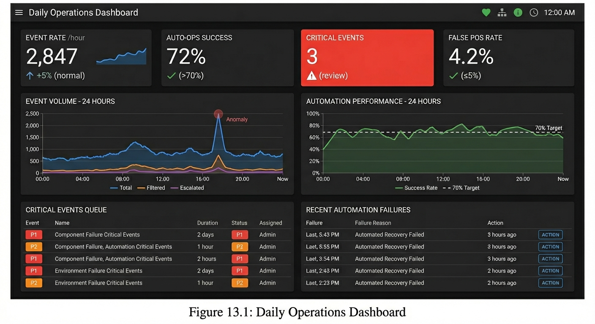
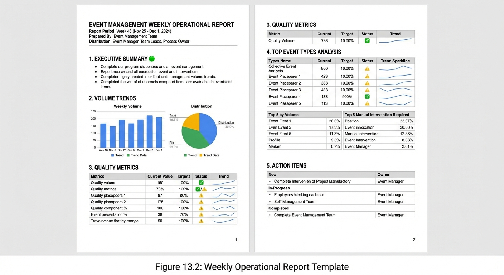
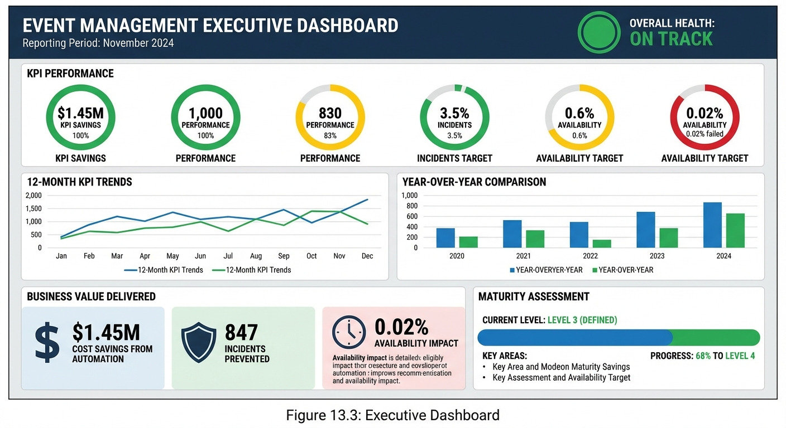

# Chapter 13: Reporting and Dashboards

## Introduction

Effective reporting and well-designed dashboards transform Event Management from a reactive operational activity into a strategic function that demonstrates measurable value to the organization. While the Event Management process generates enormous volumes of data through its continuous monitoring activities, the true value lies in converting this data into actionable insights that drive decision-making, process improvement, and resource optimization.

This chapter addresses Control Objective EM-C04, which requires organizations to define formal event data review sessions that include weekly operational reviews and monthly strategic reviews. These structured reviews ensure that Event Management metrics translate into continuous improvement by leading to proposals for action, assignments, and tracking of improvement initiatives. Without a robust reporting framework, organizations risk drowning in data while missing critical patterns, trends, and opportunities for optimization.

Reporting serves multiple audiences with distinct needs. Daily operational dashboards provide real-time visibility for Event Analysts and technical teams managing the flow of events. Weekly reports track operational trends and quality metrics for Event Managers and team leads. Monthly executive reports distill Key Performance Indicators (KPIs) and strategic value for IT leadership and business stakeholders. Each reporting level requires different data granularity, visualization approaches, and distribution strategies to maximize effectiveness and ensure that the right information reaches the right audience at the right time.

## The Event Management Reporting Framework

### Reporting Hierarchy and Governance

The Event Management reporting framework operates on a three-tier structure aligned with organizational decision-making levels. This hierarchy ensures that operational data flows upward through appropriate aggregation and analysis, while strategic insights flow downward to guide operational improvements.

At the operational tier, real-time dashboards provide continuous visibility into event flow, automation performance, and immediate quality concerns. These dashboards refresh at intervals ranging from 30 seconds to five minutes, enabling Event Analysts and technical teams to identify and respond to emerging patterns or system anomalies. The operational tier focuses on volume metrics, event distribution, automation success rates, and alert processing efficiency.

The tactical tier encompasses weekly reports that aggregate operational data to reveal patterns, trends, and quality metrics. These reports serve Event Managers, team leads, and process owners who need visibility into operational effectiveness over time. Weekly reporting focuses on volume trends, accuracy metrics, top event types, and identification of recurring issues that require attention or process adjustments.

The strategic tier comprises monthly executive reports and trend analysis that translate operational metrics into business value indicators. Monthly reports target IT leadership, business stakeholders, and governance boards who need to understand the performance of Event Management against established KPIs, the efficiency of incident detection, cost savings from automation, and the overall maturity and effectiveness of the process.

### Control Objective EM-C04: Formal Review Sessions

Control Objective EM-C04 establishes the governance requirement for formal event data review sessions. This control ensures that Event Management data is systematically reviewed, analyzed, and translated into improvement actions rather than simply collected and stored.

The control objective requires organizations to establish two distinct review cadences. Weekly operational reviews bring together Event Analysts, Event Managers, and relevant technical teams to examine operational metrics, identify quality issues, review false positive rates, assess correlation effectiveness, and address immediate process improvements. These sessions typically run 30-60 minutes and focus on actionable items that can be implemented within the current week.

Monthly strategic reviews engage IT leadership, Event Managers, and process stakeholders to evaluate KPI performance against targets, review trend analysis, assess maturity progression, evaluate cost savings and operational efficiency gains, and establish priorities for process enhancements. These reviews typically require 60-90 minutes and result in documented action items with assigned owners and target completion dates.

Both review types must follow a documented agenda structure, produce meeting minutes with action items, assign clear ownership for follow-up activities, establish target completion dates, and track completion status of previous action items. This structured approach transforms reporting from an information delivery mechanism into a continuous improvement engine.

### Integration with Control Objective EM-C08

While EM-C04 establishes the governance framework for review sessions, Control Objective EM-C08 specifically requires Event Management to provide trend analysis reports. EM-C08 mandates identification of patterns in event frequency, volume trends across event categories, correlation between events and incidents, and the number and percentage of events indicating availability issues.

Trend analysis reports serve as the analytical foundation for both weekly and monthly review sessions. These reports identify emerging patterns that may indicate deteriorating system health, monitoring gaps, or opportunities for additional automation. For example, an increasing trend in "disk space warning" events across multiple servers may indicate inadequate capacity planning processes, triggering engagement with Change Management to implement proactive capacity expansion before critical thresholds are reached.

The synergy between EM-C04 and EM-C08 creates a complete governance loop: EM-C08 ensures analytical rigor in identifying trends and patterns, while EM-C04 ensures organizational accountability for acting on those insights. Together, these controls transform Event Management from a data collection exercise into a strategic process that continuously improves service quality and operational efficiency.

## Daily Operational Dashboards

### Real-Time Monitoring Requirements

Daily operational dashboards serve as the primary interface for Event Analysts and technical teams managing the continuous flow of events through the Event Management process. These dashboards must provide immediate visibility into system health, event processing efficiency, and emerging patterns that require attention.

The fundamental principle of effective operational dashboard design is immediacy. Information must be current, accurate, and refreshed frequently enough to support real-time decision-making. For Event Management, this typically means refresh intervals of 30 seconds to five minutes, depending on event volume and organizational scale. High-volume environments processing thousands of events per hour require more frequent refreshes than smaller implementations.

Real-time dashboards must balance comprehensiveness with usability. Too much information creates cognitive overload, reducing the effectiveness of the dashboard. Too little information leaves analysts unable to identify patterns or anomalies. The optimal dashboard design presents critical metrics prominently while making detailed drill-down information available through intuitive navigation.

### Core Dashboard Components

Effective daily operational dashboards include several essential components that provide comprehensive visibility into Event Management operations. These components work together to give Event Analysts a complete operational picture at a glance.

**Event Volume Indicators** display the current rate of event ingestion, typically measured as events per minute or events per hour. This metric includes total events received, events after filtering, and events requiring escalation. Volume indicators should display current rates alongside baseline averages and historical trends, enabling analysts to quickly identify abnormal spikes or drops that may indicate monitoring issues or system problems.

**Automation Success Rate** shows the percentage of events resolved automatically without requiring escalation to Incident Management or manual intervention. This critical efficiency metric should be displayed as a gauge chart showing current performance against the target of 70% or higher for mature implementations. The dashboard should indicate when automation performance falls below acceptable thresholds, triggering investigation into failed auto-operations or automation coverage gaps.

**Critical Events Queue** provides visibility into high-priority events requiring immediate attention. This component displays Priority 1 and Priority 2 events with relevant details including event age, affected Configuration Item (CI), event category, and assigned analyst. Color coding by priority and age ensures that time-sensitive events receive appropriate attention.

**Processing Efficiency Metrics** track key performance indicators related to event handling speed and quality. These include average event processing time, percentage of events categorized within target timeframes, routing accuracy percentage, and false positive rate. These metrics validate that the Event Management process is functioning effectively and meeting quality targets.

**System Health Indicators** provide meta-monitoring of the Event Management infrastructure itself. These indicators track monitoring tool availability, event collection status, integration health with source systems, and database performance metrics. System health indicators ensure that the Event Management infrastructure is operating correctly and that events are being reliably captured and processed.

### Dashboard Design Best Practices

Dashboard effectiveness depends heavily on visual design choices that enhance readability and support rapid comprehension. Several design principles consistently improve operational dashboard usability.

**Visual Hierarchy** organizes information by importance, placing the most critical metrics in prominent positions where they naturally draw attention. The top-left quadrant typically receives highest visibility, followed by top-right, bottom-left, and bottom-right. Critical metrics like high-priority event counts and automation success rates should occupy these prime positions.

**Color Coding** leverages universal visual associations to communicate status instantly. Traffic light colors work well for status indicators: green for acceptable performance, yellow for warning conditions, and red for critical issues. However, color alone should never be the only indicator, as color-blind users require additional visual cues such as icons, patterns, or text labels.

**Consistent Formatting** applies uniform styling to similar elements, reducing cognitive load and improving comprehension speed. All gauges should use consistent scale ranges, all trend charts should use comparable time periods, and all tables should apply consistent column ordering and row styling.

**Actionable Information** ensures every dashboard element serves a purpose. Avoid including metrics that are interesting but not actionable. Every visualization should answer a specific operational question or enable a specific decision. If an analyst cannot describe what action they would take based on a metric, that metric probably does not belong on an operational dashboard.

*Figure 13.1: Daily Operations Dashboard - This mockup illustrates the layout and components of an effective daily operational dashboard. The top section displays critical real-time metrics (event rate, auto-ops success rate, critical events count, false positive rate). The middle section shows trend charts for volume patterns and automation performance over the past 24 hours. The bottom section provides detailed views of critical events queue and recent automation failures requiring attention.*

## Weekly Operational Reports

### Purpose and Audience

Weekly operational reports bridge the gap between real-time operational visibility and strategic monthly reviews. These reports aggregate daily operational data into meaningful patterns and trends that inform tactical decision-making and process adjustments.

The primary audience for weekly reports includes Event Managers who oversee process operations, team leads who manage Event Analyst teams, and technical specialists who configure and maintain Event Management tools. This audience requires detailed operational metrics with sufficient granularity to identify specific issues while remaining concise enough to review efficiently.

Weekly reports serve several critical functions. They identify emerging trends before they become significant problems, track operational quality metrics against targets, provide accountability for process adherence, document recurring issues requiring attention, and create a historical record of operational performance for trend analysis. Unlike real-time dashboards that support immediate operational decisions, weekly reports enable tactical planning and process refinement over time.

### Volume Trend Analysis

Volume trend analysis examines patterns in event flow to identify changes in system behavior, monitoring coverage, or operational conditions. Effective volume analysis compares current week performance against multiple baselines to provide context and identify significant deviations.

The weekly report should present total event volume broken down by event classification (Informational, Warning, Exception), showing absolute counts and percentage distribution. Comparing current week volume against the previous four weeks identifies immediate trends, while comparing against the same week from the previous quarter or year accounts for seasonal patterns or cyclical business activities.

Volume analysis should extend beyond simple totals to examine distribution patterns. The report should identify the top 10 event types by volume, showing count, percentage of total events, and change from previous week. This analysis helps Event Managers understand which systems or applications are generating the most events, whether that volume is appropriate, and whether filtering or correlation rules require adjustment.

Significant volume spikes or drops warrant investigation. A 25% or greater increase in specific event types may indicate deteriorating system health, monitoring configuration changes, or actual operational changes requiring attention. Conversely, significant decreases may suggest monitoring gaps, failed data collection, or successful implementation of automated remediation that reduces recurring events.

### Accuracy and Quality Metrics

Quality metrics validate that the Event Management process is functioning correctly and meeting accuracy targets established in the process design. These metrics directly relate to KPIs covered in Chapter 12 and provide accountability for operational performance.

**Categorization Accuracy** tracks the percentage of events correctly categorized according to the defined taxonomy. The target for this metric is 95% or higher, as established by Control Objective EM-C03. Categorization accuracy is typically measured through periodic sampling where a subject matter expert reviews a random sample of events and validates category assignments. The weekly report should display current accuracy percentage, trend over the previous four weeks, and identification of specific categories with recurring accuracy issues.

**Routing Accuracy** measures the percentage of events correctly routed to the appropriate resolution team or process. Like categorization accuracy, the target for this metric is 95% or higher. Routing accuracy is validated through feedback from receiving teams and periodic quality audits. Poor routing accuracy results in delays, rework, and degraded relationships with support teams who receive misdirected events.

**False Positive Rate** tracks the percentage of events that were processed but later determined to represent normal system behavior rather than actual issues requiring attention. The target for false positive rate is 5% or lower. High false positive rates indicate problems with event thresholds, filtering rules, or monitoring configuration. The weekly report should identify specific event types with high false positive rates and track improvement initiatives implemented to reduce noise.

**Correlation Effectiveness** measures the percentage reduction in alert volume achieved through event correlation rules. Effective correlation should reduce alert volume by more than 50%. The weekly report shows total alerts before and after correlation, reduction percentage, and identification of correlation rule sets that are underperforming or requiring adjustment.

### Top Event Types Analysis

Understanding which events are most prevalent enables targeted process improvements and resource allocation decisions. The weekly report should identify and analyze the top event types across multiple dimensions.

The **Top 10 Event Types by Volume** table lists the most frequently occurring events with counts, percentage of total volume, and comparison to the previous week. This analysis identifies high-volume event sources that may benefit from automation, filtering refinement, or enhanced correlation. For example, if "log file rotation successful" events represent 15% of total volume, filtering rules might appropriately suppress these informational events that provide minimal operational value.

The **Top Event Types by Manual Intervention Required** table identifies events most frequently requiring escalation to Incident Management or manual resolution. These events represent automation opportunities. If "database connection pool exhaustion" events consistently require manual intervention, developing automated remediation (such as restarting the connection pool service) could improve automation success rate and reduce operational burden.

The **Top Event Types by False Positives** table identifies event types frequently classified as false positives during review. These events require threshold adjustments, enhanced filtering, or correlation rule refinements to reduce noise. For example, if CPU utilization warning events are frequently classified as false positives during batch processing windows, time-based filtering or context-aware thresholds can eliminate unnecessary alerts.

*Figure 13.2: Weekly Operational Report Template - This document layout shows the standard structure for weekly operational reports, including executive summary, volume trends, quality metrics, top event types analysis, and action items. The template uses consistent formatting and effective visualization of metrics with trend indicators.*

## Monthly Executive Reports

### Strategic Reporting Focus

Monthly executive reports translate operational metrics into strategic business value indicators that demonstrate Event Management effectiveness to IT leadership and business stakeholders. These reports focus less on operational detail and more on KPI performance, efficiency gains, cost savings, and maturity progression.

The executive report audience includes IT Directors and VPs, CIOs and CTOs, business unit leaders, and governance boards. This audience requires high-level summaries, clear performance indicators against established targets, evidence of business value delivery, and visibility into improvement initiatives. Executive reports should be consumable in 10-15 minutes, with detailed appendices available for readers who require additional context.

Strategic reporting emphasizes trends over point-in-time metrics. Rather than reporting that automation success rate was 73% in the current month, the executive report shows that automation improved from 68% to 73% over the past quarter, exceeding the 70% target and demonstrating continuous improvement. This trend-focused approach provides context and demonstrates trajectory, which is more meaningful for strategic decision-making than isolated data points.

### KPI Performance Against Targets

The monthly executive report presents all Key Performance Indicators defined in Chapter 12, showing current performance, established targets, and trend direction. Each KPI should be visualized using gauge charts or status indicators that immediately communicate whether performance is meeting, exceeding, or missing targets.

**Auto-operations Success Rate** displays the percentage of events resolved automatically without escalation. The target for mature implementations is 70% or higher. The monthly report shows current month performance, three-month trend, and comparison to the same month in the previous year. If performance falls below target, the report should identify the primary causes and improvement initiatives in progress.

**Efficiency of Detection** measures the percentage of incidents that were detected proactively by Event Management rather than reported by users or discovered through other means. The target for this KPI is 60% or higher. High efficiency of detection demonstrates that monitoring coverage is comprehensive and that Event Management is fulfilling its primary purpose of identifying issues before users are impacted. Low efficiency suggests monitoring gaps requiring attention.

**False Positive Rate** shows the percentage of events determined to represent normal behavior rather than actual issues. The target is 5% or lower. High false positive rates erode analyst confidence, contribute to alert fatigue, and waste resources processing events that provide no operational value. The monthly report tracks trend direction and identifies improvement initiatives such as threshold tuning or enhanced filtering.

**Categorization Accuracy** and **Routing Accuracy** both target 95% or higher performance. These quality metrics validate that events are being correctly classified and directed to appropriate resolution resources. The monthly report presents these as simple percentages with trend indicators and notation of any corrective actions implemented during the reporting period.

**Correlation Effectiveness** measures alert volume reduction achieved through correlation rules, targeting greater than 50% reduction. The monthly report shows total alerts before correlation, total after correlation, reduction percentage, and year-over-year comparison demonstrating improvement as correlation capabilities mature.

### Efficiency and Value Metrics

Beyond core KPIs, the monthly executive report should quantify the business value delivered by Event Management through efficiency gains and cost avoidance. These value metrics translate operational improvements into financial and business impact terms that resonate with executive audiences.

**Cost Savings from Automation** quantifies the financial impact of automated event resolution. This calculation multiplies the number of events resolved automatically by the average cost per manual incident resolution. For example, if 50,000 events were auto-resolved during the month and average incident handling costs $25, automation delivered $1.25 million in cost avoidance. While this calculation makes assumptions about the percentage of auto-resolved events that would have escalated to incidents, it provides a reasonable estimate of automation value.

**Incident Reduction Through Proactive Detection** measures the number of incidents prevented by proactive event detection and automated remediation. Events that trigger automated responses preventing condition escalation represent incidents avoided. For example, automated disk space cleanup that prevents disk full conditions represents incidents that would have occurred without proactive intervention.

**Mean Time to Detect (MTTD) Improvement** tracks reduction in the time between when an issue begins and when it is detected by monitoring systems. As monitoring coverage improves and detection becomes more sophisticated, MTTD decreases. The monthly report should show current MTTD, trend over the previous six months, and correlation with service availability improvements.

**Resource Efficiency Gains** measure improvements in analyst productivity and workload management. As automation increases and false positives decrease, Event Analysts can manage higher event volumes with the same staffing levels. The monthly report can present metrics such as events processed per analyst FTE, showing productivity improvements as the process matures.

### Trend Analysis and Maturity Assessment

The monthly executive report should include trend analysis that examines Event Management performance over extended time periods, identifying patterns and assessing process maturity progression. This analysis provides strategic context and demonstrates continuous improvement.

Trend analysis should span at least six months, preferably twelve months, to provide sufficient data for pattern identification while remaining relevant to current operational conditions. Key trends to analyze include automation success rate progression, correlation effectiveness improvement, false positive rate reduction, detection efficiency gains, and volume trends across major event categories.

Maturity assessment evaluates Event Management against the maturity model presented in Chapter 14. The monthly report should identify the current maturity level, characteristics demonstrated that validate this level, gaps or requirements for advancement to the next level, and improvement initiatives in progress to address gaps. This assessment provides a roadmap for continuous improvement and demonstrates systematic progression toward operational excellence.

For example, an organization demonstrating 72% automation success rate, proactive event handling, established metrics and dashboards, and a continuous improvement culture would be assessed at Level 4: Measured. The report would identify that advancement to Level 5: Optimized requires implementing advanced analytics and AI/ML capabilities, enhancing predictive event management, and further integration with business service mapping.

*Figure 13.3: Executive Dashboard - This strategic dashboard is designed for IT leadership, displaying KPI performance gauges with color-coded status indicators, 12-month trend charts, year-over-year comparisons, business value delivered (cost savings, incidents prevented), and current maturity assessment level. The dashboard emphasizes high-level insights optimized for strategic decision-making.*

## Trend Analysis and Activity 5.6

### The Role of Trend Analysis in Continuous Improvement

Trend analysis represents the analytical engine that powers continuous improvement in Event Management. While individual metrics provide point-in-time assessments, trend analysis reveals patterns, identifies root causes, predicts future conditions, and guides improvement priorities. Activity 5.6 within the Event Management process specifically addresses trend analysis as a core component of the Review and Close Event activity.

The key tasks within Activity 5.6 include performing trend analysis by reviewing event frequency, volume patterns, and category distribution, and reviewing Event effectiveness by assessing false positive rates and correlation performance. These tasks transform raw operational data into actionable insights that drive process refinement and optimization.

Effective trend analysis requires establishing baseline metrics during initial implementation, collecting consistent data over extended periods, applying statistical analysis to identify significant patterns, correlating trends with operational changes or incidents, and documenting findings with recommendations for improvement. Without this systematic approach, trend analysis becomes anecdotal observation rather than rigorous data-driven investigation.

### Frequency and Volume Analysis

Frequency analysis examines how often specific events occur and how these rates change over time. Increasing frequency of particular event types may indicate deteriorating system health, growing infrastructure scale, monitoring configuration changes, or successful detection of previously unmonitored conditions.

For example, a gradual increase in "memory utilization warning" events across database servers over several months may indicate inadequate capacity planning or memory leak issues in database applications. This trend triggers engagement with Capacity Management and application development teams to address root causes before critical thresholds are reached and incidents occur.

Volume analysis examines overall event counts and distribution across categories, priorities, and sources. Healthy Event Management implementations typically show increasing volume of Informational events as monitoring coverage expands, decreasing volume of Exception events as automation and proactive management mature, and stable or slightly increasing Warning events reflecting comprehensive monitoring of potential issues.

Unexpected volume patterns warrant investigation. A sudden 50% increase in total event volume may indicate monitoring configuration changes, infrastructure expansion, or actual operational issues requiring attention. Similarly, an unexpected decrease in events from specific systems may suggest monitoring failures or data collection problems rather than improved system health.

### Category Distribution and Pattern Recognition

Category distribution analysis examines the proportion of events across the defined event categorization taxonomy. Control Objective EM-C03 requires tracking distribution of event types by category, providing visibility into which systems, applications, or infrastructure components generate the most operational events.

The monthly trend report should present category distribution as both absolute counts and percentages, showing current month distribution compared to historical averages. Significant shifts in distribution may indicate changes in application behavior, infrastructure modifications, monitoring coverage adjustments, or emerging operational patterns requiring investigation.

Pattern recognition extends beyond simple volume trends to identify correlations between events and operational conditions. For example, correlation analysis might reveal that network latency warning events increase by 40% during the first week of each month, corresponding with month-end batch processing jobs. This pattern suggests opportunity for predictive alerting or automated capacity expansion during known high-utilization periods.

Advanced pattern recognition techniques leverage historical data to identify seasonal patterns, cyclical trends based on business activities, correlation between event types and subsequent incidents, and leading indicators of degraded service conditions. Organizations at Level 4 (Measured) or Level 5 (Optimized) maturity may employ machine learning algorithms to automate pattern recognition and predictive analysis.

### Review Event Effectiveness

Activity 5.6 specifically requires reviewing Event effectiveness to assess whether the Event Management process is functioning optimally. This effectiveness review evaluates multiple dimensions of process performance.

**False Positive Rate Review** examines events initially classified as requiring attention but later determined to represent normal system behavior. The trend report should identify event types with consistently high false positive rates, analyze root causes such as inappropriate thresholds or insufficient context, recommend corrective actions including threshold adjustments or filtering rules, and track improvement following implementation of corrective measures.

**Correlation Effectiveness Review** assesses whether correlation rules are successfully reducing alert volume while preserving critical information. The trend report should evaluate correlation rules that are underperforming against targets, identify opportunities for additional correlation based on event patterns, recommend rule refinements or new correlation scenarios, and measure improvement in correlation effectiveness over time.

**Coverage Gap Identification** examines whether monitoring coverage is comprehensive or whether gaps exist that allow issues to go undetected. The trend report should analyze incidents that were not preceded by events, identifying monitoring gaps, compare efficiency of detection trends to identify declining proactive detection, and recommend monitoring enhancements to close coverage gaps.

The effectiveness review generates specific recommendations that feed back into Activity 2: Create and Maintain EM Solutions, creating the continuous improvement feedback loop that drives process maturity and operational excellence.

## Dashboard Design Best Practices

### Information Architecture and Layout

Effective dashboard design begins with clear understanding of audience needs, decision-making requirements, and information consumption patterns. Different audiences require different information architectures, and dashboard design must reflect these distinctions.

**Audience-Driven Design** ensures each dashboard serves specific user needs. Operational dashboards for Event Analysts prioritize real-time status, critical event queues, and processing efficiency metrics. Management dashboards for Event Managers emphasize quality metrics, trend indicators, and performance against targets. Executive dashboards for IT leadership focus on KPIs, business value indicators, and strategic trends.

**Logical Grouping** organizes related information together, reducing cognitive load and improving comprehension speed. Dashboards should group metrics by theme such as volume metrics, quality metrics, efficiency metrics, and system health indicators. Within each group, metrics should be arranged by importance, with the most critical information in the most prominent positions.

**Progressive Disclosure** presents high-level summaries initially while making detailed information available through drill-down capabilities. The dashboard landing view should provide complete operational awareness at a glance, with interactive elements enabling users to access underlying details, historical trends, or related information as needed.

**Consistent Navigation** applies uniform interaction patterns across all dashboards. If clicking a metric value opens detailed drill-down information in one dashboard, this pattern should apply consistently across all dashboards. Consistent navigation reduces training requirements and improves user efficiency.

### Visualization Selection and Usage

Choosing appropriate visualizations for different data types significantly impacts dashboard effectiveness. Different visualization types serve different purposes, and matching visualization to data type improves comprehension and supports better decision-making.

**Gauges and Indicators** work well for KPIs with established targets, showing current performance and its relationship to acceptable ranges. Gauges communicate status instantly through visual position and color coding. However, gauges consume significant dashboard real estate, so they should be reserved for the most critical metrics.

**Trend Lines** effectively display changes over time, revealing patterns and trajectory. Line charts work well for time-series data such as event volume over hours or days, automation success rate over weeks or months, and false positive rate trends over quarters. Multiple lines on the same chart enable comparison between metrics or between current and historical performance.

**Bar Charts** excel at comparison between categories, showing relative magnitudes clearly. Bar charts work well for comparing event volumes across categories, displaying top event types by count, and showing metric performance across different teams or infrastructure components.

**Heat Maps** effectively display two-dimensional data, using color intensity to represent magnitude. Heat maps work well for priority matrices showing Impact × Urgency = Priority, time-of-day analysis showing event volume patterns across hours and days, and capacity utilization across multiple systems.

**Tables** present detailed information with precision when exact values matter more than visual patterns. Tables work well for critical event queues requiring specific details, accuracy metrics where precise percentages matter, and action item lists with assigned owners and due dates.

### Performance and Usability Considerations

Dashboard performance directly impacts usability. Slow-loading dashboards frustrate users and reduce adoption, while poorly performing dashboards may miss critical events during load delays.

**Optimized Data Queries** ensure rapid dashboard refresh by using appropriate database indexing, aggregating data at appropriate intervals, caching frequently accessed calculations, and limiting query result sets to necessary information. Real-time dashboards should refresh in under five seconds to maintain operational utility.

**Responsive Design** ensures dashboards display effectively across different screen sizes and resolutions. Event Management teams often monitor dashboards on large wall-mounted displays, standard workstation monitors, and mobile devices. Responsive design adapts layout and font sizes to maintain readability across viewing contexts.

**Accessibility Standards** ensure dashboards serve all users effectively, including those with visual impairments or color blindness. Accessible dashboards use sufficient color contrast, provide text alternatives for visual information, support keyboard navigation, and include descriptive labels for all metrics and visualizations.

## Report Distribution and Audience Management

### Defining Report Audiences and Cadence

Effective report distribution ensures that the right information reaches the right audience at the right time while avoiding information overload. Different organizational roles require different reports at different frequencies.

**Table 13.1: Reporting Cadence and Audience Matrix**

| Report Type | Primary Audience | Cadence | Delivery Method | Key Content |
|-------------|------------------|---------|-----------------|-------------|
| Real-Time Dashboard | Event Analysts, Technical Teams | Continuous (30-sec refresh) | Dashboard Display | Event volume, critical queues, automation status, system health |
| Daily Summary | Event Manager, Team Leads | Daily (morning) | Email, Dashboard | Previous day metrics, critical events resolved, automation performance |
| Weekly Operational Report | Event Manager, Team Leads, Process Owner | Weekly (Monday morning) | Email, Portal | Volume trends, accuracy metrics, top event types, action items |
| Monthly Executive Report | IT Leadership, CIO, Governance Board | Monthly (1st week) | Email, Presentation | KPI performance, business value, trend analysis, maturity assessment |
| Ad-Hoc Analysis | Stakeholders as needed | As requested | Email, Document | Specific deep-dive analysis, root cause investigation, improvement planning |

*Caption:* This matrix defines the reporting cadence, audience, and delivery method for each report type in the Event Management reporting framework. Different audiences require different information at different frequencies. Daily operational reports serve tactical needs while monthly executive reports address strategic requirements.

### Distribution Channels and Automation

Manual report generation and distribution consumes significant time and introduces opportunities for delays or errors. Automated distribution ensures consistent delivery and enables Event Management staff to focus on analysis rather than report production.

**Email Distribution** remains the most common delivery method for scheduled reports, offering broad compatibility and enabling recipients to archive reports for future reference. Automated email distribution can include PDF attachments for formal reports, embedded HTML content for quick consumption, and links to interactive dashboards for detailed drill-down.

**Portal Publishing** provides centralized access to current and historical reports through an internal Event Management portal or ITSM tool interface. Portal publishing enables self-service access to reports, search and filtering capabilities, subscription management for automated notifications, and version control for report templates.

**Dashboard Integration** embeds report content directly into operational or executive dashboards, eliminating separate distribution requirements. Dashboard integration provides real-time or near-real-time access to information, reduces email volume, and supports interactive exploration of underlying data.

**Presentation Formats** for executive reviews require additional formatting and visualization refinement compared to operational reports. Monthly executive reports may be distributed both as standalone documents and as presentation slide decks formatted for governance meetings or leadership reviews.

### Report Customization and Filtering

Different stakeholders within the same audience category may require customized views based on their specific responsibilities or scope of authority. Infrastructure teams need event reports focused on infrastructure components, application teams need reports focused on application events, and business unit leaders need reports focused on business services relevant to their areas.

**Role-Based Filtering** automatically customizes report content based on recipient role and responsibility. Application support teams receive weekly reports showing events from their supported applications, while network teams receive reports focused on network infrastructure events. Role-based filtering reduces information overload and improves report relevance.

**Service-Based Views** organize events and metrics according to business services rather than technical infrastructure. Service-based reporting is particularly valuable for executive audiences who think in terms of business capabilities rather than servers and applications. For example, an "Order Management Service" view would aggregate events from web servers, application servers, databases, and integration middleware supporting that service.

**Threshold-Based Distribution** sends reports or alerts only when specific conditions are met, reducing notification volume and focusing attention on significant issues. For example, a threshold rule might distribute a special report to IT leadership only when efficiency of detection falls below 55% for two consecutive weeks, indicating significant monitoring gaps requiring executive attention.

## Using Reports for Continuous Improvement

### Translating Data into Action

The ultimate purpose of Event Management reporting is to drive continuous improvement by identifying issues, quantifying performance, and guiding optimization efforts. Reports that present information without driving action represent missed opportunities for improvement.

Each report should conclude with an **Action Items** section that translates data insights into specific improvement initiatives. Action items must include clear description of the issue or opportunity, specific recommended action, assigned owner responsible for implementation, target completion date, and success criteria for measuring improvement.

For example, a weekly report identifying that "database connection pool exhaustion" events require manual resolution 85% of the time would include an action item: "Develop automated remediation script for connection pool exhaustion events. Owner: Database Team Lead. Target: Two weeks. Success criteria: 70% of connection pool events auto-resolved after implementation."

Action item tracking provides accountability and ensures that improvement initiatives progress to completion rather than being acknowledged and forgotten. Subsequent reports should include an action item status section showing items completed since the last report, items in progress with completion percentage, items overdue requiring attention, and new items identified in the current reporting period.

### Feedback Loop with Activity 5.8

Activity 5.8 within the Event Management process focuses on updating EM Solutions based on lessons learned from trend analysis and effectiveness reviews. This activity creates the feedback loop that enables continuous improvement by applying insights gained from reporting and analysis back into the Event Management configuration and procedures.

The feedback loop operates through several mechanisms. Trend analysis identifies patterns requiring configuration adjustments such as threshold tuning, filter rule updates, or correlation rule enhancements. Effectiveness reviews reveal quality issues requiring attention such as categorization rule refinements, routing logic updates, or training requirements for Event Analysts. Action items from review sessions drive specific improvement initiatives such as automation script development, monitoring coverage expansion, or integration enhancements.

The reporting framework provides the measurement capability to validate whether improvement initiatives achieve their intended results. After implementing a new correlation rule set designed to reduce alert volume by 40%, subsequent reports validate actual reduction achieved and identify any unintended consequences such as false negatives or loss of critical information.

This continuous measurement and refinement cycle distinguishes mature Event Management implementations from basic implementations. Organizations operating at Level 4 (Measured) or Level 5 (Optimized) maturity leverage comprehensive reporting and systematic feedback loops to continuously optimize Event Management effectiveness and business value delivery.

### Establishing a Continuous Improvement Culture

Effective reporting supports development of a continuous improvement culture where Event Management staff, technical teams, and leadership all recognize that optimization is an ongoing journey rather than a destination. This cultural shift requires visible leadership commitment, systematic improvement processes, recognition of improvement achievements, and transparent communication of challenges and setbacks.

Monthly review sessions provide forums for celebrating improvement achievements such as reaching 70% automation success rate milestone, reducing false positive rate from 8% to 4%, or improving efficiency of detection from 55% to 62%. Recognizing these achievements reinforces the value of continuous improvement and motivates continued effort.

Review sessions also provide forums for honest discussion of challenges and obstacles such as declining correlation effectiveness due to infrastructure changes, increasing false positives from new monitoring implementations, or resource constraints limiting automation development. Transparent discussion of challenges builds trust and enables collaborative problem-solving.

The reporting framework itself evolves over time as the organization gains experience and matures. Initial reports may focus heavily on volume metrics and basic operational indicators. As the process matures, reporting sophistication increases to include predictive analytics, business service mapping, cost modeling, and integration with broader ITSM metrics. This evolution demonstrates organizational learning and continuous improvement of the measurement capability itself.

## Key Takeaways

- Control Objective EM-C04 requires formal event data review sessions including weekly operational reviews and monthly strategic reviews to ensure continuous improvement.
- The reporting framework operates on three tiers: operational dashboards for real-time visibility, weekly reports for tactical management, and monthly executive reports for strategic decision-making.
- Daily operational dashboards must provide real-time visibility into event volume, automation success rate, critical events requiring attention, processing efficiency metrics, and system health indicators.
- Weekly reports track volume trends, accuracy metrics (categorization, routing, false positives), correlation effectiveness, and top event types to identify patterns and quality issues.
- Monthly executive reports translate operational metrics into business value indicators including KPI performance, efficiency of detection, cost savings from automation, and maturity assessment.
- Activity 5.6 (Trend Analysis) provides the analytical foundation for reporting by reviewing event frequency, volume patterns, category distribution, false positive rates, and correlation effectiveness.
- Control Objective EM-C08 requires trend analysis reports that identify patterns, volume trends, and the number and percentage of events indicating availability issues.
- Effective dashboard design requires audience-driven information architecture, appropriate visualization selection, logical grouping of related metrics, and progressive disclosure of detailed information.
- Report distribution should be automated using role-based filtering, service-based views, and threshold-based alerting to ensure relevant information reaches appropriate audiences.
- The reporting framework creates a feedback loop with Activity 5.8 (Update EM Solutions) that translates insights from trend analysis into concrete process improvements and configuration refinements.

## Summary

Reporting and dashboards transform Event Management from a reactive operational activity into a strategic function that demonstrates measurable business value. The reporting framework operates on three distinct tiers that serve different audiences with different needs: real-time operational dashboards for Event Analysts and technical teams, weekly operational reports for Event Managers and team leads, and monthly executive reports for IT leadership and business stakeholders.

Control Objective EM-C04 establishes the governance requirement for formal review sessions that ensure Event Management data is systematically analyzed and translated into improvement actions. Weekly operational reviews focus on tactical issues, quality metrics, and immediate process improvements, while monthly strategic reviews evaluate KPI performance, trend analysis, and maturity progression. These structured review sessions, combined with Control Objective EM-C08's requirement for trend analysis reports, create a complete governance loop that drives continuous improvement.

Effective reporting requires careful attention to dashboard design, visualization selection, and information architecture. Different audiences require different presentations of information, and matching report design to audience needs significantly impacts effectiveness. Real-time dashboards emphasize immediacy and operational awareness, weekly reports focus on trends and quality metrics, and monthly executive reports translate technical metrics into business value indicators that resonate with leadership audiences.

The ultimate purpose of Event Management reporting extends beyond information delivery to drive continuous improvement through the feedback loop with Activity 5.8. Trend analysis identifies patterns and opportunities, effectiveness reviews reveal quality issues and gaps, and action items translate insights into concrete improvement initiatives. This systematic approach to measurement and refinement distinguishes mature Event Management implementations and enables organizations to demonstrate quantifiable value from their Event Management investments.

Chapter 14 examines Continuous Improvement and Process Maturity, building on the reporting foundation established in this chapter to explore how organizations systematically advance Event Management capabilities from initial implementation through operational excellence at Level 5 (Optimized) maturity.

## Review Questions

1. What are the two types of formal review sessions required by Control Objective EM-C04, and what are the key differences in their focus and audience?

2. Describe the three-tier reporting hierarchy in Event Management and explain how each tier serves different decision-making needs.

3. What are the five core components that should be included in an effective daily operational dashboard? Explain the purpose of each component.

4. Explain the relationship between Control Objectives EM-C04 and EM-C08. How do these controls work together to ensure continuous improvement?

5. What is Activity 5.6 in the Event Management process, and what are its key tasks related to trend analysis?

6. How should monthly executive reports translate operational metrics into business value indicators? Provide three specific examples of value metrics that should be included.

7. What is the target for correlation effectiveness, and how is this metric calculated? What does poor correlation effectiveness indicate?

8. Describe the concept of "progressive disclosure" in dashboard design and explain why this principle improves dashboard effectiveness.

9. What is the feedback loop between trend analysis reporting and Activity 5.8 (Update EM Solutions)? How does this loop drive continuous improvement?

10. Why is role-based filtering important for report distribution? Provide an example of how different teams might require customized views of the same underlying event data.

---

**Chapter 13 References**
- ITIL 4 Framework: Event Management Process
- Control Objectives for Event Management (EM-C04, EM-C08)
- Event Management Process Activities (Activity 5.6, Activity 5.8)

---

## Chapter Navigation

| Previous | Next |
|----------|------|
| [Chapter 12: Key Performance Indicators](/EventManagementHandbook/chapters/12-key-performance-indicators/) | [Chapter 14: Maturity Model](/EventManagementHandbook/chapters/14-maturity-model/) |

---
