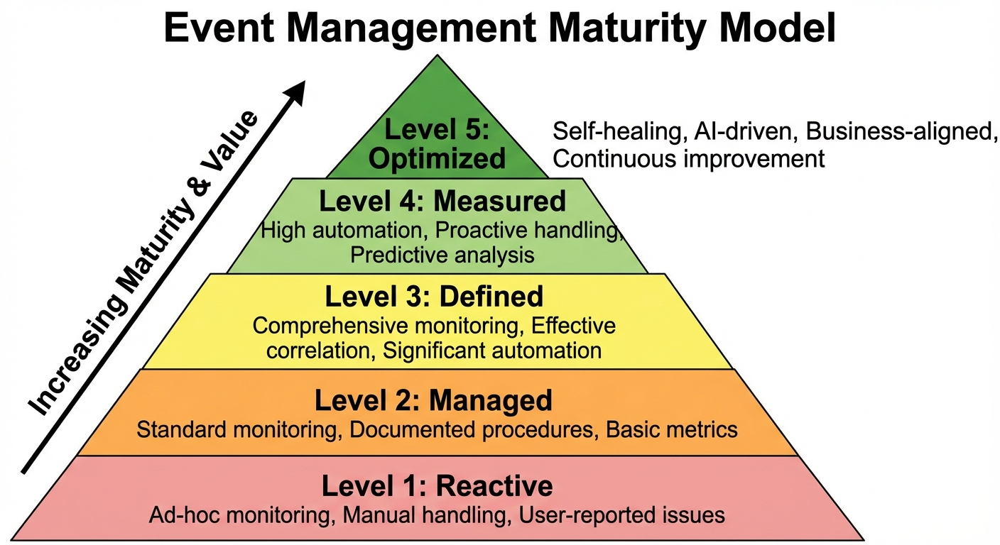
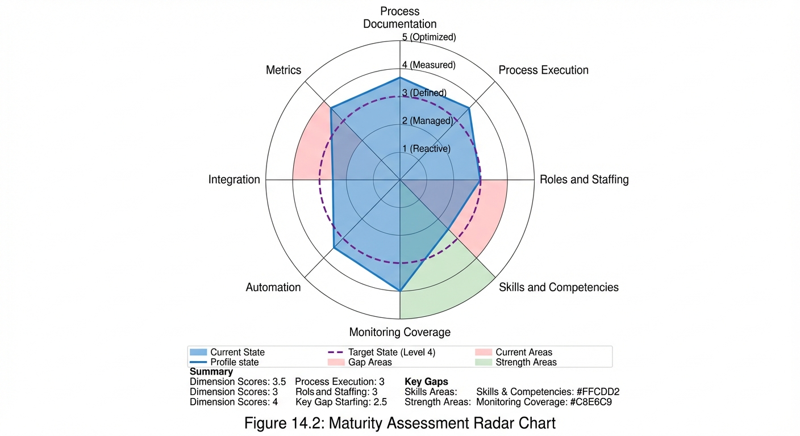

# Chapter 14: Maturity Model

## Introduction

The Event Management (EM) maturity model provides a structured framework for organizations to assess their current capabilities, identify improvement opportunities, and chart a path toward operational excellence. Understanding maturity levels is critical for setting realistic goals, prioritizing investments, and measuring progress over time. This chapter presents a comprehensive five-level maturity model that aligns with industry best practices and provides clear guidance for advancement.

Maturity in Event Management reflects an organization's ability to proactively detect, manage, and resolve operational events with increasing levels of automation, effectiveness, and business alignment. Organizations typically progress through distinct maturity stages, from reactive, ad-hoc event handling to highly optimized, AI-driven operations. Each level represents a significant improvement in capabilities, automation rates, and business value delivered.

The maturity model serves multiple purposes within an organization. First, it provides a diagnostic framework for self-assessment, enabling teams to objectively evaluate their current capabilities against industry benchmarks. Second, it establishes clear targets for progression, defining the characteristics and capabilities expected at each level. Third, it informs strategic planning by highlighting the focus areas, investments, and cultural changes required to advance. Finally, it connects operational metrics to strategic outcomes, ensuring that Key Performance Indicators (KPIs) align with maturity objectives.

*Figure 14.1: Event Management Maturity Model - This five-level maturity pyramid illustrates the progression from reactive, ad-hoc event handling (Level 1) to optimized, AI-driven operations (Level 5). Each level builds upon previous capabilities: Level 1 (Reactive) features ad-hoc monitoring and manual handling; Level 2 (Managed) introduces standard monitoring and documented procedures; Level 3 (Defined) implements comprehensive monitoring and effective correlation; Level 4 (Measured) achieves high automation and proactive handling with predictive analysis; Level 5 (Optimized) delivers self-healing, AI-driven, business-aligned continuous improvement. The pyramid shows increasing maturity and value as organizations progress upward through systematic capability development.*

## Understanding Maturity Models

A maturity model is a structured framework that describes the evolutionary stages of process capability and organizational effectiveness. In the context of Event Management, the maturity model assesses how well an organization detects, evaluates, responds to, and learns from operational events. The model is based on the fundamental principle that process maturity evolves through predictable stages, each building upon the foundation established at the previous level.

### Core Principles of Process Maturity

Process maturity is characterized by several fundamental attributes that distinguish higher-level organizations from those at earlier stages. Understanding these principles helps organizations recognize what true maturity entails and avoid the pitfall of focusing solely on tactical improvements while neglecting systemic capabilities.

**Repeatability and Consistency:** At lower maturity levels, outcomes depend heavily on individual heroics and tribal knowledge. Mature processes produce consistent results regardless of which team members are involved. Standard procedures, documented workflows, and automated enforcement mechanisms ensure repeatability.

**Proactive versus Reactive Operations:** Maturity transforms operations from a reactive "firefighting" mode to proactive prevention and prediction. Initial-level organizations discover problems when users report outages. Optimized organizations predict and prevent issues before they occur, using trend analysis, capacity modeling, and predictive analytics.

**Data-Driven Decision Making:** Higher maturity correlates with increased reliance on metrics, analysis, and evidence-based decisions rather than intuition or anecdotal experience. Mature organizations establish comprehensive KPIs, analyze trends systematically, and use data to drive continuous improvement.

**Integration and Orchestration:** Process maturity reflects the degree to which Event Management integrates seamlessly with other IT Service Management (ITSM) processes, including Incident, Problem, and Change Management. Mature organizations view EM not as an isolated function but as the central nervous system of IT operations.

**Automation and Efficiency:** Maturity progression correlates directly with increasing automation rates. Organizations advance from manual event handling to scripted responses, orchestrated workflows, and eventually autonomous operations with AI-driven decision-making.

### Benefits of Using a Maturity Model

Implementing a maturity model framework provides significant strategic and operational benefits that extend beyond simple process assessment. Organizations that adopt maturity models gain clarity, focus, and measurable progress toward operational excellence.

A maturity model establishes a **common language** for discussing process capabilities across the organization. Technical teams, management, and business stakeholders can reference maturity levels to communicate current state, target state, and progress. This shared vocabulary facilitates strategic planning and investment decisions.

The model provides **objective assessment criteria** that remove ambiguity from capability evaluations. Rather than subjective opinions about process effectiveness, organizations can use specific characteristics, KPI targets, and capability definitions to determine their maturity level. This objectivity enables benchmarking against industry standards and peer organizations.

By defining the **specific focus areas** for each level, the maturity model helps organizations prioritize improvement initiatives. Teams know which capabilities to build first, avoiding the common mistake of attempting advanced optimizations before establishing foundational practices. This staged approach maximizes return on investment and reduces implementation risk.

The maturity model serves as a **motivation tool** by demonstrating achievable progress. Organizations can celebrate advancement from one level to the next, maintaining momentum for continuous improvement. The model also helps justify investments by connecting process maturity to business outcomes and KPI improvements.

## The Five Maturity Levels

The Event Management maturity model defines five distinct levels, each representing a significant advancement in organizational capability. These levels provide a roadmap for progression from ad-hoc, reactive operations to highly optimized, autonomous event management.

### Level 1: Reactive (Initial)

Organizations at Level 1 exhibit ad-hoc and inconsistent event management practices. Operations are primarily reactive, with most issues discovered when users report problems rather than through proactive monitoring. This level represents the starting point for most organizations beginning their Event Management journey.

#### Characteristics

Level 1 organizations demonstrate several defining characteristics that distinguish this maturity stage. Event detection is **minimal and fragmented**, with limited monitoring deployed across the infrastructure. Monitoring that does exist typically focuses only on infrastructure components deemed most critical, leaving significant gaps in coverage. Configuration is inconsistent across systems, with each team or administrator applying their own standards and thresholds.

Event handling is **largely manual**, requiring human intervention for most activities. Analysts manually review alerts, investigate root causes, and execute remediation steps without the benefit of automation or standardized procedures. This manual approach is time-consuming, error-prone, and highly dependent on individual expertise.

Documentation is **sparse or non-existent**. Procedures may exist in the form of personal notes or informal knowledge shared among team members, but formal, centralized documentation is not maintained. New team members rely on shadowing experienced analysts rather than formal training materials.

The organization lacks **centralized event management**, with alerts scattered across multiple tools, email inboxes, and system logs. There is no single pane of glass for viewing operational status. Correlation between related events is manual and inconsistent, leading to duplicate efforts and inefficient problem resolution.

Metrics are **not formally tracked**. The organization may have anecdotal awareness of event volumes or response times, but systematic measurement and reporting do not occur. Without metrics, there is no objective way to assess performance or identify improvement opportunities.

User-reported incidents significantly **outnumber events detected** by monitoring. The organization operates in a reactive mode, addressing problems after they have already impacted users or business operations. This reactive posture damages user satisfaction and increases incident costs.

#### Focus Areas for Advancement

Organizations seeking to advance from Level 1 to Level 2 must focus on establishing foundational capabilities that enable repeatable processes and consistent operations.

**Establish Basic Monitoring Coverage:** The first priority is deploying monitoring agents and tools to achieve visibility into critical infrastructure. Focus on production systems supporting key business services, starting with servers, network devices, databases, and applications. Configure basic availability and performance monitoring using vendor-recommended thresholds.

**Document Event Procedures:** Create formal documentation for event handling procedures, including detection, triage, escalation, and resolution steps. Document known event types, their symptoms, and standard responses. Establish a knowledge base accessible to all team members. Use templates to ensure consistency across documentation.

**Train the Team:** Provide formal training on Event Management concepts, tools, and procedures. Ensure all team members understand the difference between Informational, Warning, and Exception events. Train analysts on escalation criteria and integration with Incident Management. Establish role-based competencies and assessment criteria.

**Deploy a Centralized Event Platform:** Implement a centralized event management system that aggregates alerts from distributed monitoring sources. This platform becomes the single source of truth for operational events. Configure basic event categorization and priority assignment. Integrate with the Incident Management ticketing system to enable formal escalation workflows.

**Establish Process Governance:** Appoint an Event Management Process Owner responsible for overall process effectiveness. Define basic roles and responsibilities for Event Analysts, Event Designers, and management. Establish regular team meetings to review event handling effectiveness and share lessons learned.

#### Key KPIs and Targets

At Level 1, organizations struggle to achieve even basic KPI targets due to limited monitoring coverage, manual processes, and reactive operations.

**Efficiency of Detection:** Organizations at Level 1 typically achieve less than 30% event-triggered incident detection. This means that more than 70% of incidents are reported by users rather than discovered proactively by monitoring. Target: Begin tracking this metric to establish a baseline. Improvement to 30-40% indicates readiness for Level 2.

**Auto-operations Success Rate:** Automation is minimal or non-existent at Level 1, resulting in an auto-resolution rate below 30%. Most events require manual intervention. Target: Establish baseline measurement. Any improvement toward 30% demonstrates progress.

**False Positive Rate:** Due to poorly tuned thresholds and lack of correlation, false positive rates often exceed 20%, contributing to alert fatigue. Target: Begin tracking false positives. Reduction to 15-20% range suggests improving configuration quality.

**Categorization Accuracy:** Without formal categorization standards, accuracy is typically below 80%. Events are miscategorized or left uncategorized. Target: Establish categorization taxonomy and begin training team. Improvement to 80-85% indicates readiness for advancement.

**Mean Time to Detect (MTTD):** Events that are detected often have high MTTD due to manual log review and delayed monitoring checks. Target: Establish baseline measurements for critical systems.

#### Typical Challenges

Organizations at Level 1 face numerous operational and strategic challenges that must be addressed to advance to higher maturity levels.

**Alert Fatigue and Noise:** Without filtering or correlation, analysts are overwhelmed by high volumes of low-value alerts. Critical events are lost in the noise, delaying response and increasing risk. Teams spend significant time manually reviewing alerts to identify actionable events.

**Lack of Management Support:** Event Management may not be recognized as a formal process, resulting in inadequate staffing, budget, and executive sponsorship. EM activities are viewed as firefighting rather than strategic operations, limiting investment in tools and process improvement.

**Skills and Knowledge Gaps:** Team members lack formal training in Event Management concepts and tools. Knowledge is siloed, with specific individuals serving as single points of failure. Staff turnover results in loss of tribal knowledge and operational disruptions.

**Tool Proliferation and Fragmentation:** Multiple monitoring tools deployed independently across teams create information silos. Each tool has its own console, alert mechanisms, and data formats. Integration between tools is manual or non-existent, preventing comprehensive operational visibility.

**Reactive Culture:** The organization operates in continuous firefighting mode, spending all available time responding to immediate crises. No time is allocated for process improvement, automation development, or root cause analysis. The culture reinforces reactive behaviors rather than proactive prevention.

### Level 2: Managed (Repeatable)

Level 2 represents a significant advancement, with organizations establishing repeatable processes, formal documentation, and basic metrics. Operations transition from ad-hoc firefighting to structured event management with defined procedures and standards.

#### Characteristics

Organizations at Level 2 have achieved foundational capabilities that enable consistent, repeatable event management practices.

**Standard Monitoring for Critical Systems:** Monitoring coverage extends to all critical production systems supporting key business services. Standard monitoring templates are deployed consistently across similar system types. Thresholds are documented and based on vendor recommendations or industry best practices rather than arbitrary values.

**Documented Procedures:** Formal, centralized documentation exists for event handling procedures. Event runbooks define standard responses for common event types. Escalation procedures clearly specify when and how to create Incident, Problem, or Change records. New team members can reference documentation rather than relying solely on experienced analysts.

**Centralized Event Management Platform:** All events are aggregated into a single event management system. Analysts work from a unified console rather than monitoring multiple disparate tools. Basic event categorization is implemented, enabling filtering and reporting by category. Integration with Incident Management allows seamless escalation and tracking.

**Basic Automation Implemented:** Some frequent, low-risk actions are automated, such as service restarts, log rotation, or cache clearing. Automation scripts follow basic safety controls, including pre-execution validation and post-execution verification. The auto-operations success rate improves to the 30-50% range as routine tasks are automated.

**Established Metrics and Reporting:** The organization tracks basic KPIs including event volume, categorization accuracy, routing accuracy, and false positive rate. Weekly operational reports provide visibility into event trends and quality metrics. Monthly strategic reports summarize KPI performance for management review.

**Process Governance Structure:** Roles and responsibilities are clearly defined and formally assigned. The Event Management Process Owner has executive sponsorship and allocated budget. Regular process review meetings occur weekly for operations and monthly for strategic planning.

#### Focus Areas for Advancement

Organizations at Level 2 seeking to advance to Level 3 must expand their capabilities in monitoring coverage, automation, correlation, and integration.

**Expand Monitoring Coverage:** Extend monitoring beyond critical systems to include supporting infrastructure, non-production environments (for early warning), and end-user experience monitoring. Implement application performance monitoring (APM) to gain visibility into application-level events. Monitor capacity metrics proactively to predict resource exhaustion before it impacts service.

**Implement Event Correlation:** Deploy correlation rules to identify relationships between events and reduce alert noise. Implement time-based correlation to group events occurring within defined time windows. Configure topology-based correlation using Configuration Management Database (CMDB) relationship data to identify parent-child event relationships. Establish duplicate event suppression to prevent redundant alerting.

**Increase Automation Portfolio:** Identify additional candidates for automation based on frequency and risk profile. Develop automated responses for medium-complexity tasks beyond simple service restarts. Implement workflow-based automation that orchestrates multiple steps across systems. Establish formal testing and approval processes for new automation.

**Improve Documentation Quality:** Enhance event runbooks with troubleshooting decision trees, known error databases, and lessons learned. Document correlation rules and their business justification. Create architectural diagrams showing monitoring coverage and integration points. Maintain current documentation through formal change control.

**Establish Comprehensive KPIs:** Implement the full suite of Event Management KPIs including efficiency of detection, auto-operations success rate, correlation effectiveness, and integration metrics (events-to-incidents, events-to-changes ratios). Configure dashboards for real-time KPI visibility. Establish formal KPI targets aligned with organizational goals.

**Enhance Integration with ITSM Processes:** Strengthen integration between Event Management and Incident, Problem, and Change Management. Automate incident creation for critical events. Implement event-triggered RFC generation for capacity expansion. Establish feedback loops where incident and problem resolutions update event handling procedures.

#### Key KPIs and Targets

Level 2 organizations achieve improved KPI performance as standardized processes and basic automation take effect.

**Efficiency of Detection:** Improves to the 30-50% range as monitoring coverage expands and proactive detection increases. Target: 40-50% indicates readiness for Level 3 advancement.

**Auto-operations Success Rate:** Increases to 30-50% as basic automation is implemented for routine tasks. Target: Sustained performance above 40% with plans to expand automation portfolio.

**False Positive Rate:** Decreases to 10-15% range through improved threshold tuning and basic filtering. Target: Reduction to below 10% demonstrates effective configuration management.

**Categorization Accuracy:** Improves to 85-95% as categorization standards are established and team training is completed. Target: Consistent performance above 90%.

**Routing Accuracy:** Achieves 85-95% as escalation procedures are documented and integration workflows are established. Target: Sustained performance above 90%.

**Correlation Effectiveness:** Basic correlation rules achieve 20-30% alert reduction. Target: Expand correlation capabilities to achieve 30-40% reduction.

**Mean Time to Detect (MTTD):** Decreases significantly for monitored systems as real-time alerting replaces manual log review. Target: Establish service-specific MTTD targets (e.g., less than 5 minutes for critical services).

#### Typical Challenges

Even with Level 2 capabilities established, organizations face challenges that must be addressed to progress to Level 3.

**Expanding Coverage While Maintaining Quality:** As monitoring coverage expands, maintaining consistent configuration quality becomes challenging. Organizations must balance the desire for comprehensive visibility with the risk of generating excessive noise through poorly configured monitoring.

**Resistance to Automation:** Some team members resist automation, fearing job loss or loss of control. Change management and communication are required to demonstrate that automation frees analysts for higher-value activities rather than replacing them.

**Data Quality in CMDB:** Correlation effectiveness depends heavily on accurate Configuration Item (CI) relationships in the CMDB. Many organizations struggle to achieve and maintain the required CMDB accuracy (95%+), limiting correlation capabilities.

**Skill Development for Advanced Capabilities:** Advancing beyond basic monitoring and automation requires specialized skills in scripting, workflow orchestration, and correlation rule design. Organizations must invest in training or hiring to build these capabilities.

**Integration Complexity:** Integrating Event Management with multiple ITSM tools and data sources introduces technical and organizational complexity. API compatibility, data format mapping, and cross-team coordination all present challenges.

### Level 3: Defined (Standardized)

Level 3 organizations achieve comprehensive, well-defined Event Management processes with significant automation, effective correlation, and proactive capabilities. This level represents a mature, standardized practice that consistently delivers value.

#### Characteristics

Organizations at Level 3 demonstrate sophisticated event management capabilities built on the foundation established at earlier levels.

**Comprehensive Monitoring Coverage:** Monitoring extends across the entire infrastructure, including servers, network devices, storage systems, databases, applications, and cloud resources. End-user experience monitoring provides visibility into service quality from the user perspective. Synthetic transactions continuously test critical business functions. Non-production environments are monitored to provide early warning of issues before they reach production.

**Effective Correlation Reducing Noise:** Advanced correlation rules dramatically reduce alert volume, typically achieving 50-70% reduction through duplicate suppression, time-based correlation, and topology-based correlation using CMDB relationships. Parent-child event relationships are automatically identified, with only parent events escalated. Threshold-based correlation groups related alerts based on common cause indicators.

**Significant Automation (50%+):** The auto-operations success rate reaches 50-70%, with automated responses handling the majority of routine events. Workflow-based automation orchestrates complex multi-step responses across systems. Self-healing capabilities resolve common failures without human intervention. Automation includes robust safety controls, pre-execution validation, and post-execution verification.

**Well-Documented Processes:** Comprehensive documentation covers all aspects of Event Management, including process procedures, event runbooks, correlation logic, automation workflows, and architectural diagrams. Documentation is maintained through formal change control and regularly reviewed for accuracy. Knowledge articles capture lessons learned from significant events.

**Proactive Capabilities Emerging:** The organization transitions from purely reactive event handling to proactive capabilities. Trend analysis identifies patterns indicating emerging issues before they cause service disruption. Capacity monitoring predicts resource exhaustion weeks or months in advance. Threshold adjustments are based on statistical analysis of historical data rather than arbitrary values.

**Mature Integration with ITSM Processes:** Event Management seamlessly integrates with Incident, Problem, and Change Management. Critical events automatically create incident records with proper categorization, priority, and assignment. Recurring events trigger problem investigations. Capacity warnings generate RFCs for infrastructure expansion. Closure codes enable tracking of escalation ratios.

**Established Continuous Improvement Culture:** Regular process reviews analyze KPI trends and identify improvement opportunities. Weekly operational reviews address tactical issues and quality problems. Monthly strategic reviews assess overall process effectiveness and set improvement priorities. Feedback loops ensure lessons learned update monitoring configuration, correlation rules, and automation.

#### Focus Areas for Advancement

Organizations at Level 3 seeking to advance to Level 4 must focus on optimization, predictive capabilities, and advanced analytics.

**Optimize Correlation Rules:** Continuously refine correlation rules to improve effectiveness while minimizing false grouping. Implement machine learning-based correlation that identifies patterns beyond rule-based logic. Monitor correlation accuracy by tracking instances where events were incorrectly grouped or failed to correlate.

**Expand Automation Portfolio Aggressively:** Identify all remaining candidates for automation, including medium-risk and complex scenarios. Develop intelligent automation that adapts responses based on system state and context. Implement orchestration that coordinates responses across multiple systems and tools. Target auto-operations success rate of 70%+ (Level 4 characteristic).

**Implement Predictive Analytics:** Deploy statistical models and machine learning algorithms to predict failures before they occur. Analyze historical event patterns to identify leading indicators of service disruption. Implement anomaly detection that identifies unusual patterns indicating emerging issues. Use predictive capacity modeling to forecast resource requirements months in advance.

**Enhance Business Service Mapping:** Extend CMDB to include business service mappings that connect technical CIs to business functions. Implement impact assessment that automatically determines business consequences of events. Enable service-aware monitoring that prioritizes events based on business criticality.

**Develop Advanced Metrics and Analytics:** Implement advanced KPIs including predictive accuracy, mean time to predict (MTP), and business impact avoidance. Deploy real-time analytics dashboards accessible to operations teams and management. Implement trending and forecasting for all key metrics.

**Drive Cultural Transformation:** Strengthen the continuous improvement culture through formal governance, recognition programs, and incentive alignment. Establish innovation time for teams to experiment with new capabilities. Share best practices across teams and participate in industry forums.

#### Key KPIs and Targets

Level 3 organizations demonstrate strong KPI performance across all measurement categories.

**Efficiency of Detection:** Reaches 50-70%, indicating that the majority of incidents are now proactively detected by Event Management. Target: Sustained performance above 60% with trend toward 70%.

**Auto-operations Success Rate:** Achieves 50-70% as comprehensive automation handles routine events. Target: Consistent performance above 60% with initiatives to reach 70%.

**False Positive Rate:** Reduced to 5-10% through effective filtering and correlation. Target: Sustained performance below 8% with goal of reaching 5% threshold.

**Categorization Accuracy:** Maintains 95%+ through established standards and automated categorization for common event types. Target: Consistent 95%+ performance.

**Routing Accuracy:** Maintains 95%+ through mature integration workflows and CMDB-based assignment. Target: Sustained 95%+ performance with minimal routing errors.

**Correlation Effectiveness:** Achieves 50-70% alert reduction through comprehensive correlation rules. Target: Sustained 60%+ reduction while maintaining correlation accuracy.

**Mean Time to Detect (MTTD):** Reduced to minutes for all monitored systems. Service-specific targets are established and consistently met. Target: Less than 5 minutes for critical services, less than 15 minutes for standard services.

**Predictive Accuracy:** Emerging capability with initial measurements of prediction success rates. Target: Begin tracking predictive accuracy for capacity and failure predictions.

#### Typical Challenges

Organizations at Level 3 face challenges related to optimization, advanced capabilities, and maintaining quality at scale.

**Diminishing Returns on Automation:** As the most frequent and straightforward events are automated, remaining candidates are increasingly complex, risky, or low-frequency, making the business case for additional automation less compelling. Organizations must carefully prioritize automation investments based on frequency, risk, and business impact.

**Maintaining Correlation Accuracy:** As correlation rules become more complex, the risk of incorrect grouping increases. Events may be inappropriately correlated, delaying problem resolution, or fail to correlate when they should. Continuous monitoring and tuning of correlation effectiveness is required.

**Data Quality and CMDB Maintenance:** Correlation and impact assessment depend on accurate CMDB data. Maintaining 95%+ CMDB accuracy requires ongoing effort, including automated discovery, regular audits, and formal change control. Many organizations struggle to sustain this level of data quality.

**Skills Gap for Advanced Analytics:** Predictive analytics, machine learning, and statistical modeling require specialized skills that may not exist within traditional IT operations teams. Organizations must invest in training or hire data scientists and analytics specialists.

**Balancing Proactive Capabilities with Alert Fatigue:** Implementing predictive monitoring and anomaly detection can generate new types of alerts if not carefully designed. Organizations must balance the desire for early warning with the risk of creating false positives that undermine trust in the system.

### Level 4: Measured (Managed)

Level 4 organizations demonstrate highly optimized Event Management with extensive automation, proactive handling, and mature metrics-driven decision-making. This level represents operational excellence with continuous improvement embedded in daily operations.

#### Characteristics

Organizations at Level 4 exhibit sophisticated capabilities that distinguish industry-leading event management practices.

**High Automation (70%+):** The auto-operations success rate exceeds 70%, with self-healing capabilities resolving the majority of routine events without human intervention. Intelligent automation adapts responses based on system state, time of day, and business context. Workflow orchestration coordinates complex responses across multiple systems and processes. Automation includes comprehensive safety controls, rollback capabilities, and automated validation of success.

**Proactive Event Handling:** Operations are predominantly proactive rather than reactive. Predictive analytics identify issues days or weeks before they cause service disruption. Capacity management is predictive, forecasting resource requirements months in advance based on trend analysis and business growth projections. Anomaly detection identifies unusual patterns that deviate from established baselines, providing early warning of emerging issues.

**Predictive Analysis Capabilities:** Machine learning algorithms analyze historical event patterns to predict future occurrences. Failure prediction models identify infrastructure components at risk of failure based on leading indicators. Correlation algorithms continuously learn and adapt based on operational data. Seasonal and cyclical patterns are automatically detected and factored into threshold calculations.

**Mature Metrics and Dashboards:** Comprehensive KPI dashboards provide real-time visibility into process performance for operations teams, management, and business stakeholders. Advanced analytics enable trend forecasting, anomaly detection, and root cause analysis. Service-level metrics connect technical events to business outcomes. Predictive metrics track prediction accuracy and business impact avoidance.

**Strong Continuous Improvement Culture:** Continuous improvement is embedded in daily operations through formal governance structures, dedicated improvement time, and clear accountability. Innovation is encouraged through experimentation time, recognition programs, and sharing of best practices. Cross-functional collaboration drives optimization across Event, Incident, Problem, and Change Management processes. External benchmarking and participation in industry forums bring new ideas and validate performance.

**Business-Aligned Monitoring:** Monitoring is designed and prioritized based on business service impact rather than purely technical metrics. Business service maps connect technical CIs to business functions, enabling impact-based prioritization. Event significance is assessed based on business context including time of day, business cycles, and special events. Reporting emphasizes business outcomes such as incident prevention and service availability rather than purely technical metrics.

#### Focus Areas for Advancement

Organizations at Level 4 seeking to advance to Level 5 must focus on autonomous operations, AI-driven capabilities, and transformational innovation.

**Implement AIOps Platforms:** Deploy artificial intelligence for IT operations (AIOps) platforms that combine machine learning, big data analytics, and automation. Enable cognitive capabilities that understand context, learn from experience, and make intelligent decisions. Implement natural language processing for automated event analysis and recommendation generation.

**Develop Self-Healing Infrastructure:** Expand automation to include complex, multi-step remediation scenarios currently requiring human judgment. Implement autonomous decision-making for routine operations including capacity allocation, load balancing, and failover management. Deploy infrastructure as code to enable rapid, automated infrastructure provisioning and modification.

**Enhance Predictive Capabilities:** Advance from failure prediction to prescriptive analytics that recommend specific preventive actions. Implement digital twin technology that simulates infrastructure behavior to test predictions and responses. Develop business outcome prediction that forecasts the business impact of predicted events.

**Focus on Business Outcomes:** Shift metrics focus from technical process measures to business value delivered. Track business impact avoidance quantifying the financial value of prevented incidents. Measure improvement in user satisfaction and productivity enabled by proactive event management. Align Event Management KPIs with business KPIs such as revenue, customer satisfaction, and operational efficiency.

**Drive Industry Innovation:** Participate in industry working groups and standards bodies to shape the future of Event Management practices. Publish case studies and best practices to establish thought leadership. Develop intellectual property including algorithms, methodologies, and tools that advance the state of the art.

**Enable Autonomous Operations:** Design systems that operate autonomously within defined guardrails, escalating to humans only for exceptions and strategic decisions. Implement closed-loop automation that continuously monitors, adjusts, and optimizes without human intervention. Develop trust frameworks and safety mechanisms that enable confidence in autonomous operations.

#### Key KPIs and Targets

Level 4 organizations achieve exceptional KPI performance that demonstrates operational excellence.

**Efficiency of Detection:** Exceeds 70%, with the majority of incidents proactively detected and many prevented entirely. Target: Sustained performance above 70% with trend toward 80%.

**Auto-operations Success Rate:** Exceeds 70%, demonstrating highly effective self-healing capabilities. Target: Sustained performance above 70% with focus on expanding to complex scenarios.

**False Positive Rate:** Maintained at or below 5% through mature filtering, correlation, and continuous tuning. Target: Consistent performance at or below 5%.

**Categorization Accuracy:** Sustained at 95%+ through automated categorization and mature processes. Target: Maintain 95%+ with automation handling categorization for 90%+ of events.

**Routing Accuracy:** Sustained at 95%+ with mature integration and CMDB-based routing. Target: Maintain 95%+ with focus on automated routing for 95%+ of events.

**Correlation Effectiveness:** Achieves 70%+ alert reduction through comprehensive, continuously optimized correlation. Target: Sustain 70%+ reduction while maintaining high correlation accuracy.

**Mean Time to Detect (MTTD):** Minimized to under 2 minutes for critical services through real-time monitoring and predictive capabilities. Target: Less than 2 minutes for critical services, less than 5 minutes for standard services.

**Mean Time to Resolve (MTTR):** Dramatically reduced through automation and proactive prevention. Target: Track MTTR reduction year-over-year, targeting 20%+ improvement annually.

**Predictive Accuracy:** Measures the percentage of predictions that are accurate and actionable. Target: 60-70% accuracy for failure predictions, 70-80% for capacity predictions.

**Business Impact Avoidance:** Quantifies the financial value of incidents prevented through proactive event management. Target: Establish financial model and track quarterly. Demonstrate positive ROI on Event Management investments.

#### Typical Challenges

Organizations at Level 4 face challenges related to sustaining excellence, managing complexity, and driving continued innovation.

**Sustaining Excellence:** As operations become highly optimized, maintaining quality and preventing complacency becomes challenging. Organizations must continuously refresh goals, recognize achievements, and seek new improvement opportunities to maintain momentum.

**Managing Increasing Complexity:** Advanced automation, correlation, and predictive analytics create complex systems that are difficult to troubleshoot when issues occur. Organizations must invest in observability, testing, and documentation to manage this complexity.

**Balancing Automation with Human Oversight:** As automation increases, the role of human analysts evolves from hands-on problem-solving to oversight, exception handling, and strategic decision-making. Organizations must redefine roles, develop new competencies, and address cultural concerns about changing job responsibilities.

**Advanced Skills Requirements:** Level 4 capabilities require highly specialized skills in machine learning, statistical analysis, software development, and data science. Recruiting and retaining talent with these skills is challenging and expensive.

**Justifying Continued Investment:** With high automation rates and strong performance already achieved, justifying continued investment in optimization and innovation becomes more difficult. Organizations must clearly articulate the business value of incremental improvements and new capabilities.

### Level 5: Optimized (Continuous Improvement)

Level 5 represents the pinnacle of Event Management maturity, with self-healing infrastructure, AI-driven operations, and industry-leading practices. Organizations at this level continuously innovate and optimize, sharing best practices with the broader industry.

#### Characteristics

Organizations at Level 5 demonstrate transformative capabilities that set them apart as industry leaders.

**Self-Healing Infrastructure:** The infrastructure autonomously detects, diagnoses, and resolves issues without human intervention. Complex, multi-step remediation scenarios are handled automatically through intelligent workflows. Infrastructure dynamically adapts to changing conditions including traffic patterns, resource utilization, and failure scenarios. Auto-remediation extends beyond traditional event responses to include capacity allocation, load balancing, and architectural adjustments.

**AI-Driven Event Management:** Artificial intelligence and machine learning are pervasive across all Event Management activities. Natural language processing analyzes event descriptions and automatically suggests or implements responses. Machine learning algorithms continuously optimize correlation rules, thresholds, and automation workflows based on operational feedback. Cognitive systems understand context, learn from experience, and make intelligent decisions that previously required human judgment.

**Business-Aligned Monitoring and Operations:** Monitoring is designed entirely around business services and outcomes rather than technical infrastructure. Events are prioritized and routed based on real-time business context including transactions, revenue impact, and customer experience. Business service maps dynamically reflect current architecture and dependencies. Reporting focuses on business outcomes such as revenue protection, customer satisfaction, and operational efficiency.

**Industry-Leading Practices:** The organization is recognized as a thought leader in Event Management. Best practices and innovations are shared through industry forums, publications, and speaking engagements. The organization participates in standards development and industry working groups. Case studies and success stories are published and referenced by peers.

**Culture of Innovation:** Innovation is embedded in the organizational culture with dedicated time, resources, and incentives for experimentation. Teams are empowered to propose and implement new capabilities. Failures are treated as learning opportunities rather than punished. Cross-functional collaboration drives innovation across IT and business functions.

**Autonomous Operations:** Systems operate autonomously within defined guardrails, requiring human intervention only for exceptions, strategic decisions, and approvals. Closed-loop automation continuously monitors, adjusts, and optimizes operations. Self-healing extends beyond reactive responses to include proactive optimization of performance, cost, and reliability.

#### Focus Areas

Organizations at Level 5 focus on sustaining excellence, driving continuous innovation, and contributing to industry advancement.

**Sustain and Enhance AI Capabilities:** Continuously refine machine learning models and algorithms based on operational feedback and new techniques. Expand AI applications to new domains including business outcome prediction, resource optimization, and strategic planning. Invest in research partnerships with academic institutions and technology vendors to access cutting-edge capabilities.

**Drive Autonomous Operations Maturity:** Expand the scope of autonomous operations to include strategic decisions currently requiring human judgment. Develop trust frameworks and safety mechanisms that enable greater autonomy. Monitor autonomous operation effectiveness and continuously optimize decision-making algorithms.

**Focus on Business Transformation:** Extend Event Management capabilities to enable new business models and revenue opportunities. Use operational data and predictive analytics to inform business strategy and planning. Demonstrate how proactive event management enables business agility and competitive advantage.

**Share Knowledge and Best Practices:** Actively contribute to industry knowledge through publications, conference presentations, and mentorship programs. Participate in vendor advisory boards and influence product roadmaps. Mentor organizations at earlier maturity levels through consulting or industry programs.

**Pursue Continuous Innovation:** Allocate resources to experimental capabilities and emerging technologies. Establish innovation labs or centers of excellence focused on next-generation event management. Partner with technology vendors and research institutions on pilot programs.

**Maintain Operational Excellence:** Even as innovation continues, sustain the operational excellence achieved at Level 4. Monitor KPIs vigilantly to prevent regression. Continuously review and optimize existing capabilities. Maintain team skills through ongoing training and development.

#### Key KPIs and Targets

Level 5 organizations achieve exceptional performance across all metrics and establish new, innovative measures.

**Efficiency of Detection:** Exceeds 70%, with many potential incidents prevented entirely through proactive intervention. Target: Sustained performance above 75% with focus on incident prevention rather than just detection.

**Auto-operations Success Rate:** Exceeds 70%, approaching 80%+ for the most mature organizations. Target: Sustained performance above 75% with focus on complex scenarios and autonomous operations.

**False Positive Rate:** Maintained well below 5%, often achieving 2-3% through AI-driven optimization. Target: Sustain below 5% with continuous improvement toward 3%.

**Proactive Detection Rate:** Measures the percentage of potential issues identified and prevented before they cause service disruption. Target: Greater than 70% of potential incidents prevented through proactive intervention.

**Business Impact Avoidance:** Quantifies financial value of prevented incidents and optimized operations. Target: Demonstrate significant positive ROI, typically 300-500%+ return on Event Management investments.

**Autonomous Operation Success Rate:** Measures the percentage of operational decisions made autonomously without human intervention. Target: Greater than 80% of routine operational decisions handled autonomously.

**Innovation Index:** Measures the number of new capabilities deployed, experiments conducted, and industry contributions made. Target: Deploy significant innovations quarterly, contribute to industry publications or presentations at least annually.

**User Satisfaction with IT Services:** Measures end-user satisfaction with IT service reliability and responsiveness. Target: Sustained high satisfaction scores (80%+ satisfied or very satisfied).

**Time to Value for New Services:** Measures how quickly new services can be deployed with full monitoring and event management. Target: Same-day deployment of monitoring for new services using automated onboarding.

#### Typical Challenges

Even at Level 5, organizations face challenges related to sustaining innovation, managing complexity, and justifying continued investment.

**Preventing Complacency:** With excellent operational performance achieved, teams may become complacent and lose the improvement momentum. Continuous goal-setting, external benchmarking, and celebration of innovation are required to maintain focus.

**Managing Extreme Complexity:** AI-driven systems with autonomous decision-making are inherently complex and can be difficult to troubleshoot when unexpected issues occur. Explainable AI, comprehensive observability, and robust testing frameworks are essential.

**Balancing Innovation and Stability:** Pursuing cutting-edge capabilities can introduce risk to stable, high-performing operations. Organizations must carefully balance innovation with operational stability through staged rollouts, comprehensive testing, and rollback capabilities.

**Evolving Role of Operations Teams:** As automation and AI take over routine tasks, the role of operations teams evolves dramatically. Organizations must redefine positions, develop new career paths, and address workforce concerns about automation displacing jobs.

**Demonstrating Continued Value:** With high maturity achieved, justifying continued investment becomes increasingly challenging. Organizations must clearly articulate business value through financial models, business case analysis, and demonstration of competitive advantage enabled by operational excellence.

## Maturity Assessment Methodology

Conducting a thorough and objective maturity assessment is essential for understanding current capabilities, identifying gaps, and prioritizing improvement initiatives. This section provides a structured methodology for assessing Event Management maturity.

### Assessment Approach

A comprehensive maturity assessment evaluates capabilities across multiple dimensions including process, people, technology, and governance. The assessment should be objective, evidence-based, and involve stakeholders from across the organization.

**Define Assessment Scope:** Clearly define which aspects of Event Management will be assessed. Include all five process activities (Monitor and Detect, Create and Maintain EM Solutions, Manage Event, Escalate, Review and Close Event). Assess supporting elements including roles and responsibilities, tooling and technology, documentation, training, and integration with other ITSM processes. Determine organizational scope, whether assessing a single team, department, or entire enterprise.

**Gather Evidence:** Collect objective evidence of capabilities and performance. Review documentation including process procedures, event runbooks, correlation rules, and automation workflows. Analyze KPI data for the past 6-12 months, examining trends rather than point-in-time snapshots. Interview stakeholders including Event Analysts, Event Designers, Event Managers, Process Owners, and representatives from Incident, Problem, and Change Management. Observe operations by sitting with analysts during event handling to assess real-world practices. Review tool configurations including monitoring coverage, correlation rules, automation scripts, and integration workflows.

**Evaluate Against Criteria:** Assess each capability area against the maturity level criteria defined in this chapter. Determine whether characteristics of each level are fully met, partially met, or not met. Evaluate KPI performance against targets for each maturity level. Identify gaps between current state and desired future state. Document specific evidence supporting the assessment, avoiding subjective opinions.

**Determine Overall Maturity Level:** Synthesize findings across all capability areas to determine overall maturity level. Apply conservative judgment, as overall maturity is determined by the lowest-performing critical area rather than an average. An organization cannot claim Level 3 maturity if foundational Level 2 capabilities are not fully established. Document the rationale for the determined maturity level with supporting evidence.

**Develop Improvement Roadmap:** Based on assessment findings, develop a prioritized roadmap for advancement to the next maturity level. Focus on the specific gaps identified during assessment. Prioritize improvements based on business impact, feasibility, and dependencies. Establish timelines and resource requirements for improvement initiatives.

### Assessment Dimensions

A comprehensive maturity assessment evaluates multiple dimensions of Event Management capability.

#### Process Dimension

**Process Documentation:** Assess the completeness, accuracy, and accessibility of process documentation. Evaluate whether procedures exist for all five process activities. Determine if documentation is current and reflects actual practices. Assess whether documentation is accessible to all team members and new hires.

**Process Execution:** Evaluate how consistently processes are followed in practice. Observe actual event handling to compare against documented procedures. Assess whether escalation criteria are applied consistently. Determine if continuous improvement activities (Activity 5) are executed regularly.

**Process Governance:** Evaluate governance structures supporting the process. Assess whether roles and responsibilities are clearly defined and assigned. Determine if regular process reviews occur at both operational and strategic levels. Evaluate whether process metrics are reviewed and acted upon.

#### People Dimension

**Roles and Staffing:** Assess whether required roles are formally defined and filled with qualified individuals. Evaluate Event Management Process Owner, Event Manager, Event Designers, Event Analysts, and supporting roles. Determine if staffing levels are adequate for operational demands and improvement initiatives.

**Skills and Competencies:** Evaluate team competencies against role requirements. Assess technical skills including monitoring tools, scripting, correlation design, and automation development. Evaluate process knowledge including ITSM concepts, Event Management practices, and integration with other processes. Determine if specialized skills (statistical analysis, machine learning, data science) are available for advanced capabilities.

**Training and Development:** Assess training programs and continuing education. Evaluate new hire onboarding processes and time to productivity. Determine if role-based training tracks exist and are current. Assess whether ongoing skill development is supported and funded.

#### Technology Dimension

**Monitoring Coverage:** Assess the breadth and depth of monitoring across the infrastructure. Evaluate coverage of servers, network devices, storage, databases, applications, and cloud resources. Determine if critical business services are fully monitored. Assess whether end-user experience monitoring is implemented.

**Event Management Platform:** Evaluate the capabilities of the centralized event management platform. Assess event collection, correlation, automation, and integration capabilities. Determine if the platform scales to handle current and future event volumes. Evaluate usability and effectiveness of analyst console and dashboards.

**Automation Capabilities:** Assess the extent and effectiveness of automation. Evaluate the auto-operations success rate and breadth of automated scenarios. Determine if automation includes appropriate safety controls and rollback capabilities. Assess workflow orchestration capabilities for complex multi-step scenarios.

**Integration and Data Quality:** Evaluate integration with ITSM tools and data sources. Assess bi-directional integration with Incident, Problem, and Change Management systems. Evaluate CMDB accuracy and completeness, particularly CI relationships. Determine if data flows seamlessly across integrated systems.

#### Metrics Dimension

**KPI Implementation:** Assess which KPIs are tracked and how comprehensively. Evaluate implementation of efficiency metrics (auto-operations success rate), effectiveness metrics (efficiency of detection), quality metrics (false positive rate, categorization accuracy, routing accuracy), and integration metrics (events to incidents, events to changes ratios).

**Data Quality and Accuracy:** Evaluate the accuracy and reliability of metrics data. Assess whether data is collected automatically or relies on manual input. Determine if metrics calculations are validated and audited. Evaluate whether stakeholders trust the metrics data.

**Reporting and Dashboards:** Assess the effectiveness of reporting and visualization. Evaluate whether dashboards provide real-time visibility into operations. Determine if reports are tailored to different audiences (operations teams, management, executives). Assess whether metrics are used to drive decision-making and improvement.

**Continuous Improvement:** Evaluate how effectively metrics drive improvement initiatives. Assess whether metrics are reviewed regularly in operational and strategic forums. Determine if trends are analyzed and acted upon. Evaluate whether improvement initiatives result in measurable KPI improvements.

### Assessment Tools

Several tools and techniques support effective maturity assessment.

*Figure 14.2: Maturity Assessment Radar Chart - This radar chart visualizes organizational maturity across eight assessment dimensions: Process Documentation, Process Execution, Roles and Staffing, Skills and Competencies, Monitoring Coverage, Automation, Integration, and Metrics. Each axis represents one dimension, with maturity levels 1-5 marked from center to edge. The shaded area shows current state assessment (blue) versus target state (dashed line), making strengths and gaps immediately visible.*

**Assessment Questionnaire:** Develop a structured questionnaire covering all capability areas and maturity levels. Include questions that can be objectively verified through evidence rather than relying solely on self-assessment. Use consistent scales (e.g., Not Implemented, Partially Implemented, Fully Implemented) for scoring. Provide clear definitions and examples for each rating to ensure consistency.

**Capability Checklist:** Create detailed checklists for each maturity level identifying specific capabilities that must be present. Organize checklists by the five process activities and supporting elements. Use binary (Yes/No) or multi-level (Not Met, Partially Met, Fully Met, Exceeded) scoring. Document evidence supporting each assessment.

**KPI Scorecard:** Develop a scorecard comparing actual KPI performance against targets for each maturity level. Include all key metrics: efficiency of detection, auto-operations success rate, false positive rate, categorization accuracy, routing accuracy, and correlation effectiveness. Analyze 6-12 months of trend data rather than point-in-time snapshots. Identify KPIs that meet, exceed, or fall short of targets for the assessed maturity level.

**Stakeholder Interview Guide:** Prepare structured interview guides for different stakeholder groups. Include open-ended questions about process effectiveness, challenges, and improvement opportunities. Use consistent questions across interviewees to enable comparison. Document responses and identify common themes.

### Conducting the Assessment

A successful assessment follows a structured approach ensuring objectivity and stakeholder engagement.

**Phase 1: Planning (1-2 Weeks):** Define assessment scope, objectives, and success criteria. Identify assessment team members and assign responsibilities. Develop assessment schedule and stakeholder communication plan. Prepare assessment tools including questionnaires, checklists, and interview guides.

**Phase 2: Data Collection (2-4 Weeks):** Review documentation and configuration for completeness and accuracy. Analyze 6-12 months of KPI data and trend information. Conduct stakeholder interviews across all relevant roles and functions. Observe operational event handling in real-time. Review tool configurations and technical implementations.

**Phase 3: Analysis (1-2 Weeks):** Consolidate findings from all data sources. Evaluate each capability area against maturity level criteria. Identify gaps between current state and maturity level requirements. Determine overall maturity level based on evidence. Document strengths, weaknesses, and improvement opportunities.

**Phase 4: Reporting (1 Week):** Prepare assessment report documenting findings, conclusions, and recommendations. Include executive summary for management highlighting key findings and overall maturity level. Provide detailed findings for each capability area with supporting evidence. Present improvement recommendations prioritized by business impact and feasibility. Develop high-level roadmap for advancing to next maturity level.

**Phase 5: Roadmap Development (2-3 Weeks):** Based on assessment findings, develop detailed improvement roadmap. Define specific initiatives addressing identified gaps. Prioritize initiatives based on dependencies, business value, and resource availability. Establish timelines, resource requirements, and success criteria. Assign ownership and accountability for each initiative.

## Roadmap for Progression

Advancing through maturity levels requires a structured roadmap that addresses capability gaps systematically while maintaining operational stability. This section provides guidance for developing and executing maturity progression roadmaps.

### Principles for Successful Progression

Several key principles guide effective maturity advancement.

**Build on Solid Foundations:** Never skip maturity levels or implement advanced capabilities before foundational practices are established. Level 3 correlation depends on Level 2 monitoring coverage and documentation. Level 4 predictive analytics requires Level 3 data quality and metrics. Attempting to implement advanced capabilities without proper foundations leads to failure and wasted investment.

**Focus on Quick Wins:** Balance long-term capability building with quick wins that demonstrate value and maintain momentum. Identify improvements that can be achieved rapidly (weeks or months) with visible impact. Celebrate successes to maintain stakeholder engagement and team motivation. Use quick wins to justify continued investment in longer-term initiatives.

**Maintain Operational Stability:** Improvement initiatives must not jeopardize operational stability. Implement changes in controlled phases with thorough testing. Maintain rollback capabilities for all significant changes. Monitor operational metrics during implementation to detect negative impacts early. Balance improvement activities with ongoing operational responsibilities.

**Secure Ongoing Sponsorship:** Maturity progression requires sustained executive sponsorship and resource commitment. Clearly articulate business value and return on investment for improvement initiatives. Provide regular progress updates to maintain visibility and support. Demonstrate results through measurable KPI improvements. Ensure budget and staffing are adequate for both operations and improvement activities.

**Invest in People:** Process and technology improvements are only sustainable with capable people. Invest in training and skill development throughout the progression journey. Allocate time for learning and experimentation. Provide career paths that recognize growing expertise. Build both depth (specialization) and breadth (cross-functional knowledge) in the team.

### Level 1 to Level 2 Progression

Organizations advancing from Level 1 (Reactive) to Level 2 (Managed) must establish foundational capabilities in monitoring, documentation, and process governance.

**Timeline:** Typically 6-12 months depending on organizational size and starting point.

**Key Initiatives:**

1. **Deploy Centralized Event Management Platform (Months 1-3):**
   - Select and procure event management tool based on requirements analysis
   - Install and configure platform infrastructure
   - Integrate initial monitoring sources (top 3-5 critical systems)
   - Configure basic event categorization schema
   - Train initial team members on platform usage
   - Success Criteria: Single platform receiving events from critical systems, basic categorization operational

2. **Establish Monitoring Coverage for Critical Systems (Months 2-4):**
   - Identify critical business services and supporting infrastructure
   - Deploy monitoring agents to critical servers, network devices, databases
   - Configure availability and performance monitoring using vendor-recommended thresholds
   - Document monitoring coverage in CMDB or configuration database
   - Success Criteria: All critical production systems monitored, events flowing to central platform

3. **Document Event Handling Procedures (Months 3-5):**
   - Develop process procedure documents for all five process activities
   - Create event runbooks for common event types (start with top 20)
   - Document escalation procedures to Incident, Problem, and Change Management
   - Establish document repository accessible to all team members
   - Success Criteria: Core procedures documented, runbooks covering 80% of event volume

4. **Implement Basic Automation (Months 4-6):**
   - Identify top 5-10 candidates for automation based on frequency and risk
   - Develop automated responses for simple, low-risk scenarios (service restart, log rotation)
   - Implement basic safety controls (pre-execution checks, post-execution validation)
   - Test automation thoroughly in non-production environment
   - Success Criteria: 5-10 event types automated, auto-operations success rate 20-30%

5. **Establish Roles and Governance (Months 5-7):**
   - Formally define and staff Event Management Process Owner role
   - Define Event Analyst, Event Designer, and Event Manager roles
   - Assign responsibilities and establish accountability
   - Schedule regular operational reviews (weekly) and strategic reviews (monthly)
   - Success Criteria: All roles formally defined and assigned, regular review meetings scheduled and occurring

6. **Implement Basic Metrics and Reporting (Months 6-8):**
   - Configure data collection for key KPIs (volume, categorization accuracy, routing accuracy, false positive rate)
   - Develop weekly operational report template
   - Develop monthly strategic report template
   - Establish KPI targets based on Level 2 benchmarks
   - Success Criteria: All baseline KPIs tracked, reports delivered regularly, improvement trends visible

**Expected Outcomes:** By completing Level 1 to Level 2 progression, organizations achieve repeatable processes, documented procedures, centralized event management, basic automation, and metrics-driven visibility into performance.

### Level 2 to Level 3 Progression

Organizations advancing from Level 2 (Managed) to Level 3 (Defined) must expand monitoring coverage, implement correlation, increase automation, and establish proactive capabilities.

**Timeline:** Typically 9-18 months depending on infrastructure complexity and team maturity.

**Key Initiatives:**

1. **Expand Monitoring Coverage (Months 1-6):**
   - Extend monitoring to all production systems and supporting infrastructure
   - Implement application performance monitoring (APM) for business applications
   - Deploy end-user experience monitoring (synthetic transactions, real user monitoring)
   - Extend monitoring to non-production environments for early warning
   - Success Criteria: Comprehensive monitoring coverage, all business services fully instrumented

2. **Implement Event Correlation (Months 3-9):**
   - Implement duplicate event suppression
   - Configure time-based correlation for related events
   - Deploy topology-based correlation using CMDB relationship data
   - Implement threshold-based correlation grouping related alerts
   - Monitor correlation effectiveness and tune rules
   - Success Criteria: Correlation reducing alert volume by 50%+, correlation accuracy validated

3. **Expand Automation Portfolio (Months 4-12):**
   - Identify 20-30 additional automation candidates
   - Develop workflow-based automation for multi-step scenarios
   - Implement orchestration across multiple systems
   - Establish formal automation development lifecycle (design, test, approve, deploy)
   - Success Criteria: Auto-operations success rate 50-60%, 30+ event types automated

4. **Enhance CMDB Accuracy (Months 5-10):**
   - Implement automated discovery tools
   - Define CI relationship standards and mandatory attributes
   - Conduct CMDB audit and data quality improvement
   - Establish change control for CMDB updates
   - Success Criteria: CMDB accuracy 95%+, all critical CI relationships documented

5. **Strengthen ITSM Integration (Months 6-12):**
   - Automate incident creation for critical events
   - Implement event-triggered RFC generation for capacity warnings
   - Establish problem creation workflows for recurring events
   - Configure bi-directional data synchronization
   - Success Criteria: Seamless integration with Incident, Problem, and Change Management

6. **Implement Proactive Capabilities (Months 8-14):**
   - Deploy trend analysis for event frequency and patterns
   - Implement capacity monitoring with predictive forecasting
   - Configure anomaly detection for baseline-based alerting
   - Establish regular trend review and action planning
   - Success Criteria: Efficiency of detection 60%+, proactive prevention of potential incidents

**Expected Outcomes:** By completing Level 2 to Level 3 progression, organizations achieve comprehensive monitoring, effective correlation reducing noise, significant automation (50%+), proactive capabilities, and mature integration with ITSM processes.

### Level 3 to Level 4 Progression

Organizations advancing from Level 3 (Defined) to Level 4 (Measured) must optimize existing capabilities, implement advanced analytics, and establish predictive operations.

**Timeline:** Typically 12-24 months requiring significant investment in advanced tools and specialized skills.

**Key Initiatives:**

1. **Optimize Correlation and Noise Reduction (Months 1-6):**
   - Continuously tune correlation rules based on operational feedback
   - Implement machine learning-based correlation supplementing rule-based logic
   - Monitor correlation accuracy and address false grouping
   - Success Criteria: Alert reduction 70%+, correlation accuracy 95%+

2. **Achieve High Automation Rates (Months 3-12):**
   - Identify all remaining automation candidates including complex scenarios
   - Develop intelligent automation adapting to system state and context
   - Implement autonomous decision-making for routine operations
   - Success Criteria: Auto-operations success rate 70%+, complex scenarios automated

3. **Implement Predictive Analytics (Months 6-18):**
   - Deploy statistical models for failure prediction
   - Implement anomaly detection using machine learning
   - Develop predictive capacity models
   - Establish predictive accuracy tracking and model refinement
   - Success Criteria: Predictive capabilities operational, 60%+ prediction accuracy

4. **Deploy Advanced Metrics and Dashboards (Months 8-14):**
   - Implement real-time analytics dashboards for all stakeholder groups
   - Deploy trending and forecasting for all key metrics
   - Establish business impact metrics and financial models
   - Configure mobile access to critical metrics
   - Success Criteria: Comprehensive dashboards deployed, metrics driving decisions

5. **Implement Business Service Mapping (Months 9-16):**
   - Extend CMDB to include business service maps
   - Configure impact assessment based on business criticality
   - Implement service-aware monitoring and prioritization
   - Success Criteria: All business services mapped, impact assessment automated

6. **Strengthen Continuous Improvement Culture (Months 10-20):**
   - Formalize governance structures and review cadences
   - Implement recognition programs for improvement contributions
   - Allocate dedicated time for innovation and experimentation
   - Establish external benchmarking and industry participation
   - Success Criteria: Continuous improvement embedded in culture, measurable improvements quarterly

**Expected Outcomes:** By completing Level 3 to Level 4 progression, organizations achieve high automation (70%+), proactive and predictive operations, mature metrics and dashboards, strong continuous improvement culture, and business-aligned monitoring.

### Level 4 to Level 5 Progression

Organizations advancing from Level 4 (Measured) to Level 5 (Optimized) must implement AI-driven operations, autonomous capabilities, and industry-leading practices.

**Timeline:** Typically 18-36 months representing a transformational journey requiring significant investment and cultural change.

**Key Initiatives:**

1. **Implement AIOps Platforms (Months 1-12):**
   - Evaluate and select AIOps platform
   - Integrate AIOps with existing event management and monitoring infrastructure
   - Train machine learning models on historical operational data
   - Deploy cognitive capabilities for event analysis and response recommendation
   - Success Criteria: AIOps operational, AI-driven decision-making for routine scenarios

2. **Develop Self-Healing Infrastructure (Months 6-18):**
   - Expand automation to complex multi-step remediation
   - Implement autonomous capacity allocation and load balancing
   - Deploy infrastructure as code for rapid provisioning
   - Success Criteria: Self-healing for complex scenarios, autonomous infrastructure operations

3. **Achieve Autonomous Operations (Months 12-24):**
   - Implement closed-loop automation for routine operations
   - Develop trust frameworks and safety mechanisms for autonomous systems
   - Establish escalation criteria for autonomous to human handoff
   - Success Criteria: 80%+ of routine decisions autonomous, human intervention only for exceptions

4. **Focus on Business Outcomes (Months 15-30):**
   - Develop financial models quantifying business impact avoidance
   - Align Event Management KPIs with business KPIs
   - Demonstrate operational excellence enabling business transformation
   - Success Criteria: Business value clearly demonstrated, Event Management recognized as strategic capability

5. **Drive Industry Leadership (Months 18-36):**
   - Publish case studies and best practices
   - Present at industry conferences and forums
   - Participate in standards development and vendor advisory boards
   - Mentor other organizations through consulting or programs
   - Success Criteria: Industry recognition, thought leadership established

**Expected Outcomes:** By completing Level 4 to Level 5 progression, organizations achieve self-healing infrastructure, AI-driven operations, autonomous capabilities, business-aligned monitoring, and recognition as industry leaders.

## Linking Maturity to Implementation Phases

The maturity model directly informs implementation priorities and phases. Organizations should structure their Event Management implementation roadmap to align with maturity progression, ensuring that foundational capabilities are established before advanced features are attempted.

### Maturity-Aligned Implementation Framework

Implementation phases should correspond to maturity levels, with each phase building the capabilities required to achieve the next level of maturity.

**Phase 1: Foundation (Target: Level 2 Maturity):** Focus on establishing basic monitoring, centralized event management, documented procedures, and initial automation. This phase typically spans 6-12 months and requires moderate investment in tools and training. Success is measured by achieving Level 2 characteristics and KPI targets.

**Phase 2: Expansion (Target: Level 3 Maturity):** Focus on expanding monitoring coverage, implementing correlation, increasing automation rates, and establishing proactive capabilities. This phase typically spans 9-18 months and requires continued investment in tools, CMDB accuracy, and skill development. Success is measured by achieving Level 3 characteristics and KPI targets.

**Phase 3: Optimization (Target: Level 4 Maturity):** Focus on optimizing existing capabilities, implementing advanced analytics and predictive capabilities, achieving high automation rates (70%+), and establishing strong continuous improvement culture. This phase typically spans 12-24 months and requires significant investment in advanced tools, specialized skills, and cultural transformation. Success is measured by achieving Level 4 characteristics and KPI targets.

**Phase 4: Transformation (Target: Level 5 Maturity):** Focus on AI-driven operations, autonomous capabilities, self-healing infrastructure, and industry leadership. This phase is transformational rather than incremental, typically spanning 18-36 months and requiring substantial investment in AIOps platforms, advanced skills, and organizational change. Success is measured by achieving Level 5 characteristics and recognition as an industry leader.

### KPI Targets by Maturity Level

The following table summarizes KPI targets for each maturity level, providing clear performance benchmarks for assessment and goal-setting.[^1]

[^1]: The KPI targets and maturity level characteristics throughout this chapter are based on ITIL best practices, industry guidelines, and benchmarks from mature ITSM implementations. These figures represent commonly accepted targets and should be treated as reference points rather than absolute standards. Actual appropriate targets vary based on organizational context, industry, infrastructure complexity, and business requirements. Organizations should establish their own baseline measurements and calibrate targets based on their specific circumstances. Progression timelines are also indicative; actual implementation durations depend heavily on organizational size, complexity, resource availability, and change management capability.

**Table 14.1: Maturity Characteristics Matrix**

| Maturity Level | Auto-operations Success Rate | Efficiency of Detection | False Positive Rate | Correlation Effectiveness | Categorization Accuracy | Routing Accuracy |
|---|---|---|---|---|---|---|
| **Level 1: Reactive** | <30% | <30% | >20% | Not Implemented | <80% | <80% |
| **Level 2: Managed** | 30-50% | 30-50% | 10-20% | 20-30% reduction | 85-95% | 85-95% |
| **Level 3: Defined** | 50-70% | 50-70% | 5-10% | 50-70% reduction | ≥95% | ≥95% |
| **Level 4: Measured** | ≥70% | ≥70% | ≤5% | ≥70% reduction | ≥95% | ≥95% |
| **Level 5: Optimized** | ≥70% (75%+) | ≥70% (75%+) | <5% (2-3%) | ≥70% | ≥95% | ≥95% |

*Table 14.1:* This matrix provides KPI targets for each maturity level across six critical metrics. Organizations can use these benchmarks to assess current performance and set improvement goals. Note that Level 5 maintains Level 4 thresholds while achieving excellence in the upper range and introducing additional metrics such as proactive detection rate, business impact avoidance, and autonomous operation success rate.

### Implementation Phase Dependencies

Successful maturity progression requires understanding dependencies between capabilities and implementing them in the correct sequence.

**Monitoring Before Correlation:** Comprehensive monitoring coverage must be established before implementing sophisticated correlation. Correlation rules depend on having sufficient event data to identify patterns and relationships. Attempting correlation with sparse monitoring coverage yields limited value.

**Documentation Before Automation:** Event runbooks and procedures must be documented before automating responses. Automation codifies procedures, so those procedures must be proven effective through manual execution first. Automating flawed procedures simply creates faster failure.

**CMDB Accuracy Before Advanced Correlation:** Topology-based correlation depends on accurate CI relationships in the CMDB. Organizations must achieve 95%+ CMDB accuracy before implementing correlation rules that leverage dependency data. Poor CMDB data leads to incorrect correlation and missed events.

**Basic Metrics Before Advanced Analytics:** Organizations must establish basic KPI tracking and reporting before implementing predictive analytics and machine learning. Advanced analytics require quality historical data, which only comes from mature measurement practices.

**Automation Before Autonomous Operations:** High automation rates (70%+) must be achieved before attempting autonomous operations. Autonomous decision-making builds on proven automation workflows. Organizations should not attempt autonomous operations until automation is mature, reliable, and trusted.

## Key Takeaways

- The Event Management maturity model defines five distinct levels: Reactive (Initial), Managed (Repeatable), Defined (Standardized), Measured (Managed), and Optimized (Continuous Improvement).

- Maturity progression is characterized by increasing automation rates, transitioning from reactive to proactive operations, and evolving from ad-hoc practices to standardized, metrics-driven processes.

- Organizations cannot skip maturity levels; each level builds on the foundation established at previous levels. Attempting advanced capabilities without proper foundations leads to failure.

- Each maturity level has specific characteristics, focus areas for advancement, KPI targets, and typical challenges that organizations must understand and address.

- Maturity assessment should be objective and evidence-based, evaluating capabilities across process, people, technology, and metrics dimensions.

- KPI targets are directly linked to maturity levels, with clear performance benchmarks for auto-operations success rate, efficiency of detection, false positive rate, correlation effectiveness, and other critical metrics.

- Maturity progression requires sustained executive sponsorship, adequate resources, skilled personnel, and organizational commitment to continuous improvement.

- Implementation phases should align with maturity levels, ensuring that foundational capabilities (monitoring, documentation, basic automation) are established before pursuing advanced features (predictive analytics, AI-driven operations, autonomous capabilities).

## Summary

The Event Management maturity model provides a strategic framework for organizations to assess current capabilities, set improvement goals, and chart a path toward operational excellence. By understanding the five maturity levels and their distinguishing characteristics, organizations can objectively evaluate where they stand today and what is required to advance to the next level.

Maturity progression is not instantaneous but represents a journey of continuous improvement spanning multiple years. Organizations must invest in foundational capabilities such as monitoring coverage, process documentation, and basic automation before pursuing advanced features like predictive analytics and AI-driven operations. Each maturity level builds systematically on the previous one, and attempting to skip levels invariably leads to failure.

Key Performance Indicators (KPIs) provide objective evidence of maturity, with clear targets defined for each level. As organizations advance through maturity stages, they achieve progressively higher automation rates, lower false positive rates, greater proactive detection capabilities, and stronger business alignment. These improvements directly translate to business value through reduced operational costs, improved service availability, and enhanced user satisfaction.

The maturity assessment methodology presented in this chapter enables organizations to conduct thorough, evidence-based evaluations of their Event Management capabilities. By assessing multiple dimensions including process, people, technology, and metrics, organizations gain a comprehensive understanding of strengths and gaps. This understanding informs prioritized roadmaps for improvement that balance quick wins with long-term capability building.

As organizations progress to higher maturity levels, the nature of Event Management transforms. At Level 1, operations are reactive and ad-hoc, with analysts fighting fires and users discovering most problems. At Level 5, operations are proactive and autonomous, with AI-driven systems predicting and preventing issues before they occur, self-healing infrastructure resolving problems automatically, and operations teams focusing on strategic optimization rather than tactical firefighting.

The journey from Level 1 to Level 5 requires more than just technology investment. It demands cultural transformation, skill development, process discipline, and sustained executive commitment. Organizations that successfully navigate this journey gain competitive advantage through operational excellence, positioning IT as a strategic business enabler rather than a cost center.

Chapter 15 will explore Implementation Roadmap in detail, providing specific guidance for planning and executing Event Management implementations aligned with maturity objectives.

## Review Questions

1. Describe the five levels of the Event Management maturity model and the key characteristics that distinguish each level from the others.

2. An organization has achieved 45% auto-operations success rate, 55% efficiency of detection, 12% false positive rate, and 92% categorization accuracy. What maturity level is this organization most likely operating at, and what should be the focus areas for advancement to the next level?

3. Why is it important that organizations cannot skip maturity levels? Provide a specific example of how attempting Level 4 capabilities without Level 3 foundations would lead to failure.

4. Describe the four dimensions that should be assessed during a comprehensive maturity assessment. For each dimension, provide two specific examples of what would be evaluated.

5. Explain how KPI targets are linked to maturity levels. How do targets for auto-operations success rate and efficiency of detection progress as organizations advance from Level 1 to Level 5?

---

## Chapter Navigation

| Previous | Next |
|----------|------|
| [Chapter 13: Reporting and Dashboards](/EventManagementHandbook/chapters/13-reporting-dashboards/) | [Chapter 15: Control Objectives](/EventManagementHandbook/chapters/15-control-objectives/) |

---
