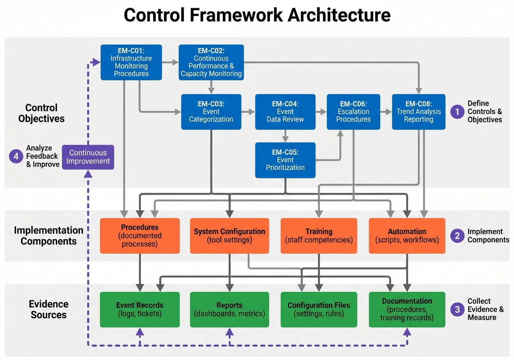

# Chapter 15: Control Objectives and Compliance


## Introduction

Control objectives form the backbone of effective Event Management governance, providing measurable criteria that ensure the process delivers consistent, reliable, and auditable results. These objectives transform best practices and strategic goals into specific, verifiable requirements that organizations must implement and maintain to achieve operational excellence in Event Management. This chapter establishes the comprehensive framework for eight critical Control Objectives (EM-C01 through EM-C08) that govern every aspect of the Event Management process, from infrastructure monitoring to continuous service improvement.

In an era where IT environments grow increasingly complex and business dependencies on technology intensify, governance and compliance cannot be afterthoughts. Organizations must demonstrate not only that Event Management processes exist, but that they function effectively and deliver measurable value. Control objectives provide this assurance by establishing clear expectations, defining implementation requirements, specifying audit evidence, and measuring effectiveness. Whether facing internal audits, external regulatory requirements, or management oversight, these control objectives ensure Event Management operations meet the highest standards of operational discipline.

This chapter provides detailed guidance for each control objective, including the control statement, rationale, specific requirements, implementation steps, audit evidence specifications, and measurement criteria. Organizations can use this framework to design compliant Event Management implementations, conduct self-assessments, prepare for audits, and continuously improve their governance posture. By the end of this chapter, practitioners will understand not only what must be controlled but why it matters and how to prove compliance.

## Understanding Control Objectives

### Purpose and Scope

Control objectives serve multiple critical functions within the Event Management framework. First, they establish **accountability** by clearly defining what must be achieved and who is responsible. Second, they enable **measurability** by providing specific criteria that can be verified through audit evidence. Third, they ensure **consistency** by standardizing practices across the organization. Fourth, they support **compliance** by aligning Event Management activities with regulatory requirements, industry standards, and organizational policies.

The eight control objectives span the complete Event Management lifecycle, from initial infrastructure monitoring through continuous improvement activities. Each control objective addresses a specific aspect of process governance:

- **EM-C01 and EM-C02** establish the foundation by ensuring comprehensive monitoring coverage
- **EM-C03 and EM-C05** govern event specifications and accurate classification
- **EM-C06** ensures appropriate escalation and communication
- **EM-C04, EM-C07, and EM-C08** drive continuous improvement through formal review, root cause analysis, and trend analysis

### Control Objective Framework

Every control objective in this framework follows a consistent structure that ensures clarity and enables implementation:

1. **Control Statement:** A concise declaration of what must be achieved
2. **Rationale:** The business and technical justification for the control
3. **Requirements:** Specific capabilities or activities that must be in place
4. **Implementation Steps:** Actionable guidance for achieving compliance
5. **Audit Evidence:** Documented artifacts that prove the control is functioning
6. **Measurement Criteria:** Metrics and thresholds that validate effectiveness

This structured approach ensures that practitioners understand not only the "what" but also the "why" and "how" of each control objective. Organizations can use this framework to assess current compliance status, identify gaps, prioritize remediation efforts, and demonstrate compliance to auditors and stakeholders.

## EM-C01: Infrastructure Monitoring Procedures

### Control Statement

Event Management procedures must define and implement processes to monitor the IT infrastructure, specifying the percentage of infrastructure under active monitoring.

### Rationale

Effective Event Management cannot exist without comprehensive infrastructure monitoring. This control ensures organizations make deliberate decisions about monitoring scope, establish clear procedures for monitoring activities, and can demonstrate what percentage of their IT infrastructure is actively monitored. Without this foundation, organizations risk blind spots that allow incidents to escalate undetected, creating service disruptions and business impact.

The requirement to specify monitoring percentage creates accountability. Organizations must explicitly document monitoring coverage rather than assuming "we monitor everything." This transparency enables informed risk discussions, resource allocation decisions, and continuous improvement of monitoring scope.

### Requirements

To satisfy EM-C01, organizations must establish and maintain:

1. **Documented Monitoring Procedures:** Written procedures that define what will be monitored, how monitoring will be performed, and who is responsible for monitoring activities.

2. **Monitoring Scope Definition:** Explicit documentation of which Configuration Items (CIs), applications, services, and infrastructure components are included in monitoring coverage.

3. **Coverage Measurement:** Regular calculation and reporting of the percentage of total infrastructure under active monitoring, based on the distribution and coverage of monitoring across all managed CIs.

4. **Monitoring Standards:** Technical standards defining monitoring approaches, tools, agents, and data collection methods for different CI types.

### Implementation Steps

Organizations implementing EM-C01 should follow these steps:

1. **Inventory IT Infrastructure:** Create a comprehensive inventory of all CIs that should be considered for monitoring, including servers, network devices, storage systems, applications, databases, and environmental controls.

2. **Define Monitoring Requirements:** For each CI category, document what should be monitored (availability, performance, capacity, errors), monitoring frequency, and criticality level.

3. **Document Monitoring Procedures:** Create formal procedures that specify monitoring tool selection, agent deployment, threshold configuration, event collection, and escalation paths.

4. **Calculate Coverage Baseline:** Determine current monitoring coverage by dividing monitored CIs by total CIs in scope, establishing a baseline percentage.

5. **Establish Coverage Targets:** Set organizational targets for monitoring coverage (for example, 95% of production servers, 90% of critical applications), with justification for any exclusions.

6. **Review and Update Regularly:** Schedule periodic reviews (quarterly recommended) to update monitoring scope as infrastructure changes, ensuring coverage calculations remain accurate.

### Audit Evidence

Auditors and compliance teams should look for the following evidence when validating EM-C01:

- **Monitoring Procedures Document:** Formal, approved documentation defining monitoring processes, responsibilities, and scope
- **Infrastructure Inventory:** Current list of all CIs with monitoring status indicator (monitored/not monitored)
- **Coverage Reports:** Monthly or quarterly reports showing percentage of infrastructure under monitoring
- **Monitoring Tool Configuration:** Evidence that monitoring tools are deployed and configured according to documented standards
- **Review Meeting Minutes:** Documentation of periodic reviews where monitoring coverage is discussed and decisions recorded

### Measurement Criteria

Organizations can measure EM-C01 effectiveness using these criteria:

**Monitoring Coverage Rate:**
```
(Number of Monitored CIs / Total Number of CIs in Scope) × 100
```

**Target:** ≥90% for critical infrastructure, ≥80% for standard infrastructure

**Monitoring Scope Documentation:** 100% of CI categories must have documented monitoring requirements

**Review Frequency:** Monitoring coverage must be reviewed at least quarterly, with documented findings and action items

### Integration with Critical Success Factors

Control Objective EM-C01 directly supports the Critical Success Factor (CSF) "Clearly Defined Events and Responses." Organizations must define clear procedures for monitoring IT infrastructure to ensure consistent interpretation and handling across all teams. Without this foundation, Event Management cannot achieve its primary goal of detecting, evaluating, and acting upon events in a consistent and reliable manner.

## EM-C02: Continuous Performance and Capacity Monitoring

### Control Statement

Event Management must implement continuous monitoring of the performance and capacity of IT resources, including the resources supporting IT infrastructure such as power and cooling systems.

### Rationale

Performance degradation and capacity exhaustion rarely occur without warning. Continuous monitoring enables organizations to detect early warning signs, predict future capacity needs, and take proactive action before service impact occurs. This control extends beyond traditional IT components to include environmental factors that support IT infrastructure, recognizing that facility failures can be as disruptive as server failures.

The emphasis on "continuous" monitoring distinguishes this control from periodic checks or scheduled scans. Thresholds must be continuously evaluated against defined capacity requirements, ensuring that warning events are generated at the earliest possible moment when intervention can prevent service disruption.

### Requirements

Organizations must implement:

1. **Performance Monitoring:** Continuous collection and evaluation of performance metrics including response times, throughput, CPU utilization, memory consumption, and transaction processing rates.

2. **Capacity Monitoring:** Continuous tracking of capacity metrics including disk space utilization, network bandwidth consumption, database table growth, and connection pool usage.

3. **Infrastructure Support Monitoring:** Monitoring of environmental and facility systems including temperature, humidity, power distribution, UPS status, generator functionality, and cooling system performance.

4. **Threshold Evaluation:** Automated comparison of collected metrics against defined thresholds, generating Warning Events when thresholds approach capacity limits and Exception Events when limits are breached.

5. **Trend Analysis Integration:** Integration with trend analysis processes that identify consumption patterns and predict when capacity will be exhausted.

### Implementation Steps

Follow these steps to implement EM-C02:

1. **Define Performance Requirements:** Establish performance targets based on Service Level Objectives (SLOs) and business requirements for each critical service and application.

2. **Define Capacity Requirements:** Work with Capacity Management to document capacity limits and thresholds for all infrastructure components, including appropriate warning levels (typically 70-80% utilization).

3. **Configure Continuous Collection:** Deploy monitoring agents and configure tools to collect performance and capacity metrics at appropriate intervals (typically every 1-5 minutes for critical systems).

4. **Establish Threshold Ranges:** Configure multiple threshold levels (normal, warning, critical) for each monitored metric, ensuring thresholds align with capacity requirements.

5. **Implement Environmental Monitoring:** Extend monitoring to include data center environmental systems, integrating facility management systems with the Event Management platform.

6. **Validate Continuous Operation:** Verify that monitoring operates 24/7 without gaps, implementing redundancy for monitoring systems themselves to prevent monitoring failures.

### Audit Evidence

Compliance with EM-C02 can be demonstrated through:

- **Capacity Requirements Documentation:** Formal documentation from Capacity Management specifying performance thresholds and capacity limits for monitored systems
- **Monitoring Configuration:** Exported configuration from monitoring tools showing continuous collection intervals and configured thresholds
- **Event Logs:** Historical event data showing Warning and Exception Events generated for performance and capacity issues
- **Environmental Monitoring Integration:** Evidence that environmental systems (temperature, power, cooling) are integrated with Event Management platform
- **Coverage Reports:** Reports demonstrating continuous monitoring coverage (24/7 operation) for critical infrastructure

### Measurement Criteria

Measure EM-C02 effectiveness using:

**Monitoring Availability:**
```
(Time Monitoring System is Operational / Total Time in Period) × 100
```

**Target:** ≥99.9% availability (less than 45 minutes downtime per month)

**Coverage Completeness:** 100% of critical infrastructure must have defined capacity thresholds and continuous monitoring

**Proactive Detection Rate:** Percentage of capacity-related incidents preceded by Warning Events should be ≥80%, demonstrating that continuous monitoring enables proactive intervention

## EM-C03: Event Categorization

### Control Statement

Event Management procedures must include criteria for categorizing events, implemented through a documented event categorization taxonomy with staff training on categorization standards.

### Rationale

Categorization enables the single most important capability in Event Management: the ability to analyze patterns, identify trends, and derive actionable insights from event data. Without consistent categorization, events remain isolated data points rather than becoming information that drives decision-making. Accurate categorization supports trend analysis, resource allocation, root cause identification, and continuous improvement initiatives.

Control Objective EM-C03 recognizes that categorization accuracy requires explicit governance. Organizations must define the taxonomy, document criteria for each category, configure systems with category definitions, and train staff to apply standards consistently. Achieving and maintaining target categorization accuracy requires these implementation controls defined in the governance framework.

### Requirements

Compliance with EM-C03 requires:

1. **Event Categorization Taxonomy:** A documented, hierarchical taxonomy defining all valid event categories and subcategories, including Hardware, Software (Commercial and Custom), Environmental Controls, Security, and Normal Operational Activities.

2. **Categorization Criteria:** Written criteria for each category explaining when to assign each classification, including examples and decision trees for complex scenarios.

3. **System Configuration:** Event Management tools must be configured with the defined taxonomy, making categories available for event classification during both automated and manual event handling.

4. **Staff Training Program:** Formal training for all Event Management personnel on the categorization schema, ensuring consistent application across all shifts and team members.

5. **Categorization Accuracy Measurement:** Regular validation of categorization accuracy through sampling and audit processes.

### Implementation Steps

Implement EM-C03 through these activities:

1. **Define Categorization Taxonomy:** Develop a hierarchical taxonomy aligned with organizational structure, including primary categories (Hardware, Software, Environmental, Security) and subcategories (Server, Network, Storage under Hardware; Commercial, Custom under Software).

2. **Document Categorization Criteria:** For each category and subcategory, create written criteria describing characteristics, providing examples, and clarifying boundary conditions between similar categories.

3. **Configure Event Management System:** Implement the taxonomy in the Event Management platform, creating dropdown lists, validation rules, and automated categorization logic where possible.

4. **Develop Training Materials:** Create training documentation, quick reference guides, and decision trees that staff can use when categorizing events.

5. **Train Staff on Standards:** Conduct mandatory training for all Event Analysts, Event Coordinators, and Event Designers, ensuring every team member understands categorization requirements. This is a specific responsibility of the Event Management Process Owner.

6. **Implement Quality Controls:** Establish sampling and audit processes to regularly review categorization accuracy, providing feedback and retraining when patterns of miscategorization emerge.

### Audit Evidence

Validate EM-C03 compliance through:

- **Categorization Taxonomy Document:** Formal documentation defining all categories, subcategories, and selection criteria
- **Training Records:** Documentation showing completion of categorization training by all Event Management staff
- **System Configuration Screenshots:** Evidence that the taxonomy is implemented in the Event Management tool
- **Categorization Accuracy Reports:** Regular reports showing sampled events and categorization accuracy percentage
- **Event Records:** Individual event records demonstrating consistent use of defined categories

### Measurement Criteria

**Categorization Accuracy:**
```
(Correctly Categorized Events / Total Sampled Events) × 100
```

**Target:** ≥95% accuracy

**Training Completion:** 100% of Event Management staff must complete categorization training within 30 days of role assignment

**Taxonomy Coverage:** 100% of events must be assigned to a defined category (no "uncategorized" or "unknown" events)

### Integration with Process Activities

Event categorization occurs primarily during Activity 3: Manage Event, where Event Analysts and automated correlation systems assign categories to each detected event. Accurate categorization is essential input for Activity 4: Escalate (routing to appropriate teams based on category) and Activity 5: Review and Close Event (analyzing patterns by category during trend analysis).

## EM-C04: Formal Event Data Review Sessions

### Control Statement

Event Management must define formal event data review sessions with mandatory management participation, including weekly operational reviews and monthly strategic reviews where metrics are analyzed, findings documented, and action items tracked.

### Rationale

Continuous improvement requires structured management attention. Control Objective EM-C04 ensures that Event Management data is not simply collected but actively reviewed, analyzed, and converted into improvement actions. These formal review sessions create accountability, ensure management support is maintained through direct involvement, and generate the proposals, assignments, and tracking mechanisms that drive actual improvement rather than just identifying opportunities.

The distinction between operational (weekly) and strategic (monthly) reviews recognizes different review purposes. Operational reviews focus on immediate performance, emerging issues, and tactical adjustments. Strategic reviews examine long-term trends, evaluate KPI achievement, assess process maturity, and make strategic decisions about tools, staffing, and process changes.

### Requirements

Organizations must establish:

1. **Formal Review Schedule:** Defined cadence for operational reviews (weekly recommended) and strategic reviews (monthly recommended) with scheduled dates, times, and required participants.

2. **Management Participation Requirements:** Mandatory attendance by Event Manager for operational reviews and senior management for strategic reviews, demonstrating that governance and funding decisions receive appropriate visibility.

3. **Standard Review Agenda:** Predefined agenda for each review type, ensuring critical topics are consistently addressed including KPI performance, incident correlation, escalation patterns, and improvement initiatives.

4. **Documented Findings:** Written documentation of findings, issues identified, and insights discovered during each review session.

5. **Action Item Tracking:** Formal tracking system for improvement actions proposed during reviews, including assignments, due dates, status updates, and completion verification.

### Implementation Steps

1. **Define Review Types and Cadence:** Establish two review types:
   - **Weekly Operational Reviews:** Focus on current performance, emerging issues, and immediate concerns
   - **Monthly Strategic Reviews:** Analyze trends, assess KPI achievement, review improvement initiatives, and make strategic decisions

2. **Establish Required Participation:** Define mandatory attendees for each review type:
   - Operational: Event Manager, Event Coordinator, key Event Analysts
   - Strategic: Event Manager, IT management, Process Owner, service owners

3. **Create Review Templates:** Develop standard agendas and reporting templates that ensure consistency:
   - KPI dashboard review
   - Incident correlation analysis
   - Escalation effectiveness review
   - Trend identification
   - Action item status update
   - New improvement proposals

4. **Implement Action Tracking System:** Use a formal tracking system (ticketing system, project management tool, or dedicated database) to record, assign, and monitor action items generated during reviews.

5. **Schedule Recurring Meetings:** Establish standing calendar invitations for both operational and strategic reviews, treating these as mandatory commitments.

6. **Document and Distribute Results:** Within 24 hours of each review, distribute documentation including attendance, findings, decisions made, and action items assigned.

### Audit Evidence

Demonstrate EM-C04 compliance through:

- **Review Calendar and Attendance Records:** Evidence of scheduled reviews with attendance logs showing management participation
- **Review Meeting Minutes:** Documented findings, metrics presented, issues discussed, and decisions made for each review session
- **Action Item Tracking Reports:** Current and historical tracking of action items including assignments, due dates, status, and completion
- **Metrics Analysis Presentations:** KPI dashboards, trend reports, and analysis documents presented during review sessions
- **Improvement Initiative Documentation:** Evidence that reviews lead to proposals for action, assignments, and tracking of improvement initiatives

### Measurement Criteria

**Review Completion Rate:**
```
(Completed Reviews / Scheduled Reviews) × 100
```

**Target:** ≥95% (allowing for rare emergency cancellations)

**Management Attendance:** Senior management attendance at Monthly Strategic Reviews must be ≥90%

**Action Item Closure Rate:**
```
(Closed Action Items / Total Action Items Due) × 100
```

**Target:** ≥80% of action items closed by due date

**Improvement Initiatives Launched:** Minimum of two new improvement initiatives launched per quarter based on review findings

### Integration with Continuous Improvement

EM-C04 is the primary mechanism for translating data into action. These formal review sessions ensure that insights gained from trend analysis (EM-C08) and root cause analysis (EM-C07) result in actual improvements rather than simply being noted and forgotten. Management attendance requirements ensure funding, resources, and organizational support for improvement initiatives.

## EM-C05: Event Prioritization Using Defined Criteria

### Control Statement

Events must be prioritized to ensure those with the highest potential to impact service levels are addressed first, using defined Impact and Urgency matrices with automated priority assignment and regular validation.

### Rationale

Not all events are equally important. During periods of high event volume or multiple concurrent issues, organizations must ensure that effort is focused on events with the greatest potential for business impact. Control Objective EM-C05 ensures prioritization decisions are consistent, transparent, and aligned with business priorities rather than being arbitrary or based on individual judgment.

Priority calculation derived from Impact and Urgency matrices provides the mechanism to achieve this control. Impact measures the business consequence of an event, while Urgency defines the time sensitivity of response. Together, these factors produce a priority that ensures critical, time-sensitive issues receive immediate attention while lower-impact events are handled systematically.

### Requirements

Organizations must implement:

1. **Impact Assessment Matrix:** A documented matrix defining Impact Levels (typically 1-4, from Low to Critical) based on organizational scope, environment type, and business consequence.

2. **Urgency Assessment Matrix:** A documented matrix defining Urgency Levels based on business cycles, regulatory deadlines, time of day, and service level requirements.

3. **Priority Calculation Formula:** A formula or matrix that combines Impact and Urgency to produce Priority levels (typically 1-5, from Low to Critical).

4. **Automated Priority Assignment:** Configuration in the Event Management system that automatically calculates and assigns priority based on event attributes, CI information, and defined matrices.

5. **Priority Distribution Validation:** Regular analysis of priority distribution to ensure the calculation logic produces appropriate results (typically more events at lower priorities, fewer at critical levels).

6. **Configuration Audits:** Periodic audits to verify that priority calculation configuration matches documented matrices and business requirements.

### Implementation Steps

Follow this implementation approach:

1. **Define Impact Levels:** Work with business stakeholders to establish Impact Level definitions:
   - **Level 1 (Low):** Single user or workstation affected
   - **Level 2 (Moderate):** Multiple users or department affected
   - **Level 3 (Significant):** Site or critical application affected
   - **Level 4 (Critical):** Organization-wide or business-critical service affected

2. **Define Urgency Levels:** Establish Urgency Level definitions considering:
   - **Time of Day:** Higher urgency during business hours
   - **Day of Week:** Higher urgency on business days
   - **Business Cycles:** Higher urgency during period-end reporting or peak business periods
   - **Regulatory Deadlines:** Higher urgency when approaching compliance deadlines

3. **Create Priority Matrix:** Map Impact and Urgency combinations to Priority levels using a matrix approach. For example:
   - Impact 4 + Urgency 4 = Priority 1 (Critical)
   - Impact 4 + Urgency 3 = Priority 1 (Critical)
   - Impact 3 + Urgency 3 = Priority 2 (High)
   - Impact 2 + Urgency 2 = Priority 3 (Medium)
   - Impact 1 + Urgency 1 = Priority 4 (Low)

4. **Configure Automated Assignment:** Implement the priority calculation in the Event Management system, using CI attributes (environment, criticality), event characteristics (type, severity), and time-based rules to automatically assign priorities.

5. **Test Priority Assignment:** Validate priority calculation logic using test events representing different scenarios, ensuring results match expected priorities.

6. **Generate Priority Distribution Reports:** Create monthly reports showing distribution of events across priority levels, tracking priority distribution as audit evidence to validate effectiveness.

7. **Conduct Regular Configuration Audits:** Schedule quarterly audits to verify configuration matches documented matrices and to identify any configuration drift.

### Audit Evidence

Evidence for EM-C05 includes:

- **Impact and Urgency Matrices:** Documented matrices showing defined levels and criteria for assignment
- **Priority Calculation Documentation:** Written explanation of how Impact and Urgency combine to produce Priority
- **System Configuration Export:** Configuration files or screenshots showing automated priority assignment rules
- **Priority Distribution Reports:** Historical reports showing distribution of priorities assigned to events
- **Configuration Audit Results:** Audit reports verifying that configuration matches documentation
- **Event Records:** Sample events demonstrating correct priority assignment based on attributes

### Measurement Criteria

**Priority Assignment Accuracy:**
```
(Correctly Prioritized Events / Total Sampled Events) × 100
```

**Target:** ≥95% accuracy

**Automation Rate:**
```
(Automatically Prioritized Events / Total Events) × 100
```

**Target:** ≥90% of events should receive automated priority assignment

**Priority Distribution Appropriateness:** Priority distribution should follow expected patterns, typically:
- Priority 1 (Critical): <5% of events
- Priority 2 (High): 10-15% of events
- Priority 3 (Medium): 30-40% of events
- Priority 4 (Low): 40-50% of events
- Priority 5 (Informational): Variable

Significant deviation from expected distribution patterns indicates potential issues with threshold configuration or matrix definitions.

### Integration with Service Level Management

Priority assignment directly influences response times and escalation decisions. SLOs provided by Service Level Management are crucial inputs that define event thresholds, priorities, and escalation levels. Event Management must respond based on potential business impact and urgency defined by service agreements, ensuring that prioritization aligns with contractual obligations and business expectations.

## EM-C06: Escalation Procedures and Communication

### Control Statement

Event Management procedures must include escalation criteria and communication procedures, with defined escalation paths for 100% of event types and configured automated escalation workflows.

### Rationale

Events that exceed Event Management's scope of action must be escalated to other processes or teams for resolution. Control Objective EM-C06 ensures these escalations occur consistently, promptly, and to the appropriate destination. Without defined escalation procedures, critical events may be delayed, routed incorrectly, or fall through gaps between teams.

Escalation effectiveness directly impacts incident response times, problem identification, and overall service availability. Organizations must define escalation paths, configure automated workflows, and measure routing accuracy to ensure events reach the right team with the right information at the right time.

### Requirements

Organizations must establish:

1. **Escalation Criteria:** Documented criteria defining when events should be escalated to Incident Management, Problem Management, Change Management, Security Operations, or other teams.

2. **Escalation Paths:** Defined routing for 100% of event types, specifying which team or process should receive escalations based on event category, priority, CI type, and other attributes.

3. **Communication Procedures:** Standard procedures for how escalations are communicated, including required information, notification methods, and escalation acknowledgment requirements.

4. **Automated Escalation Workflows:** Configuration in Event Management tools that automatically creates incident records, problem records, or notifications when escalation criteria are met.

5. **Escalation Tracking:** Mechanisms to track escalations, including escalation time, receiving team, and eventual outcome.

### Implementation Steps

Implement EM-C06 using this approach:

1. **Define Escalation Types:** Establish escalation destinations:
   - **Incident Management:** Service-impacting events requiring immediate restoration
   - **Problem Management:** Recurring events or events with unknown root causes
   - **Change Management:** Events indicating need for scheduled changes
   - **Security Operations:** Security-related events requiring investigation
   - **Capacity Management:** Capacity or performance trends requiring planning

2. **Document Escalation Criteria:** For each escalation type, define specific criteria:
   - Priority thresholds (for example, all Priority 1 events escalate to Incident Management)
   - Event types (for example, all Security category events escalate to Security Operations)
   - Recurrence patterns (for example, three occurrences in 24 hours escalate to Problem Management)

3. **Create Escalation Decision Matrix:** Develop a matrix showing event characteristics (category, priority, recurrence) mapped to escalation destinations, ensuring 100% coverage.

4. **Define Communication Standards:** Establish what information must be included in escalations:
   - Event details (timestamp, source, description)
   - Affected CI and business service
   - Impact and urgency assessment
   - Priority calculation
   - Related events and correlation information
   - Any automated actions already taken

5. **Configure Automated Workflows:** Implement escalation automation in the Event Management platform, creating automated incident creation, notification generation, and routing logic.

6. **Establish Escalation SLAs:** Define timeframes for escalations to occur (for example, Priority 1 events must be escalated within five minutes of detection).

7. **Implement Tracking and Reporting:** Create reports showing escalation volumes, routing accuracy, and outcomes.

### Audit Evidence

Demonstrate EM-C06 compliance through:

- **Escalation Procedures Document:** Written procedures defining escalation criteria, paths, and communication standards
- **Escalation Decision Matrix:** Matrix showing 100% coverage of event types with defined escalation destinations
- **Automated Workflow Configuration:** Evidence that escalation workflows are configured and operational
- **Escalation Reports:** Monthly reports showing escalation volumes by type and destination
- **Incident Correlation Data:** Reports showing percentage of events that resulted in incidents, measuring escalation effectiveness
- **Sample Escalations:** Individual records demonstrating correct escalation routing and information transfer

### Measurement Criteria

**Routing Accuracy:**
```
(Correctly Routed Escalations / Total Escalations) × 100
```

**Target:** ≥95% accuracy

**Escalation Timeliness:**
```
(Escalations Meeting SLA / Total Escalations) × 100
```

**Target:** ≥95% escalated within defined timeframe

**Event-to-Incident Ratio:** The percentage of events that resulted in incidents is a measurement criterion for EM-C06. This metric validates that escalation procedures are functioning effectively and events are being properly routed. Typical ratios range from 5-15% depending on monitoring maturity and automation levels.

### Integration with Process Activities

Escalation is formalized as Activity 4 in the Event Management process. When evaluation during Activity 3 determines that an event requires external action, the escalation procedures defined by EM-C06 ensure consistent, timely, and accurate transfer to the appropriate process or team. Routing accuracy measures the effectiveness of these defined protocols.

## EM-C07: Root Cause Analysis for Unknown Causal Factors

### Control Statement

Root Cause Analysis (RCA) must be performed on events whose causal factors are unknown, requiring identification of events with unknown causes, initiation of Problem Management for recurring unknown events, and tracking of the percentage of events with known causes.

### Rationale

Events with unknown causes represent risks. If the organization does not understand why an event occurred, it cannot prevent recurrence, cannot implement appropriate fixes, and cannot assess whether similar issues exist elsewhere in the environment. Control Objective EM-C07 ensures that unknown causes are not simply accepted but actively investigated through formal RCA processes.

The linkage to Problem Management is critical. While Event Management detects and documents events with unknown causes, Problem Management has the mandate and methodology to conduct thorough investigations, identify root causes, and implement permanent solutions. EM-C07 creates the governance requirement that ensures these two processes work together effectively.

### Requirements

Organizations must implement:

1. **Unknown Cause Identification:** Procedures for identifying and flagging events where the causal factor is unknown or unclear.

2. **RCA Trigger Criteria:** Defined criteria for when RCA must be initiated, typically including recurring events with unknown causes, high-impact events with unknown causes, and patterns of similar unknown events.

3. **Problem Management Integration:** Automated or manual processes for escalating events with unknown causes to Problem Management for formal RCA.

4. **Known Cause Tracking:** Measurement of the percentage of events with known versus unknown causes, tracking improvement over time.

5. **Closure Code Compliance:** Use of specific closure codes (particularly `Problem`) to document events escalated for RCA, providing audit evidence.

### Implementation Steps

Follow these steps to implement EM-C07:

1. **Define Unknown Cause Criteria:** Establish clear criteria for what constitutes an "unknown cause":
   - Event source is unclear
   - Triggering condition cannot be explained
   - Root cause is not immediately apparent from available data
   - Event resolves without clear understanding of why

2. **Implement Cause Documentation:** Require Event Analysts to document known causes during event resolution, creating a field in event records specifically for causal factor documentation.

3. **Establish RCA Trigger Rules:** Define when RCA must be initiated:
   - Any Priority 1 or 2 event with unknown cause
   - Any event with unknown cause that recurs three or more times
   - Patterns of similar events (five or more) with unknown causes

4. **Configure Problem Management Escalation:** Implement workflows that automatically create Problem records when RCA trigger criteria are met, transferring event data, correlation information, and initial analysis.

5. **Define Closure Code Requirements:** Mandate use of the `Problem` closure code when events are escalated for RCA, creating an audit trail that demonstrates compliance with EM-C07.

6. **Track Known Cause Percentage:** Generate monthly reports showing:
   ```
   (Events with Documented Known Cause / Total Events) × 100
   ```

7. **Review Unknown Cause Trends:** During formal review sessions (EM-C04), analyze trends in unknown causes to identify systemic issues requiring broader investigation.

### Audit Evidence

Validate EM-C07 compliance using:

- **RCA Procedures Document:** Written procedures defining unknown cause identification, RCA trigger criteria, and escalation processes
- **Problem Record Linkage:** Evidence showing events with unknown causes linked to Problem Management records
- **Closure Code Reports:** Reports showing events closed with `Problem` closure code, demonstrating RCA escalation
- **Known Cause Percentage Reports:** Trending reports showing improvement in percentage of events with known causes
- **RCA Results Documentation:** Problem Management records showing completed RCA investigations traced back to original events

### Measurement Criteria

**Known Cause Rate:**
```
(Events with Known Cause / Total Events) × 100
```

**Target:** ≥85% (recognizing that some percentage of events will legitimately have unknown causes requiring investigation)

**RCA Initiation Rate:**
```
(RCA Initiated for Qualifying Events / Events Meeting RCA Criteria) × 100
```

**Target:** 100% (all events meeting RCA trigger criteria must result in Problem Management escalation)

**RCA Completion Rate:** Percentage of escalated events where RCA is completed within defined timeframe (typically 30-60 days depending on complexity)

**Target:** ≥80%

### Integration with Problem Management

EM-C07 creates the formal bridge between Event Management and Problem Management. Closing an event as `Problem` provides necessary audit evidence for compliance and ensures recurring unknown events receive the investigation resources required for permanent resolution. Problem Management returns Known Error documentation to Event Management, enabling automated resolution of future similar events.

## EM-C08: Trend Analysis Reports for Service Improvement

### Control Statement

Event Management must provide trend analysis reports for service improvement, comparing numbers and percentages of events to incidents to identify actionable insights and launch Continuous Service Improvement (CSI) initiatives.

### Rationale

Event data represents a rich source of intelligence about IT health, performance patterns, emerging risks, and improvement opportunities. However, this value is only realized when data is analyzed, trends are identified, and insights are translated into action. Control Objective EM-C08 ensures that trend analysis is not optional but mandatory, with specific requirements for reporting cadence, content, and outcome.

The comparison of events to incidents is particularly valuable. A high event-to-incident ratio suggests monitoring is detecting issues but not enabling proactive response. A low ratio indicates effective automation and early intervention. Trending these ratios over time demonstrates improvement in Event Management maturity and effectiveness.

### Requirements

Organizations must establish:

1. **Scheduled Trend Analysis Reporting:** Regular production of trend analysis reports (monthly recommended) analyzing event patterns, volumes, categories, priorities, and outcomes.

2. **Actionable Insights Identification:** Analysis must go beyond data presentation to identify specific insights that can drive improvement, such as recurring issues, false positive patterns, automation opportunities, or capacity trends.

3. **Event-to-Incident Comparison:** Reports must include comparison of event volumes to incident volumes, showing the percentage of events that resulted in incidents and trending this percentage over time.

4. **CSI Initiative Linkage:** Trend analysis must result in documented CSI initiatives, including specific proposals for automation, threshold tuning, monitoring expansion, or process improvements.

5. **Improvement Tracking:** Mechanisms to track CSI initiatives from identification through implementation to benefit realization.

### Implementation Steps

Implement EM-C08 through these activities:

1. **Define Report Content and Cadence:** Establish monthly trend analysis reports including:
   - Total event volume trends
   - Event distribution by category, priority, and type
   - Event-to-incident ratio and trends
   - Closure code distribution and patterns
   - Auto-operations success rates
   - False positive rates
   - Top event sources and volumes

2. **Establish Analysis Methodology:** Train analysts on how to identify actionable insights:
   - Sudden spikes or drops in volume (indicating new issues or monitoring gaps)
   - Increasing false positive rates (requiring threshold tuning)
   - High-volume repetitive events (automation candidates)
   - Category patterns (resource allocation optimization)
   - Priority distribution anomalies (matrix calibration needs)

3. **Create CSI Proposal Process:** Develop a standard template for CSI proposals that includes:
   - Insight or trend identified
   - Current impact and frequency
   - Proposed improvement action
   - Expected benefit and metrics
   - Resource requirements
   - Implementation timeline

4. **Integrate with Formal Reviews:** Present trend analysis reports during Monthly Strategic Reviews (EM-C04), ensuring management visibility and approval for CSI initiatives.

5. **Implement CSI Tracking:** Use project management or ticketing systems to track approved CSI initiatives from approval through implementation to benefit measurement.

6. **Measure Improvement Outcomes:** For each completed CSI initiative, measure actual results against expected benefits, documenting lessons learned and ROI achieved.

### Audit Evidence

Demonstrate EM-C08 compliance through:

- **Trend Analysis Reports:** Monthly reports showing analysis of event patterns, comparisons, and identified insights
- **Event-to-Incident Metrics:** Historical data showing event volumes, incident volumes, and calculated ratios
- **CSI Initiative Proposals:** Documentation of improvement initiatives proposed based on trend analysis findings
- **CSI Tracking Records:** Project records showing CSI initiatives in progress and completed, including status, outcomes, and benefits
- **Review Session Documentation:** Meeting minutes showing trend analysis presentation and management discussion during formal review sessions

### Measurement Criteria

**Reporting Compliance:**
```
(Trend Reports Produced / Trend Reports Scheduled) × 100
```

**Target:** 100% (no missed reports)

**CSI Initiative Rate:** Minimum of two CSI initiatives proposed per quarter based on trend analysis

**Implementation Success Rate:**
```
(Completed CSI Initiatives / Approved CSI Initiatives) × 100
```

**Target:** ≥80% completion within planned timeframe

**Event-to-Incident Ratio Improvement:** Trending metric showing decreasing percentage of events escalating to incidents, demonstrating improved proactive handling

**Expected Trend:** 5-10% reduction year-over-year in mature implementations

### Integration with Continuous Improvement

EM-C08 is the primary mechanism for translating operational data into strategic improvements. Combined with EM-C04 (Formal Review Sessions), this control ensures Event Management continuously evolves, optimizes, and delivers increasing value. Trend analysis identifies opportunities, formal reviews approve initiatives, and CSI tracking ensures accountability for delivering improvements.

## Compliance Requirements and Audit Procedures

### Establishing a Compliance Framework

Compliance with control objectives requires a structured framework that encompasses policies, procedures, standards, roles, and measurement. Organizations should establish:

1. **Control Objective Policy:** Executive-level policy mandating compliance with all eight control objectives and defining governance structure.

2. **Procedures and Standards:** Detailed procedures for each control objective, including implementation guidance, templates, and technical standards.

3. **Roles and Responsibilities:** Clear assignment of accountability for each control objective, typically to Event Manager, Event Coordinator, or Process Owner.

4. **Compliance Measurement:** Regular assessment of compliance status using defined metrics, audit evidence, and measurement criteria.

5. **Exception Management:** Process for requesting, evaluating, and approving exceptions to control requirements when justified by business circumstances.

### Audit Preparation and Execution

Organizations should prepare for both internal and external audits of Event Management controls:

#### Pre-Audit Preparation

1. **Self-Assessment:** Conduct internal assessment using the measurement criteria defined for each control objective, identifying gaps before external audit.

2. **Evidence Collection:** Gather audit evidence specified for each control, organizing documentation for efficient retrieval during audit.

3. **Stakeholder Notification:** Inform Event Management team members of upcoming audit scope, schedule, and evidence requirements.

4. **Tool Configuration Validation:** Verify that system configurations match documented standards, correcting any configuration drift before audit.

#### Audit Execution Support

1. **Documentation Availability:** Provide auditors with requested evidence promptly, maintaining professional and cooperative approach.

2. **Interview Preparation:** Prepare team members who will be interviewed by auditors, ensuring they understand control objectives and their roles.

3. **Sampling Support:** Support auditor requests for sample data, providing representative samples that demonstrate typical operations.

4. **Clarification and Explanation:** Respond to auditor questions with clear, accurate explanations of control implementation and evidence.

#### Post-Audit Response

1. **Finding Assessment:** Review audit findings to understand identified gaps, control weaknesses, or non-compliance issues.

2. **Remediation Planning:** Develop action plans to address findings, including specific corrective actions, responsible parties, and completion dates.

3. **Evidence of Remediation:** Implement corrective actions and collect evidence demonstrating that issues have been resolved.

4. **Follow-Up Audit Support:** Cooperate with follow-up audits that verify remediation completion and control effectiveness.

### Common Audit Findings and Remediation

Organizations frequently encounter these audit findings related to Event Management control objectives:

**Finding: Insufficient Documentation of Monitoring Scope (EM-C01)**
- **Remediation:** Conduct comprehensive infrastructure inventory, document monitoring scope, calculate coverage percentage, establish targets

**Finding: Lack of Formal Review Sessions (EM-C04)**
- **Remediation:** Establish recurring review meetings, define agendas and participants, document findings and action items retroactively for recent period

**Finding: Inconsistent Event Categorization (EM-C03)**
- **Remediation:** Develop categorization taxonomy, create training materials, conduct mandatory training, implement quality sampling

**Finding: No Evidence of Root Cause Analysis (EM-C07)**
- **Remediation:** Define RCA trigger criteria, implement Problem Management integration, establish closure code requirements, generate retroactive reports

**Finding: Missing Trend Analysis Reports (EM-C08)**
- **Remediation:** Create report templates, establish monthly reporting schedule, generate missing reports for audit period, integrate with formal reviews

## Evidence Collection and Documentation

### Evidence Repository Structure

Organizations should maintain an organized repository of audit evidence for efficient retrieval and compliance demonstration:

```
Event_Management_Controls/
├── EM-C01_Infrastructure_Monitoring/
│   ├── Monitoring_Procedures_v1.3.pdf
│   ├── Infrastructure_Inventory_2025Q1.xlsx
│   ├── Coverage_Reports/
│   │   ├── 2025-01_Coverage.pdf
│   │   ├── 2025-02_Coverage.pdf
│   │   └── 2025-03_Coverage.pdf
│   └── Review_Minutes_2025Q1.pdf
├── EM-C02_Performance_Capacity_Monitoring/
│   ├── Capacity_Requirements_Documentation.pdf
│   ├── Monitoring_Configuration_Export.xml
│   └── Event_Logs_Sample.csv
├── EM-C03_Event_Categorization/
│   ├── Categorization_Taxonomy_v2.1.pdf
│   ├── Training_Records_2025.xlsx
│   ├── Accuracy_Reports/
│   └── System_Configuration_Screenshots.pdf
├── EM-C04_Formal_Review_Sessions/
│   ├── Review_Calendar_2025.pdf
│   ├── Meeting_Minutes/
│   ├── Action_Item_Tracking.xlsx
│   └── Attendance_Records.xlsx
├── EM-C05_Event_Prioritization/
│   ├── Impact_Urgency_Matrices.pdf
│   ├── Priority_Calculation_Documentation.pdf
│   ├── System_Configuration_Export.xml
│   └── Priority_Distribution_Reports/
├── EM-C06_Escalation_Procedures/
│   ├── Escalation_Procedures_v1.5.pdf
│   ├── Escalation_Decision_Matrix.xlsx
│   ├── Workflow_Configuration_Screenshots.pdf
│   └── Escalation_Reports_2025Q1.pdf
├── EM-C07_Root_Cause_Analysis/
│   ├── RCA_Procedures.pdf
│   ├── Problem_Record_Linkage_Report.xlsx
│   ├── Closure_Code_Reports/
│   └── Known_Cause_Percentage_Trends.pdf
└── EM-C08_Trend_Analysis_Reports/
    ├── Trend_Analysis_Reports/
    │   ├── 2025-01_Trend_Analysis.pdf
    │   ├── 2025-02_Trend_Analysis.pdf
    │   └── 2025-03_Trend_Analysis.pdf
    ├── CSI_Initiative_Proposals/
    ├── CSI_Tracking_Dashboard.xlsx
    └── Event_Incident_Ratio_Trends.pdf
```

### Documentation Best Practices

**Version Control:** All procedures, standards, and documentation should include version numbers, revision dates, and change summaries to demonstrate evolution and currency.

**Retention Periods:** Maintain audit evidence for defined retention periods (typically minimum of three years) to support compliance demonstration and historical trending.

**Access Controls:** Implement appropriate security on evidence repositories to ensure integrity while enabling authorized access for auditors and compliance teams.

**Regular Updates:** Schedule periodic reviews of documentation to ensure accuracy, relevance, and alignment with current practices.

## Control Effectiveness Measurement

### Measurement Framework

Effective controls must be measurable. Organizations should establish a comprehensive measurement framework that assesses three dimensions:

#### 1. Implementation Completeness

Measures whether control requirements are fully implemented:
- Are documented procedures in place?
- Is system configuration complete?
- Have staff been trained?
- Are automation workflows operational?

**Measurement Approach:** Checklist-based assessment of implementation steps for each control objective

#### 2. Operational Effectiveness

Measures whether controls function as intended in daily operations:
- Do procedures guide actual behavior?
- Does automation execute correctly?
- Are targets and thresholds appropriate?
- Do escalations route correctly?

**Measurement Approach:** Process metrics, quality sampling, and operational monitoring

#### 3. Continuous Improvement

Measures whether controls drive ongoing enhancement:
- Are trends analyzed and acted upon?
- Do CSI initiatives result from control data?
- Is compliance improving over time?
- Are controls adapted to changing needs?

**Measurement Approach:** CSI tracking, trend analysis, and maturity assessment

### Control Effectiveness Dashboard

Organizations should develop a dashboard providing at-a-glance visibility into control effectiveness:

**Table 15.1: Control Objectives Summary**

| Control ID | Control Objective | Implementation Status | Current Metric | Target | Compliance Status |
|------------|-------------------|----------------------|----------------|--------|-------------------|
| EM-C01 | Infrastructure Monitoring Procedures | Implemented | 87% coverage | ≥90% | Approaching Target |
| EM-C02 | Continuous Performance and Capacity Monitoring | Implemented | 99.7% availability | ≥99.9% | Approaching Target |
| EM-C03 | Event Categorization | Implemented | 96% accuracy | ≥95% | Compliant |
| EM-C04 | Formal Event Data Review Sessions | Implemented | 100% completion | ≥95% | Compliant |
| EM-C05 | Event Prioritization Using Defined Criteria | Implemented | 94% accuracy | ≥95% | Approaching Target |
| EM-C06 | Escalation Procedures and Communication | Implemented | 97% routing accuracy | ≥95% | Compliant |
| EM-C07 | Root Cause Analysis for Unknown Causal Factors | Implemented | 88% known cause rate | ≥85% | Compliant |
| EM-C08 | Trend Analysis Reports for Service Improvement | Implemented | 100% reporting compliance | 100% | Compliant |

*Note: This table provides a template for tracking control implementation and effectiveness. Organizations should update metrics monthly and review during formal management review sessions.*

### Maturity Assessment

Control effectiveness can be assessed using a maturity model:

**Level 1 - Initial:** Controls are ad-hoc, inconsistent, and lack documentation. Evidence collection is reactive and incomplete.

**Level 2 - Defined:** Control requirements are documented and understood. Basic implementation exists but may not be consistently followed.

**Level 3 - Implemented:** Controls are fully implemented with documented procedures, system configuration, and training. Evidence is collected systematically.

**Level 4 - Measured:** Control effectiveness is actively measured using defined metrics. Compliance is regularly assessed and reported.

**Level 5 - Optimized:** Controls drive continuous improvement. Metrics are trended, insights drive action, and controls evolve based on changing needs.

Organizations should target Level 4 (Measured) as the minimum acceptable maturity for Event Management controls, with Level 5 (Optimized) as the strategic goal.

## Control Framework Architecture



*Figure 15.1: Control Framework Architecture - This architectural diagram illustrates the Event Management Control Framework, showing how the eight control objectives (EM-C01 through EM-C08) at the top layer are implemented through procedures, system configuration, training, and automation (middle layer), and validated through evidence sources including event records, reports, configuration files, and documentation (bottom layer). The continuous improvement feedback loop demonstrates how measurement results drive ongoing control refinement.*

## Integration with Policy Framework

Control objectives and policies work together to create comprehensive governance. While policies establish high-level requirements and strategic direction, control objectives define specific, measurable implementation requirements. Organizations should ensure alignment between:

**Policy 2: Alert Logging Requirements** aligns with **EM-C01** by requiring detailed logging that supports monitoring procedures and coverage measurement.

**Policy 3: Centralized Event Management Platform** supports **EM-C02, EM-C03, and EM-C05** by providing the technical foundation for continuous monitoring, consistent categorization, and automated prioritization.

**Policy 4: Enterprise Standard Monitoring Agents** enables **EM-C01 and EM-C02** by standardizing monitoring approaches and ensuring consistent data collection.

**Policy 5: Centralized Event Management Team** facilitates **EM-C04, EM-C07, and EM-C08** by creating organizational structure for formal reviews, root cause analysis, and trend analysis.

**Policy 6: Single Monitoring Agent per CI** supports **EM-C01** by preventing monitoring conflicts and ensuring clarity of monitoring responsibility and coverage.

## Linking Controls to KPIs

Control objectives should be linked to Key Performance Indicators (KPIs) to ensure measurement alignment:

**EM-C01 and EM-C02** support the **Efficiency of Detection** KPI by ensuring comprehensive monitoring enables proactive event detection before user reports.

**EM-C03** enables accurate **Categorization Accuracy** measurement and supports trend analysis capabilities.

**EM-C04** drives improvement in multiple KPIs by ensuring management reviews identify and address performance gaps.

**EM-C05** directly enables the measurement of prioritization accuracy and ensures critical events receive appropriate attention.

**EM-C06** measures **Routing Accuracy** and influences the event-to-incident ratio by ensuring appropriate escalations.

**EM-C07** improves the **Known Cause Rate** and reduces recurring incidents by ensuring root causes are identified and addressed.

**EM-C08** provides the analytical foundation for measuring CSI initiative success and trending improvement in all KPIs over time.

This linkage ensures that compliance efforts directly contribute to operational performance rather than being separate "governance overhead."

## Key Takeaways

- **Control objectives provide measurable governance:** The eight control objectives (EM-C01 through EM-C08) transform Event Management best practices into specific, verifiable requirements that can be implemented, measured, and audited.

- **Comprehensive coverage across process lifecycle:** Controls span monitoring scope (EM-C01, EM-C02), event specifications (EM-C03, EM-C05), operational execution (EM-C06), and continuous improvement (EM-C04, EM-C07, EM-C08), ensuring all critical aspects are governed.

- **Evidence-based compliance demonstration:** Each control objective specifies required audit evidence including documentation, system configuration, reports, and operational records that prove compliance to auditors and stakeholders.

- **Measurement drives accountability:** Defined measurement criteria with specific targets (such as ≥90% monitoring coverage, ≥95% categorization accuracy, 100% reporting compliance) create accountability and enable objective assessment of control effectiveness.

- **Controls enable continuous improvement:** Control objectives are not static compliance requirements but active mechanisms that drive improvement through formal reviews (EM-C04), root cause analysis (EM-C07), and trend analysis (EM-C08).

- **Integration with broader governance framework:** Control objectives align with organizational policies, support KPI measurement, integrate with other ITSM processes, and contribute to overall IT governance and compliance requirements.

- **Implementation requires deliberate effort:** Achieving compliance requires documented procedures, system configuration, staff training, automated workflows, evidence collection mechanisms, and regular measurement—not simply good intentions.

## Summary

Control objectives transform Event Management from an informal set of activities into a governed, measurable, and continuously improving discipline. The eight control objectives presented in this chapter provide comprehensive coverage of critical governance requirements, from foundational monitoring scope through advanced continuous improvement activities. Organizations that implement these controls gain not only audit compliance but operational excellence, with clear accountability, measurable performance, and systematic improvement.

EM-C01 and EM-C02 establish the monitoring foundation, ensuring comprehensive coverage and continuous evaluation of infrastructure performance and capacity. EM-C03 and EM-C05 govern event specifications, ensuring consistent categorization and appropriate prioritization that enables effective handling and meaningful analysis. EM-C06 ensures events are escalated to the right team with the right information at the right time, preventing delays and routing errors. EM-C04, EM-C07, and EM-C08 drive continuous improvement by mandating formal reviews, root cause analysis, and trend analysis that convert operational data into strategic insights and improvement actions.

Implementation of these control objectives requires deliberate investment in documentation, system configuration, training, automation, and measurement infrastructure. However, this investment delivers substantial returns through improved service availability, reduced operational costs, faster incident response, better capacity planning, and demonstrated compliance with governance requirements. Organizations should approach control implementation systematically, starting with foundational controls (EM-C01, EM-C02), building event specification governance (EM-C03, EM-C05), implementing operational controls (EM-C06), and finally establishing continuous improvement mechanisms (EM-C04, EM-C07, EM-C08).

The next chapter examines the policy framework that provides strategic direction and high-level requirements complementing these detailed control objectives, along with the organizational structures, roles, and governance mechanisms that ensure sustained compliance and continuous evolution of Event Management capabilities.

## Review Questions

1. **Control Scope and Coverage:** Explain why Control Objective EM-C01 requires organizations to specify the percentage of IT infrastructure under monitoring rather than simply stating "all infrastructure will be monitored." What governance benefits does this specificity provide?

<details>
<summary>Click to reveal answer</summary>

**Answer:**

**Why percentage specification matters:**

| Benefit | Explanation |
|---------|-------------|
| **Measurability** | "95% coverage" can be verified; "all" cannot be objectively assessed |
| **Accountability** | Clear target enables tracking and responsibility assignment |
| **Gap identification** | Knowing current % reveals what's missing |
| **Progressive improvement** | Can set targets (85%→90%→95%) with clear milestones |
| **Audit compliance** | Auditors can verify specific percentage claims |

**Governance benefits:**
- Creates accountability for coverage decisions
- Enables budget justification (cost of closing gap)
- Supports risk-based prioritization (which 5% is excluded?)
- Provides audit trail for exceptions

</details>

2. **Prioritization Implementation:** Describe how Control Objective EM-C05 ensures that event prioritization is based on business impact and urgency rather than subjective judgment. What are the key implementation components required to achieve this control?

<details>
<summary>Click to reveal answer</summary>

**Answer:**

**How EM-C05 ensures objective prioritization:**

| Mechanism | How It Removes Subjectivity |
|-----------|---------------------------|
| **Impact matrix** | Predefined levels based on scope (users, services) |
| **Urgency criteria** | Time-based factors with clear definitions |
| **Priority calculation** | Formula: Priority = f(Impact, Urgency) |
| **Automated assignment** | System calculates; human doesn't choose |
| **Override documentation** | Any manual changes require justification |

**Implementation components:**
- Impact levels defined (1-4 scale with clear criteria)
- Urgency levels defined (1-4 scale with time factors)
- Priority matrix mapping Impact × Urgency → Priority
- CMDB integration for CI criticality
- Automated calculation with audit trail

</details>

3. **Evidence Requirements:** For Control Objective EM-C04 (Formal Event Data Review Sessions), what specific audit evidence would you collect to demonstrate compliance? How would this evidence prove that reviews are occurring, management is participating, and improvement actions result?

<details>
<summary>Click to reveal answer</summary>

**Answer:**

**Evidence to collect:**

| Evidence Type | What It Demonstrates |
|---------------|---------------------|
| **Meeting minutes** | Reviews occurred; topics discussed |
| **Attendance records** | Management participated |
| **Action item logs** | Improvements identified |
| **Completed actions** | Improvements implemented |
| **KPI dashboards** | Data was reviewed |
| **Change records** | Actions resulted in changes |

**Compliance checklist:**
- Weekly reviews: 52 sets of minutes per year
- Monthly strategic reviews: 12 sets with leadership attendance
- Action items tracked to completion
- Trend reports distributed post-meeting

</details>

4. **Control Integration:** Explain how Control Objectives EM-C07 (Root Cause Analysis) and EM-C08 (Trend Analysis Reports) work together to drive continuous improvement. How do these controls complement each other?

<details>
<summary>Click to reveal answer</summary>

**Answer:**

| Control | Focus | Output |
|---------|-------|--------|
| **EM-C07** | Root Cause Analysis | Why specific events occurred |
| **EM-C08** | Trend Analysis Reports | Patterns over time |

**How they work together:**
1. EM-C08 identifies patterns ("same event recurring weekly")
2. EM-C07 investigates why (root cause analysis)
3. Improvement implemented
4. EM-C08 validates improvement in next report

**Without both:** Trends identified but not explained (missing RCA), or individual issues fixed but patterns missed (no trends).

</details>

5. **Measurement and Accountability:** Control Objective EM-C06 defines routing accuracy as a measurement criterion for escalation effectiveness. How would you calculate this metric, what target would you set, and what actions would you take if routing accuracy fell below the target threshold?

<details>
<summary>Click to reveal answer</summary>

**Answer:**

**Calculation:**
```
Routing Accuracy = (Correctly Routed Events / Total Routed Events) × 100%
```

**Target:** ≥95% routing accuracy

**Actions if below target:**

| Gap Size | Actions |
|----------|---------|
| 90-95% | Minor tuning—review misrouted events, adjust rules |
| 80-90% | Moderate intervention—audit routing logic, retrain staff |
| <80% | Significant remediation—redesign routing, CMDB audit |

**Investigation steps:**
1. Identify misrouted event categories
2. Analyze why routing failed
3. Determine root cause (stale rules? CMDB inaccurate?)
4. Implement fix
5. Monitor for improvement

</details>

---

**Chapter 15 References**

This chapter synthesizes control objective requirements from Event Management best practices, ITIL framework guidance, and organizational governance standards. Specific control objectives align with ISO/IEC 20000 requirements for IT Service Management process control and measurement.

---

## Chapter Navigation

| Previous | Next |
|----------|------|
| [Chapter 14: Maturity Model](/EventManagementHandbook/chapters/14-maturity-model/) | [Chapter 16: Policies and Standards](/EventManagementHandbook/chapters/16-policies-standards/) |

---
