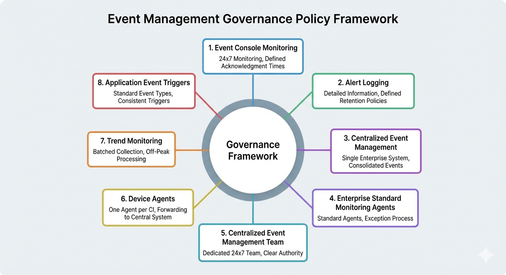

# Chapter 16: Policies and Standards


## Introduction

Policies and standards establish the foundational governance framework that transforms Event Management from an operational activity into a strategic enterprise capability. While Control Objectives (Chapter 15) define what must be achieved, policies define organizational mandates and strategic decisions that enable consistent, enterprise-wide Event Management implementation. Standards provide the technical specifications and architectural guidelines that ensure all Event Management implementations comply with enterprise governance requirements and deliver predictable, measurable results.

In mature organizations, Event Management cannot succeed as a siloed activity with inconsistent tools, fragmented processes, and decentralized decision-making. Enterprise-scale IT environments require unified visibility, centralized coordination, and standardized approaches. This chapter establishes eight critical policies that mandate centralization, standardization, and continuous improvement, along with comprehensive guidance on standards development, policy governance, and exception management processes.

These policies are not suggestions—they are mandatory requirements for Event Management success. Organizations that implement these policies achieve higher operational efficiency, improved service availability, reduced costs, and enhanced compliance posture. Those that fail to establish clear policies face tool sprawl, monitoring gaps, inconsistent event handling, and inability to demonstrate governance to auditors and regulators. This chapter provides the complete framework for establishing, implementing, governing, and enforcing Event Management policies and standards.

## Policy Framework Overview



*Figure 16.1: Event Management Governance Policy Framework - This circular framework illustrates the eight core governance policies essential for Event Management success. Positioned around a central Governance Framework hub, the policies address: (1) Event Console Monitoring requiring 24x7 coverage with defined acknowledgment times, (2) Alert Logging mandating detailed information and retention policies, (3) Centralized Event Management requiring a single enterprise system with consolidated events, (4) Enterprise Standard Monitoring Agents specifying standard agents with exception processes, (5) Centralized Event Management Team establishing a dedicated 24x7 team with clear authority, (6) Device Agents ensuring one agent per CI forwarding to the central system, (7) Trend Monitoring requiring batched collection and off-peak processing, and (8) Application Event Triggers mandating standard event types with consistent triggers. Together, these policies create comprehensive governance ensuring consistent, enterprise-wide Event Management implementation.*

### The Role of Policies in Event Management

Policies serve as strategic directives that establish enterprise-wide requirements and decision-making authority. Unlike procedures (which define how to perform activities) or standards (which specify technical requirements), policies answer fundamental questions about organizational structure, resource allocation, and strategic direction. Event Management policies address critical decisions including centralization vs. decentralization, standardization vs. diversity, and mandatory vs. optional participation.

Effective policies share several characteristics:

- **Mandatory:** Policies are not optional; they require compliance across the organization
- **Strategic:** Policies reflect executive decisions about organizational direction
- **Enduring:** Policies remain stable over time, changing only with strategic shifts
- **Measurable:** Policy compliance can be objectively verified and measured
- **Supported:** Policies have executive sponsorship and enforcement mechanisms

### Policy Hierarchy and Relationships

Event Management policies exist within a broader governance hierarchy that includes:

1. **Corporate Policies:** Enterprise-wide directives (security, compliance, risk management)
2. **IT Policies:** Technology governance (architecture standards, service management)
3. **Process Policies:** ITSM process-specific requirements including Event Management
4. **Technical Standards:** Detailed specifications implementing policy requirements
5. **Procedures:** Step-by-step instructions for executing activities within policy boundaries

Event Management policies must align with higher-level policies while providing sufficient specificity to guide Event Management implementation decisions. For instance, a corporate policy requiring centralized IT service management might be implemented through Event Management Policy 5 (Centralized Event Management Team), which in turn drives technical standards for event routing and team structure.

### Policy Implementation Approach

Successful policy implementation requires a phased approach:

**Phase 1: Policy Definition and Approval (1-2 months)**
- Draft policy statements based on organizational requirements and best practices
- Review with stakeholders including Event Management, IT Architecture, Security, and Compliance
- Obtain executive approval and publish policies

**Phase 2: Standards Development (2-3 months)**
- Define technical standards that implement policy requirements
- Document configuration specifications, architectural patterns, and compliance criteria
- Review and approve standards through governance process

**Phase 3: Implementation Planning (1-2 months)**
- Assess current state against policy requirements
- Identify gaps and compliance risks
- Develop remediation plans with timelines and resource requirements

**Phase 4: Implementation Execution (3-12 months)**
- Deploy technical solutions to achieve policy compliance
- Migrate existing systems to compliant configurations
- Train staff on policy requirements and compliance procedures

**Phase 5: Compliance Monitoring (Ongoing)**
- Establish compliance reporting and metrics
- Conduct periodic audits to verify ongoing compliance
- Address exceptions and non-compliance through governance process

## Policy 1: 24×7 Event Console Monitoring

### Policy Statement

The Event Management console must be monitored by qualified Event Analysts 24 hours per day, 7 days per week, including weekends and holidays, to ensure continuous detection and response to events requiring human intervention.

### Purpose and Rationale

Continuous console monitoring is foundational to effective Event Management. While automation handles many events, human expertise remains essential for complex situations, pattern recognition, and decisions requiring business context. A monitoring gap of even a few hours can allow critical events to escalate into major incidents, resulting in service disruptions, business impact, and potential regulatory violations.

This policy reflects the strategic decision that Event Management is a critical IT capability requiring the same continuous operational discipline as network operations, data center management, and security operations. Organizations implementing this policy demonstrate commitment to proactive IT operations and rapid response to issues before they impact business services.

### Scope and Requirements

**Scope:** This policy applies to all Event Management console operations where events require human evaluation, decision-making, or action beyond automated responses.

**Specific Requirements:**

1. **Continuous Coverage:** Qualified Event Analysts must have direct visibility to the Event Management console at all times, 24×7×365.

2. **Minimum Staffing Levels:** Sufficient Event Analysts must be scheduled to ensure coverage during shift transitions, breaks, and unexpected absences. Minimum two analysts during peak business hours; minimum one analyst during off-hours, with escalation backup.

3. **Maximum Response Times:** Analysts must acknowledge new events within defined timeframes (Critical: 5 minutes, Warning: 15 minutes, Informational: 60 minutes).

4. **Console Monitoring Standards:** The primary Event Management console must be continuously visible on analyst workstations with audio/visual alerts enabled for critical events.

5. **Break and Shift Procedures:** Formal handoff procedures must ensure console coverage during analyst breaks and shift changes with no monitoring gaps.

6. **Qualification Requirements:** All analysts providing 24×7 coverage must complete Event Management training and demonstrate competency in event evaluation, escalation procedures, and critical system knowledge.

### Implementation Guidance

Organizations implementing Policy 1 should address the following:

**Staffing Model Options:**
- **Follow-the-Sun Model:** Regional teams providing coverage during local business hours with handoffs across time zones
- **Dedicated Shifts Model:** Three 8-hour shifts or two 12-hour shifts providing continuous coverage from a single location
- **Hybrid Model:** Core business hours staffed locally; off-hours coverage outsourced to managed service provider

**Coverage Scheduling:**
- Develop shift schedules ensuring 100% coverage with overlap during handoff periods
- Plan for holidays, vacations, training, and unexpected absences
- Establish on-call rotation for backup coverage
- Document minimum staffing requirements for different times (business hours vs. off-hours)

**Technology Enablers:**
- Implement redundant console access ensuring continuity if primary workstation fails
- Deploy mobile console access allowing remote monitoring during emergencies
- Configure escalation alerts that trigger if console acknowledgments fall outside response time requirements
- Establish communication channels for rapid escalation to on-call resources

### Compliance Measurement

Organizations can measure Policy 1 compliance through:

**Console Coverage Rate:**
```
(Hours with Qualified Analyst Monitoring / Total Hours in Period) × 100
```
**Target:** 100% (zero gaps in coverage)

**Event Response Time Compliance:**
```
(Events Acknowledged Within Target / Total Events Requiring Acknowledgment) × 100
```
**Target:** ≥95% for Critical events, ≥90% for Warning events

**Shift Handoff Completion Rate:**
```
(Shifts with Documented Handoff / Total Shifts) × 100
```
**Target:** 100%

**Coverage Gap Incidents:** Number of instances where console monitoring lapsed (Target: 0)

### Exception Process

Exceptions to Policy 1 are rarely justified but may be considered in these scenarios:

- **Testing/Non-Production Environments:** Development and test environments may have business-hours-only monitoring
- **Planned Maintenance Windows:** Short-term coverage reduction during major system maintenance (requires risk acceptance)
- **Phase-In Period:** New Event Management implementations may phase in 24×7 coverage over 3-6 months

All exceptions require documented risk assessment, compensating controls (such as automated escalation), and formal approval by the Event Management Process Owner and IT Director.

## Policy 2: Alert Logging Requirements and Data Retention

### Policy Statement

Every alert generated by monitoring tools must be logged with complete detail information required for analysis and trending, and event data must be retained according to regulatory, operational, and audit requirements.

### Purpose and Rationale

Comprehensive event logging serves multiple critical purposes. First, it provides the audit trail necessary for compliance, root cause analysis, and incident investigation. Second, it enables trend analysis that drives continuous service improvement and capacity planning. Third, it ensures data availability for retrospective analysis when new patterns emerge or problems are identified months after event occurrence.

Organizations that log only "failure" events or implement incomplete logging lose critical context, making trend analysis impossible and leaving gaps in audit trails. This policy mandates that even successful operational activities (Informational Events) are logged, ensuring complete visibility into IT operations and supporting predictive capabilities that prevent incidents before they occur.

### Scope and Requirements

**Scope:** This policy applies to all monitoring tools, agents, and systems that generate events within the Event Management scope.

**Logging Requirements:**

1. **Universal Logging:** All events generated by monitoring tools must be logged to the central Event Management platform, regardless of event type (Informational, Warning, Exception) or automatic closure status.

2. **Minimum Data Elements:** Every event log entry must include:
   - Timestamp (event detection time)
   - Source CI (configuration item generating the event)
   - Event type and category
   - Severity/priority
   - Detailed event message and description
   - Threshold values (if applicable)
   - Correlation ID (if part of correlated event group)
   - Response actions taken (manual or automated)
   - Closure code and closure timestamp
   - Related incident/problem/change records

3. **Data Quality Standards:** Logged data must be complete, accurate, and structured to enable automated analysis and reporting.

4. **Real-Time Logging:** Events must be logged immediately upon detection with maximum 60-second latency between event generation and logging.

**Data Retention Requirements:**

1. **Minimum Retention Periods:**
   - **Active Events:** Retained indefinitely until closed
   - **Closed Events:** Minimum 13 months for operational trending
   - **Archived Events:** Minimum 7 years for regulatory compliance
   - **Audit-Critical Events:** Permanent retention or per regulatory requirement

2. **Archive Strategy:** Events older than 13 months must be archived to secondary storage while remaining accessible for compliance and audit purposes.

3. **Deletion Controls:** Event data deletion must follow documented procedures with approval requirements and audit logging of deletion activities.

### Implementation Guidance

**Logging Architecture:**

Organizations should implement tiered logging architecture:

- **Tier 1 - Active Database:** Events from last 3 months stored in high-performance database supporting real-time queries and operational dashboards
- **Tier 2 - Near-Line Storage:** Events from 3-13 months stored in standard database supporting trend analysis and reporting
- **Tier 3 - Archive Storage:** Events older than 13 months compressed and stored in low-cost archive storage with retrieval SLA of 24-48 hours

**Data Quality Controls:**

- Implement validation rules ensuring required fields are populated before event logging
- Configure monitoring tools to include detailed context in event messages
- Establish data quality metrics and periodic audits of logged event data
- Reject or flag events with incomplete data for investigation and remediation

**Storage Capacity Planning:**

Organizations must plan storage capacity based on event generation rates:

```
Annual Storage Requirement (TB) = (Average Events per Day × 365 × Average Event Size in KB) / 1,000,000
```

For example: 50,000 events/day × 365 days × 2 KB = 36.5 GB/year (uncompressed)

With 7-year retention and considering growth, organizations should plan for 500GB-1TB of total event storage.

### Compliance Measurement

**Logging Completeness:**
```
(Events Logged / Events Generated) × 100
```
**Target:** 100% (no event loss)

**Data Quality Score:**
```
(Events with All Required Fields Complete / Total Events Logged) × 100
```
**Target:** ≥98%

**Retention Compliance:**
- Percentage of closed events retained for minimum 13 months: 100%
- Percentage of archived events retained for minimum 7 years: 100%
- Number of unauthorized deletions: 0

**Logging Latency:**
```
Average time between event generation and event logging
```
**Target:** ≤60 seconds for 95th percentile

### Exception Process

Exceptions to Policy 2 are limited to:

- **Test Events:** Events generated during testing may be logged to separate test database with shorter retention
- **High-Volume Informational Events:** Events with no operational or compliance value may be excluded with documented justification (example: successful heartbeat checks every 30 seconds)
- **Privacy Concerns:** Events containing PII or sensitive data may have reduced retention periods per privacy regulations

Exceptions require Event Manager approval and documentation of compensating controls.

## Policy 3: Centralized Event Management Platform

### Policy Statement

The organization must implement and maintain a single, centralized Event Management platform that serves as the system of record for all event data, and all monitoring tools must integrate with this central system.

### Purpose and Rationale

Centralization is mandatory for Event Management success. Organizations with multiple, disconnected event management systems face insurmountable challenges: inability to correlate events across domains, no unified view of IT health, duplicated effort investigating the same issues, inconsistent handling procedures, and impossible audit and compliance demonstration.

This policy reflects the strategic decision that Event Management is an enterprise capability requiring unified visibility and centralized coordination. A centralized platform enables cross-domain correlation (identifying that a network event, database event, and application event are all symptoms of a single root cause), provides single-pane-of-glass visibility to all IT operations, and ensures consistent application of prioritization and escalation rules across all technology domains.

### Scope and Requirements

**Scope:** This policy applies to all monitoring tools, domain-specific management platforms, and event sources across the enterprise IT environment.

**Specific Requirements:**

1. **Single Platform:** The organization must designate one Event Management platform as the enterprise system of record for event data and event correlation.

2. **Universal Integration:** All monitoring tools, management platforms, and event sources must integrate with the centralized Event Management platform. No tool may operate in isolation.

3. **Real-Time Integration:** Event data must flow to the central platform in real-time (maximum 5-minute latency) to enable timely detection and correlation.

4. **Bidirectional Communication:** Integration must support bidirectional flows including events from tools to platform AND acknowledgments, updates, and actions from platform to tools.

5. **Data Normalization:** All integrated tools must map event data to standardized Event Management data model ensuring consistent event attributes across all sources.

6. **Integration Standards:** All integrations must follow enterprise integration standards including security, authentication, error handling, and monitoring of integration health.

### Implementation Guidance

**Platform Selection Criteria:**

Organizations selecting a centralized Event Management platform should evaluate:

- **Scalability:** Capacity to handle enterprise event volumes (consider peak loads of 50,000+ events/hour)
- **Integration Capabilities:** Pre-built connectors for common monitoring tools and open APIs for custom integrations
- **Correlation Engine:** Advanced event correlation supporting time-based, topology-based, and pattern-based correlation
- **Automation Framework:** Robust workflow automation supporting auto-remediation, enrichment, and orchestration
- **Reporting and Analytics:** Comprehensive reporting, dashboards, and trend analysis capabilities
- **High Availability:** Redundant architecture ensuring 99.9%+ platform availability

**Integration Architecture Patterns:**

1. **Direct Integration:** Monitoring tool connects directly to Event Management platform via API
2. **Message Bus Integration:** Monitoring tools publish events to enterprise message bus; Event Management subscribes to relevant topics
3. **Polling Integration:** Event Management platform polls monitoring tool APIs at regular intervals
4. **Agent-Based Integration:** Lightweight agents installed on monitoring tools forward events to central platform

**Migration Strategy for Existing Environments:**

Organizations with existing, decentralized event management must plan phased migration:

**Phase 1:** Deploy central platform and establish integration standards
**Phase 2:** Integrate critical production monitoring tools (targeting 40% coverage)
**Phase 3:** Integrate standard infrastructure monitoring (targeting 80% coverage)
**Phase 4:** Integrate remaining specialized tools (targeting 95%+ coverage)
**Phase 5:** Decommission legacy platforms and consolidate operations

### Compliance Measurement

**Integration Coverage:**
```
(Number of Monitoring Tools Integrated / Total Number of Monitoring Tools) × 100
```
**Target:** ≥95%

**Event Volume Coverage:**
```
(Events Received at Central Platform / Total Events Generated) × 100
```
**Target:** ≥98%

**Integration Health:**
```
(Integrations Operating Within SLA / Total Integrations) × 100
```
**Target:** ≥99% (maximum 1% with connectivity or performance issues)

**Integration Latency:** Average time from event generation at source to receipt at central platform
**Target:** ≤5 minutes for 95th percentile

### Exception Process

Exceptions to Policy 3 are limited and require strong justification:

- **Regulatory Segregation:** Systems with regulatory requirements preventing integration (example: PCI DSS cardholder data environments) may maintain separate event management with documented compensating controls
- **Temporary Pilot Tools:** Tools being evaluated may operate independently for maximum 90 days during pilot phase
- **Decommissioned Systems:** Systems scheduled for retirement within 90 days may be exempted from integration requirements

All exceptions require documented risk assessment, mitigation plan, and approval by Event Management Architect and IT Architecture team.

## Policy 4: Enterprise Standard Monitoring Agents

### Policy Statement

The organization must establish and maintain a defined set of enterprise-standard monitoring agents for each technology domain, and all new monitoring implementations must use approved standard agents unless an exception is granted.

### Purpose and Rationale

Agent standardization is critical for operational efficiency, supportability, and cost management. Organizations with proliferated monitoring agents face significant challenges: increased licensing costs, fragmented expertise requiring staff to master multiple tools, inconsistent monitoring coverage across similar systems, complex troubleshooting when multiple agents conflict, and inability to leverage economies of scale in tool deployment and support.

This policy mandates standardization while recognizing that no single monitoring tool can address all requirements. Organizations typically need 5-8 standard agents covering different technology domains (infrastructure, applications, databases, network, cloud, security). The policy requires deliberate selection of standard tools rather than allowing ad-hoc adoption, ensuring organizational expertise, support infrastructure, and architectural integration are in place before enterprise deployment.

### Scope and Requirements

**Scope:** This policy applies to all monitoring agents deployed on Configuration Items (servers, applications, databases, network devices, etc.) to collect metrics, generate events, or report status to the Event Management platform.

**Specific Requirements:**

1. **Standard Agent Registry:** The Event Management Architect must maintain a registry of approved, enterprise-standard monitoring agents for each technology domain.

2. **Technology Domain Coverage:** Standard agents must be defined for at a minimum:
   - Infrastructure monitoring (servers, storage)
   - Network monitoring (routers, switches, firewalls)
   - Application monitoring (web applications, middleware)
   - Database monitoring
   - Cloud platform monitoring (AWS, Azure, GCP)
   - Container/orchestration monitoring (Docker, Kubernetes)

3. **Mandatory Use:** New monitoring implementations must use standard agents unless an exception is formally approved.

4. **Lifecycle Management:** Standard agents must be kept current with vendor-supported versions, security patches, and configuration updates.

5. **Decommissioning Non-Standard Agents:** Organizations must develop and execute plans to replace non-standard agents with approved standards over time.

### Implementation Guidance

**Standard Agent Selection Process:**

Organizations should establish a formal process for evaluating and approving standard agents:

1. **Requirements Definition:** Document functional requirements, technical requirements, and integration requirements for the technology domain
2. **Tool Evaluation:** Assess candidate tools against requirements, including proof-of-concept testing
3. **Architecture Review:** Validate alignment with enterprise architecture standards and integration with Event Management platform
4. **Cost Analysis:** Evaluate total cost of ownership including licensing, implementation, training, and ongoing support
5. **Approval and Designation:** Formally approve selected tool as enterprise standard and add to registry

**Agent Registry Structure:**

The Standard Agent Registry should document for each approved agent:

- **Technology Domain:** Infrastructure, network, application, database, cloud, etc.
- **Agent Name and Version:** Specific tool name and minimum approved version
- **Vendor:** Agent vendor and licensing model
- **Use Cases:** Primary use cases and CI types where agent should be deployed
- **Integration Method:** How agent integrates with central Event Management platform
- **Support Model:** Who provides L1/L2/L3 support for the agent
- **Exclusions:** CI types or scenarios where this agent should not be used
- **Exception Process:** How to request exceptions for non-standard alternatives

**Example Standard Agent Registry:**

| Technology Domain | Standard Agent | Version | Use Cases | Support Team |
|-------------------|----------------|---------|-----------|--------------|
| Infrastructure Monitoring | Zabbix Agent | 6.0+ | Linux/Windows servers, basic infrastructure | Platform Team |
| Application Performance | New Relic APM | Current | Web applications, application performance | Application Team |
| Network Monitoring | SolarWinds NPM | 2024.1+ | Routers, switches, SNMP devices | Network Team |
| Database Monitoring | SolarWinds DPA | 2024.1+ | Oracle, SQL Server, MySQL databases | Database Team |
| Cloud Infrastructure | Native Cloud Monitoring | N/A | AWS CloudWatch, Azure Monitor | Cloud Team |
| Container Monitoring | Prometheus/Grafana | 2.45+/9.0+ | Kubernetes, Docker containers | Platform Team |

### Compliance Measurement

**Standardization Rate:**
```
(CIs Monitored by Standard Agents / Total Monitored CIs) × 100
```
**Target:** ≥90% within 18 months of policy implementation

**New Implementation Compliance:**
```
(New Monitoring Deployments Using Standard Agents / Total New Deployments) × 100
```
**Target:** ≥95%

**Agent Version Currency:**
```
(Standard Agents on Supported Versions / Total Standard Agent Deployments) × 100
```
**Target:** ≥95%

**Exception Rate:**
```
(Approved Exceptions / Total Monitoring Implementations) × 100
```
**Target:** ≤10%

### Exception Process

Organizations may approve exceptions to Policy 4 in these circumstances:

- **Unique Technology Requirements:** Specialized systems requiring monitoring capabilities not available in standard agents
- **Vendor Requirements:** Vendor-supported systems where vendor mandates specific monitoring tools for warranty/support
- **Temporary Gaps:** New technology adopted before standard agent selection is complete (exception limited to 6 months)
- **Sunset Systems:** Systems scheduled for decommissioning within 12 months may retain existing non-standard agents

Exception requests must include:
- Business/technical justification for non-standard agent
- Analysis of why standard agent cannot meet requirements
- Implementation and ongoing support plan
- Estimated duration of exception
- Plan to migrate to standard (if applicable)

Exceptions require approval from Event Management Architect and appropriate domain architect (application, infrastructure, network, etc.).

## Policy 5: Centralized Event Management Team

### Policy Statement

The organization must establish and maintain a dedicated, centralized Event Management team with defined roles, responsibilities, and operating procedures to ensure consistent event handling and efficient resource utilization.

### Purpose and Rationale

Centralization of the Event Management team is strategically critical for operational efficiency and service quality. Distributed models where each IT team manages their own events lead to inefficiencies, inconsistent practices, unclear accountability, duplication of effort, and inability to optimize staffing. A centralized team enables consistent application of procedures, efficient resource utilization through workload balancing, development of specialized expertise, clear accountability for event handling, and enterprise-wide visibility into operational status.

This policy reflects the organizational decision that Event Management is a professional discipline requiring dedicated resources rather than an ad-hoc activity performed part-time by various IT staff. Mature organizations recognize that centralizing routine event handling frees technical specialists to focus on complex problem-solving, development, and strategic initiatives rather than monitoring consoles and responding to routine alerts.

### Scope and Requirements

**Scope:** This policy applies to all Event Management operational activities including console monitoring, event evaluation, initial triage, routing, and coordination of event resolution.

**Specific Requirements:**

1. **Dedicated Team:** The organization must establish a formal Event Management team with dedicated staff (Event Manager, Event Analysts, Event Coordinators) as defined in Chapter 6.

2. **Centralized Operations:** Event Management operational activities must be performed by the centralized team rather than distributed across multiple IT teams.

3. **Clear Boundaries:** The policy must define clear boundaries between Event Management team responsibilities (detection, evaluation, triage, coordination) and resolver team responsibilities (technical troubleshooting, remediation, root cause analysis).

4. **Skill Requirements:** Event Management team members must meet minimum qualification requirements including process training, system knowledge, and demonstrated competency.

5. **Operating Procedures:** The centralized team must operate according to documented procedures ensuring consistent event handling across all shifts and team members.

6. **Performance Management:** Team performance must be measured against defined KPIs including event handling time, escalation accuracy, and SLA compliance.

### Implementation Guidance

**Team Structure Options:**

Organizations have several options for structuring the centralized Event Management team:

**Option 1: Fully Dedicated Team**
- Dedicated Event Management staff who perform only EM activities
- Optimal for large organizations (1000+ servers, 50,000+ events/month)
- Enables deep expertise and process optimization
- Requires significant headcount investment

**Option 2: Shared Services Model**
- Event Management team also provides L1 Service Desk functions
- Efficient for medium organizations where event volume alone doesn't justify dedicated staff
- Requires cross-training and workload management

**Option 3: Managed Service Provider**
- Event Management operations outsourced to specialized MSP
- Viable for organizations lacking 24×7 internal staffing
- Requires strong vendor management and clear service level agreements

**Organizational Positioning:**

The Event Management team should report to IT Operations leadership, with the Event Manager reporting to the IT Operations Manager or Director. This positioning ensures:
- Alignment with operational priorities
- Authority to escalate to appropriate resolver teams
- Integration with Incident Management and Problem Management
- Access to operational resources and support

**Staffing Considerations:**

Organizations should determine staffing levels based on:

```
Required FTEs = (Event Volume × Average Handling Time) / (Available Hours per FTE × Target Utilization)
```

Example calculation:
- Event volume requiring human action: 10,000 events/month = 333 events/day
- Average handling time: 10 minutes per event = 3,330 minutes/day = 55.5 hours/day
- Available hours per FTE: 8 hours/shift × 70% utilization = 5.6 productive hours/FTE/shift
- Required staffing: 55.5 hours/day ÷ 5.6 hours/FTE = 10 FTEs
- With three shifts (24×7): 10 FTEs per shift × 3 shifts = 30 FTEs total
- Adding leave/training coverage (20%): 30 × 1.20 = 36 FTEs

### Compliance Measurement

**Centralization Rate:**
```
(Events Handled by Centralized Team / Total Events Requiring Human Action) × 100
```
**Target:** ≥95%

**Team Qualification Rate:**
```
(Team Members Meeting Qualification Requirements / Total Team Members) × 100
```
**Target:** 100%

**Procedure Adherence:**
```
(Events Handled According to Documented Procedures / Total Events Handled) × 100
```
**Target:** ≥95% (measured through quality audits)

**Escalation Accuracy:**
```
(Events Escalated to Correct Team / Total Escalations) × 100
```
**Target:** ≥90%

### Exception Process

Exceptions to Policy 5 are extremely limited:

- **Specialized Technical Events:** Certain highly specialized events may require direct escalation to technical teams (example: security events escalating directly to Security Operations)
- **Phase-In Period:** Organizations implementing centralized teams may phase in over 6-12 months, transitioning domain-by-domain
- **Follow-the-Sun Handoffs:** Organizations with global operations may have regional teams operating centrally within their regions

All exceptions require documented justification, clear handoff procedures, and formal approval by IT Operations leadership.

## Policy 6: Single Monitoring Agent per CI

### Policy Statement

Each Configuration Item (CI) must be monitored by a maximum of one monitoring agent, and that agent must report to the centralized Event Management system, preventing monitoring conflicts and ensuring standardization.

### Purpose and Rationale

Multiple agents monitoring the same CI create significant problems: monitoring conflicts where agents interfere with each other's data collection, performance degradation from redundant monitoring overhead, alert duplication creating noise and confusion, inconsistent data from different agents measuring the same metric differently, and unnecessary licensing costs paying for multiple tools to monitor the same system.

This policy enforces discipline in monitoring architecture, ensuring each CI has exactly one designated monitoring agent responsible for comprehensive monitoring of that CI. This does not mean organizations can only have one monitoring tool—rather, it means each CI is assigned to the most appropriate tool for that technology type, and that tool exclusively handles monitoring for that CI.

### Scope and Requirements

**Scope:** This policy applies to all Configuration Items (servers, network devices, applications, databases, etc.) within Event Management monitoring scope.

**Specific Requirements:**

1. **Single Agent Rule:** Each CI must have exactly one monitoring agent deployed for infrastructure/platform monitoring.

2. **Agent Assignment:** The organization must maintain documentation showing which standard agent is assigned to monitor each CI category.

3. **Conflict Prevention:** Before deploying a monitoring agent to a CI, the organization must verify no existing agent is already monitoring that CI.

4. **Specialized Monitoring Coexistence:** Specialized monitoring tools (application performance monitoring, security monitoring) may coexist with infrastructure monitoring agents as long as they monitor different aspects without overlap or conflict.

5. **Deconfliction Process:** When conflicts are discovered, the organization must follow a defined process to determine which agent should remain and remove the conflicting agent.

### Implementation Guidance

**Agent Assignment Matrix:**

Organizations should document agent assignment rules:

| CI Type | Standard Agent | Monitoring Scope |
|---------|----------------|------------------|
| Linux Servers | Zabbix Agent | OS, disk, CPU, memory, processes |
| Windows Servers | Zabbix Agent | OS, disk, CPU, memory, services |
| Network Devices | SolarWinds NPM | Device availability, interface status, SNMP metrics |
| Oracle Databases | SolarWinds DPA | Database performance, SQL metrics, sessions |
| Web Applications | New Relic APM | Application performance, transaction times, errors |
| AWS Resources | CloudWatch | Cloud resource metrics, service health |

**Specialized Monitoring Coexistence:**

Policy 6 allows specialized monitoring to coexist with infrastructure monitoring when they serve different purposes:

- **Infrastructure Agent:** Monitors OS, hardware, basic service availability (Zabbix)
- **Application Performance Agent:** Monitors application transactions, user experience, code-level performance (New Relic)
- **Security Agent:** Monitors security events, access attempts, vulnerability status (Security tool)

These agents coexist because they monitor different aspects without overlap. Organizations must document what each agent monitors to prevent duplication.

**Conflict Resolution Process:**

When monitoring conflicts are discovered:

1. **Identify Conflict:** Determine which agents are monitoring the same CI
2. **Assess Impact:** Evaluate if conflict is causing problems (duplicated alerts, performance impact, data inconsistencies)
3. **Determine Correct Agent:** Based on standard agent assignments, determine which agent should monitor this CI
4. **Remove Incorrect Agent:** Uninstall or disable the non-standard agent
5. **Validate:** Confirm monitoring is functioning correctly with single agent
6. **Document:** Update CMDB and monitoring documentation to reflect correct configuration

### Compliance Measurement

**Single Agent Compliance:**
```
(CIs with Exactly One Infrastructure Agent / Total Monitored CIs) × 100
```
**Target:** ≥95%

**Conflict Rate:**
```
Number of CIs with Multiple Conflicting Agents / Total Monitored CIs
```
**Target:** ≤5%

**Documentation Currency:**
```
(CIs with Current Agent Assignment Documentation / Total Monitored CIs) × 100
```
**Target:** ≥98%

### Exception Process

Exceptions to Policy 6 may be approved for:

- **Migration Periods:** During migration from one monitoring tool to another, both agents may coexist temporarily (maximum 30 days per CI)
- **Specialized Requirements:** Unique CI requirements where single standard agent cannot provide required monitoring depth
- **Vendor Requirements:** Situations where vendor support requires vendor-specific monitoring tool in addition to enterprise standard

Exceptions require documented justification and time-limited approval.

## Policy 7: Trend Monitoring and Analysis

### Policy Statement

The Event Management team must perform regular trend analysis of event data to identify patterns, predict potential issues, and initiate Continuous Service Improvement (CSI) activities, directly supporting Control Objective EM-C08.

### Purpose and Rationale

Event Management's strategic value extends beyond reactive response to events—it includes proactive identification of trends that predict future problems and opportunities for improvement. Organizations that analyze only individual events miss critical insights visible only when examining patterns across time, systems, and event types. Trend analysis enables predictive operations, supports capacity planning, identifies recurring problems requiring root cause analysis, and validates the effectiveness of automation and improvement initiatives.

This policy mandates that trend analysis is not optional or ad-hoc but rather a structured, regular activity with defined deliverables, review cadence, and action-taking requirements. Organizations implementing this policy transform event data from reactive alerts into strategic intelligence driving operational excellence.

### Scope and Requirements

**Scope:** This policy applies to all closed event data within the retention period, with primary focus on data from the most recent 13 months.

**Specific Requirements:**

1. **Regular Analysis Cadence:** Trend analysis must be performed at least monthly, with results reviewed in formal management review sessions per Control Objective EM-C04.

2. **Defined Analysis Dimensions:** Trend analysis must examine multiple dimensions including:
   - Event volume trends over time
   - Event category distribution
   - Event priority distribution
   - Closure code trends (especially False Positives, Auto Actions, Incidents)
   - Event source/CI trends
   - Time-of-day and day-of-week patterns
   - Seasonal patterns
   - Event-to-incident conversion rates

3. **Actionable Insights:** Trend analysis reports must identify specific, actionable insights with recommendations for improvement initiatives.

4. **CSI Initiative Tracking:** Insights leading to CSI initiatives must be tracked through implementation and outcome measurement.

5. **Reporting Requirements:** Trend analysis findings must be documented in standardized reports and presented to Event Management stakeholders and IT leadership.

### Implementation Guidance

**Monthly Trend Analysis Activities:**

Organizations should establish a monthly trend analysis process:

**Week 1 of Month:** Data collection and analysis
- Extract previous month's closed event data
- Generate standard trend analysis reports
- Perform comparative analysis (month-over-month, year-over-year)
- Identify anomalies and notable patterns

**Week 2 of Month:** Insight development
- Analyze patterns for actionable insights
- Correlate trends with known incidents or changes
- Develop preliminary recommendations
- Draft trend analysis report

**Week 3 of Month:** Review and action planning
- Present findings in Monthly Process Review meeting
- Discuss insights with stakeholders
- Prioritize improvement opportunities
- Assign action items and owners

**Week 4 of Month:** CSI initiative launch
- Document CSI initiatives in tracking system
- Begin implementation of approved improvements
- Update monitoring configurations based on findings

**Key Trend Analysis Patterns:**

Organizations should specifically look for these patterns:

1. **Rising False Positive Trends:** Increasing false positive events indicate monitoring threshold tuning needed
2. **Event Storms:** Recurring patterns of high event volumes at specific times suggest correlation opportunities
3. **Declining Auto-Resolution Rates:** Decreasing automatic resolution success suggests scripts need updating
4. **Category Drift:** Changes in event category distribution may indicate new monitoring or changing infrastructure
5. **Seasonal Patterns:** Business cycle impacts on event patterns inform capacity planning
6. **Incident Conversion Hotspots:** Specific event types frequently escalating to incidents indicate areas needing proactive monitoring enhancement

**Trend Analysis Tools and Techniques:**

- **Statistical Analysis:** Calculate mean, median, standard deviation to identify outliers
- **Comparative Analysis:** Compare periods (MoM, QoQ, YoY) to identify trends
- **Visualization:** Use line charts, bar charts, and heat maps to make patterns visible
- **Correlation Analysis:** Identify relationships between different event types or event trends and incident trends
- **Predictive Modeling:** Apply basic predictive techniques to forecast future event volumes

### Compliance Measurement

**Trend Analysis Completion:**
```
(Months with Completed Trend Analysis / Total Months) × 100
```
**Target:** 100%

**CSI Initiative Launch Rate:**
```
Number of CSI Initiatives Launched from Trend Analysis per Quarter
```
**Target:** ≥3 per quarter

**Insight Quality:**
```
(Insights Leading to Implemented Improvements / Total Insights Identified) × 100
```
**Target:** ≥30%

**Management Review Participation:**
```
(Months with Trend Analysis Reviewed in Management Meeting / Total Months) × 100
```
**Target:** 100%

## Policy 8: Management Policy Framework and Governance

### Policy Statement

The organization must establish and maintain a comprehensive management policy framework for Event Management that includes policy lifecycle management, standards documentation, exception processes, and compliance monitoring.

### Purpose and Rationale

Policies without governance are merely suggestions. This meta-policy establishes the governance framework that ensures Policies 1-7 are not just documented but actively implemented, monitored, enforced, and evolved over time. Organizations need structured approaches to policy creation, approval, communication, enforcement, exception handling, and periodic review to ensure policies remain relevant and effective as the organization and technology environment evolve.

This policy framework ensures Event Management governance is sustainable, adaptable, and integrated with broader IT governance and enterprise risk management processes. It establishes accountability for policy compliance and provides clear escalation paths when policy conflicts arise or circumstances require policy adaptation.

### Scope and Requirements

**Scope:** This policy applies to all Event Management policies (Policies 1-7 and any additional policies adopted by the organization).

**Specific Requirements:**

1. **Policy Ownership:** Each policy must have a designated Policy Owner responsible for policy maintenance, interpretation, and compliance monitoring.

2. **Policy Lifecycle Management:** Policies must follow a structured lifecycle including development, approval, publication, implementation, compliance monitoring, review, and update/retirement.

3. **Standards Documentation:** For each policy requiring technical implementation, supporting standards documents must be created specifying technical requirements, configuration parameters, and compliance criteria.

4. **Exception Process:** A formal exception request and approval process must be documented and followed for all policy exceptions.

5. **Compliance Monitoring:** Policy compliance must be measured using defined metrics and reported to IT governance regularly (minimum quarterly).

6. **Review Cadence:** All policies must be reviewed at least annually to ensure continued relevance and effectiveness.

### Implementation Guidance

**Policy Lifecycle Process:**

**1. Development Phase**
- Identify need for new policy or policy update
- Draft policy statement, purpose, requirements, and implementation guidance
- Conduct stakeholder review (Event Management, Architecture, Security, Compliance)
- Revise based on feedback

**2. Approval Phase**
- Submit policy to IT Governance Board or appropriate approval authority
- Present business justification and impact analysis
- Address questions and concerns
- Obtain formal approval

**3. Publication Phase**
- Publish approved policy to policy repository
- Communicate policy to affected stakeholders via multiple channels
- Conduct training sessions on policy requirements
- Update compliance checklists and audit procedures

**4. Implementation Phase**
- Develop implementation plans with timelines
- Assess current state and identify gaps
- Execute remediation activities to achieve compliance
- Provide implementation support and guidance

**5. Compliance Monitoring Phase**
- Establish compliance metrics and reporting
- Conduct periodic compliance assessments
- Address non-compliance through corrective action plans
- Report compliance status to IT governance

**6. Review and Update Phase**
- Conduct annual policy review
- Assess continued relevance and effectiveness
- Identify needed updates based on technology changes, organizational changes, or lessons learned
- Initiate update process or policy retirement if appropriate

**Policy Ownership and Governance Structure:**

| Policy | Policy Owner | Approval Authority | Review Frequency |
|--------|--------------|-------------------|------------------|
| Policy 1: 24×7 Monitoring | Event Manager | IT Operations Director | Annual |
| Policy 2: Alert Logging | Event Manager | IT Operations Director | Annual |
| Policy 3: Centralized Platform | Event Management Architect | IT Architecture Board | Annual |
| Policy 4: Standard Agents | Event Management Architect | IT Architecture Board | Annual |
| Policy 5: Centralized Team | Event Management Process Owner | IT Operations Director | Annual |
| Policy 6: Single Agent per CI | Event Management Architect | IT Architecture Board | Annual |
| Policy 7: Trend Monitoring | Event Manager | IT Operations Director | Annual |
| Policy 8: Policy Framework | Event Management Process Owner | IT Governance Board | Annual |

**Standards Documentation Requirements:**

For each policy requiring technical implementation, create supporting standards documents:

- **Policy 2 Standards:** Event Logging Data Model Standard, Event Retention Standard
- **Policy 3 Standards:** Event Management Platform Integration Standard, Event Data Normalization Standard
- **Policy 4 Standards:** Enterprise Monitoring Agent Standards (per technology domain)
- **Policy 6 Standards:** Agent Assignment Standard, Monitoring Conflict Resolution Standard

Each standards document should include:
- Purpose and scope
- Technical requirements and specifications
- Configuration parameters and templates
- Compliance criteria and validation procedures
- Exception handling guidance
- Version control and change history

### Policy Exception Management Process

**Exception Request Process:**

1. **Request Submission:** Requestor completes exception request form including:
   - Policy being excepted
   - Specific requirement being excepted
   - Business/technical justification
   - Affected systems/CIs
   - Requested exception duration
   - Compensating controls or risk mitigation
   - Plan to achieve compliance (if temporary exception)

2. **Risk Assessment:** Event Management team assesses risk including:
   - Operational risk from non-compliance
   - Compliance/audit risk
   - Security risk
   - Impact on other systems or processes

3. **Approval Decision:** Policy Owner reviews and either:
   - Approves exception with conditions and time limits
   - Approves with requirement for compensating controls
   - Denies exception with explanation
   - Escalates to higher authority if risk is significant

4. **Exception Tracking:** Approved exceptions are logged in exception register including:
   - Exception ID and approval date
   - Affected systems
   - Exception details and justification
   - Approver and approval conditions
   - Expiration date
   - Review requirements

5. **Exception Monitoring:** Active exceptions are reviewed monthly to ensure:
   - Compensating controls remain in place
   - Exception hasn't expired
   - Compliance plan is progressing (for temporary exceptions)
   - Risk level hasn't changed

6. **Exception Closure:** Exceptions are closed when:
   - Exception period expires and compliance is achieved
   - Exception is no longer needed
   - Exception is revoked due to changing circumstances

**Exception Reporting:**

Exception status must be reported quarterly to IT governance including:
- Number of active exceptions by policy
- Number of new exceptions approved in quarter
- Number of exceptions closed in quarter
- Number of expired exceptions requiring renewal or enforcement
- Risk assessment summary of active exceptions

### Compliance Measurement

**Policy Compliance Score:**
```
Weighted average of compliance metrics across all policies
```
**Target:** ≥85% overall compliance within 12 months of policy implementation

**Exception Rate:**
```
(Active Exceptions / Total In-Scope Systems or CIs) × 100
```
**Target:** ≤15%

**Policy Review Currency:**
```
(Policies Reviewed Within Required Timeframe / Total Policies) × 100
```
**Target:** 100%

**Exception Age:**
```
Average duration of active exceptions
```
**Target:** ≤6 months average

## Standards Documentation Framework

### Purpose of Standards

While policies establish organizational mandates and strategic direction, standards provide the detailed technical specifications necessary to implement policies consistently across the enterprise. Standards translate policy intent into concrete requirements that architects, engineers, and administrators can use to configure systems, validate implementations, and demonstrate compliance.

### Standards Development Process

Organizations should follow a structured process for developing Event Management standards:

1. **Requirements Gathering:** Identify technical requirements derived from policies, control objectives, and architectural principles
2. **Current State Analysis:** Document existing approaches and identify gaps
3. **Best Practices Research:** Review industry best practices, vendor recommendations, and peer organization approaches
4. **Draft Standards Development:** Create detailed technical specifications
5. **Stakeholder Review:** Review with implementation teams, architects, and security
6. **Testing and Validation:** Test proposed standards in lab environment
7. **Approval and Publication:** Obtain approval from appropriate governance body and publish

### Standards Content Template

Each Event Management standard should follow a consistent format:

```markdown
# [Standard Name]

## Standard ID: EM-STD-###

## Version: X.Y

## Effective Date: YYYY-MM-DD

## Purpose
[Why this standard exists and what policy/control it supports]

## Scope
[What systems, technologies, or activities this standard applies to]

## Related Policies and Controls
[References to policies and control objectives this standard implements]

## Technical Requirements
[Specific, testable technical requirements]

## Configuration Specifications
[Detailed configuration parameters, templates, and examples]

## Compliance Validation
[How to test/verify compliance with this standard]

## Exception Process
[How to request exceptions to this standard]

## References
[Related documents, vendor documentation, industry standards]

## Document Control
- Owner: [Role/Name]
- Approval Authority: [Role/Name]
- Review Frequency: [Annual/Biannual]
- Next Review Date: [YYYY-MM-DD]
- Change History: [Version, Date, Changes, Approver]
```

### Key Event Management Standards

Organizations implementing Event Management policies should develop these critical standards:

**EM-STD-001: Event Data Model Standard**
- Defines required event attributes
- Specifies data types and validation rules
- Documents event categorization taxonomy
- Establishes event status lifecycle

**EM-STD-002: Event Logging and Retention Standard**
- Specifies logging requirements per event type
- Defines retention periods per regulatory and operational requirements
- Documents archive and retrieval procedures
- Establishes data deletion controls

**EM-STD-003: Event Management Platform Integration Standard**
- Defines integration architecture patterns
- Specifies API requirements and authentication
- Documents data mapping and normalization rules
- Establishes integration monitoring requirements

**EM-STD-004: Monitoring Agent Deployment Standard**
- Documents standard agents per technology domain
- Specifies agent installation and configuration procedures
- Defines agent update and patching requirements
- Establishes agent monitoring and health checks

**EM-STD-005: Event Prioritization Standard**
- Documents Impact and Urgency matrices
- Defines priority calculation algorithms
- Specifies time-of-day and business cycle modifiers
- Establishes priority validation procedures

**EM-STD-006: Event Correlation Standard**
- Defines correlation rules and algorithms
- Documents topology-based correlation requirements
- Specifies time-window correlation parameters
- Establishes correlation testing procedures

**EM-STD-007: Event Automation Standard**
- Documents automation safety controls
- Specifies automation testing and approval requirements
- Defines automation monitoring and rollback procedures
- Establishes automation governance process

**EM-STD-008: Event Management Naming and Labeling Standard**
- Defines naming conventions for event sources
- Specifies labeling requirements for monitoring tools
- Documents tagging standards for correlation and reporting
- Establishes consistency in event message formatting

## Policy Governance and Lifecycle Management

### Governance Structure

Effective policy governance requires clear organizational structure with defined roles and responsibilities:

**Event Management Governance Board:**
- **Composition:** Event Management Process Owner (chair), Event Manager, Event Management Architect, representatives from IT Operations, IT Architecture, Security, and Compliance
- **Frequency:** Quarterly
- **Responsibilities:**
  - Review policy compliance metrics
  - Approve policy updates and new policies
  - Review and approve significant exceptions
  - Address policy conflicts and escalations
  - Ensure alignment with IT governance and enterprise policies

**Policy Owners:**
- **Responsibilities:**
  - Maintain policy documentation
  - Monitor policy compliance
  - Approve routine exceptions
  - Recommend policy updates
  - Support implementation teams
  - Report compliance to governance board

**Event Management Process Owner:**
- **Responsibilities:**
  - Overall accountability for policy framework
  - Escalation point for policy conflicts
  - Liaison to IT Governance Board
  - Champion for policy compliance
  - Strategic direction for policy evolution

### Policy Review and Update Process

Policies must remain current as technology, business requirements, and organizational structure evolve. Organizations should implement structured review processes:

**Annual Scheduled Review:**
- Review all policies for continued relevance
- Assess compliance levels and effectiveness
- Identify needed updates based on lessons learned
- Update policies to reflect technology changes
- Validate policy alignment with higher-level governance

**Triggered Review:**
Policies should be reviewed outside the annual cycle when:
- Significant compliance gaps are identified
- Major technology changes occur (platform migrations, new tools)
- Organizational restructuring affects policy implementation
- Regulatory requirements change
- Audit findings indicate policy deficiencies

**Update Approval Process:**
- Minor updates (clarifications, formatting): Policy Owner approval
- Moderate updates (requirement changes, scope changes): IT Operations Director approval
- Major updates (new requirements, significant changes): IT Governance Board approval

### Policy Communication and Training

Policies only work when stakeholders understand and comply with them. Organizations must establish comprehensive communication and training programs:

**Initial Communication (New Policies):**
- Executive announcement from IT leadership
- Email communication to all affected staff
- Policy publication to policy repository and intranet
- Q&A sessions for implementation teams
- Training sessions covering policy requirements

**Ongoing Communication:**
- Quarterly policy compliance updates
- Annual policy review reminders
- Exception approval notifications
- Policy update announcements

**Training Requirements:**
- All Event Management team members: Comprehensive training on all policies and standards
- IT Operations staff: Awareness training on policies affecting their work
- IT leadership: Executive briefings on policy framework and compliance
- New hires: Policy training as part of onboarding

## Policy Integration with Control Objectives

Event Management policies directly support implementation of Control Objectives established in Chapter 15. This integration ensures policies are not arbitrary rules but rather strategic enablers of governance and compliance:

**Policy 1 (24×7 Monitoring) enables:**
- EM-C01 (Infrastructure Monitoring): Ensures continuous monitoring coverage
- EM-C06 (Escalation Procedures): Ensures events requiring escalation are detected and acted upon timely

**Policy 2 (Alert Logging) enables:**
- EM-C07 (Root Cause Analysis): Provides complete event history for RCA activities
- EM-C08 (Trend Analysis): Ensures data availability for trend analysis and CSI initiatives
- All control objectives: Provides audit trail demonstrating compliance

**Policy 3 (Centralized Platform) enables:**
- EM-C01 (Infrastructure Monitoring): Enables enterprise-wide view of monitoring coverage
- EM-C03 (Event Categorization): Ensures consistent categorization across all event sources
- EM-C05 (Event Prioritization): Enables consistent priority calculation across domains

**Policy 4 (Standard Agents) enables:**
- EM-C01 (Infrastructure Monitoring): Ensures consistent, supportable monitoring implementation
- EM-C02 (Performance and Capacity Monitoring): Ensures capability to monitor performance across infrastructure

**Policy 5 (Centralized Team) enables:**
- EM-C03 (Event Categorization): Ensures staff are trained and categorize events consistently
- EM-C06 (Escalation Procedures): Ensures escalation procedures are consistently followed

**Policy 6 (Single Agent) enables:**
- EM-C01 (Infrastructure Monitoring): Prevents monitoring conflicts that create gaps
- EM-C02 (Performance Monitoring): Ensures consistent performance data collection

**Policy 7 (Trend Monitoring) enables:**
- EM-C04 (Formal Review Sessions): Provides trend analysis content for management reviews
- EM-C08 (Trend Analysis for Improvement): Directly implements the trend analysis requirement

**Policy 8 (Policy Framework) enables:**
- All control objectives: Ensures governance framework supporting all controls exists and functions

Organizations should document these relationships in policy documentation and use them to demonstrate to auditors how policies support control objective compliance.

## Key Takeaways

- Event Management policies are mandatory strategic directives that establish enterprise-wide requirements for centralization, standardization, and continuous improvement.

- Policy 1 (24×7 Event Console Monitoring) ensures continuous operational coverage by qualified analysts, preventing gaps in detection and response that lead to service disruptions.

- Policy 2 (Alert Logging and Data Retention) mandates comprehensive logging of all events with sufficient detail for analysis, trending, compliance, and audit requirements.

- Policy 3 (Centralized Event Management Platform) requires a single enterprise system of record for event data with universal integration of all monitoring tools, enabling cross-domain correlation and unified visibility.

- Policy 4 (Enterprise Standard Monitoring Agents) establishes standardization of monitoring tools per technology domain, reducing complexity, costs, and support burden while improving consistency.

- Policy 5 (Centralized Event Management Team) mandates dedicated Event Management resources operating centrally, enabling efficient resource utilization, consistent practices, and professional discipline.

- Policy 6 (Single Monitoring Agent per CI) prevents monitoring conflicts, performance degradation, and alert duplication by limiting each CI to exactly one infrastructure monitoring agent.

- Policy 7 (Trend Monitoring and Analysis) requires regular trend analysis activities that transform event data into strategic intelligence driving continuous service improvement initiatives.

- Policy 8 (Management Policy Framework) establishes governance structure for policy lifecycle management, standards documentation, exception handling, and compliance monitoring.

- Standards provide detailed technical specifications that implement policies, translating strategic mandates into concrete requirements for system configuration and implementation.

- Policy governance requires defined ownership, structured lifecycle management, formal exception processes, compliance monitoring, and regular review to ensure policies remain effective as circumstances evolve.

- Policies directly support Control Objectives (Chapter 15), with clear traceability showing how each policy enables compliance with specific governance requirements.

## Summary

Policies and standards form the governance backbone that transforms Event Management from ad-hoc operational activities into a mature, strategic enterprise capability. The eight policies established in this chapter—24×7 monitoring, comprehensive logging, centralized platform, standard agents, centralized team, single agent per CI, trend monitoring, and policy framework governance—address the fundamental strategic decisions that determine Event Management success or failure.

Organizations that implement these policies achieve significant operational and strategic benefits. Operationally, policies drive efficiency through standardization and centralization, reduce costs through tool consolidation and optimized staffing, and improve quality through consistent practices and professional discipline. Strategically, policies enable enterprise-wide visibility, support predictive operations through trend analysis, ensure audit and compliance readiness, and create the foundation for continuous improvement.

Implementation requires executive commitment, dedicated resources, and phased execution over 12-18 months. Organizations must develop supporting standards that provide technical specifications, establish governance processes that monitor compliance and handle exceptions, and maintain policies through regular review and update cycles. The policy exception process recognizes that rigid adherence without flexibility can be counterproductive, providing structured approaches to handle legitimate exceptions while maintaining overall governance discipline.

The integration between policies, standards, and control objectives creates a comprehensive governance framework. Policies establish strategic mandates, standards provide implementation specifications, and control objectives define measurable compliance criteria. This three-layer approach ensures Event Management implementations are strategically aligned, technically consistent, and demonstrably compliant with governance requirements.

As organizations mature in Event Management capabilities, these policies evolve from aspirational goals to operational reality. Initial implementation focuses on achieving basic compliance—establishing centralized platforms, deploying standard agents, and organizing centralized teams. Mature implementation optimizes compliance—achieving 95%+ integration coverage, streamlining exception processes, and leveraging trend analysis for predictive operations. Leading organizations go beyond compliance to innovation—using the stable foundation of policy compliance to experiment with advanced analytics, artificial intelligence, and autonomous operations that push the boundaries of Event Management capabilities.

Chapter 17 will explore implementation planning, providing detailed guidance on how organizations can assess their current state, design target state architectures, develop implementation roadmaps, and execute transformation initiatives that bring these policies to life across the enterprise.

## Review Questions

1. **Policy Justification:** Explain why Policy 3 (Centralized Event Management Platform) is mandatory rather than optional. What specific problems does centralization solve that decentralized approaches cannot address?

2. **Policy Integration:** Describe how Policy 6 (Single Monitoring Agent per CI) relates to Policy 4 (Enterprise Standard Monitoring Agents). How do these two policies work together to achieve standardization?

3. **Governance Structure:** Your organization has identified 15 CIs currently monitored by non-standard agents. Describe the process for requesting exceptions vs. planning migration to standard agents. When is an exception justified vs. when should immediate remediation be required?

4. **Policy Compliance Measurement:** Calculate the Integration Coverage metric for Policy 3 if your organization has 50 monitoring tools, 47 of which are integrated to the central platform, and 2 are scheduled for decommissioning. Does this meet the ≥95% target? What actions should be taken?

5. **Standards Development:** You are tasked with creating an Event Correlation Standard (EM-STD-006). Describe the five most critical elements this standard must specify and explain why each is necessary for consistent correlation implementation.

6. **Exception Management:** An application team requests a 12-month exception to Policy 4 (Enterprise Standard Agents) to use a vendor-specific monitoring tool for a new mission-critical application. The vendor claims their tool is required for support, but your organization's standard APM tool claims it can monitor this application type. As Policy Owner, how would you evaluate this request? What information would you require? What alternatives might you propose?

7. **Policy Lifecycle:** Policy 7 (Trend Monitoring) was implemented 18 months ago. Compliance data shows only 60% of months had completed trend analysis, and only 2 CSI initiatives have been launched from findings. As Event Management Process Owner, what steps would you take to improve compliance and effectiveness? Should the policy be updated, or is this an implementation problem?

8. **Control Objective Linkage:** Explain the relationship between Policy 2 (Alert Logging Requirements) and Control Objectives EM-C07 (Root Cause Analysis) and EM-C08 (Trend Analysis). How does this policy enable compliance with these control objectives?

---

**Chapter 16 References**

- ITIL 4 Foundation, AXELOS, 2019
- ISO/IEC 20000-1:2018 - Information technology — Service management — Part 1: Service management system requirements
- COBIT 2019 Framework: Governance and Management Objectives, ISACA
- Event Management Process Framework, IT Process Institute

---

**Visual Specifications for Chapter 16**

### Table 16.1: Policy Summary Matrix

**Type:** Comparison Table

**Purpose:** Provide quick reference showing all eight policies with their key attributes and compliance targets

**Content:**

| Policy | Policy Statement Summary | Primary Purpose | Compliance Target | Policy Owner |
|--------|-------------------------|-----------------|-------------------|--------------|
| Policy 1: 24×7 Monitoring | Event console monitored continuously by qualified analysts | Ensure continuous detection and response | 100% coverage, 0 gaps | Event Manager |
| Policy 2: Alert Logging | All alerts logged with complete detail; data retained per requirements | Enable analysis, trending, and audit trail | 100% logging, 98% data quality | Event Manager |
| Policy 3: Centralized Platform | Single enterprise platform; all tools integrate | Enable unified visibility and cross-domain correlation | ≥95% integration coverage | EM Architect |
| Policy 4: Standard Agents | Defined standard agents per domain; mandatory use | Standardize monitoring, reduce complexity | ≥90% standardization within 18 months | EM Architect |
| Policy 5: Centralized Team | Dedicated, centralized Event Management team | Efficient resource utilization, consistent handling | ≥95% events handled by central team | EM Process Owner |
| Policy 6: Single Agent per CI | Maximum one agent per CI reporting to central platform | Prevent conflicts, ensure standardization | ≥95% compliance, ≤5% conflicts | EM Architect |
| Policy 7: Trend Monitoring | Regular trend analysis, CSI initiative launching | Enable predictive operations and improvement | 100% monthly analysis, ≥3 CSI/quarter | Event Manager |
| Policy 8: Policy Framework | Comprehensive policy governance and lifecycle management | Ensure sustainable governance | ≥85% overall compliance, 100% review currency | EM Process Owner |

**Caption:**
**Table 16.1:** Policy Summary Matrix
*This table provides a comprehensive overview of all eight Event Management policies, including policy statements, purposes, compliance targets, and ownership. Organizations can use this matrix as a quick reference for policy requirements and as a checklist for compliance assessment.*

**Position:** At the end of "Policy Framework Overview" section, before detailed policy sections begin

---

### Figure 16.1: Policy Governance Lifecycle

**Type:** Flowchart/Process Diagram

**Purpose:** Illustrate the complete policy lifecycle from development through review and update

**Content Description:**
- Circular/cyclical diagram showing policy lifecycle phases
- Six main phases: Development → Approval → Publication → Implementation → Compliance Monitoring → Review/Update → (back to Development if updates needed)
- Each phase shows key activities and decision points
- Color coding: Blue for development phases, Green for active/operational phases, Yellow for review phases
- Arrows showing flow and feedback loops
- Callout boxes showing key stakeholders for each phase
- Center of diagram: "Continuous Governance"

**Specifications:**
- Type: Process flow diagram with circular layout
- Colors: Blue (#0066CC), Green (#28A745), Yellow (#FFC107), with connecting arrows in Dark Gray (#2C3E50)
- Size: Full page width
- Format: Vector graphic (SVG) preferred

**Caption:**
**Figure 16.1:** Policy Governance Lifecycle
*This diagram illustrates the complete lifecycle for Event Management policies from initial development through ongoing compliance monitoring and periodic review. The cyclical nature emphasizes that policy governance is not a one-time activity but rather continuous process requiring regular attention, measurement, and adaptation. Each phase includes specific activities, stakeholder involvement, and decision points ensuring policies remain relevant and effective as the organization evolves.*

**Position:** In "Policy Governance and Lifecycle Management" section, after "Governance Structure" subsection

---

## Chapter Navigation

[← Previous: Chapter 15 - Control Objectives and Compliance](/EventManagementHandbook/chapters/15-control-objectives/)

[Next: Chapter 17 - Implementation Roadmap →](/EventManagementHandbook/chapters/17-implementation-roadmap/)

[↑ Back to Table of Contents](/EventManagementHandbook/contents/)
