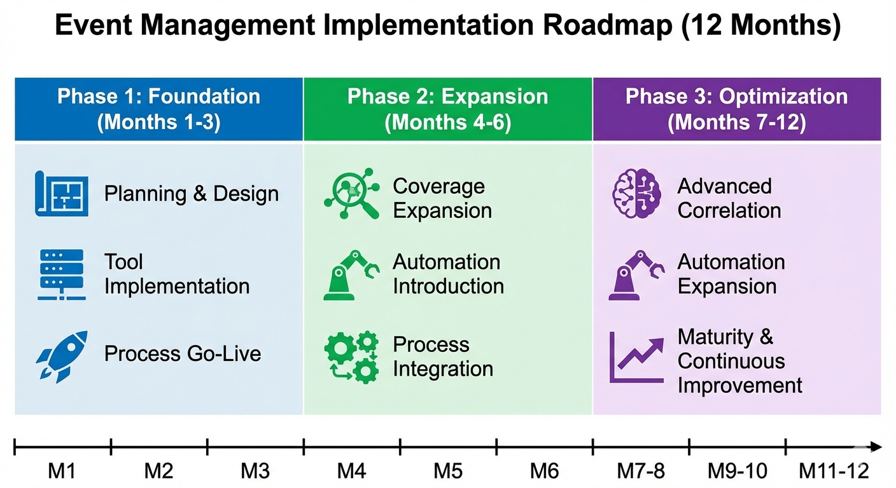
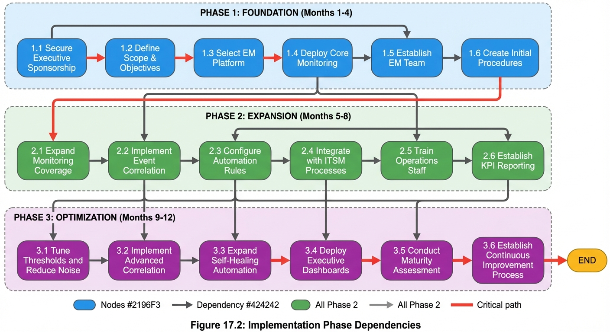

# Chapter 17: Implementation Roadmap

## Introduction

Implementing Event Management within an organization represents a transformative journey that requires strategic planning, disciplined execution, and sustained commitment. While the technical concepts and process frameworks provide the theoretical foundation, successful implementation demands a practical, phased approach that balances ambition with operational reality. This chapter presents a comprehensive 12-month roadmap designed to guide organizations from initial deployment through operational maturity.

The implementation roadmap is structured around three distinct phases, each with clearly defined objectives, deliverables, and success criteria. Phase 1 (Foundation, Months 1-3) establishes the core infrastructure and processes necessary for basic event detection and management. Phase 2 (Expansion, Months 4-6) extends monitoring coverage and introduces automation capabilities. Phase 3 (Optimization, Months 7-12) achieves enterprise-scale operations with advanced correlation, comprehensive automation, and full integration with IT Service Management (ITSM) processes.

This phased approach recognizes that Event Management maturity cannot be achieved overnight. Organizations must build capability incrementally, validating each phase before progressing to the next. The roadmap provides specific guidance on resource requirements, risk mitigation strategies, phase dependencies, and critical path activities. By following this structured approach, organizations can deliver early value through quick wins while systematically working toward full operational capability.

*Figure 17.1: Event Management Implementation Roadmap (12 Months) - This three-phase implementation timeline illustrates the systematic progression from foundation through optimization over 12 months. Phase 1: Foundation (Months 1-3) focuses on Planning & Design, Tool Implementation, and Process Go-Live to establish core capabilities. Phase 2: Expansion (Months 4-6) delivers Coverage Expansion across additional infrastructure, Automation Introduction for common scenarios, and Process Integration with Incident and Problem Management. Phase 3: Optimization (Months 7-12) advances capabilities through Advanced Correlation for noise reduction, Automation Expansion for self-healing, and Maturity & Continuous Improvement programs. This phased approach balances quick wins with sustainable capability building, enabling organizations to demonstrate value early while systematically progressing toward operational excellence.*

## The Three-Phase Implementation Model

### Implementation Philosophy

The three-phase implementation model is built on several fundamental principles that maximize success probability while minimizing operational disruption. First, the approach prioritizes critical systems, ensuring that the highest-value assets receive event monitoring protection earliest in the implementation. Second, the model emphasizes learning and iteration, with each phase providing opportunities to refine processes and address gaps before scaling. Third, the roadmap balances quick wins with long-term capability building, demonstrating value early while systematically advancing toward maturity.

The phases are sequential but overlapping, allowing organizations to begin planning the next phase while completing the current one. This overlap reduces total implementation time and maintains momentum. However, strict entry and exit criteria govern phase transitions, ensuring that foundational capabilities are solid before adding complexity. Organizations that attempt to skip phases or rush transitions invariably encounter difficulties with stability, adoption, and sustainability.

### Phase Overview and Timeline

The 12-month implementation timeline divides into three unequal phases reflecting the natural progression from foundation through optimization. Phase 1 requires three months to establish fundamental infrastructure, processes, and skills. Phase 2 extends for three months to expand coverage and introduce automation. Phase 3, the longest at six months, focuses on achieving enterprise maturity through advanced capabilities and process integration.

**Figure 17.1:** 12-Month Implementation Timeline
*Caption:* This Gantt chart illustrates the three-phase implementation approach with key milestones and deliverables. Note the overlapping planning periods between phases, allowing organizations to maintain momentum while ensuring readiness for the next phase. Critical path activities include tool deployment (Month 1), 24x7 staffing (Month 2), correlation implementation (Month 5), and automation expansion (Months 8-10).
*Position:* Full-page figure following this section

Each phase concludes with a formal readiness assessment evaluating whether the organization has met all success criteria and can safely proceed to the next phase. This governance mechanism prevents organizations from advancing prematurely, which is a common cause of implementation failure.

## Phase 1: Foundation (Months 1-3)

### Phase Objectives

Phase 1 establishes the foundational infrastructure, processes, and capabilities required for basic event detection and response. The primary objective is to deploy a centralized Event Management system capable of monitoring critical Configuration Items (CIs) and routing events to appropriate handlers. By the end of Month 3, the organization should have 24x7 monitoring coverage for critical production systems, documented procedures for event handling, and trained personnel capable of detecting and responding to Exception Events.

The Foundation phase does not attempt to achieve comprehensive monitoring or advanced automation. Instead, it focuses on getting the basics right: detecting critical failures, routing alerts appropriately, and ensuring that significant events do not go unnoticed. This conservative approach allows teams to build confidence and competence before tackling more complex capabilities.

### Month 1: Planning and Tool Deployment

The first month focuses on strategic planning and initial system deployment. Key activities include:

**Strategic Planning:** The Event Manager leads development of the Event Management strategy document, defining scope, objectives, success metrics, and governance structure. This document establishes the vision for Event Management within the organization and secures executive sponsorship. The strategy identifies which Configuration Items will be monitored, which events will be detected, and how Event Management integrates with existing ITSM processes like Incident Management (Process 20) and Change Management (Process 30).

**Tool Selection and Deployment:** Organizations select and deploy a centralized Event Management platform that serves as the single source of truth for all event data. This centralized approach is mandated by the Centralized Event Management Policy, which requires a unified view enabling cross-domain correlation and consistent handling. The platform must provide capabilities for event ingestion, filtering, categorization, correlation, and routing. During Month 1, the tool is installed in a non-production environment and configured with basic settings.

**CMDB Foundation:** Accurate event correlation depends on understanding Configuration Item relationships. Month 1 includes validating and updating the Configuration Management Database (CMDB) for critical systems that will receive monitoring coverage in Phase 1. This ensures that topology-based correlation can function when implemented in later phases.

**Role Definition:** The organization defines and documents Event Management roles including Event Manager, Event Designer, Event Analyst, and Event Coordinator. Job descriptions specify responsibilities, required skills, and reporting relationships. Initial recruitment or assignment of personnel to these roles begins during Month 1.

### Month 2: Initial Configuration and Training

Month 2 focuses on configuring the Event Management system for critical production systems and training personnel on core processes.

**Critical System Identification:** The Event Designer works with service owners to identify critical production systems requiring immediate monitoring coverage. Selection criteria include business criticality, current incident volume, and known stability issues. Typically, Phase 1 targets 15-20% of the organization's total CI inventory, focusing exclusively on Tier 1 (critical) systems.

**Event Detection Rule Configuration:** For each critical system, the Event Designer configures event detection rules specifying conditions that trigger events. This includes setting Warning Thresholds and Critical Thresholds based on capacity requirements and Service Level Agreements (SLAs). For example, disk space monitoring might be configured with a Warning Event at 70% capacity and an Exception Event at 85% capacity, as described in the sources.

**Event Type Classification:** The Event Designer configures categorization rules that automatically classify incoming events as Informational Events, Warning Events, Exception Events, or Related Events based on severity, source, and content. Accurate classification is essential because it determines the appropriate control action for each event.

**Training Program Launch:** A structured training program begins in Month 2, covering Event Management fundamentals, tool usage, and operational procedures. Event Analysts receive training on Activity 3 (Manage Event) and Activity 4 (Correlate and Escalate Event), learning to filter events, categorize them accurately, and determine appropriate escalation paths. Training emphasizes the distinction between events, incidents, and problems, ensuring that teams understand when to escalate to Incident Management versus when to handle events through automated responses or operational tasks.

**24x7 Coverage Establishment:** By the end of Month 2, the organization establishes 24x7 Event Console Monitoring for critical systems, as mandated by the Event Console Monitoring Policy. This requires staffing Event Analyst roles around the clock, typically through shift rotations or follow-the-sun models if the organization has geographically distributed operations centers.

### Month 3: Go-Live and Stabilization

Month 3 marks the transition from configuration to operations, with critical systems transitioning to production monitoring.

**Production Cutover:** Critical systems identified in Month 2 transition to production monitoring in a phased manner, typically moving 5-10 systems per week to allow for stabilization and troubleshooting. Each cutover includes validation that events are being generated, classified correctly, and routed to Event Analysts.

**Alert Logging Implementation:** The Alert Logging Policy mandates that every alert be logged with complete detail required for analysis and trending. During Month 3, Event Analysts begin documenting all event handling activities including actions taken, time to resolution, and closure codes. Closure codes such as `Auto Action`, `Incident`, `Problem`, and `Related` provide data for future analysis.

**Basic Escalation Procedures:** Month 3 implements basic escalation procedures connecting Event Management to Incident Management. When Exception Events indicating abnormal operation or service disruption are detected, Event Analysts create incident records, link them to originating events, set incident priority based on Impact and Urgency, and notify incident teams. This integration ensures that critical events causing service disruption trigger immediate response through Incident Management (Process 20).

**Initial Metrics Collection:** The organization begins collecting Key Performance Indicators (KPIs) that measure Event Management effectiveness. Phase 1 focuses on foundational metrics including Categorization Accuracy (target ≥95%), False Positives Rate (target ≤5%), and Real-time Detection (target <5 minutes from state change to event detection). These baseline metrics establish starting points for improvement in subsequent phases.

**Lessons Learned Review:** Month 3 concludes with a formal lessons learned review capturing insights from the first production deployment. Common challenges identified during Phase 1 include threshold tuning (initial thresholds often generate too many or too few alerts), escalation clarity (teams need clear guidance on when to escalate), and tool familiarity (additional training may be required). These lessons inform adjustments before Phase 2 begins.

### Phase 1 Success Criteria

Phase 1 is considered complete when the organization has achieved all of the following success criteria:

1. **Infrastructure:** Centralized Event Management platform deployed and operational with 24x7 availability
2. **Coverage:** Critical production systems (15-20% of total CIs) actively monitored with event detection rules configured
3. **Staffing:** Event Analyst roles staffed 24x7 with trained personnel capable of handling Exception Events
4. **Process Integration:** Basic escalation to Incident Management operational for Exception Events
5. **Metrics:** Baseline KPI measurement established with Categorization Accuracy ≥90% and False Positives Rate ≤10%
6. **Documentation:** Event Management procedures documented including event handling, escalation, and closure processes

Organizations failing to meet these criteria should address gaps before proceeding to Phase 2. Common reasons for delayed phase transitions include insufficient staffing, inadequate tool configuration, or incomplete integration with Incident Management.

## Phase 2: Expansion (Months 4-6)

### Phase Objectives

Phase 2 expands Event Management capabilities beyond critical systems to achieve broader organizational coverage while introducing initial automation. The primary objectives are to extend monitoring to approximately 50% of Configuration Items, implement basic event correlation to reduce alert noise, and deploy low-risk automated responses that resolve simple events without human intervention.

Phase 2 represents a significant scaling challenge, as the volume of events increases substantially with expanded coverage. The introduction of correlation and automation is essential to prevent alert fatigue and ensure that Event Analysts can manage the increased load. Organizations that successfully navigate Phase 2 demonstrate that Event Management can scale beyond critical systems while maintaining quality and responsiveness.

### Month 4: Coverage Expansion Planning

Month 4 focuses on planning the expanded coverage that will be implemented in Months 5-6.

**CI Inventory Analysis:** The Event Designer conducts a comprehensive analysis of the Configuration Item inventory, categorizing CIs by criticality, monitoring complexity, and business value. This analysis identifies which systems will receive monitoring in Phase 2, targeting medium-criticality production systems and high-criticality non-production systems that support development and testing.

**Threshold Strategy Refinement:** Based on lessons learned from Phase 1, the Event Designer refines the threshold configuration strategy. Warning Thresholds are adjusted based on actual system behavior observed during Phase 1, ensuring that events trigger at appropriate levels. The goal is to configure thresholds that provide sufficient advance warning (typically 15-30 minutes before critical failure) without generating excessive false positives.

**Correlation Design:** Month 4 includes designing correlation rules that will be implemented in Month 5. Correlation is central to Activity 4 (Correlate and Escalate Event) and prevents alert storms caused by numerous linked events. The Event Designer develops correlation rules based on several techniques:

- **Topology-Based Correlation:** Leverages CMDB dependency relationships to identify parent-child relationships between events. For example, multiple server alerts caused by a single network switch failure are correlated to the switch event.
- **Time-Based Correlation:** Links events occurring within a defined time window (typically 2-5 minutes), grouping related events that share a common root cause.
- **Pattern-Based Correlation:** Uses pattern matching and keywords to identify related events based on content similarity.
- **Service-Based Correlation:** Links events affecting the same business service, enabling impact assessment at the service level.

**Automation Candidate Identification:** The Event Designer identifies low-risk events suitable for automated response. Candidates include events with clear resolution procedures, minimal risk of unintended consequences, and high frequency. Common examples include restarting failed services, clearing temporary files, and removing redundant servers from load balancer rotation.

### Month 5: Correlation Implementation

Month 5 implements the correlation capabilities designed in Month 4, significantly improving signal-to-noise ratio.

**Correlation Rule Deployment:** Correlation rules are deployed in a phased manner, beginning with the most straightforward topology-based rules and progressing to more complex pattern-based rules. Each rule is tested in a non-production environment before activation in production. The goal is to achieve Correlation Effectiveness of >50% reduction in alerts, meaning that correlation should eliminate at least half of the redundant or related events.

**Related Event Handling:** When correlation successfully identifies Related/Sympathetic Events (duplicates or events caused by an existing primary event), these secondary events are automatically closed using closure code `Related`. This prevents alert storms and focuses investigation on the primary event. For example, when a database failure occurs, multiple "cannot connect to database" events from different application servers are correlated to the primary database failure event, with the application server events closed as `Related`.

**Escalation Path Refinement:** Month 5 refines escalation paths to ensure that correlated events route to the appropriate handler. The Event Designer configures rules that determine whether an event should be escalated to Incident Management (Exception Events causing service disruption), Problem Management (recurring events or patterns indicating systemic issues), or Change Management (events indicating need for configuration or capacity changes).

**Expanded CI Monitoring:** Monitoring coverage expands to include additional systems identified in Month 4. By the end of Month 5, coverage should reach approximately 35-40% of total CIs, with clear plans for reaching 50% by the end of Month 6.

### Month 6: Initial Automation

Month 6 introduces automated responses for low-risk, high-frequency events, enabling self-healing capabilities.

**Automated Response Script Development:** The Event Designer develops and tests automated response scripts for identified candidates. Each script includes safety controls such as throttling (limiting execution frequency), time window restrictions (only executing during designated maintenance windows if applicable), audit trails (logging all automated actions), and manual override capabilities. These safety controls are essential to prevent automation from causing cascading failures or unintended service disruptions.

**Low-Risk Automation Deployment:** Automated responses are deployed initially for the lowest-risk events, such as restarting monitoring agents or clearing log files. Each automation is monitored closely for the first week of operation to ensure that it functions as intended and does not cause unexpected issues. Successful automations are documented with closure code `Auto Action`, providing data for measuring the Auto-operations Success Rate KPI.

**Automation Success Monitoring:** The organization establishes monitoring for automation effectiveness, tracking the percentage of events successfully resolved through automated responses without human intervention. Early in Phase 2, the Auto-operations Success Rate typically ranges from 20-30% as only low-risk events are automated. However, this percentage will increase significantly in Phase 3 as more sophisticated automation is deployed.

**Process Integration Enhancement:** Month 6 enhances integration between Event Management and related ITSM processes. Warning Events that indicate approaching capacity thresholds now trigger automatic creation of Requests for Change (RFCs) in Change Management (Process 30), enabling proactive capacity expansion. Recurring Exception Events automatically escalate to Problem Management (Process 14) for root cause investigation. These integrations ensure that Event Management serves as an effective entry point for Service Operation processes and activities.

**Proactive Management Enablement:** With correlation reducing noise and automation handling routine events, Event Analysts can focus more attention on Warning Events that enable proactive management. Month 6 emphasizes procedures for handling Warning Events, which indicate something approaching threshold or unusual activity. For example, when disk space reaches 70% capacity, the Event Analyst follows documented procedures to attempt cleanup of temporary files. If space cannot be reclaimed, the analyst opens an RFC to expand disk capacity, using closure code `Change` to document the outcome.

### Phase 2 Success Criteria

Phase 2 is considered complete when the organization has achieved:

1. **Coverage:** 50% of Configuration Items actively monitored including medium-criticality production systems
2. **Correlation:** Correlation Effectiveness achieving >50% reduction in alert volume with Related Events properly identified and closed
3. **Automation:** Auto-operations Success Rate ≥30% with low-risk automated responses operational
4. **Process Integration:** Integration with Incident, Problem, and Change Management operational with clear escalation paths
5. **Metrics:** Routing Accuracy ≥95% with events consistently routed to correct handlers
6. **Proactive Operations:** Warning Event procedures documented and operational, with capacity-related warnings triggering preventive RFCs

Organizations achieving these criteria have demonstrated that Event Management can scale to substantial coverage levels while maintaining quality through correlation and automation. This foundation enables the advanced capabilities introduced in Phase 3.

## Phase 3: Optimization (Months 7-12)

### Phase Objectives

Phase 3 focuses on achieving enterprise maturity through comprehensive coverage, advanced automation, and optimization of Event Management processes. Primary objectives include extending monitoring to 90%+ of Configuration Items, achieving Auto-operations Success Rate ≥70% through extensive automation, implementing advanced correlation techniques, and optimizing all Key Performance Indicators to meet or exceed target thresholds.

Phase 3 is the longest phase, spanning six months, because it involves significant complexity including advanced automation that requires careful testing, comprehensive coverage of diverse systems, and deep integration with multiple ITSM processes. Organizations completing Phase 3 successfully achieve operational maturity where Event Management functions as the foundation for operational monitoring and control.

### Months 7-8: Advanced Coverage and Correlation

**Comprehensive Coverage Rollout:** Months 7-8 focus on extending monitoring to 90%+ of the organization's Configuration Item inventory. This includes challenging environments such as legacy systems with limited monitoring capabilities, distributed edge devices, cloud infrastructure, and third-party services. The Event Designer develops custom solutions for these complex monitoring scenarios, potentially including custom agent development or API integrations.

**Advanced Correlation Techniques:** With increased coverage comes increased event volume, requiring more sophisticated correlation. Month 7 introduces advanced correlation techniques including:

- **Machine Learning Correlation:** Leveraging machine learning algorithms to identify patterns that traditional rule-based correlation misses
- **Causal Analysis:** Determining root events from multiple alerts by analyzing causal relationships rather than just temporal or topological proximity
- **Cross-Domain Correlation:** Correlating events across different technology domains (network, application, database, storage) to provide holistic incident analysis

**Service-Based Event Grouping:** The Event Designer implements service-based event grouping that aligns events with business services. When multiple events affect the same business service, they are grouped and prioritized based on the service's business criticality. This capability supports Strategic Alignment by linking IT operations directly to business outcomes through better Business Impact Assessment.

**CMDB Accuracy Enhancement:** Advanced correlation depends on accurate Configuration Item relationships in the CMDB. Months 7-8 include a focused effort to validate and update CMDB data, ensuring that dependency relationships accurately reflect the current environment. This is a Critical Success Factor for Event Management effectiveness.

### Months 9-10: Extensive Automation

**Medium-Risk Automation:** With confidence gained from low-risk automation in Phase 2, Months 9-10 introduce medium-risk automated responses including service restarts, resource scaling, and traffic rerouting. Each automation includes comprehensive safety controls and is deployed initially in non-production environments for validation before production deployment.

**Predictive Automation:** Month 9 introduces predictive automation that takes action before events occur based on trending data. For example, if trending analysis shows that disk space consistently increases by 5% per week, predictive automation can trigger capacity expansion before the Warning Threshold at 70% is reached. This capability aligns with Event Management's goal of enabling Predictive Operations.

**Automation Orchestration:** Month 10 implements automation orchestration that coordinates multiple automated responses in sequence. For example, if a database failure is detected, orchestrated automation might restart the database service, verify connectivity, clear transaction logs, and notify dependent applications to reconnect. This orchestration capability significantly increases the complexity and effectiveness of automation.

**Auto-operations Success Rate Optimization:** By the end of Month 10, the organization targets Auto-operations Success Rate ≥70%, meaning that 70% or more of events are resolved automatically without human intervention. Achieving this target requires extensive automation coverage and reliable safety controls that prevent automation-induced failures.

### Months 11-12: Integration and Optimization

**Full ITSM Integration:** Months 11-12 complete the integration of Event Management with all relevant ITSM processes. This includes:

- **Incident Management (Process 20):** Exception Events automatically create incident records with appropriate priority, transfer complete event history, and update incident status when events are resolved
- **Problem Management (Process 14):** Recurring event patterns automatically trigger problem investigations with event history provided for root cause analysis
- **Change Management (Process 30):** Warning Events indicating capacity or configuration issues automatically generate RFCs with event evidence and rationale
- **Availability Management (Process 140):** Event data feeds availability reporting and analysis, enabling continuous service improvement
- **Capacity Management:** Event trends inform capacity planning decisions, with Warning Events serving as early indicators of capacity requirements

**KPI Optimization:** Month 11 focuses on optimizing all Key Performance Indicators to meet or exceed target thresholds:

- **Efficiency of Detection:** Target ≥60% (ratio of incidents detected by Event Management vs. those reported by users)
- **Auto-operations Success Rate:** Target ≥70% (percentage of events successfully resolved through automated responses)
- **Categorization Accuracy:** Target ≥95% (events correctly classified into appropriate types)
- **Routing Accuracy:** Target ≥95% (events routed to correct destination)
- **False Positives Rate:** Target ≤5% (events incorrectly identified as requiring attention)
- **Correlation Effectiveness:** Target >50% reduction in alerts

**Continuous Improvement Framework:** Month 12 establishes a continuous improvement framework ensuring that Event Management capabilities evolve over time. This includes regular trend analysis, lessons learned reviews, and systematic updates to event detection rules, correlation logic, and automated responses based on operational experience.

**Maturity Assessment:** The final activity in Phase 3 is a comprehensive maturity assessment evaluating the organization's Event Management capabilities against industry benchmarks. This assessment identifies remaining gaps and establishes priorities for post-implementation enhancement.

### Phase 3 Success Criteria

Phase 3 is considered complete when the organization has achieved:

1. **Coverage:** 90%+ of Configuration Items actively monitored with event detection rules configured
2. **Automation:** Auto-operations Success Rate ≥70% with comprehensive automation including medium-risk responses
3. **Correlation:** Advanced correlation techniques operational with Correlation Effectiveness >60% reduction in alerts
4. **Process Integration:** Full integration with Incident, Problem, Change, Availability, and Capacity Management processes
5. **KPIs:** All Key Performance Indicators meeting or exceeding target thresholds
6. **Maturity:** Formal maturity assessment confirming that Event Management operates as the foundation for operational monitoring and control
7. **Sustainability:** Continuous improvement framework operational with regular review and optimization cycles

Organizations achieving these criteria have successfully implemented enterprise-class Event Management capable of supporting operational excellence, incident prevention, and continuous service improvement.

## Success Criteria and Metrics

### Defining Success

Success in Event Management implementation is measured through a combination of quantitative metrics, qualitative assessments, and business outcomes. The Key Performance Indicators established during the implementation roadmap provide objective measures of process effectiveness, while qualitative assessments evaluate user satisfaction, process adoption, and integration quality. Business outcomes such as reduced downtime, increased productivity, and improved SLA compliance validate that Event Management delivers tangible value.

### Phase-Specific Metrics

Each implementation phase has distinct success criteria reflecting the capabilities being built:

**Phase 1 (Foundation) Metrics:**
- Categorization Accuracy ≥95%: Events correctly classified into Informational, Warning, Exception, or Related categories
- False Positives Rate ≤5%: Percentage of events incorrectly identified as requiring attention
- Real-time Detection <5 minutes: Time from state change to event detection and alert generation
- Coverage: 15-20% of CIs monitored (critical systems only)

**Phase 2 (Expansion) Metrics:**
- Correlation Effectiveness >50%: Percentage reduction in alert volume achieved through correlation
- Auto-operations Success Rate ≥30%: Events resolved through low-risk automated responses
- Routing Accuracy ≥95%: Events routed to correct destination (Incident, Problem, Change Management)
- Coverage: 50% of CIs monitored

**Phase 3 (Optimization) Metrics:**
- Efficiency of Detection ≥60%: Ratio of incidents detected by Event Management vs. reported by users
- Auto-operations Success Rate ≥70%: Events resolved through comprehensive automation
- Mean Time to Detect (MTTD) <2 minutes: Average time from issue occurrence to event detection
- Mean Time to Repair (MTTR) Reduced by 40%: Improvement due to early detection and proper escalation
- Coverage: 90%+ of CIs monitored

### Measurement Methodology

Organizations must establish consistent measurement methodologies to ensure that metrics are accurate, reliable, and comparable over time. The Alert Logging Policy mandates that every alert be logged with complete detail required for analysis and trending, providing the data foundation for metric calculation.

**Categorization Accuracy Measurement:** Calculated as (Correctly Categorized Events / Total Events) × 100. Validation occurs through periodic sampling where Event Analysts review a random sample of 50-100 events and verify that categorization matches documented criteria.

**Correlation Effectiveness Measurement:** Calculated as ((Total Events Before Correlation - Total Events After Correlation) / Total Events Before Correlation) × 100. This metric quantifies the noise reduction achieved through correlation.

**Auto-operations Success Rate Measurement:** Calculated as (Auto-resolved Events / Total Events Eligible for Automation) × 100. This metric measures the percentage of automatable events that are successfully resolved without human intervention.

**Efficiency of Detection Measurement:** Calculated as (Incidents Detected by Event Management / Total Incidents) × 100. This metric validates that Event Management proactively detects issues before users report them.

### Metric Targets and Benchmarks

The target values for Event Management metrics are based on industry benchmarks and ITIL best practices:

**Table 17.1:** Implementation Checklist by Phase

| Phase | Month | Key Deliverable | Success Metric | Target |
|-------|-------|----------------|----------------|--------|
| Foundation | 1 | Tool deployment | System availability | 99.9% |
| Foundation | 2 | Critical CI monitoring | Coverage | 15-20% |
| Foundation | 2 | 24x7 staffing | Coverage hours | 168 hrs/week |
| Foundation | 3 | Incident integration | Categorization accuracy | ≥90% |
| Expansion | 4 | Threshold refinement | False positives rate | ≤8% |
| Expansion | 5 | Correlation deployment | Alert reduction | >50% |
| Expansion | 6 | Low-risk automation | Auto-ops success | ≥30% |
| Expansion | 6 | 50% CI coverage | Monitoring coverage | 50% |
| Optimization | 7-8 | 90% CI coverage | Monitoring coverage | 90%+ |
| Optimization | 9-10 | Medium-risk automation | Auto-ops success | ≥70% |
| Optimization | 11 | KPI optimization | All KPIs | Target met |
| Optimization | 12 | Maturity assessment | Process maturity | Level 4+ |

Organizations should track these metrics consistently throughout implementation, reporting them in monthly governance reviews. Trends are as important as absolute values, with steady improvement indicating healthy implementation progress.

## Resource Requirements and Team Sizing

### Staffing Requirements by Phase

Event Management implementation requires substantial staffing investment, particularly for 24x7 operational roles. Staffing requirements vary by phase as capabilities expand:

**Phase 1 (Foundation) Staffing:**
- Event Manager: 1 FTE (Full-Time Equivalent) - Provides strategic leadership and governance
- Event Designer: 2 FTE - Configures monitoring, thresholds, and rules for critical systems
- Event Analyst: 6-8 FTE - Provides 24x7 coverage for event console monitoring (assumes 3-shift rotation with backup)
- Event Coordinator: 0.5 FTE - Manages reporting and coordination

**Phase 2 (Expansion) Staffing:**
- Event Manager: 1 FTE
- Event Designer: 3 FTE - Increased capacity for correlation and automation design
- Event Analyst: 8-10 FTE - Increased volume from expanded coverage
- Event Coordinator: 1 FTE - Increased coordination needs

**Phase 3 (Optimization) Staffing:**
- Event Manager: 1 FTE
- Event Designer: 4 FTE - Peak capacity for comprehensive automation development
- Event Analyst: 8-10 FTE - Stable despite increased coverage due to automation reducing manual workload
- Event Coordinator: 1 FTE
- Automation Specialist: 2 FTE - New role for advanced automation development and maintenance

**Total Staffing Investment:** Peak staffing occurs in Phase 3 with approximately 17-20 FTE dedicated to Event Management. Organizations should plan for this investment when developing business cases and securing budget approval.

### Role Responsibilities

**Event Manager:** Responsible for Event Management strategy, governance, and continuous improvement. Provides leadership for the implementation roadmap, manages stakeholder relationships, and ensures that Event Management delivers business value. The Event Manager chairs the Event Management governance board and represents Event Management in ITSM process integration discussions.

**Event Designer:** Responsible for technical design of Event Management solutions including event detection rules, correlation logic, and automated response scripts. The Event Designer analyzes monitoring requirements, configures thresholds, and maintains the Event Management system. This role requires deep technical knowledge of monitored infrastructure and strong analytical skills.

**Event Analyst:** Responsible for operational event handling including filtering events, categorizing them, executing manual responses when automation is unavailable, and escalating events to appropriate handlers. Event Analysts staff the 24x7 event console and serve as the front line of Event Management operations. This role requires strong communication skills, ability to work under pressure, and basic technical troubleshooting knowledge.

**Event Coordinator:** Responsible for reporting, metrics collection, trend analysis, and coordination between Event Management and other ITSM processes. The Event Coordinator prepares monthly governance reports, identifies improvement opportunities, and facilitates lessons learned reviews.

**Automation Specialist:** Introduced in Phase 3, this role focuses on developing and maintaining advanced automation including orchestration, predictive automation, and integration with external systems. The Automation Specialist works closely with Event Designers to translate manual procedures into reliable automated responses with appropriate safety controls.

### Skills and Training

Successful Event Management implementation requires substantial investment in training and skill development:

**Technical Skills:**
- Understanding of monitored infrastructure (servers, network, applications, databases)
- Event Management tool expertise
- CMDB navigation and maintenance
- Scripting and automation (Python, PowerShell, Bash)
- ITIL Event Management concepts

**Process Skills:**
- Event categorization and prioritization
- Correlation analysis
- Escalation decision-making
- Incident, Problem, and Change Management integration
- Root cause analysis

**Communication Skills:**
- Alert notification procedures
- Escalation communication
- Stakeholder reporting
- Documentation standards

Organizations should plan for 40-60 hours of training per Event Analyst during Phase 1, with ongoing training throughout implementation as new capabilities are introduced. Event Designers require more extensive training (80-100 hours) covering tool configuration, correlation techniques, and automation development.

### Budget Considerations

**Table 17.2:** Resource Requirements by Phase

| Resource Category | Phase 1 (M1-3) | Phase 2 (M4-6) | Phase 3 (M7-12) | Total |
|-------------------|----------------|----------------|-----------------|-------|
| Staffing (FTE costs) | 9.5 FTE | 12.5 FTE | 17 FTE | - |
| Tooling (licensing) | $150K | $50K | $100K | $300K |
| Training | $80K | $40K | $60K | $180K |
| Consulting | $120K | $80K | $100K | $300K |
| Infrastructure | $100K | $50K | $50K | $200K |
| **Phase Total** | **$450K + FTE** | **$220K + FTE** | **$310K + FTE** | **$980K + FTE** |

Budget estimates assume mid-size enterprise implementation monitoring 3,000-5,000 Configuration Items. Larger or smaller organizations should scale estimates accordingly. Staffing costs are excluded from totals as they vary significantly by geography and employment model.

## Risk Management and Mitigation

### Implementation Risks

Event Management implementation faces several categories of risk that can delay timelines, increase costs, or compromise effectiveness:

**Technical Risks:**
- **Tool Integration Failures:** Event Management platforms may fail to integrate properly with existing monitoring tools, requiring custom development
- **CMDB Inaccuracy:** Correlation depends on accurate CI relationships; inaccurate CMDB data causes correlation failures
- **Performance Degradation:** Event Management systems can generate substantial load on monitored systems if agents are poorly optimized
- **Data Loss:** Events may be lost during system failures if redundancy is inadequate

**Process Risks:**
- **Inadequate Staffing:** 24x7 coverage requires substantial staffing; understaffing leads to missed events and burnout
- **Threshold Misconfiguration:** Improperly configured thresholds generate excessive false positives (alert fatigue) or false negatives (missed events)
- **Poor Process Integration:** If escalation to Incident, Problem, and Change Management is unclear, events may not be handled appropriately
- **Automation Failures:** Automated responses without adequate safety controls can cause cascading failures

**Organizational Risks:**
- **Resistance to Change:** Operations teams may resist new processes and tools, particularly if they perceive increased workload
- **Executive Support Erosion:** If early phases fail to demonstrate value, executive sponsors may withdraw support
- **Skill Gaps:** Event Management requires new skills that existing staff may lack; training investment is essential
- **Competing Priorities:** Other initiatives may divert resources from Event Management implementation

### Mitigation Strategies

**Technical Risk Mitigation:**
- **Proof of Concept (POC):** Conduct POC testing before full tool deployment to validate integration capabilities
- **CMDB Remediation:** Allocate dedicated resources to CMDB accuracy improvement before implementing correlation
- **Performance Testing:** Test monitoring agent performance in non-production environments before production deployment
- **Redundancy Architecture:** Implement redundant Event Management infrastructure with failover capabilities

**Process Risk Mitigation:**
- **Conservative Staffing:** Staff at 125% of calculated minimum to provide buffer for absences and turnover
- **Threshold Tuning Process:** Implement formal threshold review and adjustment process based on operational feedback
- **Clear Escalation Criteria:** Document and train clear escalation criteria with decision trees for complex scenarios
- **Automation Safety Framework:** Require throttling, audit trails, rollback mechanisms, and manual override for all automation

**Organizational Risk Mitigation:**
- **Change Management Program:** Implement formal change management program with stakeholder engagement, communication plan, and training
- **Quick Wins Strategy:** Prioritize quick wins in Phase 1 that demonstrate tangible value to maintain executive support
- **Skills Assessment:** Conduct upfront skills assessment and develop comprehensive training plan addressing gaps
- **Governance Structure:** Establish strong governance structure with executive steering committee ensuring priority and resource commitment

### Risk Monitoring

Organizations should establish a risk register at the beginning of implementation, tracking identified risks, likelihood, impact, mitigation strategies, and status. The Event Manager reviews the risk register monthly in governance meetings, escalating high-priority risks to the executive steering committee. Common leading indicators of implementation risk include:

- Staffing shortfalls or turnover in key roles
- Schedule slippage in Phase 1 milestones
- Metrics failing to meet minimum thresholds
- Increased escalations or complaints from stakeholders
- Budget overruns exceeding 10% of plan

Early detection and response to these indicators prevents minor issues from becoming major obstacles to success.

## Phase Dependencies and Critical Path

### Understanding Phase Dependencies

The three-phase implementation model includes numerous dependencies that govern the sequence of activities. Understanding these dependencies is essential for developing realistic schedules and identifying the critical path—the sequence of activities that determines the minimum implementation duration.

*Figure 17.2: Implementation Phase Dependencies - This network diagram illustrates the dependencies between major implementation activities across three phases: Foundation (Months 1-4), Expansion (Months 5-8), and Optimization (Months 9-12). The critical path (highlighted in red) shows the sequence of activities that determines minimum project duration, with clear dependencies between phases ensuring proper sequencing of capabilities.*

### Critical Path Activities

The critical path for the 12-month implementation roadmap includes:

**Month 1 - Tool Deployment (Critical):** Cannot proceed with any configuration or training until the centralized Event Management platform is operational. Any delay in tool deployment cascades through all subsequent activities.

**Month 2 - 24x7 Staffing (Critical):** Production monitoring cannot begin until 24x7 Event Analyst coverage is established. Staffing delays push back the Month 3 production cutover.

**Month 3 - Production Cutover (Critical):** Phase 2 planning depends on operational lessons learned from Phase 1. Without production experience, correlation and automation design in Phase 2 lacks necessary context.

**Month 5 - Correlation Implementation (Critical):** Correlation is a prerequisite for expanded coverage in Months 5-6. Without correlation, increased monitoring generates unmanageable alert volumes.

**Months 9-10 - Automation Expansion (Critical):** Achieving the Phase 3 target of 70% Auto-operations Success Rate requires extensive automation development in Months 9-10. This is the longest single activity on the critical path.

### Non-Critical Path Opportunities

While the critical path determines minimum duration, several activities can be accelerated or overlapped to reduce overall timeline:

**CMDB Remediation:** Can occur in parallel with Month 1 tool deployment if resources are available

**Training Development:** Training materials can be developed during Month 1 before trainers are needed in Month 2

**Phase 2 Planning:** Can begin during Month 3 rather than waiting until Month 4

**Advanced Correlation Design:** Can be prototyped during Months 5-6 even though deployment doesn't occur until Months 7-8

Organizations with strong program management and adequate resources can potentially compress the 12-month roadmap to 10-11 months by optimizing these non-critical activities. However, attempting to compress critical path activities typically results in quality issues, technical debt, and unstable implementations.

### Managing Dependencies

Effective dependency management requires:

- **Clear Documentation:** Document all dependencies in project plans with explicit identification of critical path
- **Regular Review:** Review dependencies weekly in project status meetings, identifying any new dependencies that emerge
- **Risk Assessment:** Assess the risk that dependencies will delay the project, with mitigation plans for high-risk dependencies
- **Communication:** Ensure that all team members understand how their activities depend on others and impact downstream work

## Quick Wins and Early Value Delivery

### The Importance of Quick Wins

Long implementation timelines create risk that executive sponsors will lose patience or competing priorities will divert resources. Quick wins—visible successes delivered early in the implementation—demonstrate value, build momentum, and sustain organizational commitment. The implementation roadmap incorporates several quick win opportunities that organizations should prioritize.

### Phase 1 Quick Wins

**Week 6 - First Automated Event Detection:** When the first critical system begins generating automated event alerts in Week 6 (Month 2), it represents a visible milestone showing that Event Management infrastructure is operational. Even if the volume is small, this first automated detection demonstrates progress.

**Week 10 - First Incident Prevented:** When Event Management detects and resolves a Warning Event before it escalates to service disruption, it delivers tangible value. For example, detecting disk space at 70% capacity and expanding capacity before reaching critical threshold demonstrates incident prevention. Organizations should widely publicize these early wins through internal communications.

**Month 3 - First Month of 24x7 Coverage:** Completing the first full month of 24x7 event console monitoring for critical systems is a significant operational milestone. It proves that the organization can sustain Event Management operations at enterprise scale.

### Phase 2 Quick Wins

**Week 18 - First Alert Storm Prevention:** When correlation successfully prevents an alert storm by correlating dozens of related events to a single root event, it delivers dramatic value that operations teams immediately appreciate. Organizations should document these events with before-and-after alert counts to quantify value.

**Week 22 - Automation Success Stories:** By Week 22 (Month 6), low-risk automation should have accumulated enough runs to demonstrate reliability. Highlighting that automated responses have successfully resolved hundreds of events without human intervention builds confidence in automation.

**Month 6 - Proactive Capacity Expansion:** Demonstrating that Warning Events triggered preventive capacity expansions before critical thresholds were reached validates the proactive management value proposition.

### Phase 3 Quick Wins

**Month 8 - 90% Coverage Achievement:** Reaching 90% monitoring coverage is a major milestone demonstrating comprehensive Event Management capability. This achievement should be celebrated and communicated broadly.

**Month 10 - 70% Automation Achievement:** Achieving 70% Auto-operations Success Rate validates that Event Management has fundamentally transformed operations from reactive to proactive.

**Month 12 - Business Impact Report:** At the conclusion of Phase 3, organizations should prepare a comprehensive business impact report quantifying Event Management value including reduced downtime, improved SLA compliance, and operational cost savings. This report validates return on investment and sustains ongoing support.

### Communicating Quick Wins

Quick wins only deliver value if they are communicated effectively:

- **Regular Status Reports:** Include quick win highlights in monthly status reports to executive sponsors
- **Success Story Format:** Document each quick win in a standard success story format describing the situation, action, and result
- **Metrics Dashboard:** Display progress toward key milestones on an accessible metrics dashboard
- **Stakeholder Presentations:** Present major quick wins in operational review meetings and governance forums
- **Recognition:** Recognize team members who contribute to quick wins, building morale and momentum

## Key Takeaways

- The three-phase implementation model provides a structured approach to Event Management deployment, balancing quick wins with long-term capability building across 12 months
- Phase 1 (Foundation, Months 1-3) establishes core infrastructure, 24x7 monitoring for critical systems, and basic Incident Management integration
- Phase 2 (Expansion, Months 4-6) extends coverage to 50% of CIs, implements correlation reducing alert volume by >50%, and introduces low-risk automation achieving 30% Auto-operations Success Rate
- Phase 3 (Optimization, Months 7-12) achieves enterprise maturity with 90%+ CI coverage, 70%+ automation success rate, and full ITSM process integration
- Success criteria for each phase provide clear milestones that organizations must achieve before proceeding to the next phase
- Resource requirements peak in Phase 3 at 17-20 FTE with substantial investments in tooling ($300K), training ($180K), and consulting ($300K) for mid-size enterprises
- Implementation risks span technical, process, and organizational categories; mitigation strategies include POC testing, CMDB remediation, conservative staffing, and strong governance
- The critical path includes tool deployment, 24x7 staffing, correlation implementation, and automation expansion; these activities determine minimum project duration
- Quick wins delivered early in each phase demonstrate value, build momentum, and sustain organizational commitment through the long implementation timeline

## Summary

This chapter has presented a comprehensive 12-month roadmap for implementing Event Management from initial deployment through operational maturity. The three-phase model recognizes that Event Management capabilities must be built incrementally, with each phase establishing foundational capabilities that enable the next phase. Organizations that follow this structured approach systematically build capability while delivering value throughout the journey.

Phase 1 establishes the foundation with critical system monitoring, 24x7 operations, and basic process integration. Phase 2 expands coverage and introduces correlation and automation that enable scalability. Phase 3 achieves enterprise maturity through comprehensive coverage, extensive automation, and full ITSM integration. Each phase includes specific success criteria, resource requirements, and risk mitigation strategies that guide organizations toward successful implementation.

The roadmap emphasizes practical considerations including staffing requirements, budget planning, risk management, and dependency management. Organizations must invest substantial resources—both financial and human—to implement Event Management successfully. However, the return on this investment is significant, with mature Event Management delivering incident prevention, operational efficiency, reduced costs, and improved service quality.

Chapter 18 will detail the specific activities, deliverables, and techniques required during Phase 2 (Expansion), providing practical guidance on implementing correlation, expanding coverage, and introducing automation. The chapter will include detailed procedures, tool configurations, and best practices that organizations can apply directly to their implementations.

## Review Questions

1. **Phase Progression:** What are the primary objectives of each implementation phase, and why is it important to achieve success criteria before proceeding to the next phase?

2. **Critical Path Analysis:** Identify the critical path activities in the 12-month implementation roadmap. Why do these activities determine the minimum project duration?

3. **Correlation Value:** In Phase 2, correlation is introduced with a target of >50% reduction in alert volume. Explain how correlation achieves this reduction and why it is essential before expanding monitoring coverage.

4. **Automation Safety:** What safety controls should be included in automated responses, and why are these controls essential to prevent automation-induced failures?

5. **Resource Planning:** An organization with 5,000 Configuration Items is planning Event Management implementation. Estimate the staffing requirements for each phase and explain how automation in Phase 3 prevents Event Analyst staffing from increasing despite expanded coverage.

---
**Chapter 17 References**
- ITIL Service Operation - Event Management Process
- Event Management Implementation Best Practices
- ITSM Process Integration Frameworks

---

## Chapter Navigation

| Previous | Next |
|----------|------|
| [Chapter 16: Policies and Standards](/EventManagementHandbook/chapters/16-policies-standards/) | [Chapter 18: Best Practices and Pitfalls](/EventManagementHandbook/chapters/18-best-practices-pitfalls/) |

---
