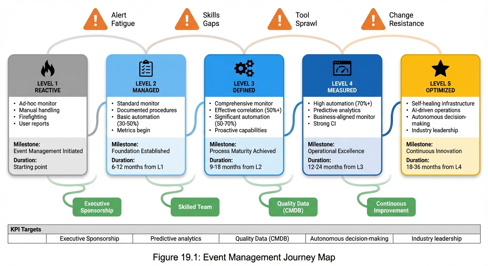

# Chapter 19: Moving Forward

## Introduction

You have reached the final chapter of the Event Management Handbook. Throughout this journey, you have explored the comprehensive framework for building a world-class Event Management capability—from foundational concepts and process design to advanced automation, integration, and continuous improvement. You have learned how Event Management serves as the foundation for operational monitoring and control, providing the ability to detect events, make sense of them, and determine appropriate control action.

This concluding chapter brings everything together and focuses on what matters most: helping you take action. Whether you are just beginning your Event Management journey or looking to optimize an existing implementation, this chapter provides practical guidance for moving forward. It offers a roadmap for getting started, building executive support, achieving quick wins, measuring success, and positioning your organization for future trends in AIOps and autonomous operations.

Event Management is not a destination but a continuous journey of improvement. The principles, processes, and practices outlined in this handbook provide the foundation, but your success will depend on how you adapt and apply them to your unique organizational context. Let us now explore how to transform knowledge into action and build an Event Management capability that delivers lasting value.

## Recap of Key Concepts

Before charting your path forward, let us briefly revisit the core concepts that form the foundation of effective Event Management.

### The Event Management Framework

Event Management is defined as the process responsible for managing events throughout their entire lifecycle. It provides the critical capability to **detect events**, **make sense of them**, and **determine appropriate control action**. This three-part framework—detect, evaluate, decide—forms the backbone of operational excellence.

An **event** is any detectable or discernible occurrence that has significance for the management of IT infrastructure or delivery of IT services. Events represent changes of state that must be captured, classified, and acted upon to ensure service quality and availability.

### The Four Event Types

Events are classified into four primary types based on their significance and required action:

1. **Informational Events** are notifications that require no action. They are logged only for audit and trending purposes. Examples include scheduled backups completing successfully or routine configuration changes.

2. **Warning Events** indicate something approaching a threshold or unusual activity. They require close monitoring and may necessitate preventive action. Examples include disk space reaching 70% capacity or CPU utilization sustained at 75%.

3. **Exception Events** indicate abnormal operation or service disruption. They require immediate investigation and resolution. Examples include critical services stopping unexpectedly or database connections failing.

4. **Related/Sympathetic Events** are duplicates or events related to an existing primary event. The appropriate action is to correlate these to the parent event to prevent alert storms and focus investigation on the root cause.

### The Five Process Activities

Event Management operates through five interconnected activities:

**Activity 1: Design and Maintain EM Framework** establishes the strategic foundation by defining event management strategy, designing technical architecture, and documenting standards and procedures.

**Activity 2: Create and Maintain EM Solutions** focuses on configuring technical solutions including monitoring agents, event detection rules, correlation rules, and automated response scripts.

**Activity 3: Manage Event** handles the operational work of detecting events, filtering irrelevant occurrences, categorizing events appropriately, and executing automated responses where applicable.

**Activity 4: Correlate and Escalate Event** analyzes events not auto-resolved to identify relationships through correlation techniques, determines event significance through impact and urgency assessment, and routes events to the appropriate receiving process such as Incident Management, Problem Management, or Change Management.

**Activity 5: Review and Close Event** verifies that the event condition has been resolved, documents outcomes, applies appropriate closure codes, and performs trend analysis to support continuous improvement.

### Integration with ITSM Processes

Event Management serves as the entry point for many Service Operation processes. Exception Events trigger **Incident Management** when service disruption occurs or is imminent. Recurring event patterns or events with unknown root causes trigger **Problem Management** for root cause investigation. Warning Events indicating capacity or configuration needs trigger **Change Management** through Requests for Change (RFCs). Historical event data feeds **Availability Management** and **Capacity Management** for analysis and planning.

### Success Through Correlation, Automation, and Integration

Three principles drive Event Management success:

**Correlation** prevents alert storms by grouping related or sympathetic events to a single parent event, reducing noise by over 50% and focusing investigation on root causes rather than symptoms.

**Automation** enables self-healing through automated responses that restart failed services, clear temporary files, or scale resources without human intervention. Mature implementations achieve auto-resolution rates of 70% or higher.

**Integration** ensures events are routed to the right process at the right time with the right information, enabling proactive service management and continuous improvement across the entire IT organization.

These concepts form the foundation upon which your Event Management capability will be built. Now let us explore how to translate this knowledge into action.

## Getting Started: First Steps Checklist

Starting your Event Management journey can seem overwhelming. The comprehensive framework outlined in this handbook represents the mature state, but every successful implementation begins with focused first steps. This section provides a practical 90-day action plan to launch your Event Management initiative.

### Days 1-30: Foundation Phase

The first 30 days focus on assessment, planning, and securing initial support.

**Conduct Current State Assessment:** Begin by documenting your current monitoring and alerting landscape. Identify all monitoring tools in use, catalog event sources and volumes, assess current alert management practices, and evaluate existing integration points with Incident Management. This assessment reveals gaps and opportunities that will guide your implementation priorities.

**Define Scope and Objectives:** Establish clear boundaries for your initial Event Management implementation. Select one or two critical services or infrastructure domains as your starting point. Define specific, measurable objectives aligned to business outcomes such as reducing mean time to detect (MTTD) by 50% or achieving 60% proactive incident detection. Use the SMART criteria to ensure your objectives are Specific, Measurable, Achievable, Relevant, and Time-bound.

**Secure Executive Sponsorship:** Identify an executive sponsor who understands the business value of proactive operations. Prepare a business case that quantifies the cost of service disruptions, demonstrates the value of early detection, and outlines expected return on investment. Schedule a formal sponsorship meeting to secure commitment and resources.

**Assemble Core Team:** Identify the key roles needed for initial implementation. At minimum, you need an Event Manager to lead the initiative, one or two Event Analysts with technical monitoring expertise, and an Event Designer with scripting and automation skills. Ensure team members can dedicate at least 50% of their time to the implementation during the first 90 days.

**Select Initial Monitoring Platform:** If you do not already have a centralized event management platform, evaluate and select one. Prioritize platforms that support correlation, automation, and integration with your existing ITSM tools. Remember that enterprise standardization is a long-term goal; starting with a single platform for your initial scope is acceptable.

**Document Initial Policies:** Create lightweight initial policies to guide consistent practices. Define alert logging policy requiring all alerts to be captured with sufficient detail for analysis. Establish event console monitoring policy specifying coverage hours (even if not yet 24x7). Document basic escalation criteria for routing events to Incident Management.

### Days 31-60: Implementation Phase

The second 30 days focus on configuration, testing, and initial deployment.

**Configure Monitoring Agents:** Deploy and configure monitoring agents on your selected scope of systems. Focus on standard infrastructure metrics (CPU, memory, disk, network) and critical application availability checks. Ensure agents report to your centralized event management platform.

**Define Event Detection Rules:** Configure detection rules for your initial scope. Start with three categories: critical service availability (Exception Events), capacity thresholds (Warning Events at 70%, Critical at 85%), and successful completion of key processes (Informational Events). Avoid the temptation to monitor everything; focus on events that matter to service quality.

**Implement Basic Correlation:** Configure time-based and topology-based correlation rules for common scenarios. For example, correlate multiple server alerts to a single network switch failure, or group database connection failures from multiple application servers to the root database event. Start simple and refine based on real-world event patterns.

**Design Initial Automated Responses:** Identify three to five common, low-risk scenarios suitable for automation. Examples include restarting specific failed services, clearing temporary file directories when disk warnings occur, or removing failed nodes from load balancer pools. Implement these automations with appropriate safety controls including throttling to prevent rapid-fire execution, time window restrictions limiting execution to off-peak hours, and comprehensive audit logging of all automated actions.

**Establish Event Management Procedures:** Document operational procedures for your team. Create step-by-step guides for managing events, correlating related alerts, determining escalation paths, and closing events with appropriate closure codes. Include decision trees to help analysts determine event types and appropriate actions.

**Integrate with Incident Management:** Configure integration between your event management platform and incident management system. Ensure Exception Events can automatically create incident records with relevant event data, priority calculation, and linkage to originating events. Test the integration thoroughly to verify data flows correctly.

### Days 61-90: Stabilization Phase

The final 30 days focus on refinement, training, and measurement.

**Conduct Team Training:** Provide comprehensive training to all Event Analysts and stakeholders. Cover event types and classifications, correlation techniques, escalation criteria, and use of automated responses. Include hands-on exercises with real event scenarios to build confidence and competence.

**Tune Thresholds and Rules:** Review the first 30 days of operational data to identify tuning opportunities. Adjust thresholds that generate too many false positives, refine correlation rules that miss related events, and optimize automated responses based on success rates and edge cases discovered.

**Establish KPI Baseline:** Begin measuring key performance indicators to establish your baseline. Calculate categorization accuracy, false positive rate, auto-operations success rate, and efficiency of detection. Document these baseline metrics; they will demonstrate improvement as your capability matures.

**Conduct Initial Retrospective:** Gather your team for a structured retrospective. Discuss what worked well, what challenges were encountered, and what should be improved. Document lessons learned and create action items for addressing gaps identified.

**Plan Next Phase:** Based on lessons learned, define your next 90-day objectives. This might include expanding scope to additional services, implementing more advanced correlation techniques, increasing automation coverage, or improving integration with Problem Management and Change Management.

**Communicate Initial Success:** Prepare a summary report documenting initial progress, quick wins achieved, baseline metrics established, and planned next steps. Share this with your executive sponsor and broader stakeholder community to maintain momentum and support.

Table 19.1 summarizes this 90-day action plan.

**Table 19.1:** First 90 Days Action Plan

| Phase | Days | Key Activities | Deliverables |
|-------|------|----------------|--------------|
| Foundation | 1-30 | Current state assessment, scope definition, executive sponsorship, team assembly, platform selection, initial policies | Assessment report, charter document, executive approval, staffing plan, platform selection, policy documents |
| Implementation | 31-60 | Agent configuration, detection rules, correlation rules, automated responses, procedures, incident integration | Configured monitoring, detection rules, correlation rules, automation scripts, procedure documents, tested integration |
| Stabilization | 61-90 | Team training, threshold tuning, KPI baseline, retrospective, next phase planning, success communication | Training completion, tuned configuration, baseline metrics, lessons learned, phase 2 plan, progress report |

*Caption:* This action plan provides a structured approach to launching Event Management in 90 days, progressing from assessment and planning through implementation to initial stabilization and measurement.

## Building Executive Support

Executive support is critical to Event Management success. Without leadership commitment, you will struggle to secure resources, drive organizational change, and sustain improvement efforts. This section outlines strategies for building and maintaining executive support throughout your Event Management journey.

### Crafting the Business Case

Executives think in terms of business outcomes, risk mitigation, and return on investment. Your business case must speak their language.

**Quantify the Cost of Service Disruptions:** Calculate the financial impact of incidents and outages. Include direct costs such as lost revenue during outages, overtime costs for incident response, and productivity losses for affected users. Also include indirect costs such as damage to customer relationships, regulatory compliance risks, and competitive disadvantages.

*Illustrative Example:* Consider an organization experiencing an average of 15 Priority 1 incidents per year, each causing four hours of business disruption affecting 500 users, with a fully loaded cost per user hour of $75. In this hypothetical scenario, the annual cost would be $2.25 million in lost productivity alone. *Note: These figures are illustrative and intended to demonstrate the calculation methodology. Your actual numbers will depend on your organization's incident frequency, user base, hourly costs, and business model. Use your own data to build a credible business case.*

**Demonstrate the Value of Early Detection:** Show how proactive event detection prevents incidents before they impact users. Continuing the illustrative example above: if Event Management can detect and resolve 60% of potential incidents before users are affected (the benchmark target for mature implementations), this would prevent approximately nine Priority 1 incidents per year, yielding hypothetical savings of $1.35 million in lost productivity. *Actual prevention rates and savings depend on your organization's specific circumstances, implementation quality, and baseline detection capabilities.* Add savings from reduced overtime for incident response teams, improved customer satisfaction, and reduced regulatory risk.

**Outline Expected ROI:** Project the costs of implementing Event Management including platform licensing, staff training, process development, and ongoing operations. Compare these costs against projected benefits including reduced incident costs, improved productivity, and avoided business losses. Industry practitioners commonly report achieving positive ROI within 12-18 months for well-executed implementations, though actual results vary based on implementation scope, organizational readiness, and benefit realization practices.[^1]

[^1]: ROI timelines are based on practitioner reports and ITSM implementation case studies. Results vary significantly based on factors including implementation quality, organizational change management, and the discipline applied to benefit measurement and realization.

**Highlight Strategic Alignment:** Connect Event Management to broader organizational strategies. If your organization is pursuing digital transformation, emphasize how Event Management enables reliable digital services. If operational excellence is a priority, show how proactive operations reduce firefighting and enable planned improvement work. If cloud migration is underway, demonstrate how Event Management provides visibility and control across hybrid environments.

### Presenting to Leadership

When presenting your business case to executives, structure your presentation for maximum impact.

**Start with Business Context:** Open by acknowledging current challenges such as too many incidents impacting customers, operations teams overwhelmed by alerts, or inability to prevent recurring problems. Frame Event Management as the solution to these business problems, not as a technical initiative.

**Tell Compelling Stories:** Use real examples from your organization. Describe a recent major outage that could have been prevented with earlier detection. Explain how operations teams spend hours triaging alert storms when correlation could focus them on root causes immediately. Make the pain tangible and the solution clear.

**Show Visual Evidence:** Use charts and graphs to illustrate the current state and projected improvement. Show the rising trend of incident volumes over the past year and how Event Management will reverse this trend. Display a heat map of alerts by system showing where noise reduction efforts should focus. Visualize the projected ROI timeline with break-even point clearly marked.

**Address Concerns Proactively:** Anticipate executive concerns and address them directly. If they worry about implementation risk, explain your phased approach starting with limited scope. If they question staff capability, describe your training plan and external support resources. If they ask about time to value, emphasize quick wins achievable in the first 90 days.

**Close with Clear Ask:** End your presentation with a specific request. You need budget approval for platform licensing and implementation services, dedicated staff resources with defined time commitments, and executive sponsorship with regular steering committee meetings. Be clear about what success requires and what support you need.

### Maintaining Ongoing Engagement

Securing initial approval is only the beginning. Sustained executive support requires ongoing engagement and demonstrated results.

**Establish Regular Communication Cadence:** Schedule monthly steering committee meetings with your executive sponsor. Prepare concise dashboards showing KPI trends, implementation progress against plan, and upcoming milestones. Keep meetings focused on business outcomes rather than technical details.

**Celebrate and Communicate Wins:** When Event Management prevents a potential outage, broadcast the success. When automation resolves events without human intervention, quantify the time saved. When improved correlation reduces alert storms, show before and after metrics. Make success visible throughout the organization.

**Be Transparent About Challenges:** When you encounter obstacles, communicate them early with proposed solutions. If threshold tuning takes longer than expected, explain why and show how lessons learned will accelerate future phases. If integration issues delay a milestone, describe mitigation plans to minimize impact. Executives appreciate honesty and proactive problem-solving.

**Connect to Strategic Initiatives:** Continuously demonstrate how Event Management enables broader organizational goals. If the business launches a new digital service, show how Event Management monitors its health. If a cloud migration wave completes, demonstrate visibility into the new environment. Position Event Management as an enabler of strategic success.

**Leverage External Validation:** Share industry benchmarks, analyst reports, and case studies from peer organizations. When your KPIs reach or exceed industry targets, highlight the achievement. When industry analysts publish research validating your approach, share it with leadership. External validation reinforces the value of internal investments.

Figure 19.1 visualizes the Event Management journey and key milestones for building stakeholder support.

*Figure 19.1: Event Management Journey Map - This journey map illustrates the progression through five maturity levels: Level 1 Reactive (ad-hoc monitoring, manual handling), Level 2 Managed (standard monitoring, documented procedures, basic automation), Level 3 Defined (comprehensive monitoring, effective correlation, significant automation), Level 4 Measured (high automation, predictive analytics, business-aligned monitoring), and Level 5 Optimized (self-healing infrastructure, AI-driven operations, autonomous decision-making). Key enablers at each transition point include Executive Sponsorship, Skilled Team, Quality Data, and Continuous Improvement.*

## Quick Wins and Demonstrating Value

Quick wins build momentum, validate your approach, and justify continued investment. This section identifies high-impact opportunities that deliver measurable value rapidly.

### High-Impact Quick Win Opportunities

**Implement Correlation for Known Alert Storms:** If your operations team regularly experiences alert storms—dozens or hundreds of related alerts flooding the console when a single component fails—implementing correlation for these scenarios delivers immediate, dramatic value. For example, when a database server fails, application servers may generate hundreds of "cannot connect to database" events. With proper correlation, all of these are grouped to the single root database failure event. Operations teams immediately see the value as alert noise drops by 80% or more for these scenarios.

**Automate Common Service Restarts:** Many services experience occasional failures that are quickly resolved by restarting the service. If your team manually restarts these services multiple times per week, automating these restarts is a perfect quick win. Implement automated restart for three to five well-understood services with clear failure signatures. Measure time saved (typically 15-30 minutes per event avoided) and highlight successful auto-resolutions. Mature implementations achieve 70% automation success rates, but even 50% provides significant value early in your journey.

**Reduce False Positives for Top Noise Generators:** Review your event data to identify the top sources of false positive alerts—events that require attention but turn out to be non-issues. Common culprits include overly sensitive thresholds, monitoring during maintenance windows, or detection of expected test activity in non-production environments. Tune detection rules to eliminate these false positives. Reducing false positives by even 30-40% dramatically improves analyst efficiency and morale.

**Implement Proactive Detection for Recurring Incidents:** Analyze your recent incident history to identify recurring issues. If certain incident types occur monthly or quarterly, investigate whether earlier event detection could have provided warning. Implement detection rules for these scenarios. When Event Management detects and resolves the issue before it becomes an incident, document the prevented incident and its business impact. This directly demonstrates the value of proactive operations.

**Establish Warning Thresholds for Capacity Issues:** If your organization regularly experiences capacity-related incidents—disk space exhaustion, connection pool depletion, or license limits exceeded—implementing warning thresholds at 70% provides time for preventive action before critical thresholds are reached at 85-90%. The first time this prevents a midnight emergency expansion or a user-impacting outage, the value is clear and quantifiable.

### Measuring and Communicating Value

Quick wins are valuable only if you measure and communicate them effectively.

**Track Event Volume and Reduction:** Measure baseline event volumes by type before implementing improvements. After implementing correlation or noise reduction, measure the new volumes and calculate percentage reduction. Communicate this as "Alert volume reduced by 55% through correlation, allowing our team to focus on genuine issues rather than duplicates."

**Calculate Time Saved Through Automation:** For each automated response, track the time typically required for manual intervention. Multiply by the number of successful auto-resolutions to calculate total time saved. Communicate this as "Automated service restarts saved 43 analyst hours in the first month—equivalent to one full-time employee who can now focus on higher-value improvement activities."

**Document Prevented Incidents:** When Event Management detects and resolves an issue before it impacts users, document it as a prevented incident. Include the potential business impact had the issue become a full incident. For example: "Event Management prevented an estimated eight Priority 2 incidents in Q1, avoiding *[calculated impact based on your organization's incident cost model]* in lost productivity and maintaining service availability targets." *Calculate prevented incident value using your own organization's incident cost data rather than generic estimates.*

**Measure MTTD Improvement:** Track mean time to detect (MTTD) before and after Event Management improvements. Even a 30-40% reduction in MTTD translates directly to shorter incident durations and reduced business impact. Communicate this as "Average detection time reduced from 18 minutes to 7 minutes, enabling 40% faster incident resolution."

**Showcase User Feedback:** Collect testimonials from operations team members, incident managers, and business stakeholders. When an analyst says "correlation saved me three hours of investigation during last night's outage," that story resonates more powerfully than metrics alone. When a business user never experiences an outage because Event Management resolved it proactively, their thank you validates your value.

### Creating Value Stories

Transform metrics into compelling narratives that non-technical stakeholders understand. The following are example story templates that organizations can adapt using their own specific metrics and circumstances.

**The Prevented Outage Story (Example Template):** "Last Tuesday at 2 AM, Event Management detected that disk space on our e-commerce database server reached 72% capacity and triggered a warning event. Our automated response cleared temporary files, reducing utilization to 64%. A change request was automatically created to expand capacity during the next maintenance window. Without this proactive detection, the disk would have filled completely around 4 AM—prime time for European customers—causing a complete service outage. *[Insert your organization's calculated hourly outage cost based on revenue, productivity, and other factors specific to your business.]* Event Management prevented significant business impact."

*Note: Hourly outage costs vary dramatically by industry, company size, and affected services. E-commerce and financial services organizations may face costs in the hundreds of thousands per hour, while other organizations may have lower (or higher) figures. Calculate your own costs based on your revenue model, user base, and service criticality.*

**The Alert Storm Story (Example Template):** "During last month's network infrastructure upgrade, a misconfigured router caused connectivity issues for 200 servers, generating 2,400 individual alerts in 15 minutes. Our previous response would have required hours to triage and identify the root cause. With correlation now in place, all 2,400 alerts were grouped to the single router failure. Our team identified and resolved the issue in 22 minutes—a significant reduction in resolution time. Business users experienced minimal disruption, and our team avoided the stress and overtime of an extended outage investigation."

**The Automation Success Story (Example Template):** "One of our critical batch processes occasionally fails and requires a restart to complete successfully. This historically required paging an analyst, logging in remotely, diagnosing the failure, and manually restarting the process—typically 25-30 minutes of work during off-hours. We implemented an automated response that detects the specific failure signature and restarts the process automatically with validation checks. In the first 60 days, this automation successfully resolved 18 failures without human intervention, saving analyst time and eliminating 18 after-hours pages. Our on-call team's work-life balance improved measurably."

*When developing your own value stories, use actual data from your environment. Credible stories based on real metrics are more compelling than hypothetical examples.*

These stories make Event Management value tangible, memorable, and shareable across your organization.

## Measuring Success and Communicating Results

Sustained success requires rigorous measurement and clear communication of results. This section outlines the key metrics to track and strategies for reporting progress effectively.

### Essential Key Performance Indicators

Five KPIs provide a comprehensive view of Event Management effectiveness.

**Efficiency of Detection** measures the ratio of incidents detected proactively by Event Management versus those reported by users. The formula is: (Incidents Detected by EM / Total Incidents) × 100. The target benchmark is ≥60%, meaning at least 60% of incidents should be detected through monitoring rather than user reports. This KPI directly measures whether Event Management is enabling proactive operations or whether your organization remains reactive. Track this monthly and trend over time. As your capability matures, this percentage should steadily increase.

**Auto-operations Success Rate** measures the percentage of events successfully resolved through automated responses without human intervention. The formula is: (Events Auto-Resolved / Total Events with Automation Attempted) × 100. The target for mature implementations is ≥70%. This KPI measures the effectiveness of your self-healing capabilities. Track both overall success rate and success rates by individual automation type to identify opportunities for improvement. Correlate automation failures to specific scenarios requiring remediation.

**Categorization Accuracy** measures the percentage of events correctly classified into appropriate types (Informational, Warning, Exception, Related). The formula is: (Events Correctly Categorized / Total Events Reviewed) × 100. The target is ≥95%. This requires periodic sampling and manual review to assess whether automated categorization aligns with expert judgment. Accurate categorization ensures events receive appropriate prioritization and handling.

**False Positives Rate** measures the percentage of events incorrectly identified as requiring attention when no actual issue exists. The formula is: (False Positive Events / Total Events Generated) × 100. The target is ≤5%. False positives create noise, waste analyst time, and erode confidence in monitoring. Track top sources of false positives and systematically address them through threshold tuning and detection rule refinement.

**Mean Time to Detect (MTTD)** measures the average time from when an issue occurs to when Event Management detects and alerts on it. The formula is: Total Time to Detection for All Events / Number of Events Detected. Target mature MTTD at less than two minutes. This KPI measures the speed of your detection capability. Factors affecting MTTD include monitoring frequency, agent configuration, and network latency. Continuously optimize to minimize detection time and enable faster response.

### Supporting Operational Metrics

Beyond the five essential KPIs, track additional operational metrics for deeper insight.

**Correlation Effectiveness** measures the percentage reduction in alert volume achieved through correlation. Calculate baseline alert volume without correlation and compare to current volume with correlation active. Target greater than 50% reduction in alert volume. This demonstrates the noise reduction value of your correlation capabilities.

**Routing Accuracy** measures the percentage of events correctly routed to the appropriate destination (Incident Management, Problem Management, Change Management, Operational Team). Sample and review escalation decisions to verify alignment with defined criteria. Target ≥95% routing accuracy.

**Events by Type Distribution** tracks the percentage breakdown of events by type: Informational, Warning, Exception, Related. Monitor this distribution over time. A healthy mature distribution typically shows 60-70% Informational, 20-25% Warning, 5-10% Exception, and 5-10% Related. Significant deviations suggest detection rule tuning opportunities.

**Closure Code Distribution** tracks how events are resolved: Auto Action, Incident, Problem, Change, Related, Manual. This reveals patterns in event resolution and identifies opportunities to increase automation or improve process integration. Target increasing percentages of Auto Action closures over time.

**Events per CI** measures the average number of events generated per Configuration Item (CI). This helps identify CIs generating excessive noise that require threshold tuning or detection rule refinement. Establish baseline averages and investigate outliers generating significantly higher event volumes.

### Establishing a Measurement Cadence

Define a regular rhythm for measurement, analysis, and reporting.

**Daily Operational Dashboards:** Operations teams need real-time visibility into current event status. Display current open events by type and priority, auto-operations success rate for the past 24 hours, correlation effectiveness for the current day, and top event sources generating highest volumes. These dashboards support operational decision-making and identify issues requiring immediate attention.

**Weekly Team Reviews:** Conduct brief weekly team meetings to review operational metrics, discuss challenges encountered, and share lessons learned. Review events that required escalation, assess automation successes and failures, and identify tuning opportunities. These reviews support continuous learning and operational improvement.

**Monthly Management Reports:** Prepare concise monthly reports for Event Management leadership and stakeholders. Include trend charts for the five essential KPIs, highlights of significant achievements or incidents, summary of tuning activities completed, and identified improvement opportunities for the coming month. Keep reports focused on insights and actions rather than raw data.

**Quarterly Business Reviews:** Conduct comprehensive quarterly reviews with executive sponsors and senior stakeholders. Include cumulative value delivered (prevented incidents, time saved, business impact avoided), progress against annual objectives, comparison to industry benchmarks, and strategic recommendations for the next quarter. These reviews maintain executive engagement and justify continued investment.

**Annual Maturity Assessment:** Conduct a comprehensive annual assessment of Event Management maturity. Evaluate process maturity across all five activities, assess technology capability and utilization, review KPI performance against targets, and identify strategic priorities for the coming year. This annual assessment guides multi-year improvement roadmaps.

### Communicating Results Effectively

How you present results matters as much as what results you achieve.

**Use Visual Dashboards:** Transform data into compelling visuals. Use trend line charts to show KPI improvement over time. Use gauge charts to show current performance against targets with green/yellow/red zones. Use heat maps to identify high-volume event sources requiring attention. Visual dashboards communicate more effectively than tables of numbers.

**Tell the Story Behind the Metrics:** Every significant metric change has a story. When efficiency of detection improves from 45% to 68%, explain what specific improvements drove that gain—perhaps expanded monitoring coverage, refined detection rules, or improved correlation that identified issues faster. Stories make metrics meaningful and actionable.

**Compare to Baselines and Benchmarks:** Show progress by comparing current state to initial baseline. A false positive rate of 8% might seem high until compared to the initial baseline of 23%. Also compare to industry benchmarks. When your auto-operations success rate reaches 72%, note that this exceeds the industry benchmark of 70% for mature implementations.

**Segment by Service or Domain:** Report metrics both in aggregate and segmented by business service or infrastructure domain. This reveals which areas are performing well and which need focused attention. It also allows service owners to see specific value delivered for their services.

**Acknowledge Challenges Transparently:** When metrics fall short of targets, acknowledge this directly and explain contributing factors and remediation plans. Stakeholders appreciate transparency and proactive problem-solving. Hiding challenges erodes trust and credibility.

**Highlight Qualitative Feedback:** Supplement quantitative metrics with qualitative feedback from stakeholders. Quotes from satisfied operations team members, testimonials from incident managers, or recognition from business users provide context that metrics alone cannot convey.

## Continuous Improvement Mindset

Event Management is never "done." The IT environment constantly evolves with new technologies, new applications, and new business requirements. Continuous improvement is essential to sustaining value and relevance.

### Building Feedback Loops

Effective continuous improvement requires structured feedback mechanisms.

**Retrospectives After Major Events:** After every significant incident or outage, conduct a retrospective focused on Event Management's role. Ask whether events were detected early enough, whether correlation identified the root cause effectively, whether automation was appropriate or could have helped, and whether escalation occurred at the right time to the right process. Document lessons learned and translate them into specific improvement actions such as new detection rules, refined correlation logic, or expanded automation opportunities.

**Regular Process Reviews:** Schedule quarterly reviews of Event Management processes and procedures. Examine Activity 3 (Manage Event) to ensure filtering and categorization remain effective as the event landscape evolves. Review Activity 4 (Correlate and Escalate Event) to validate escalation criteria and routing decisions. Assess Activity 5 (Review and Close Event) to verify closure codes are used consistently and trending analysis occurs regularly.

**KPI Trend Analysis:** Do not just report KPIs—analyze them. When a KPI trends in the wrong direction, investigate root causes. If false positives increase, analyze which event sources are generating noise. If auto-operations success rate declines, examine which automations are failing and why. Trend analysis transforms metrics from scorecards into diagnostic tools.

**Stakeholder Feedback Sessions:** Regularly solicit feedback from key stakeholders including Event Analysts who perform daily operational work, Incident Managers who receive escalated events, Problem Managers who rely on event data for root cause analysis, and Service Owners who care about their services' health. Structured feedback sessions reveal pain points and improvement opportunities that metrics alone may not surface.

**Technology Assessment:** Evaluate your event management platform annually against evolving capabilities. As monitoring and event management technology rapidly advances—particularly with AIOps and machine learning capabilities—periodic assessment ensures you leverage new features and capabilities that can enhance your process.

### Expanding Scope and Capability

As your Event Management capability matures, continuously expand scope and sophistication.

**Expand Monitoring Coverage:** After establishing Event Management for initial scope, systematically expand coverage. Add additional applications, infrastructure domains, or business services. Prioritize expansion based on business criticality and incident history. Services experiencing frequent incidents should receive monitoring coverage earlier than stable, low-risk services.

**Enhance Correlation Sophistication:** Begin with basic time-based and topology-based correlation. As you mature, implement more advanced correlation techniques. Service-based correlation links events affecting the same business service even when CIs are not directly connected. Pattern-based correlation identifies recurring event sequences that indicate specific failure scenarios. Machine learning-based correlation detects anomalies and relationships that rule-based approaches might miss.

**Increase Automation Scope:** Start automating simple, low-risk scenarios like service restarts or temporary file cleanup. As confidence grows, expand to more complex automations such as scaling cloud resources dynamically, failing over to backup systems automatically, or executing multi-step remediation workflows. Each successful automation expands the scope of self-healing capabilities.

**Integrate Additional Processes:** Initial implementation typically focuses on Incident Management integration. As you mature, strengthen integration with Problem Management by providing event trend data and correlation insights for root cause analysis. Enhance Change Management integration by automatically generating RFCs when Warning Events indicate capacity expansion needs. Connect with Service Level Management to provide performance comparison data supporting SLA compliance reporting.

**Implement Predictive Capabilities:** Mature Event Management moves beyond detection of current issues to prediction of future issues. Implement trend analysis that forecasts when capacity thresholds will be breached based on historical growth patterns. Use machine learning models to predict component failures based on degradation patterns. Predictive capabilities represent the highest level of proactive operations.

### Fostering a Proactive Culture

Technical capabilities alone do not ensure success. Cultural transformation is equally important.

**Recognize Proactive Behaviors:** Celebrate and recognize team members who identify improvement opportunities, implement effective automations, or prevent incidents through proactive action. Recognition reinforces desired behaviors and signals organizational priorities.

**Share Lessons Learned Widely:** When retrospectives identify valuable lessons, share them broadly. Create a lessons learned repository accessible to all IT teams. Conduct knowledge sharing sessions where Event Analysts present interesting scenarios and solutions. Organizational learning accelerates improvement.

**Empower Front-Line Staff:** Event Analysts performing daily operational work see opportunities for improvement that management may not. Empower them to propose and implement improvements within defined boundaries. Create a lightweight process for suggesting new detection rules, correlation rules, or automations.

**Measure and Reward Prevention:** Traditional IT metrics emphasize response and resolution. Shift focus to prevention by measuring and reporting prevented incidents, avoided business impact, and proactive issue resolution. What gets measured gets done; by measuring prevention, you reinforce proactive culture.

**Invest in Skill Development:** Continuous improvement requires continuous learning. Invest in training for your team in areas such as advanced correlation techniques, scripting and automation development, data analysis and trending, and emerging technologies like AIOps and machine learning. Skilled teams drive better outcomes.

## Future Trends: AIOps, AI/ML, and Autonomous Operations

Event Management is evolving rapidly, driven by advances in artificial intelligence, machine learning, and automation. Understanding these trends helps you position your organization for the future.

### The AIOps Revolution

AIOps—Artificial Intelligence for IT Operations—applies machine learning, big data analytics, and automation to enhance and partially replace human intervention in IT operations. For Event Management, AIOps offers transformative capabilities.

**Intelligent Correlation:** Traditional correlation relies on predefined rules based on topology, time windows, or patterns. AIOps uses machine learning to automatically discover correlation relationships from observed event patterns. The system learns that certain event combinations consistently occur together and automatically correlates them without explicit rule definition. This dramatically reduces manual rule maintenance and adapts to environment changes automatically.

**Anomaly Detection:** Rather than relying solely on threshold-based detection, AIOps applies statistical analysis and machine learning to establish baselines of normal behavior and detect deviations. The system learns that CPU utilization for a specific application server typically ranges between 30-45% during business hours. When utilization suddenly jumps to 65%—still below a traditional threshold of 75%—the system generates an anomaly event because the behavior is unusual for that specific CI at that specific time. This enables earlier detection of issues that threshold-based monitoring might miss.

**Automated Root Cause Analysis:** AIOps platforms analyze correlated event groups, CI dependency relationships, and historical incident data to automatically suggest probable root causes. When multiple symptoms appear, the system identifies the most likely underlying failure based on patterns observed in similar past scenarios. This accelerates investigation and resolution by focusing analyst attention on the most probable causes.

**Predictive Failure Analysis:** AIOps systems identify patterns that historically precede failures. For example, a specific combination of memory utilization trends, log file error rates, and transaction latency patterns might consistently appear 2-3 hours before a database crash. The system learns this pattern and generates predictive alerts when it detects the precursor pattern, enabling preventive action before failure occurs.

**Self-Learning Systems:** Perhaps most transformative, AIOps platforms continuously learn from outcomes. When an analyst overrides a system recommendation, the platform learns from that decision. When a correlation proves incorrect, the system adjusts its model. Over time, accuracy improves without explicit reprogramming, reducing manual tuning burden.

### Machine Learning in Event Management

Machine learning techniques are being applied across Event Management activities.

**Classification Automation:** Machine learning models learn to classify events into types (Informational, Warning, Exception) based on features such as event source, severity level, message text, and historical classification of similar events. As the model trains on classified data, accuracy improves, reducing manual categorization effort.

**Priority Prediction:** ML models predict event priority by analyzing historical events and their eventual impact and urgency assessments. The model learns which event characteristics correlate with high-priority situations, enabling more accurate initial prioritization than rule-based approaches.

**Noise Reduction:** ML algorithms identify events that consistently require no action or are closed as false positives. The system learns to suppress or filter these noisy events, dramatically reducing alert volume without explicit rule definition.

**Automated Response Optimization:** ML models analyze the success and failure patterns of automated responses to identify optimal conditions for automation execution. The system learns which scenarios are safe for automation and which require human intervention, continuously refining automation boundaries.

### Autonomous Operations: The Future State

The ultimate evolution of Event Management is autonomous operations—IT environments that detect, diagnose, and remediate issues with minimal or no human intervention.

**Self-Healing Infrastructure:** Future systems will automatically detect degradation or failure, identify root causes through AI-driven analysis, select appropriate remediation actions from a library of proven responses, execute remediation automatically with safety controls, and verify successful resolution before closing the event. Human intervention is required only for novel scenarios outside the system's learned experience.

**Closed-Loop Automation:** Autonomous operations implement closed-loop feedback where monitoring detects issues, automation resolves them, verification confirms resolution, and learning updates system knowledge. Each cycle improves system capability without human programming.

**Continuous Optimization:** Autonomous systems not only maintain service levels but continuously optimize them. The system identifies inefficiencies, tests optimization approaches, measures results, and implements successful optimizations automatically. Performance continuously improves without explicit optimization projects.

**Proactive Capacity Management:** Rather than reacting to capacity warnings, autonomous systems forecast capacity needs based on trend analysis, automatically provision additional capacity ahead of demand, and optimize resource allocation continuously to minimize cost while meeting performance targets.

### Positioning Your Organization for the Future

You do not need to wait for full autonomy to begin benefiting from these trends.

**Evaluate AIOps Capabilities in Your Platform:** Many event management platforms now offer AIOps features. Evaluate which capabilities your current platform provides, assess which features would deliver highest value for your organization, and pilot high-value features in controlled scope to validate effectiveness and build confidence.

**Build Quality Data Foundations:** Machine learning requires quality data. Focus on improving categorization accuracy, standardizing closure codes, and maintaining accurate CMDB relationships. Clean, consistent historical data enables effective ML model training.

**Start with Supervised Learning:** Begin ML implementation with supervised learning approaches where human experts provide training data and validate model outputs. This builds confidence and understanding before advancing to fully autonomous unsupervised learning.

**Establish Governance for Autonomous Actions:** Before implementing automated decision-making, establish governance frameworks defining boundaries of automated action, approval requirements for new automation types, audit and oversight mechanisms, and rollback procedures for problematic automations. Governance ensures autonomous operations remain controlled and accountable.

**Invest in Skills for the AI Era:** Ensure your team develops skills relevant to AI-driven operations including data analysis and interpretation, machine learning model basics, prompt engineering for AI assistants, and oversight and validation of AI-driven decisions. The Event Manager role evolves from hands-on problem solving to oversight of intelligent systems.

The future of Event Management is intelligent, automated, and increasingly autonomous. Organizations that prepare now will realize these benefits as technology matures, while those who wait will face steeper transformation challenges later.

## Additional Resources and References

As you continue your Event Management journey, leverage these resources for deeper learning and ongoing support.

### Foundational Frameworks and Standards

**ITIL 4 (Information Technology Infrastructure Library):** ITIL remains the most widely adopted IT Service Management framework globally. The Event Management process described in this handbook aligns with ITIL principles while extending them with practical implementation detail. ITIL 4 emphasizes the service value system and continual improvement, which align perfectly with the continuous improvement mindset advocated in this chapter. Access ITIL resources through Axelos (www.axelos.com).

**ISO/IEC 20000:** This international standard for IT Service Management provides formal requirements for service management systems. Organizations pursuing ISO 20000 certification will find Event Management a required process area. The standard emphasizes process integration, measurement, and continual improvement.

**COBIT (Control Objectives for Information and Related Technologies):** COBIT provides a comprehensive framework for IT governance and management. Event Management aligns particularly with COBIT's Monitor, Evaluate, and Assess domain, supporting governance objectives around performance monitoring and compliance assurance.

### Technical Resources and Communities

**Online Communities:** Engage with peer practitioners through online communities. The ITIL and ITSM communities on LinkedIn provide forums for asking questions, sharing experiences, and learning from others. Reddit's r/sysadmin and r/ITManagers communities often discuss monitoring and event management challenges. Stack Exchange's Server Fault site addresses technical implementation questions.

**Professional Associations:** Consider joining professional associations such as HDI (Help Desk Institute) or ITSMF (IT Service Management Forum) chapters. These organizations offer networking opportunities, local chapter events, conferences, and access to benchmarking data that helps you assess your performance relative to peers.

**Vendor Resources:** Major event management platform vendors provide extensive resources including product documentation, best practice guides, training courses, and user communities. Vendors such as ServiceNow, BMC, IBM, Micro Focus, and others offer certification programs that validate technical skills and platform expertise.

**Open Source Projects:** Explore open source monitoring and event management tools such as Nagios, Prometheus, Grafana, ELK Stack (Elasticsearch, Logstash, Kibana), and Zabbix. Even if you use commercial platforms, understanding open source alternatives provides valuable technical insight and may offer complementary capabilities.

### Recommended Reading

**Books:** Consider these additional books for deepening your Event Management and IT operations knowledge: "The Phoenix Project" by Gene Kim, Kevin Behr, and George Spafford illustrates DevOps principles including proactive monitoring; "Site Reliability Engineering" by Google's SRE team describes how Google manages massive-scale services with emphasis on monitoring and automation; "The Art of Monitoring" by James Turnbull provides practical guidance on monitoring system design and implementation; "Practical Monitoring" by Mike Julian offers effective monitoring strategies and anti-patterns to avoid.

**Industry Analyst Reports:** Gartner, Forrester, and IDC regularly publish research on Event Management, AIOps, and IT operations management. These reports provide market insights, vendor comparisons, and trend analysis. If your organization has analyst subscriptions, leverage these resources for strategic planning.

**Blogs and Thought Leaders:** Follow thought leaders in IT operations and Event Management through their blogs and social media. Look for practitioners who regularly share experiences, lessons learned, and practical guidance rather than purely promotional content.

### Training and Certification

**ITIL Certifications:** If you do not already hold ITIL certification, consider pursuing ITIL 4 Foundation certification as a starting point. The syllabus covers Event Management within the broader service management context. For deeper expertise, ITIL Managing Professional or Strategic Leader streams provide advanced knowledge.

**Vendor Certifications:** If your organization uses specific event management platforms, pursue vendor-specific certifications. These validate your platform expertise and often provide access to exclusive resources and support channels.

**Automation and Scripting Training:** Since automation is critical to Event Management success, invest in training for relevant scripting languages such as Python, PowerShell, or Bash depending on your environment. Online platforms like Coursera, Udemy, and LinkedIn Learning offer excellent courses.

**AIOps and Machine Learning:** As Event Management increasingly incorporates AI and ML capabilities, foundational knowledge becomes valuable. Consider introductory courses on machine learning concepts, data science basics, and AIOps fundamentals. You do not need to become a data scientist, but understanding core concepts helps you effectively leverage these capabilities.

### Benchmarking Resources

**Industry Benchmark Reports:** Organizations such as HDI, MetricNet, and ITSM.tools publish benchmark reports showing average KPIs across industries. Use these to calibrate your targets and assess your performance relative to peers.

**Peer Networking:** Establish relationships with Event Management practitioners at peer organizations. Informal benchmarking conversations often provide more nuanced insights than published reports. Professional association chapter meetings and conferences facilitate these connections.

**Consulting Firms:** If your organization has budget, consider engaging specialized consulting firms for formal benchmarking studies. These provide detailed comparative analysis and recommendations tailored to your specific context.

## Final Thoughts and Encouragement

You have reached the end of this handbook, but you stand at the beginning of your Event Management journey. The knowledge you have gained provides a solid foundation, but true mastery comes only through application, experience, and continuous learning.

### The Journey Ahead

Building a world-class Event Management capability takes time. Do not be discouraged by initial challenges or setbacks. Every mature program began with modest first steps, encountered obstacles, learned from mistakes, and progressively improved. What distinguishes successful implementations is not the absence of challenges but the persistence to overcome them.

Your first 90 days will test your resolve as you navigate technical complexities, organizational resistance, and the inevitable gap between design and reality. Remember that perfection is not the goal—progress is. Each threshold tuned, each correlation rule refined, and each automation successfully deployed moves you forward. Celebrate these incremental wins while keeping sight of your long-term vision.

As your capability matures, the nature of challenges evolves. Early challenges tend to be technical—configuring agents, tuning thresholds, implementing correlation. Later challenges are often organizational—driving adoption, changing behaviors, sustaining executive support. Recognize this evolution and adapt your approach accordingly. Technical excellence is necessary but not sufficient; sustained success requires equal attention to people and process dimensions.

### The Value You Will Deliver

The impact of effective Event Management extends far beyond IT operations. When you prevent incidents before they impact users, you protect revenue, maintain customer satisfaction, and preserve brand reputation. When you enable your operations team to work proactively rather than reactively, you improve job satisfaction, reduce burnout, and retain valuable talent. When you provide visibility and control over your IT environment, you enable the business to confidently pursue digital transformation and innovation.

These outcomes ripple throughout your organization. Marketing can confidently launch digital campaigns knowing services will remain available. Sales can commit to service levels knowing operations can deliver them. Finance can accurately model IT costs without unpredictable incident response expenses. Your CEO can present to the board without fear of embarrassing outages during the presentation.

This is the true value of Event Management—not just technical metrics but business enablement, competitive advantage, and organizational confidence.

### A Call to Action

Knowledge without action is merely interesting. Action without persistence is merely activity. Sustained action guided by knowledge and refined by experience—this is how transformation occurs.

Commit to starting your Event Management journey now. Use the First 90 Days Action Plan outlined in this chapter as your roadmap. Schedule the assessment, draft the charter, and approach your executive sponsor this week. Do not wait for perfect conditions—they will never arrive. Start where you are, use what you have, and do what you can.

When you encounter obstacles, refer back to this handbook. The technical chapters provide detailed guidance for specific challenges. The implementation roadmap shows you the path others have successfully traveled. The best practices warn you of common pitfalls. The resources section connects you to a broader community of practitioners who have faced similar challenges and can offer guidance.

Most importantly, maintain perspective. Event Management is not an end in itself but a means to an end. The goal is not flawless monitoring or perfect automation—the goal is business value, service quality, and operational excellence. Every decision and every action should connect back to these ultimate objectives.

### Looking Forward with Confidence

The future of IT operations is intelligent, automated, and increasingly autonomous. Event Management evolves from manual alert triage to AI-driven correlation, from reactive response to predictive prevention, and from human-intensive operations to self-healing infrastructure. This transformation is not distant speculation—it is happening now in leading organizations worldwide.

You have the opportunity to lead this transformation in your organization. The foundational capabilities you build today become the platform for tomorrow's AI-driven operations. The data quality you establish now enables future machine learning. The automation discipline you cultivate today becomes the basis for autonomous operations tomorrow.

This journey requires vision, persistence, and courage—vision to see beyond current limitations to future possibilities, persistence to work through challenges and setbacks, and courage to challenge the status quo and drive change. These qualities distinguish good IT organizations from great ones.

### A Final Word

This handbook has provided you with comprehensive knowledge of Event Management—its principles, processes, practices, and potential. You understand the "what" and the "how." The "why" comes from your organization's unique context, challenges, and opportunities. The "when" is now.

Your IT environment generates thousands of events every day. Each event represents an opportunity—to detect an issue early, to prevent an incident, to enable faster resolution, or to identify an improvement opportunity. Collectively, these events represent the pulse of your IT infrastructure and the health of the services that support your business.

With effective Event Management, you transform this constant stream of events from overwhelming noise into actionable intelligence. You shift your organization from reactive firefighting to proactive service management. You evolve from hoping problems do not occur to confidently detecting and resolving them before impact occurs.

This transformation begins with a single step, continues through persistent effort, and results in lasting value for your organization and career. The path forward is clear. The resources are available. The time is now.

Begin your Event Management journey today. Your organization, your team, and your career will be better for it.

## Key Takeaways

- **Event Management is a journey, not a destination:** Success requires continuous improvement, expanding scope, and evolving capability over time. Start with focused scope and progressively mature.

- **Executive support is critical and must be earned:** Build support through clear business cases quantifying value, regular communication demonstrating results, and transparency about challenges and mitigation plans.

- **Quick wins build momentum:** Focus early efforts on high-impact opportunities such as correlation for alert storms, automation of common tasks, and reduction of top false positives to demonstrate value rapidly.

- **Measurement drives improvement:** Track essential KPIs including efficiency of detection, auto-operations success rate, categorization accuracy, false positives rate, and mean time to detect. Analyze trends and act on insights.

- **The First 90 Days set the foundation:** Use the structured action plan covering foundation (days 1-30), implementation (days 31-60), and stabilization (days 61-90) phases to launch your Event Management initiative effectively.

- **Continuous improvement is essential:** Build feedback loops through retrospectives, process reviews, KPI analysis, and stakeholder engagement. Systematically expand scope and capability as maturity increases.

- **The future is AI-driven and autonomous:** Prepare for AIOps, machine learning, and autonomous operations by building quality data foundations, evaluating platform capabilities, and developing team skills for the AI era.

- **Value must be visible:** Transform metrics into compelling stories, document prevented incidents with quantified business impact, and share success broadly to maintain organizational support and momentum.

- **Integration amplifies impact:** Strong integration with Incident Management, Problem Management, and Change Management multiplies Event Management value by ensuring events reach the right process at the right time with the right information.

- **Culture matters as much as technology:** Foster proactive culture by recognizing prevention, sharing lessons learned, empowering front-line staff, and measuring what you want to encourage—prevention over reaction.

## Summary

Chapter 19 has equipped you with the practical guidance needed to transform Event Management knowledge into action. You understand how to get started with a structured 90-day action plan that progresses from assessment and planning through implementation to initial stabilization. You know how to build and maintain executive support through compelling business cases, clear communication, and demonstrated results. You have learned to identify and deliver quick wins that build momentum and validate your approach.

The chapter emphasized the critical importance of measurement, outlining the five essential KPIs that track Event Management effectiveness and providing strategies for communicating results in ways that resonate with both technical and business stakeholders. You learned that continuous improvement is not optional but essential, requiring structured feedback loops, progressive expansion of scope and capability, and cultivation of a proactive organizational culture.

Looking forward, you explored emerging trends in AIOps, machine learning, and autonomous operations that will transform Event Management in coming years. You learned how to position your organization to benefit from these advances through quality data foundations, platform capability evaluation, and team skill development.

Most importantly, this chapter reinforced that Event Management success requires equal attention to technology, process, and people dimensions. Technical capabilities without organizational adoption deliver limited value. Process without cultural transformation remains ceremonial rather than transformational. Success requires holistic attention to all dimensions.

The Event Management Handbook has now provided you with comprehensive knowledge spanning foundational concepts, detailed process design, implementation guidance, and strategic direction. You understand what Event Management is, why it matters, how to implement it, and where it is heading. The path from knowledge to value runs through action—disciplined, persistent, measured action guided by the principles and practices outlined throughout this handbook.

Your Event Management journey begins now. Take the first step today.

## Review Questions

1. **Describe the three core capabilities that define Event Management and explain why each is essential for operational excellence.**

2. **Explain the First 90 Days Action Plan. What are the three phases, what are the primary objectives of each phase, and what deliverables should be completed in each phase?**

3. **What are the five essential KPIs for Event Management, and what does each measure? Identify the target benchmark for each.**

4. **Describe three high-impact quick win opportunities that deliver value rapidly in early Event Management implementation. Explain why each delivers significant value.**

5. **What is AIOps, and how does it transform Event Management capabilities? Describe three specific AIOps capabilities and their benefits over traditional rule-based approaches.**

---

**Chapter 19 Conclusion**

This final chapter completes the Event Management Handbook by translating comprehensive process knowledge into actionable guidance. Your journey from foundational concepts through implementation to optimization and future innovation positions you to build an Event Management capability that delivers lasting business value.

The transformation from reactive IT operations to proactive service management is achievable through focused effort, persistent improvement, and commitment to excellence. Begin your journey today with confidence that the principles, processes, and practices outlined in this handbook provide a proven path to success.

Thank you for investing your time in mastering Event Management. May your implementation be successful, your incidents be few, and your business impact be significant.

---
**Event Management Handbook**
*Moving Forward: From Knowledge to Action*
*Published 2025*

---

## Chapter Navigation

| Previous | Next |
|----------|------|
| [Chapter 18: Best Practices and Pitfalls](/EventManagementHandbook/chapters/18-best-practices-pitfalls/) | [Home](/EventManagementHandbook/) |

---
